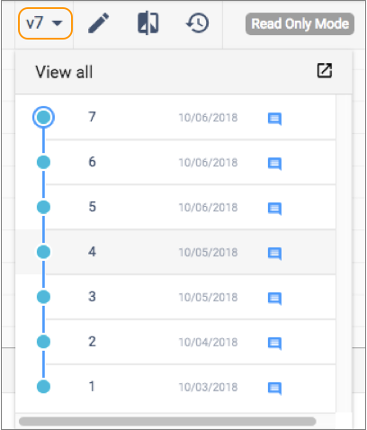
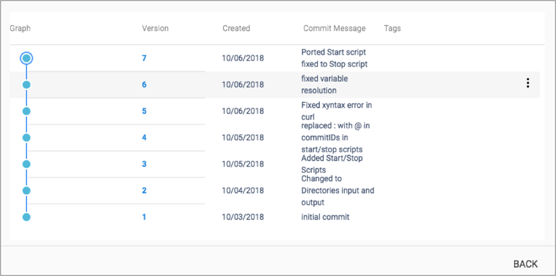
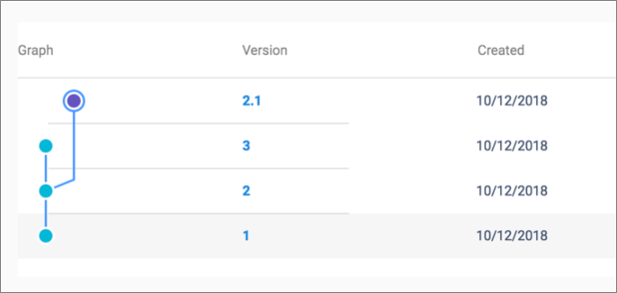
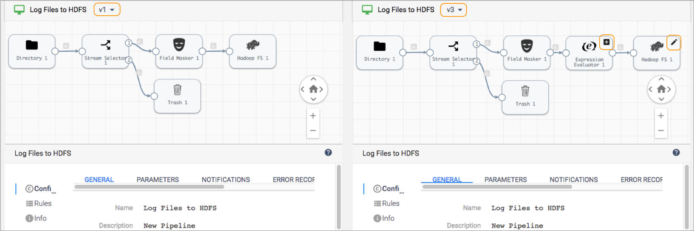

# 版本记录

典型的管道或管道片段开发周期涉及迭代更改。管道存储库维护每个管道和片段的版本历史记录。

当您首次在Pipeline Designer中创建管道或片段时，它以草稿状态开始，以便您可以配置对象。草稿对象版本为<version> -DRAFT，例如v1-DRAFT或v2-DRAFT。完成管道的编辑后，发布管道以指示它是最终的并且可以添加到作业中。发布片段以使其可用于测试或在管道中使用。

已发布的管道和片段按编号进行版本控制，例如v1或v2。您不能编辑已发布的对象。查看发布的版本时，可以单击“编辑”以基于画布中显示的版本创建新版本。

要查看管道或片段的历史记录，请单击管道或片段的版本号，如下所示：

扩展版本历史记录时，您可以管理管道或片段版本，包括查看每次提交的提交消息，比较版本，为版本创建标签以及删除版本。

下图显示了管道的扩展版本历史记录：

## 版本号

版本历史记录显示每个管道或片段提交以及版本号和提交消息。

如果编辑然后发布对象的先前版本，则控制中心将更新次要版本号，而不是主要版本号。

例如，您有一个带有三个版本的管道。您将获得管道的版本2，在Pipeline Designer中编辑管道，然后再次发布管道。Control Hub 将当前管道的版本设置为v2.1。因此，您现在拥有管道的四个版本，管道的版本2.1标记为当前版本，如下所示：

### 比较版本

您可以比较管道或管道片段的两个版本。比较版本时，Control Hub在画布中并排显示版本，突出显示版本之间的差异。您可以比较管道或片段配置属性以及管道或片段中的所有阶段。

1. 在Pipeline Designer中打开管道或管道片段版本。

2. 单击管道或片段版本号，然后展开版本历史记录。

3. 将鼠标悬停在要与画布中当前打开的版本进行比较的版本上，单击“ **更多”**图标（），然后单击“ **与版本进行比较”**。

   **提示：**要与以前的版本进行比较，只需在Pipeline Designer工具栏中单击“ **与以前的版本进行比较”**图标（）。

   Pipeline Designer在比较窗口中并排显示两个版本，并使用删除，添加或更新的图标突出显示所有差异，如下所示：

   

   您可以深入了解每个阶段的详细信息，并在版本之间比较每个阶段的配置。

### 删除版本

您可以从存储库中删除特定的管道或片段版本或管道或片段的所有版本。

您可以删除作业中不包含的管道版本。要删除作业中包含的管道版本，必须首先删除该作业或编辑该作业，以使其不再包括要删除的管道版本。

同样，您只能删除管道中未使用的片段。要删除管道中包含的片段版本，必须首先从所有管道中删除片段版本或删除那些管道。

1. 在Pipeline Designer中打开管道或管道片段版本。

2. 单击管道或片段版本号，然后展开版本历史记录。

3. 将鼠标悬停在要删除的版本上，单击 **更多**图标（），然后单击**删除提交**。

   **注意：**要从存储库中删除管道或片段的所有版本，请单击“ 管道设计器”工具栏中的“ **更多”**图标（），然后单击“ **删除管道”**或“ **删除管道片段”**。

## 标签

版本历史记录显示为管道或片段定义的所有标签。

将标签分配给管道版本或片段版本以区分版本。您可能想要在版本中添加标签以标记发布点或分离开发和生产环境。

例如，当您完成片段的第一个版本的开发时，可以在该版本中添加“准备测试”标签。然后，当片段通过集合时，可以使用“准备使用”标签。这些标签清楚地告知数据工程师，哪些片段已准备好在开发管道中进行测试或在生产管道中使用。

### 创建标签

创建标签并将其分配给管道和片段的版本，以区分版本。

1. 在Pipeline Designer中打开管道或管道片段版本。

2. 单击管道或片段版本号，然后展开版本历史记录。

3. 将鼠标悬停在要标记的版本上，单击“ **更多”**图标（），然后单击“ **标记提交”**。

4. 输入标签的名称和消息。

   在标记消息中，说明将标记添加到此版本的原因。

5. 点击**创建标签**。

   控制中心将在版本旁边显示标签。

### 移除标签

如果需要，您可以从管道和片段的版本中删除标签。

1. 在Pipeline Designer中打开管道或管道片段版本。
2. 单击“ 管道设计器”工具栏中的“ **历史记录”**图标（）。
3. 单击**管道标记**。
4. 将鼠标悬停在要删除的标签上，然后单击“ **删除标签”**图标：。