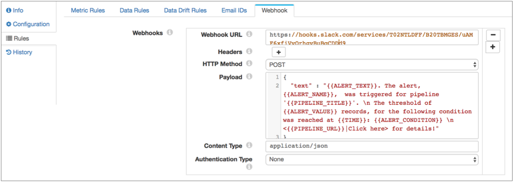
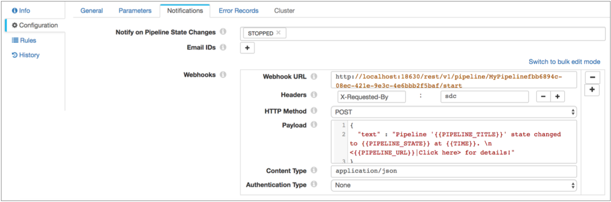

# 网络挂钩

您可以配置管道以使用webhooks。

在Data Collector Edge管道中不可用。

Webhook是用户定义的HTTP回调-发生某些操作时管道自动发送的HTTP请求。您可以使用webhooks根据HTTP请求自动触发外部任务。任务可以像通过应用程序API发送消息一样简单，也可以像将命令传递给Data Collector命令行界面一样强大。

您可以配置以下类型的Webhook：

| 触发     | 描述                                                         | 配置位置                      |
| :------- | :----------------------------------------------------------- | :---------------------------- |
| 警报     | 每次触发警报时，管道都会发送所有警报webhook。例如，如果您的短信应用程序具有Webhook API，则可以在触发警报时使管道发送文本。有关如何[配置警报Webhook的](https://streamsets.com/documentation/controlhub/latest/help/datacollector/UserGuide/Alerts/RulesAlerts_title.html#task_l2p_53t_rz)详细信息，请参阅“ [配置警报Webhook”](https://streamsets.com/documentation/controlhub/latest/help/datacollector/UserGuide/Alerts/RulesAlerts_title.html#task_l2p_53t_rz)。 | 管道规则选项卡> Webhook选项卡 |
| 状态通知 | 当管道转换到所选管道状态时，管道将发送所有状态通知Web钩子。例如，您可以将HTTP请求发送到Data Collector REST API，以在当前管道转换为“完成”状态时启动另一个管道。有关如何配置状态通知Webhook的详细信息，请参阅“ [配置管道”中](https://streamsets.com/documentation/controlhub/latest/help/datacollector/UserGuide/Pipeline_Configuration/ConfiguringAPipeline.html#task_xlv_jdw_kq)的“通知”属性。 | 管道配置选项卡>通知选项卡     |

webhooks的灵活性使您能够自动触发各种任务，具体取决于外部系统支持webhooks或处理HTTP请求的能力。

**重要：**您必须按照接收系统的预期配置webhook。有关如何配置传入的Webhooks的详细信息，请参阅接收系统的文档。您可能还需要在该系统中启用Webhook使用。

配置Webhook时，可以指定发送请求的URL和要使用的HTTP方法。一些HTTP方法允许您包括请求正文或有效负载。 在有效负载中，您可以使用参数来包含有关触发原因的信息，例如警报文本或最新的管道状态。您还可以根据需要包括请求标头，内容类型，身份验证类型，用户名和密码。

## 申请方法

您可以在webhooks中使用以下方法：

- 得到
- 放
- 开机自检
- 删除
- 头

## 有效载荷和参数

您可以包括用于PUT，POST和DELETE请求Webhooks的请求正文或有效负载。根据接收系统的不同，可能不会使用有效负载。例如，当使用Data Collector REST API时，您只需在URL中包括所有必需的信息。

配置有效负载时，可以使用任何有效的内容类型，然后在webhook属性中指定内容类型。定义消息时，请务必考虑管道何时发送Webhook并包括收件人所需的信息。

您可以在有效负载中使用参数来包含有关触发Webhook的操作的信息。例如，当配置在管道停止时发送文本消息的Webhook时，您可以在消息中包括管道名称，管道状态和时间参数。

将参数括在双大括号中，如下所示：

```

```

您可以在webhooks中使用以下参数：

- 状态通知参数

  配置状态通知Webhook时，可以使用以下参数：PIPELINE_TITLE-管道标题或名称。PIPELINE_URL-管道的直接URL。PIPELINE_STATE-管道的当前状态。TIME-触发请求的时间。PIPELINE_STATE_MESSAGE-管道状态和任何相关信息，例如最后保存的偏移量或错误状态的错误消息。PIPELINE_INPUT_RECORDS_COUNT-读取的记录数。PIPELINE_OUTPUT_RECORDS_COUNT-写入的记录数。PIPELINE_ERROR_RECORDS_COUNT-错误记录的数量。PIPELINE_ERROR_MESSAGES_COUNT-错误消息的数量。PIPELINE_RUNTIME_PARAMETERS-管道参数的数量。PIPELINE_METRICS-管道的指标数据。

  例如，假设您将管道配置为仅在管道转换为“已停止”状态时（即有人停止管道时）发送Webhook。您可以在JSON请求正文中使用以下消息：`{     "text":"At {{TIME}}, a user stopped the {{PIPELINE_TITLE}} pipeline. \n 

  但是，如果将管道配置为在管道更改为几种不同状态时发送webhook，则可以使用更通用的消息，并在消息中包括管道状态。例如：`{     "text":"The '{{PIPELINE_TITLE}}' pipeline changed state to {{PIPELINE_STATE}} at {{TIME}}. \n Pipeline status message: {{PIPELINE_STATE_MESSAGE}} \n <{{PIPELINE_URL}}|Click here for details.>" }`

- 警报参数

  配置警报Webhook时，可以使用以下参数：ALERT_CONDITION-与警报关联的规则的条件。ALERT_NAME-警报标签或名称。ALERT_TEXT-为警报配置的文本。ALERT_VALUE-触发条件的值。例如，如果警报配置为在达到1000条错误记录时触发，则警报值为1000。PIPELINE_TITLE-管道标题。PIPELINE_URL-管道的直接URL。TIME-触发请求的时间。

  例如，假设您将管道配置为在每次警报触发时发送一个Webhook警报。要将一些关键信息包含在JSON请求正文中，您可以尝试以下操作：`{     "text":"{{ALERT_TEXT}}: At {{TIME}}, {{ALERT_NAME}} was triggered by {{ALERT_VALUE}} for the following condition: {{ALERT_CONDITION}}. \n This is for the {{PIPELINE_TITLE}} pipeline, at {{PIPELINE_URL}}" }`

## 例子

以下是一些有关如何使用Webhooks的示例：

- 将Webhooks发送到Slack频道

  您可以配置管道以将Webhook发送到Slack频道。例如，您可以将所有警报发送到Operations Slack频道，以便您的运营团队中的某人可以响应警报。

  为此，您执行以下步骤：为要使用的频道的传入Web钩配置Slack。在撰写本文时，您可以从此[页面](https://slack.com/apps/A0F7XDUAZ-incoming-webhooks)开始在Slack中启用webhooks 。启用webhook时，Slack会生成一个URL供您使用。如果您已经启用了Webhooks，请检查您的帐户信息中的Slack URL。复制Slack生成的URL，并使用它来配置管道。URL看起来像这样：`https://hooks.slack.com/services///`Slack还提供了有关如何配置有效负载的说明。目前，他们建议使用消息内容的文本字段，例如Data Collector的默认有效负载。在管道中配置Webhook。对于Slack，您只需输入URL并接受其他所有设置的默认值。这是Slack警报Webhook的外观：

- 启动另一个管道

  您可以在第一个管道使用数据流触发器，Pipeline Finisher执行程序和状态通知Webhook完成所有处理之后启动管道。

  例如，假设您有一个JDBC Query Consumer源，该源执行完整查询以处理某些数据库表中的所有旧数据。

  您将原点配置为在完成所有可用数据处理后生成事件，然后将事件流连接到Pipeline Finisher执行程序。当Pipeline Finisher执行程序从JDBC查询使用者接收到事件时，它会将管道转换为Finished状态。有关将Pipeline Finisher执行程序与数据流触发器一起使用的更多信息，请参阅[案例研究：停止管道](https://streamsets.com/documentation/controlhub/latest/help/datacollector/UserGuide/Event_Handling/EventFramework-Title.html#concept_kff_ykv_lz)。

  要使用此状态更改来启动第二条管道，请配置一个Webhook，该Webhook在管道状态更改为Finished时触发：

  在管道属性中，单击“ **通知”**选项卡，然后单击“ **添加”**以添加一个Webhook。对于URL，输入命令以启动管道。该命令如下所示：`://./rest/v1/pipeline//start`例如：http：// localhost：18630 / rest / v1 / pipeline / MyPipelinefbb6894c-08ec-421e-9e3c-4e6bbb2f5baf / start使用[简单或批量编辑模式](https://streamsets.com/documentation/controlhub/latest/help/datacollector/UserGuide/Pipeline_Configuration/SimpleBulkEdit.html#concept_alb_b3y_cbb)，单击 **添加**图标以添加请求标头，然后添加以下标头：`X-Requested-By`并将值设置为：`sdc`。您可以使用默认的方法和身份验证类型，并保留或删除有效负载，因为REST API不会使用它们。这是Webhook的外观：