# 片段配置

在Control Hub Pipeline Designer中配置管道片段。要设计片段，必须使用3.2.0.0版或更高版本的创作Data Collector。

就像管道一样，您可以使用片段中创作数据收集器中可用的任何阶段-从起点到处理器，目的地和执行者。

您可以在管道片段中配置运行时参数，以更灵活地使用该片段。您还可以配置数据规则和警报以及数据漂移规则和警报，以提供运行时通知。

您可以使用数据预览来帮助设计和测试片段，并使用测试源为数据预览提供数据。

片段准备就绪后，使用Publish图标发布片段。发布片段后，可以在管道中使用该片段，并在管道中使用显式验证来验证该片段。

## 创建管道片段

您可以基于空白画布或基于管道中选定的阶段来创建管道片段。

### 使用空白画布

若要从头开始构建整个片段，请从空白画布创建管道片段。

1. 在“ **管道碎片”**视图中，单击“ **创建新管道碎片”**图标：。

2. 在“ **新建管道片段”**对话框中，指定名称，可选描述和要使用的执行模式，然后单击“ **下一步”**。

3. 在“ **选择创作数据收集器”**页面中，选择可用的创作数据收集器。

   如果使用系统Data Collector，则不能使用 [数据预览](https://streamsets.com/documentation/controlhub/latest/help/datacollector/UserGuide/Pipeline_Fragments/FragmentConfiguration.html#concept_eyr_mky_h2b)来帮助开发片段。

4. 点击**创建**。

   显示空白画布。

### 使用管道阶段

您可以从管道中的一个或多个阶段创建管道片段。

1. 在管道画布中，选择一个或多个阶段用作新管道片段的一部分。

   要在画布中选择多个阶段，请选择Shift键，然后单击每个阶段。您可以选择已连接或未连接的阶段。

2. 在详细信息窗格中，单击**创建管道片段**。

3. 在“ **新建管道片段”**对话框中，指定名称，可选描述和要使用的执行模式，然后单击“ **下一步”**。

4. 在“ **选择创作数据收集器”**页面中，选择可用的创作数据收集器。

   如果使用系统Data Collector，则不能使用 [数据预览](https://streamsets.com/documentation/controlhub/latest/help/datacollector/UserGuide/Pipeline_Fragments/FragmentConfiguration.html#concept_eyr_mky_h2b)来帮助开发片段。

   默认情况下，将选择原始管道的创作数据收集器。

5. 点击**创建**。

   选定的阶段显示在画布中。

## 片段输入和输出

已发布的管道片段在管道中显示为片段阶段，片段阶段的输入和输出流代表片段逻辑的输入和输出流。

一个片段必须至少包含一个打开的输入或输出流。您不能将完整的管道用作片段。

在设计管道片段时，请仔细考虑要使用的输入和输出流的数量。发布片段后，您将无法更改输入或输出流的数量。这有助于确保在更新片段时使用该片段的管道不会无效。

但是，您可以更改输入和输出流所代表的内容。例如，以下Flatten and Mask片段以一个处理器开始，以两个处理器结束。输入和输出流在下面突出显示：

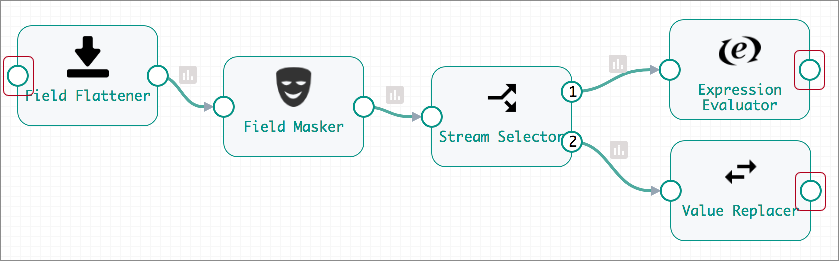

配置管道时，默认情况下，“展平”和“蒙版”片段显示为单个片段阶段。Flatten和Mask片段阶段的突出显示的输入和输出流，代表片段逻辑的输入和输出流：

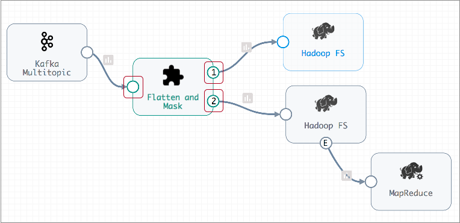

如果需要，Flatten和Mask片段的后续版本可能会发生巨大变化，但仍必须包含一个输入流和两个输出流。

例如，以下Flatten and Mask版本以新的Field Merger处理器开始，并且删除了Stream Selector之后的处理器。流选择器还具有一个附加输出流，该流将合格记录发送到管道以进行错误处理。尽管进行了这些更改，但输入和输出流的数量保持不变，因此这些更改是有效的：

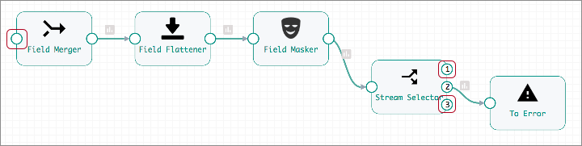


## 执行引擎和执行模式

创建片段时，请为片段指定执行引擎。配置片段时，您可以为片段指定执行模式，就像为管道指定模式一样。

您选择的执行引擎和执行模式决定了您可以在片段中使用的阶段。它还确定了可以在其中使用该片段的管道。

- 执行引擎

  创建片段时，您可以为其指定执行引擎：Data Collector或Data Collector Edge。

  您可以在Edge执行模式管道中使用Data Collector Edge执行引擎片段。而且，您可以在独立或集群执行模式管道中使用Data Collector执行引擎片段。

  为片段选择执行引擎后，就无法对其进行更改。

- 执行方式

  在片段属性中定义片段的执行模式，就像在管道属性中定义管道的执行模式一样。您可以选择独立模式，边缘模式和一组集群执行模式。

  您选择的执行模式确定可以在其中使用片段的管道。独立片段只能在独立管道，Edge片段，Edge管道等中使用。

  您可以编辑片段以更改其执行模式。但是请注意，更改片段执行模式会使片段版本对于使用先前片段版本的管道无效。

## 数据和数据漂移规则和警报

您可以在管道片段中配置数据规则和警报以及数据漂移规则和警报。当您在管道中使用该片段时，管道将继承规则和警报。

如果您从管道中删除该片段，则该片段中定义的规则和警报也会被删除。

有关数据以及数据漂移规则和警报的更多信息，请参阅[规则和警报概述](https://streamsets.com/documentation/controlhub/latest/help/datacollector/UserGuide/Alerts/RulesAlerts_title.html#concept_ugl_nlh_q5)。

## 运行时参数

您可以在管道片段中配置运行时参数，以更灵活地使用该片段。

在片段中使用运行时参数时，可以在多个位置定义和覆盖运行时参数值：

- 在片段中-您在片段中定义和调用运行时参数。定义运行时参数时，请指定其默认值。
- 在管道中-将片段添加到管道时，管道会继承该片段中的所有运行时参数。您可以在管道属性中覆盖运行时参数的默认值。您还可以在管道中的其他位置使用运行时参数。您无法更改从片段调用参数的方式，因为无法在管道中编辑片段。
- 在作业中-为管道配置作业时，可以覆盖管道中定义的任何运行时参数的值。

将带有运行时参数的片段添加到管道时，管道将继承定义的参数。如果片段更新包括对运行时参数值的更改，并且您将管道配置为使用此片段版本，则管道也将继承这些更改。

一旦继承，运行时参数将保留在管道中。如果以后再从管道中删除该片段，则管道将保留从该片段继承的所有运行时参数，直到将其删除为止。

要在片段中使用运行时参数，请执行以下步骤：

1. 在片段属性中定义运行时参数。

   在管道片段属性的“参数”选项卡上，指定运行时参数和默认值。

   例如，下图显示了一个片段的“参数”选项卡，其中定义了两个运行时参数：

   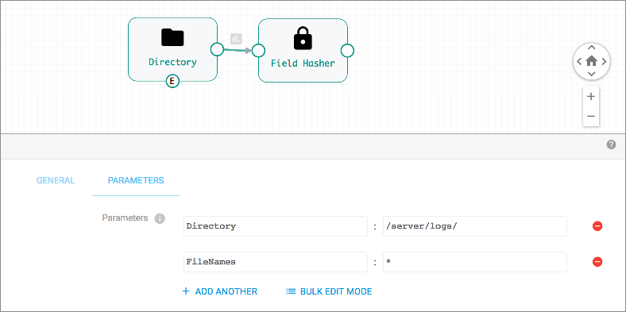

2. 要在阶段中使用运行时参数，请配置stage属性以调用运行时参数。

   在表达式中使用运行时参数的名称，如下所示：

   ```
   ${<runtime parameter name>}
   ```

   在这种情况下，我们要使用这些参数在Directory原点中定义Directory Template和File Name Pattern属性，如下所示：

   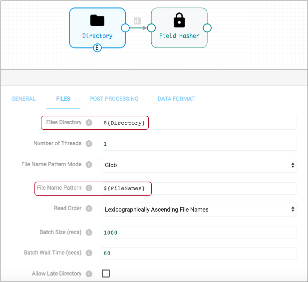

3. 发布片段，然后将片段添加到管道中。

   运行时参数是使用片段中定义的默认值继承的。

4. 在管道中，根据需要覆盖运行时参数值。

   您可以在管道属性的“参数”选项卡上配置运行时参数的值，如下所示：

   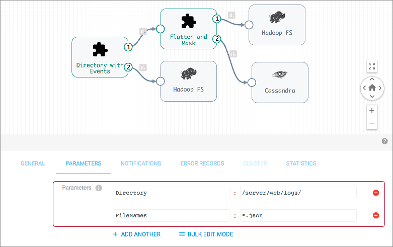

5. 为管道创建作业时，请根据需要查看并覆盖运行时参数值。

   在“添加作业”对话框中，使用“获取默认参数”链接来检索管道的参数定义。根据需要覆盖值，然后保存作业配置。“获取默认参数”链接显示在“运行时参数”属性下方，如下所示：

   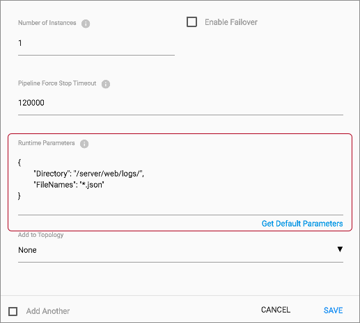

## 创建其他流

需要时，您可以使用Dev Identity处理器为片段创建开放的输入或输出流。

Dev Identity处理器是一个不执行任何处理的开发阶段，它只是将记录保持不变地传递给下一个处理器。尽管通常不会在生产管道中使用Dev Identity处理器，但在管道片段中创建额外的输入或输出流很有用。

例如，假设您在一个片段中有多个连接的处理器，这些片段以目标阶段结尾，从而产生单个输入流而没有输出流，如下所示：

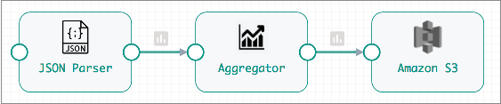

但是，除了将数据写入片段中的Amazon S3目标之外，您还希望将JSON解析器处理的数据传递到管道以进行其他处理。

要为片段创建输出流，请将JSON Parser处理器连接到Dev Identity处理器，并保持Dev Identity处理器未连接，如下所示：

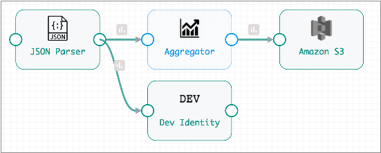

生成的片段阶段包括一个输出流，该流将JSON解析器处理的记录传递到管道：

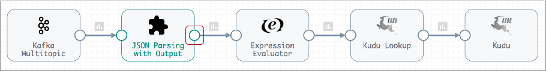

随着片段的扩展，您可以看到Dev Identity处理器如何将数据从片段中的JSON解析器传递到管道中定义的其他分支：

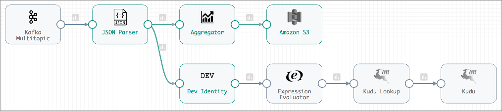

## 资料预览

您可以使用数据预览来帮助开发或测试管道片段。

与管道的数据预览一样，当您预览片段时，Pipeline Designer会通过片段传递数据，并允许您查看数据如何在每个阶段传递和更改。

您可以使用[测试原点](https://streamsets.com/documentation/controlhub/latest/help/datacollector/UserGuide/Pipeline_Design/TestOrigin.html#concept_sgt_s5v_g2b)为数据预览提供源数据。当使用不包含起点的片段时，这尤其有用。当片段包含原点时，您也可以使用原点来提供预览的源数据。

有关测试原点的更多信息，请参见[预览的测试原点](https://streamsets.com/documentation/controlhub/latest/help/datacollector/UserGuide/Pipeline_Design/TestOrigin.html#concept_sgt_s5v_g2b)。有关预览数据的详细信息，请参见“ [数据预览概述”](https://streamsets.com/documentation/controlhub/latest/help/datacollector/UserGuide/Data_Preview/DataPreview_Title.html#concept_jtn_s3m_lq)。

## 显式验证

目前，在设计管道片段时不能使用显式验证。要执行片段验证，请发布片段并在测试管道中验证片段。

在测试管道中，可以将片段连接到其他阶段以创建完整的管道，然后使用显式验证。

虽然可以在测试管道中使用实际阶段，但是验证片段的最快方法是使用开发阶段，如下所示：

1. 将开发原点连接到任何片段输入流。
2. 将任何片段输出流连接到垃圾箱目标。
3. 使用验证图标来验证管道和片段。

例如，假设您要验证以下Flatten和Mask片段的处理逻辑：

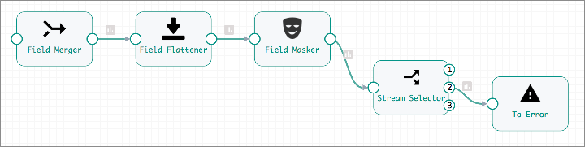

要测试片段处理，请发布片段并将其添加到管道中。

要创建通过隐式验证的管道，请将Dev Raw Data Source（或任何开发源）连接到片段输入流，然后将片段输出流连接到Trash目标，如下所示：

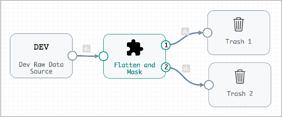

验证管道时，将显示验证错误消息，并在关联的阶段中将其突出显示，就像任何管道一样：

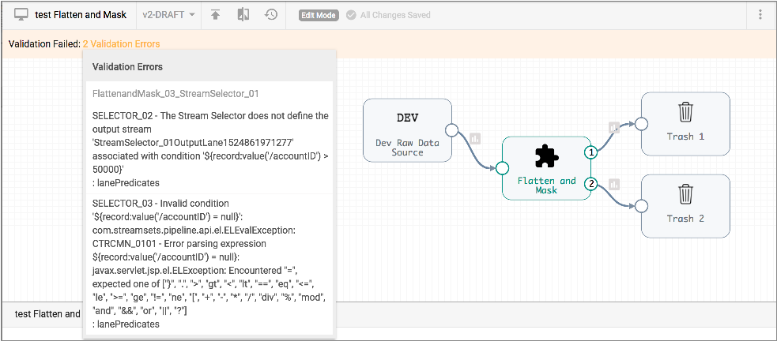

要查看出现问题的阶段，请展开片段并查看阶段属性：

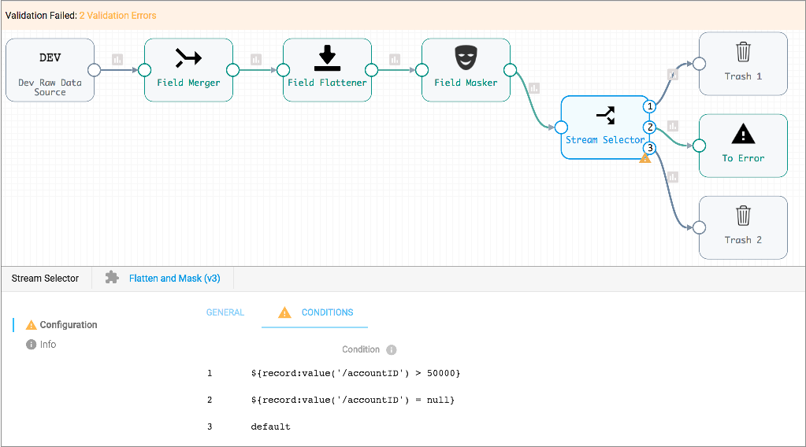

在这种情况下，流选择器条件无效，因此您可以编辑片段以更新处理器中的表达式，然后重新发布片段，更新管道以使用最新的片段版本，然后再次验证管道。

## 片段发布要求

片段必须满足多个验证要求才能发布。

当不满足以下任一要求时，Pipeline Designer不允许发布该片段：

1. 至少一个输入或输出流必须保持未连接状态。

   您不能将完整的管道用作管道片段。

2. 片段中的所有阶段都必须连接。

   发布片段时，管道画布不能包含任何未连接的阶段。

3. 输入和输出流的数量不能在片段版本之间更改。

   首次发布时，将定义片段中输入和输出流的数量。所有后续版本都必须保持相同数量的输入和输出流。这有助于防止使使用该片段的管道失效。