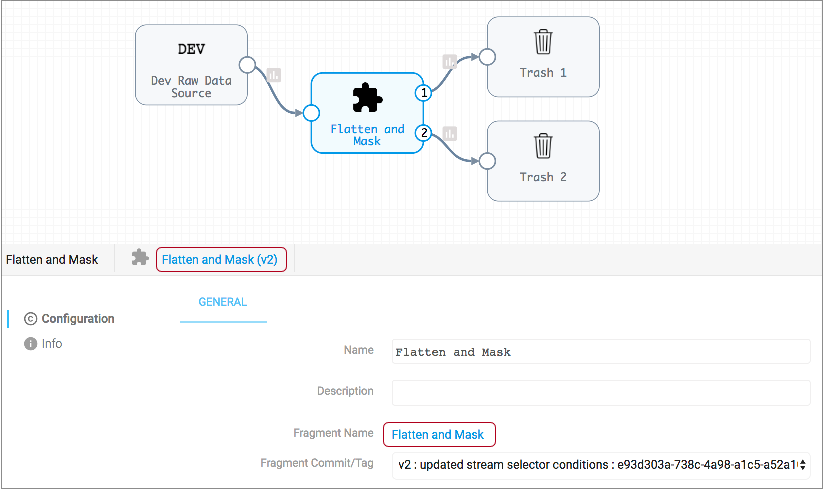

# 在管道中使用片段

发布管道片段后，您可以在管道中使用它。这是片段在管道中的工作方式...

通常，您可以像其他任何阶段一样使用片段。片段在片段库中显示为片段片段类型。适当时，片段类别也会显示在“管道创建”帮助栏中。您可以在管道中使用多个片段，并在管道中重复使用相同的片段。

将片段添加到画布后，默认情况下它将显示为片段阶段。片段级输入和输出流表示片段逻辑的输入和输出流。您可以使用扩展片段图标查看片段中的阶段并验证片段逻辑。展开片段图标（）位于导航图标的画布右侧。

如果管道中有多个片段，则“展开片段”图标将展开管道中的所有片段。使用后，“展开片段”图标将变为“折叠片段”图标（），可用于隐藏片段详细信息。

设计管道时，您无法编辑片段。要离开管道来编辑片段，请在“属性”面板中的以下任一位置单击片段名称：

## 使用片段版本

如果一个片段有多个版本，则在设计管道时请确保选择正确的版本。管道将使用选定的片段版本，直到手动更改为止。

为避免使现有管道无效，管道中的片段不会自动更新为最新版本。要更改管道使用的片段版本，请编辑管道并手动更新片段版本。

您可以在片段详细信息窗格的“管道”选项卡上看到使用片段版本的管道，如下所示：

您可以单击管道名称以快速导航到管道。

要查看或更改管道中使用的片段版本，请选择片段，然后根据需要配置Fragment Commit / Tag属性：

## 流顺序

管道中片段阶段的流顺序遵循片段中各个阶段的顺序和位置-从左到右跨主分支，然后跨任何剩余的上，下分支，所有事件流显示在数据流下方。

例如，以下片段阶段具有四个输出流：

扩展后的片段如下所示：

流顺序遵循主要分支JSON解析器到Hadoop FS，然后返回到其余的Aggregator分支。它还在数据流之后列出事件流。因此，此片段的最终流顺序如下：

- 输入流-JSON分析器输入流。
- 输出流1-流选择器输出流2。
- 输出流2-聚合器输出流。
- 输出流3-Hadoop FS事件流。
- 输出流4-聚合器事件流。