# 数据流触发器

## 数据流触发器概述

数据流触发器是事件框架的指令，用于响应管道中发生的事件启动任务。例如，在管道将文件写入HDFS之后，可以使用数据流触发器来启动MapReduce作业。或者，您可以在JDBC查询使用者源处理所有可用数据之后使用数据流触发器来停止管道。

事件框架包含以下组件：

- 事件产生

  事件框架生成与管道相关的事件和与阶段相关的事件。该框架仅在管道启动和停止时才生成管道事件。当发生与阶段相关的特定动作时，框架会生成阶段事件。生成事件的动作因阶段而异，并且与阶段如何处理数据有关。

  例如，Hive Metastore目标会更新Hive Metastore，因此每次更改Metastore都会生成事件。相反，Hadoop FS目标将文件写入HDFS，因此每次关闭文件时都会生成事件。

  事件产生事件记录。与管道相关的事件记录将立即传递给指定的事件使用者。与阶段相关的事件记录在事件流中通过管道传递。

- 任务执行

  要触发任务，您需要一个执行者。执行器阶段在Data Collector或外部系统中执行任务。每次执行者收到一个事件，它都会执行指定的任务。

  例如，Hive Query执行程序在每次接收到事件时都会运行用户定义的Hive或Impala查询，而MapReduce执行程序在收到事件时会触发MapReduce作业。在Data Collector中，Pipeline Finisher执行程序在收到事件后停止管道，从而将管道转换为Finished状态。

  在Data Collector Edge管道中不可用。 Data Collector Edge管道不支持执行器。

- 事件储存

  要存储事件信息，请将事件传递到目的地。目标将事件记录与其他任何数据一样写入目标系统。

  例如，您可以存储事件记录，以保留对管道原始读取的文件的审核跟踪。

## 管道事件生成

事件框架 在管道生命周期中的特定点在Data Collector独立管道中生成管道事件。您可以配置管道属性，以将每个事件传递给执行者或另一个管道，以进行更复杂的处理。

在Data Collector Edge管道中不可用。

事件框架生成以下与管道相关的事件：

- 管道启动

  流水线启动事件是在流水线初始化之后，紧随其启动之后以及初始化各个阶段之前生成的。这可以使执行者有时间在阶段初始化之前执行任务。

  大多数执行程序都等待任务完成的确认。结果，管道在继续阶段初始化之前等待执行程序完成任务。例如，如果将JDBC Query执行程序配置为在管道开始之前截断表，则管道将等待直到任务完成，然后再处理任何数据。

  MapReduce执行程序和Spark执行程序启动作业，并且不等待提交的作业完成。当您使用这些执行程序之一时，在继续阶段初始化之前，管道仅等待成功的作业提交。如果执行程序无法处理事件，例如，如果Hive Query Executor无法执行指定的查询，或者查询失败，则初始化阶段将失败，并且管道也不会启动。相反，管道将转换为故障状态。

- 流水线停止

  管道停止事件是在管道停止时（手动，编程或由于故障）生成的。在所有阶段都已完成处理和清理临时资源（例如删除临时文件）之后，将生成stop事件。这使执行者可以在管道处理完成之后，在管道完全停止之前执行任务。

  与启动事件使用者类似，使用事件的执行程序的行为决定了管道在允许管道停止之前是否等待执行程序任务完成。此外，如果流水线停止事件的处理由于任何原因失败，那么即使数据处理成功，流水线也会转换为失败状态。

管道事件与阶段事件不同，如下所示：

- 虚拟处理

   -与阶段事件不同，管道事件不会由您在画布中配置的阶段处理。它们被传递给您在管道属性中配置的事件使用者。

  事件使用者不会显示在管道的画布中。结果，管道事件也不会在数据预览中可视化。

- 一次性事件

   -对于管道属性中的每种事件类型，只能配置一个事件使用者：一个用于“开始”事件，一个用于“停止”事件。

  必要时，可以将管道事件传递到另一个管道。在事件消耗管道中，您可以根据需要包括任意多个阶段，以进行更复杂的处理。

有关描述使用管道事件的几种方法的[案例研究](https://streamsets.com/documentation/controlhub/latest/help/datacollector/UserGuide/Event_Handling/EventFramework-Title.html#concept_vrh_jrs_bbb)，请参阅[案例研究：将数据从关系源卸载到Hadoop](https://streamsets.com/documentation/controlhub/latest/help/datacollector/UserGuide/Event_Handling/EventFramework-Title.html#concept_vrh_jrs_bbb)。

### 使用管道事件

您可以在独立管道中配置管道事件。配置管道事件时，可以将其配置为由执行者或其他管道使用。

当执行者可以执行您需要的所有任务时，将事件传递给执行者。您可以为每种事件类型配置一个执行程序。

当您需要在使用方管道中执行更复杂的任务时，将事件传递给另一个管道，例如将事件传递给多个执行者或传递给执行者和存储目的地。

#### 传给执行人

您可以配置管道以将每种事件类型传递给执行者阶段。这使您可以在管道启动或停止时触发任务。您可以分别配置每种事件类型的行为。并且您可以丢弃任何您不想使用的事件。

**注意：**如果指定的执行程序未能处理事件，例如，如果Shell执行程序执行脚本失败，则管道将转换为失败状态。

要将管道事件传递给执行程序，请执行以下步骤：

1. 在管道属性中，选择要使用事件的执行程序。
2. 在管道属性中，配置执行程序以执行任务。

##### 例

假设您要在管道启动时发送电子邮件。首先，您将管道配置为对管道启动事件使用电子邮件执行程序。由于不需要Stop事件，因此只需使用默认的drop选项：

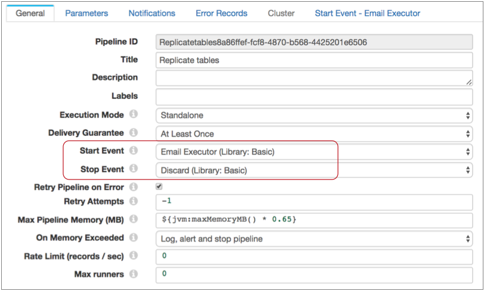

然后，也在管道属性中，配置“电子邮件”执行程序。您可以配置发送电子邮件的条件。如果您忽略该条件，则执行程序每次收到事件时都会发送电子邮件：

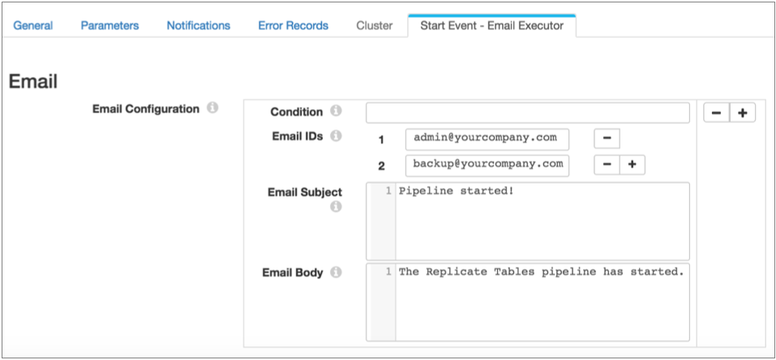

#### 传递到另一个管道

将管道事件传递到另一个管道以执行更复杂的处理，而不是简单地将事件传递给单个使用者。消耗事件的管道必须使用SDC RPC起源，然后可以包括所需的其他多个阶段。

**注意：**当您将管道事件传递给另一个管道时，消耗事件的管道不会将处理失败自动报告回事件生成管道。例如，如果将管道事件传递到执行程序未能完成其任务的管道，则该故障不会报告回事件生成管道。

要实现与传递给执行程序相同的行为，在执行程序中，处理失败会导致事件生成管道发生故障，请配置相关阶段以在发生错误时停止事件消耗管道。发生错误时，事件消耗管道然后停止并将消息传递回事件生成管道，然后事件发生管道转换为故障状态。

例如，假设您将管道事件传递到将事件路由到两个执行者的管道。为确保如果其中一个执行程序失败，事件生成管道也会失败，请在两个执行程序的“常规”选项卡上配置“记录错误”属性，将属性设置为“停止管道”。

这会导致事件消耗管道因错误而停止，从而导致事件发生管道转换为故障状态。

要将事件传递到另一个管道，请执行以下步骤：

1. 配置管道以使用事件。
2. 配置事件生成管道以将事件传递到事件消耗管道，包括来自SDC RPC起源的详细信息。
3. 在启动事件生成管道之前，先启动事件消耗管道。

##### 例

假设您希望Stop事件触发启动另一个进程和JDBC查询的Shell脚本。为此，首先配置事件消耗管道。使用SDC RPC起源并注意突出显示的属性，因为您将使用它们来配置事件生成管道：

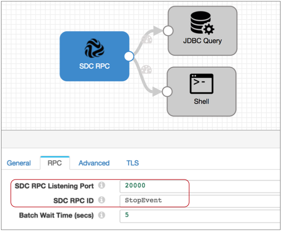

然后，您将事件生成管道配置为将Stop事件传递到新管道。请注意，如果您不需要使用Start事件，则只需使用默认的废弃选项即可：

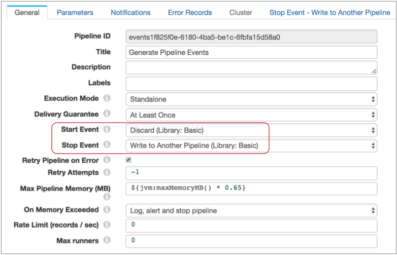

然后，使用事件消耗管道中的SDC RPC详细信息来配置“停止事件-写入另一个管道”属性：

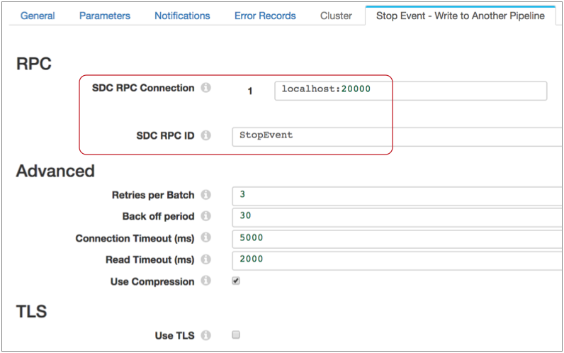

## 舞台活动的产生

您可以配置某些阶段来生成事件。根据阶段处理数据的方式，事件的生成因阶段而异。有关每个阶段的每个事件生成的详细信息，请参见阶段文档中的“事件生成”。

下表列出了事件生成阶段以及它们何时可以生成事件：

| 阶段                                  | 当舞台...生成事件                                            |
| :------------------------------------ | :----------------------------------------------------------- |
| Amazon S3的起源                       | 完成所有可用对象的处理，并且已配置的批处理等待时间已经过去。有关更多信息，请参阅[Amazon S3来源的事件生成](https://streamsets.com/documentation/controlhub/latest/help/datacollector/UserGuide/Origins/AmazonS3.html#concept_vtn_ty4_jbb)。 |
| Azure Data Lake Storage Gen1来源      | 开始处理文件。完成处理文件。完成所有可用文件的处理，并且已配置的批处理等待时间已经过去。有关更多信息，请参见[Azure Data Lake Storage Gen1起源的](https://streamsets.com/documentation/controlhub/latest/help/datacollector/UserGuide/Origins/ADLS-G1.html#concept_osx_qgz_xhb)事件生成。 |
| Azure Data Lake Storage Gen2的来源    | 开始处理文件。完成处理文件。完成所有可用文件的处理，并且已配置的批处理等待时间已经过去。有关更多信息，请参见[Azure Data Lake Storage Gen2起源的](https://streamsets.com/documentation/controlhub/latest/help/datacollector/UserGuide/Origins/ADLS-G2.html#concept_osx_qgz_xhb)事件生成。 |
| 目录来源                              | 开始处理文件。完成处理文件。完成所有可用文件的处理，并且已配置的批处理等待时间已经过去。有关更多信息，请参见[目录源的事件生成](https://streamsets.com/documentation/controlhub/latest/help/datacollector/UserGuide/Origins/Directory.html#concept_ttg_vgn_qx)。 |
| 文件尾源                              | 开始处理文件。完成处理文件。有关更多信息，请参见[文件尾源的事件生成](https://streamsets.com/documentation/controlhub/latest/help/datacollector/UserGuide/Origins/FileTail.html#concept_gwn_c32_px)。 |
| Google BigQuery的来源                 | 成功完成查询。有关更多信息，请参阅[Google BigQuery来源的事件生成](https://streamsets.com/documentation/controlhub/latest/help/datacollector/UserGuide/Origins/BigQuery.html#concept_vsm_khx_q1b)。 |
| Google Cloud Storage的起源            | 完成所有可用对象的处理，并且已配置的批处理等待时间已经过去。有关更多信息，请参阅[Google Cloud Storage来源的事件生成](https://streamsets.com/documentation/controlhub/latest/help/datacollector/UserGuide/Origins/GCS.html#concept_fkf_bmn_sbb)。 |
| Groovy脚本起源                        | 运行生成事件的脚本。有关更多信息，请参见[Groovy脚本起源的事件生成](https://streamsets.com/documentation/controlhub/latest/help/datacollector/UserGuide/Origins/GroovyScripting.html#concept_hn5_tjp_l3b)。 |
| Hadoop FS独立版本                     | 开始处理文件。完成处理文件。完成所有可用文件的处理，并且已配置的批处理等待时间已经过去。有关更多信息，请参阅[Hadoop FS Standalone源的事件生成](https://streamsets.com/documentation/controlhub/latest/help/datacollector/UserGuide/Origins/HDFSStandalone.html#concept_djz_pdm_hdb)。 |
| JavaScript脚本起源                    | 运行生成事件的脚本。有关更多信息，请参见[JavaScript脚本起源的事件生成](https://streamsets.com/documentation/controlhub/latest/help/datacollector/UserGuide/Origins/JavaScriptScripting.html#concept_jgc_tf3_p3b)。 |
| JDBC多表使用者来源                    | 完成对所有表的查询返回的数据的处理。有关更多信息，请参见[JDBC多表使用者来源的事件生成](https://streamsets.com/documentation/controlhub/latest/help/datacollector/UserGuide/Origins/MultiTableJDBCConsumer.html#concept_wjj_gzs_kz)。 |
| JDBC查询使用者来源                    | 完成处理查询返回的所有数据。成功完成查询。无法完成查询。有关更多信息，请参见[JDBC查询使用者来源的事件生成](https://streamsets.com/documentation/controlhub/latest/help/datacollector/UserGuide/Origins/JDBCConsumer.html#concept_o1c_kwr_kz)。 |
| Jython脚本起源                        | 运行生成事件的脚本。有关更多信息，请参见[Jython脚本起源的事件生成](https://streamsets.com/documentation/controlhub/latest/help/datacollector/UserGuide/Origins/JythonScripting.html#concept_ukb_2b3_p3b)。 |
| MapR FS独立来源                       | 开始处理文件。完成处理文件。完成所有可用文件的处理，并且已配置的批处理等待时间已经过去。有关更多信息，请参阅[MapR FS Standalone源的事件生成](https://streamsets.com/documentation/controlhub/latest/help/datacollector/UserGuide/Origins/MapRFSStandalone.html#concept_uqn_cjh_ndb)。 |
| MongoDB的起源                         | 完成处理查询返回的所有数据。有关更多信息，请参阅[MongoDB起源的事件生成](https://streamsets.com/documentation/controlhub/latest/help/datacollector/UserGuide/Origins/MongoDB.html#concept_vx3_1gh_scb)。 |
| Oracle Bulkload的起源                 | 完成表中的数据处理。有关更多信息，请参见[Oracle Bulkload起源的事件生成](https://streamsets.com/documentation/controlhub/latest/help/datacollector/UserGuide/Origins/OracleBulk.html#concept_vpv_cx3_lhb)。 |
| Oracle CDC客户端起源                  | 读取重做日志中的DDL语句。有关更多信息，请参见[Oracle CDC客户端起源的事件生成](https://streamsets.com/documentation/controlhub/latest/help/datacollector/UserGuide/Origins/OracleCDC.html#concept_h2t_hx1_vy)。 |
| Salesforce来源                        | 完成处理查询返回的所有数据。有关更多信息，请参阅[为Salesforce起源生成事件](https://streamsets.com/documentation/controlhub/latest/help/datacollector/UserGuide/Origins/Salesforce.html#concept_cvb_bvr_kz)。 |
| SFTP / FTP / FTPS客户端来源           | 开始处理文件。完成处理文件。完成所有可用文件的处理，并且已配置的批处理等待时间已经过去。有关更多信息，请参见[SFTP / FTP / FTPS客户端起源的事件生成](https://streamsets.com/documentation/controlhub/latest/help/datacollector/UserGuide/Origins/SFTP.html#concept_jbf_cmr_mcb)。 |
| SQL Server 2019 BDC多表使用者来源     | 完成对所有表的查询返回的数据的处理。有关详细信息，请参阅[SQL Server 2019 BDC多表使用者来源的事件生成](https://streamsets.com/documentation/controlhub/latest/help/datacollector/UserGuide/Origins/SQLServerBDCMultitable.html#SQLServerBDCMultitable-EventGen)。 |
| SQL Server CDC客户端来源              | 完成处理关联的CDC表中的数据。启用检查模式更改时，源在每次检测到模式更改时都会生成一个事件。有关更多信息，请参见[SQL Server CDC客户端起源的事件生成](https://streamsets.com/documentation/controlhub/latest/help/datacollector/UserGuide/Origins/SQLServerCDC.html#concept_byp_dgv_s1b)。 |
| SQL Server更改跟踪来源                | 完成所有指定变更跟踪表中的数据处理。有关更多信息，请参见[SQL Server更改跟踪源的事件生成](https://streamsets.com/documentation/controlhub/latest/help/datacollector/UserGuide/Origins/SQLServerChange.html#concept_byp_dgv_s1b)。 |
| Teradata消费者来源                    | 完成对所有表的查询返回的数据的处理。有关更多信息，请参阅[Teradata Consumer来源的事件生成](https://streamsets.com/documentation/controlhub/latest/help/datacollector/UserGuide/Origins/Teradata.html#concept_wjj_gzs_kz)。 |
| 窗口聚合处理器                        | 根据配置的窗口类型和时间窗口执行聚合。有关更多信息，请参见[Windowing Aggregator处理器的事件生成](https://streamsets.com/documentation/controlhub/latest/help/datacollector/UserGuide/Processors/Aggregator.html#concept_ppy_b42_wbb)。 |
| Groovy评估器处理器                    | 运行生成事件的脚本。有关更多信息，请参见[Groovy Evaluator处理器的事件生成](https://streamsets.com/documentation/controlhub/latest/help/datacollector/UserGuide/Processors/Groovy.html#concept_qcz_ssq_1y)。 |
| JavaScript评估程序处理器              | 运行生成事件的脚本。有关更多信息，请参见[JavaScript Evaluator处理器的事件生成](https://streamsets.com/documentation/controlhub/latest/help/datacollector/UserGuide/Processors/JavaScript.html#concept_mkv_wgh_cy)。 |
| Jython评估程序处理器                  | 运行生成事件的脚本。有关更多信息，请参见[Jython Evaluator处理器的事件生成](https://streamsets.com/documentation/controlhub/latest/help/datacollector/UserGuide/Processors/Jython.html#concept_zhd_chh_cy)。 |
| TensorFlow评估器处理器                | 一次评估整个批次。有关更多信息，请参阅[TensorFlow Evaluator处理器的事件生成](https://streamsets.com/documentation/controlhub/latest/help/datacollector/UserGuide/Processors/TensorFlow.html#concept_xhj_bxm_bfb)。 |
| Amazon S3目的地                       | 完成写入对象。完成流式传输整个文件。有关更多信息，请参阅[Amazon S3目标的事件生成](https://streamsets.com/documentation/controlhub/latest/help/datacollector/UserGuide/Destinations/AmazonS3.html#concept_aqq_tt2_px)。 |
| Azure Data Lake Storage（Legacy）目标 | 关闭文件。完成流式传输整个文件。有关更多信息，请参见[Azure数据湖存储（旧版）目标的事件生成](https://streamsets.com/documentation/controlhub/latest/help/datacollector/UserGuide/Destinations/DataLakeStore.html#concept_eck_fm3_vz)。 |
| Azure Data Lake Storage Gen1目标      | 关闭文件。完成流式传输整个文件。有关更多信息，请参见[Azure Data Lake Storage Gen1目标的事件生成](https://streamsets.com/documentation/controlhub/latest/help/datacollector/UserGuide/Destinations/ADLS-G1-D.html#concept_et1_lhx_zhb)。 |
| Azure Data Lake Storage Gen2目标      | 关闭文件。完成流式传输整个文件。有关更多信息，请参见[Azure Data Lake Storage Gen2目标的事件生成](https://streamsets.com/documentation/controlhub/latest/help/datacollector/UserGuide/Destinations/ADLS-G2-D.html#concept_l53_gsk_vhb)。 |
| Google Cloud Storage目的地            | 完成写入对象。完成流式传输整个文件。有关更多信息，请参阅[Google Cloud Storage目标的事件生成](https://streamsets.com/documentation/controlhub/latest/help/datacollector/UserGuide/Destinations/GCS.html#concept_xjx_h4n_sbb)。 |
| Hadoop FS目标                         | 关闭文件。完成流式传输整个文件。有关更多信息，请参阅[Hadoop FS目标的事件生成](https://streamsets.com/documentation/controlhub/latest/help/datacollector/UserGuide/Destinations/HadoopFS-destination.html#concept_bvb_rxj_px)。 |
| Hive Metastore目的地                  | 通过创建表，添加列或创建分区来更新Hive Metastore。生成并写入新的Avro模式文件。有关更多信息，请参见[Hive Metastore目标的事件生成](https://streamsets.com/documentation/controlhub/latest/help/datacollector/UserGuide/Destinations/HiveMetastore.html#concept_drg_lwc_rx)。 |
| 本地FS目的地                          | 关闭文件。完成流式传输整个文件。有关更多信息，请参阅[本地FS目标的事件生成](https://streamsets.com/documentation/controlhub/latest/help/datacollector/UserGuide/Destinations/LocalFS.html#concept_in1_fcm_px)。 |
| MapR FS目的地                         | 关闭文件。完成流式传输整个文件。有关更多信息，请参阅[MapR FS目标的事件生成](https://streamsets.com/documentation/controlhub/latest/help/datacollector/UserGuide/Destinations/MapRFS.html#concept_bqd_3qb_rx)。 |
| SFTP / FTP / FTPS客户端目标           | 关闭文件。完成流式传输整个文件。有关更多信息，请参见[SFTP / FTP / FTPS客户端目标的事件生成](https://streamsets.com/documentation/controlhub/latest/help/datacollector/UserGuide/Destinations/SFTP.html#concept_lvv_xvq_23b)。 |
| ADLS Gen1文件元数据执行器             | 更改文件元数据，例如文件名，位置或权限。创建一个空文件。删除文件或目录。有关更多信息，请参见[ADLS Gen1文件元数据执行程序的事件生成](https://streamsets.com/documentation/controlhub/latest/help/datacollector/UserGuide/Executors/ADLS-G1-FileMeta.html#concept_xjb_tjj_zhb)。 |
| ADLS Gen2文件元数据执行器             | 更改文件元数据，例如文件名，位置或权限。创建一个空文件。删除文件或目录。有关更多信息，请参见[ADLS Gen2文件元数据执行程序的事件生成](https://streamsets.com/documentation/controlhub/latest/help/datacollector/UserGuide/Executors/ADLS-G2-FileMeta.html#concept_h5x_5rb_b3b)。 |
| Amazon S3执行器                       | 创建一个新的Amazon S3对象。将对象复制到另一个位置。将标签添加到现有对象。有关更多信息，请参阅[Amazon S3执行程序的事件生成](https://streamsets.com/documentation/controlhub/latest/help/datacollector/UserGuide/Executors/AmazonS3.html#concept_jv4_12x_gjb)。 |
| Databricks执行器                      | 开始Databricks作业。有关更多信息，请参见[Databricks执行程序的事件生成](https://streamsets.com/documentation/controlhub/latest/help/datacollector/UserGuide/Executors/Databricks.html#concept_ekj_mdz_cfb)。 |
| HDFS文件元数据执行器                  | 更改文件元数据，例如文件名，位置或权限。创建一个空文件。删除文件或目录。有关更多信息，请参见[HDFS文件元数据执行程序的事件生成](https://streamsets.com/documentation/controlhub/latest/help/datacollector/UserGuide/Executors/HDFSMetadata.html#concept_vhl_mfj_rx)。 |
| 配置单元查询执行器                    | 确定提交的查询成功完成。确定提交的查询未能完成。有关更多信息，请参见[Hive Query执行程序的事件生成](https://streamsets.com/documentation/controlhub/latest/help/datacollector/UserGuide/Executors/HiveQuery.html#concept_arl_xx3_my)。 |
| JDBC查询执行器                        | 确定提交的查询成功完成。确定提交的查询未能完成。有关更多信息，请参见[JDBC查询执行程序的事件生成](https://streamsets.com/documentation/controlhub/latest/help/datacollector/UserGuide/Executors/JDBCQuery.html#concept_j2c_hpx_gjb)。 |
| MapR FS文件元数据执行器               | 更改文件元数据，例如文件名，位置或权限。创建一个空文件。删除文件或目录。有关更多信息，请参见[MapR FS文件元数据执行程序的事件生成](https://streamsets.com/documentation/controlhub/latest/help/datacollector/UserGuide/Executors/MapRFSFileMeta.html#concept_vhl_mfj_rx)。 |
| MapReduce执行器                       | 启动MapReduce作业。有关更多信息，请参见[MapReduce执行程序的事件生成](https://streamsets.com/documentation/controlhub/latest/help/datacollector/UserGuide/Executors/MapReduce.html#concept_e1s_sm5_sx)。 |
| Spark执行器                           | 启动一个Spark应用程序。有关更多信息，请参见[Spark执行程序的事件生成](https://streamsets.com/documentation/controlhub/latest/help/datacollector/UserGuide/Executors/Spark.html#concept_xmx_1wg_gz)。 |

### 使用舞台活动

您可以按照自己的需要使用与舞台相关的事件。在为舞台事件配置事件流时，可以向流中添加其他舞台。例如，您可以使用流选择器将不同类型的事件路由到不同的执行程序。但是您不能将事件流与数据流合并。

您可以创建两种一般类型的事件流：

- 任务执行流将事件路由到执行者以执行任务。

  在Data Collector Edge管道中不可用。 Data Collector Edge管道不支持执行器。

- 事件存储流将事件路由到目的地以存储事件信息。

当然，您可以通过将事件记录同时路由到执行者和目标来配置执行两个任务的事件流。您还可以根据需要配置事件流，以将数据路由到多个执行程序和目标。

#### 任务执行流

任务执行流将事件记录从事件生成阶段路由到执行者阶段。执行程序每次接收到事件记录时都会执行任务。

在Data Collector Edge管道中，不能使用任务执行流。Data Collector Edge管道不支持执行器。

例如，您有一个从Kafka读取并将文件写入HDFS的管道：

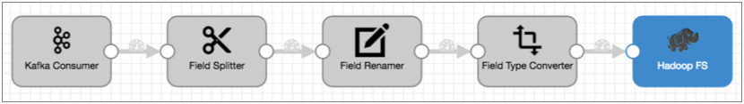

当Hadoop FS关闭文件时，您希望将文件移动到其他目录，并且文件权限更改为只读。

保留其余管道，您可以在Hadoop FS目标中启用事件处理，将其连接到HDFS File Metadata executor，并将HDFS File Metadata executor配置为文件并更改权限。产生的管道如下所示：

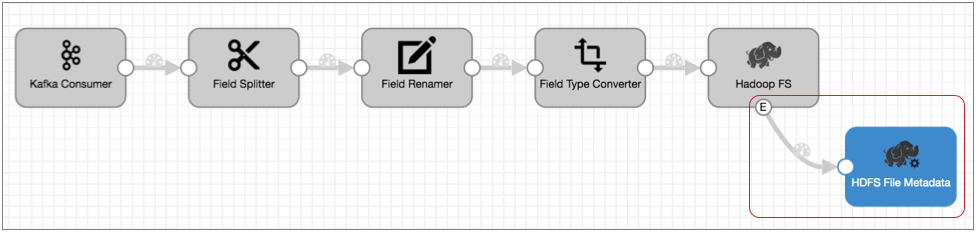

如果需要根据文件名或位置不同地设置权限，则可以使用流选择器相应地路由事件记录，然后使用两个HDFS文件元数据执行程序来更改文件权限，如下所示：

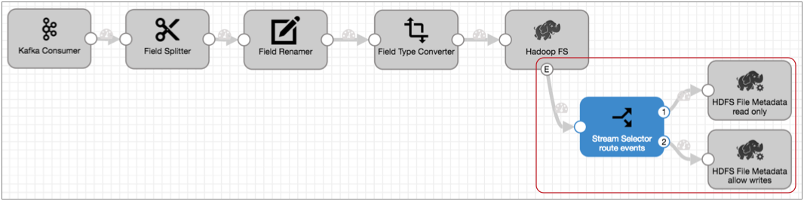

#### 事件存储流

事件存储流将事件记录从事件生成阶段路由到目标。目标将事件记录写入目标系统。

事件记录在记录头属性和记录字段中包含有关事件的信息。您可以在事件流中添加处理器以丰富事件记录，然后再将其写入目标。

例如，您有一个使用Directory原点来处理Weblog的管道：

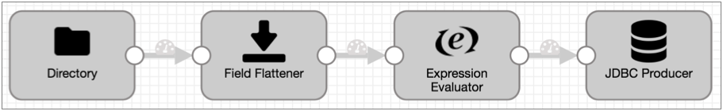

Directory每次启动并完成读取文件时都会生成事件记录，并且事件记录包括一个带有文件的文件路径的字段。出于审计目的，您希望将此信息写入数据库表。

保留其余的管道，可以为Directory起源启用事件处理，并只需将其连接到JDBC Producer，如下所示：

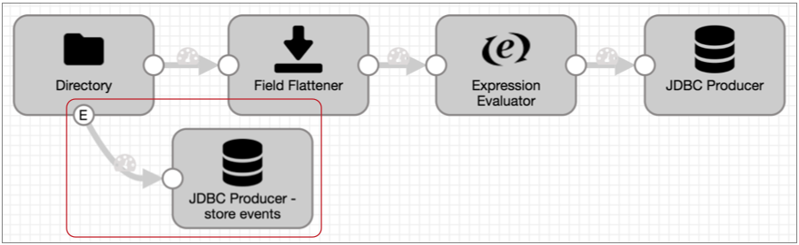

但是您想知道事件何时发生。目录事件记录将事件创建时间存储在sdc.event.creation_timestamp记录头属性中。因此，您可以将Expression Evaluator与以下表达式配合使用，以将创建日期和时间添加到记录中：

```
${record:attribute('sdc.event.creation_timestamp')}
```

而且，如果您有多个将事件写入同一位置的管道，则可以使用以下表达式在事件记录中也包括管道名称：

```
${pipeline:name()}
```

Expression Evaluator和最终管道如下所示：

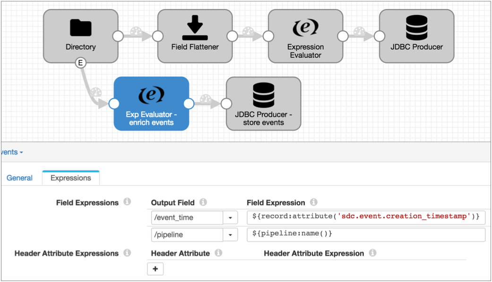

## 执行者

执行者在收到事件记录时执行任务。

在Data Collector Edge管道中不可用。 Data Collector Edge管道不支持执行器。

您可以使用以下执行程序阶段进行事件处理：

- ADLS Gen1文件元数据执行器

  收到事件后，更改文件元数据，创建一个空文件或删除Azure Data Lake Storage Gen1中的文件或目录。

  更改文件元数据时，执行者除了可以指定所有者和组以及更新文件的权限和ACL之外，还可以重命名和移动文件。创建空文件时，执行者可以指定所有者和组，并设置文件的权限和ACL。删除文件和目录时，执行程序将递归执行任务。

  您可以以任何逻辑方式使用执行程序，例如在Azure Data Lake Storage Gen1目标关闭文件后更改权限。

- ADLS Gen2文件元数据执行器

  收到事件后，更改文件元数据，创建一个空文件或删除Azure Data Lake Storage Gen2中的文件或目录。

  更改文件元数据时，执行者除了可以指定所有者和组以及更新文件的权限和ACL之外，还可以重命名和移动文件。创建空文件时，执行者可以指定所有者和组，并设置文件的权限和ACL。删除文件和目录时，执行程序将递归执行任务。

  可以以任何逻辑方式使用执行程序，例如在Azure Data Lake Storage Gen2目标关闭文件后移动文件。

- Amazon S3执行器

  为指定内容创建新的Amazon S3对象，在存储桶中复制对象，或在接收到事件后将标签添加到现有的Amazon S3对象。

  您可以以任何逻辑方式使用执行程序，例如将信息从事件记录写入新的S3对象，或者在对象被Amazon S3目标写入后复制或标记对象。

- Databricks执行器

  为每个事件启动一个Databricks作业。

  您可以以任何逻辑方式使用执行程序，例如在Hadoop FS，MapR FS或Amazon S3目标关闭文件后运行Databricks作业。

- 电子邮件执行器

  在收到事件后向配置的收件人发送自定义电子邮件。您可以选择配置确定何时发送电子邮件的条件。

  您可以以任何逻辑方式使用执行程序，例如，每次Azure Data Lake Storage目标每次完成流式传输整个文件时都发送电子邮件。

- 配置单元查询执行器

  对每个事件执行用户定义的Hive或Impala查询。

  您可以以任何逻辑方式使用执行程序，例如在Hive元数据目标更新Hive元存储之后，或者在Hadoop FS或MapR FS目标关闭文件之后运行Hive或Impala查询。

  例如，如果您通过Impala读取数据，则可以将Hive Query执行器用作Hive [漂移同步解决方案的](https://streamsets.com/documentation/controlhub/latest/help/datacollector/UserGuide/Hive_Drift_Solution/HiveDriftSolution_title.html#concept_phk_bdf_2w)一部分。当表结构或数据更改时，Impala要求您运行Invalidate Metadata命令。

  您可以使用Hive Query执行程序在每次Hive Metastore目标更改表的结构以及每次Hadoop FS目标关闭文件时自动提交命令，而无需尝试手动计时此操作。

- HDFS文件元数据执行器

  收到事件后，更改文件元数据，创建空文件或删除HDFS或本地文件系统中的文件或目录。

  更改文件元数据时，执行者除了可以指定所有者和组以及更新文件的权限和ACL之外，还可以重命名和移动文件。创建空文件时，执行者可以指定所有者和组，并设置文件的权限和ACL。删除文件和目录时，执行程序将递归执行任务。

  您可以以任何逻辑方式使用执行程序，例如在从Hadoop FS或本地FS目标接收文件关闭事件后更改文件元数据。

- 管道修整器执行器

  收到事件时停止管道，将管道转换为“完成”状态。允许管道在停止之前完成所有预期的处理。

  您可以以任何逻辑方式使用Pipeline Finisher执行程序，例如在从JDBC Query Consumer来源接收到no-more-data事件后停止管道。这使您可以实现“批量”处理-在处理所有可用数据时停止管道，而不是使管道无限期地处于空闲状态。

  例如，您可以将Pipeline Finisher执行程序与JDBC Multitable Consumer一起使用，以在处理指定表中的所有查询数据时停止管道。

- JDBC查询执行器

  使用JDBC连接到数据库并运行指定的SQL查询。

  发生事件后，用于在数据库上运行SQL查询。

- MapR FS文件元数据执行器

  收到事件后，更改文件元数据，创建一个空文件或删除MapR FS中的文件或目录。

  更改文件元数据时，执行者除了可以指定所有者和组以及更新文件的权限和ACL之外，还可以重命名和移动文件。创建空文件时，执行者可以指定所有者和组，并设置文件的权限和ACL。删除文件和目录时，执行程序将递归执行任务。

  您可以以任何逻辑方式使用执行程序，例如在MapR FS目标关闭文件后创建一个空文件。

- MapReduce执行器

  连接到HDFS或MapR FS，并为每个事件启动MapReduce作业。

  您可以以任何逻辑方式使用执行程序，例如在Hadoop FS或MapR FS目标关闭文件后运行MapReduce作业。例如，您可以将MapReduce执行程序与Hadoop FS目标一起使用，以在Hadoop FS关闭文件时将Avro文件转换为Parquet。

- 壳牌执行人

  为每个事件执行用户定义的外壳脚本。

- Spark执行器

  连接到YARN上的Spark，并为每个事件启动一个Spark应用程序。

  您可以以任何逻辑方式使用执行程序，例如在Hadoop FS，MapR FS或Amazon S3目标关闭文件后运行Spark应用程序。例如，您可以将Spark执行程序与Hadoop FS目标一起使用，以在Hadoop FS关闭文件时将Avro文件转换为Parquet。

## 逻辑配对

您可以按照自己的需要使用任何事件。下表概述了事件生成与执行程序和目标之间的一些逻辑配对。

### 管道事件

| 管道事件类型 | 活动消费者                                                   |
| :----------- | :----------------------------------------------------------- |
| 管道启动     | 除Pipeline Finisher外的任何单个执行程序。另一个用于额外处理的管道。 |
| 流水线停止   | 除Pipeline Finisher外的任何单个执行程序。另一个用于额外处理的管道。 |

### 起源事件

| 事件产生的起源                | 活动消费者                                                   |
| :---------------------------- | :----------------------------------------------------------- |
| 亚马逊S3                      | Pipeline Finisher执行程序在处理所有对象查询的数据后停止管道。电子邮件执行程序在源完成对可用对象的处理时发送电子邮件。事件存储的任何目的地。 |
| Azure Data Lake Storage Gen1  | 电子邮件执行程序在关闭文件或流式传输整个文件后发送电子邮件。Pipeline Finisher执行程序在处理所有可用文件后停止管道。事件存储的任何目的地。 |
| Azure Data Lake Storage Gen2  | 电子邮件执行程序在关闭文件或流式传输整个文件后发送电子邮件。Pipeline Finisher执行程序在处理所有可用文件后停止管道。事件存储的任何目的地。 |
| 目录                          | 电子邮件执行程序，可在源头每次启动或完成文件处理时发送电子邮件。Pipeline Finisher执行程序在处理所有可用文件后停止管道。事件存储的任何目的地。 |
| 文件尾                        | 电子邮件执行程序，可在源头每次启动或完成文件处理时发送电子邮件。事件存储的任何目的地。 |
| Google BigQuery               | 电子邮件执行程序，可在每次原始成功完成查询时发送电子邮件。事件存储的任何目的地。 |
| 谷歌云存储                    | Pipeline Finisher执行程序在处理所有对象查询的数据后停止管道。电子邮件执行程序在源完成对可用对象的处理时发送电子邮件。事件存储的任何目的地。 |
| Hadoop FS独立版               | 电子邮件执行程序，可在源头每次启动或完成文件处理时发送电子邮件。Pipeline Finisher执行程序在处理所有可用文件后停止管道。事件存储的任何目的地。 |
| JDBC多表使用者                | Pipeline Finisher执行程序在处理所有表中查询的数据后停止管道。电子邮件执行程序在原始处理完查询返回的所有数据后发送电子邮件。事件存储的任何目的地。 |
| JDBC查询使用者                | 将no-more-data事件路由到Pipeline Finisher执行程序，以在处理查询的数据后停止管道。电子邮件执行程序，可在源成功完成查询，完成查询失败或完成所有可用数据处理时发送电子邮件。事件存储的任何目的地。 |
| MapR FS独立版                 | 电子邮件执行程序，可在源头每次启动或完成文件处理时发送电子邮件。Pipeline Finisher执行程序在处理所有可用文件后停止管道。事件存储的任何目的地。 |
| MongoDB                       | 将no-more-data事件路由到Pipeline Finisher执行程序，以在处理查询的数据后停止管道。电子邮件执行程序在源完成对可用对象的处理时发送电子邮件。事件存储的任何目的地。 |
| Oracle批量加载                | 电子邮件执行程序在完成读取表中的数据后发送电子邮件。事件存储的任何目的地。 |
| Oracle CDC客户端              | 电子邮件执行程序在每次读取重做日志中的DDL语句时发送电子邮件。事件存储的任何目的地。 |
| 销售队伍                      | Pipeline Finisher执行程序在处理查询的数据后停止管道。电子邮件执行程序在源完成对查询返回的所有数据的处理后发送电子邮件。事件存储的任何目的地。 |
| SFTP / FTP / FTPS客户端       | 电子邮件执行程序，可在源头每次启动或完成文件处理时发送电子邮件。Pipeline Finisher执行程序在处理所有可用文件后停止管道。事件存储的任何目的地。 |
| SQL Server 2019 BDC多表使用者 | Pipeline Finisher执行程序在处理所有表中查询的数据后停止管道。电子邮件执行程序在原始处理完查询返回的所有数据后发送电子邮件。事件存储的任何目的地。 |
| SQL Server更改跟踪            | Pipeline Finisher执行程序在处理可用数据后停止管道。          |
| Teradata消费者                | Pipeline Finisher执行程序在处理所有表中查询的数据后停止管道。电子邮件执行程序在原始处理完查询返回的所有数据后发送电子邮件。事件存储的任何目的地。 |

### 处理器事件

| 事件产生处理器   | 活动消费者                                                   |
| :--------------- | :----------------------------------------------------------- |
| 窗口聚合器       | 当结果超过指定的阈值时，通过电子邮件发送给执行者以进行通知。事件存储的任何目的地。 |
| Groovy评估器     | 任何逻辑执行器。事件存储的任何目的地。                       |
| JavaScript评估器 | 任何逻辑执行器。事件存储的任何目的地。                       |
| Jython评估师     | 任何逻辑执行器。事件存储的任何目的地。                       |
| TensorFlow评估器 | 事件存储的任何目的地。                                       |

### 目的地活动

| 事件产生目的地               | 活动消费者                                                   |
| :--------------------------- | :----------------------------------------------------------- |
| 亚马逊S3                     | Amazon S3执行器，用于创建或复制对象或向关闭的对象添加标签。Databricks执行程序在关闭对象或整个文件后运行Databricks应用程序。Spark执行程序在关闭对象或整个文件后运行Spark应用程序。电子邮件执行程序在关闭对象或整个文件后发送电子邮件。事件存储的任何目的地。 |
| Azure数据湖存储（旧版）      | ADLS Gen1执行程序可在关闭文件后更改文件元数据，创建空文件或删除文件或目录。电子邮件执行程序在关闭文件或流式传输整个文件后发送电子邮件。事件存储的任何目的地。 |
| Azure Data Lake Storage Gen1 | ADLS Gen1执行程序可在关闭文件后更改文件元数据，创建空文件或删除文件或目录。电子邮件执行程序在关闭文件或流式传输整个文件后发送电子邮件。事件存储的任何目的地。 |
| Azure Data Lake Storage Gen2 | ADLS Gen2执行程序可在关闭文件后更改文件元数据，创建空文件或删除文件或目录。电子邮件执行程序在关闭文件或流式传输整个文件后发送电子邮件。事件存储的任何目的地。 |
| 谷歌云存储                   | Databricks执行程序在关闭对象或整个文件后运行Databricks作业。Spark执行程序在关闭对象或整个文件后运行Spark应用程序。电子邮件执行程序在关闭对象或整个文件后发送电子邮件。事件存储的任何目的地。 |
| Hadoop FS                    | HDFS文件元数据执行程序，用于在关闭文件后更改文件元数据，创建空文件或删除文件或目录。Hive Query执行程序在关闭文件后运行Hive或Impala查询。在使用带有Impala的Hive的Drift同步解决方案时特别有用。MapReduce执行程序在关闭文件后运行MapReduce作业。Databricks执行程序在关闭文件后运行Databricks作业。Spark执行程序在关闭文件后运行Spark应用程序。电子邮件执行程序在关闭文件或流式传输整个文件后发送电子邮件。事件存储的任何目的地。 |
| Hive Metastore               | Hive Query执行程序在目标更改表结构后运行Hive或Impala查询。在使用带有Impala的Hive的Drift同步解决方案时特别有用。HDFS文件元数据执行程序，用于在写入Avro模式文件后更改文件元数据，创建空文件或删除文件或目录。电子邮件执行程序，以在每次目标更改Hive元存储库时发送电子邮件。事件存储的任何目的地。 |
| 本地FS                       | HDFS文件元数据执行程序，用于在关闭文件后更改文件元数据，创建空文件或删除文件或目录。电子邮件执行程序在目标关闭文件或流式传输整个文件后发送电子邮件。事件存储的任何目的地。 |
| MapR FS                      | MapR FS文件元数据执行程序可在关闭文件后更改文件元数据，创建空文件或删除文件或目录。MapReduce执行程序在关闭文件后运行MapReduce作业。Databricks执行程序在关闭文件后运行Spark应用程序。Spark执行程序在关闭文件后运行Spark应用程序。电子邮件执行程序在目标每次关闭文件或流式传输整个文件时发送电子邮件。事件存储的任何目的地。 |
| SFTP / FTP / FTPS客户端      | 电子邮件执行程序在目标每次关闭文件或流式传输整个文件时发送电子邮件。事件存储的任何目的地。 |

### 执行器事件

| 事件产生执行器            | 活动消费者                                                   |
| :------------------------ | :----------------------------------------------------------- |
| ADLS Gen1文件元数据执行器 | 电子邮件执行程序在执行程序每次更改文件元数据时发送电子邮件。事件存储的任何目的地。 |
| ADLS Gen2文件元数据执行器 | 电子邮件执行程序在执行程序每次更改文件元数据时发送电子邮件。事件存储的任何目的地。 |
| 亚马逊S3                  | 电子邮件执行程序在执行程序每次更改对象元数据时发送电子邮件。事件存储的任何目的地。 |
| Databricks执行器          | 电子邮件执行程序，以在Databricks执行程序每次启动Databricks作业时发送电子邮件。事件存储的任何目的地。 |
| HDFS文件元数据执行器      | 电子邮件执行程序在执行程序每次更改文件元数据时发送电子邮件。事件存储的任何目的地。 |
| 配置单元查询执行器        | 电子邮件执行程序，可在查询成功或失败时发送电子邮件。事件存储的任何目的地。 |
| JDBC查询执行器            | 电子邮件执行程序，可在查询成功或失败时发送电子邮件。事件存储的任何目的地。 |
| MapR FS文件元数据执行器   | 电子邮件执行程序在执行程序每次更改文件元数据时发送电子邮件。事件存储的任何目的地。 |
| MapReduce执行器           | 电子邮件执行程序，以在执行程序每次启动MapReduce作业时发送电子邮件。事件存储的任何目的地。 |
| Spark执行器               | 电子邮件执行程序，以在每次Spark执行程序启动Spark应用程序时发送电子邮件。事件存储的任何目的地。 |

## 活动记录

事件记录是在阶段或管道事件发生时创建的记录。

大多数事件记录都会在记录标题中传递常规事件信息，例如事件发生的时间。它们还可以在记录字段中包含特定于事件的详细信息，例如已关闭的输出文件的名称和位置。

File Tail起源生成的事件记录是例外-它们在记录字段中包含所有事件信息。

### 事件记录标题属性

除标准记录头属性外，大多数事件记录还包括事件信息（例如事件类型和事件发生时间）的记录头属性。

与任何记录头属性一样，您可以使用Expression Evaluator和record：attribute函数将记录头属性信息作为记录中的字段包括在内。例如，在存储事件记录时，您很可能希望在表达式评估器中使用以下表达式将事件的时间包括在事件记录中：

```
${record:attribute('sdc.event.creation_timestamp')}
```

请注意，所有记录头属性都是字符串值。有关使用记录标题属性的更多信息，请参见[Record Header Attributes](https://streamsets.com/documentation/controlhub/latest/help/datacollector/UserGuide/Pipeline_Design/RecordHeaderAttributes.html#concept_wn2_jcz_dz)。

大多数事件包括以下事件记录头属性。File Tail例外，将所有事件信息写入记录字段。

| 事件记录标题属性             | 描述                                                         |
| :--------------------------- | :----------------------------------------------------------- |
| sdc.event.type               | 事件类型。由生成事件的阶段定义。有关可用于事件生成阶段的事件类型的信息，请参阅阶段文档。 |
| sdc.event.version            | 整数，指示事件记录类型的版本。                               |
| sdc.event.creation_timestamp | 舞台创建事件的时间戳记。                                     |

**注意：** 阶段生成的事件记录因阶段而异。有关阶段事件的描述，请参见事件发生阶段的文档中的“事件记录”。有关管道事件的描述，请参见[管道事件记录](https://streamsets.com/documentation/controlhub/latest/help/datacollector/UserGuide/Pipeline_Configuration/EventGeneration.html#concept_cv3_nqt_51b)。

## 在数据预览和快照中查看事件

生成事件后，舞台事件将在事件预览和快照中显示为事件记录。记录离开事件生成阶段后，将其视为标准记录。

事件框架生成的管道事件不会显示在数据预览中。但是，您可以启用数据预览以生成和处理管道事件。

### 在数据预览和快照中查看舞台事件

在数据预览中和查看数据快照时，与阶段相关的事件记录会在事件生成阶段中显示为“事件记录”，并显示在标准记录批的下方。

离开舞台后，该记录将像其他任何记录一样显示。

例如，下面的目录来源在开始读取文件进行数据预览时会生成事件记录：

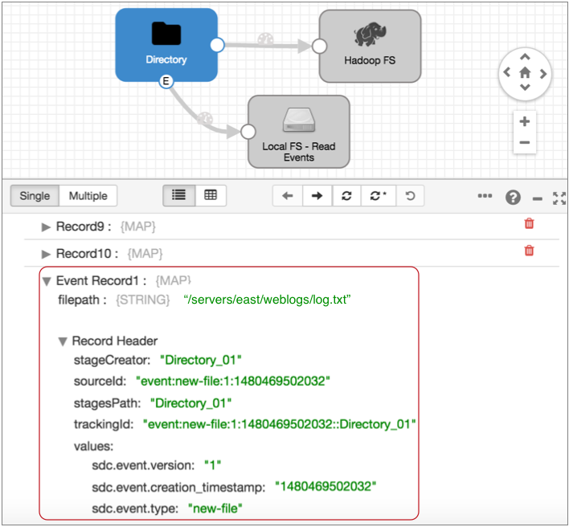

当您选择写入事件记录的本地FS目标时，您会看到同一事件记录不再显示事件记录标签。就像对待其他任何记录一样：

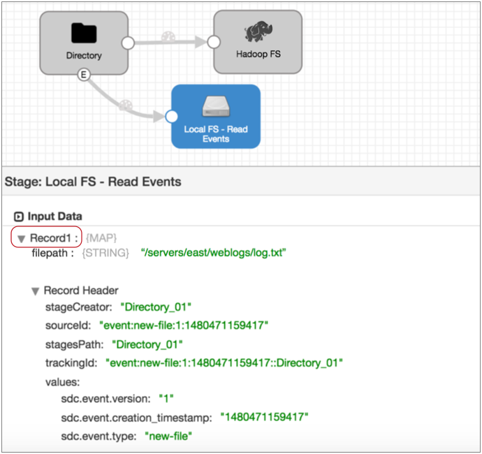

## 在数据预览中执行管道事件

您可以在数据预览中启用管道事件执行以测试事件处理。

在预览数据时启用管道事件生成时，事件框架在启动数据预览时生成管道启动事件，在停止数据预览时生成停止事件。如果将管道配置为将事件传递给执行者或消耗事件的管道，则会传递事件并触发其他处理。

要在数据预览期间启用生成管道事件执行，请使用“启用管道执行数据预览”属性。

## 案例研究：实木复合地板转换

假设您想使用列格式Parquet在HDFS上存储数据。但是Data Collector 没有Parquet数据格式。你怎么做呢？

事件框架正是为此目的而创建的。只需将事件流添加到管道中，即可将Avro文件自动转换为Parquet。

您可以使用Spark执行程序来触发Spark应用程序，也可以使用MapReduce执行程序来触发MapReduce作业。本案例研究使用MapReduce执行程序。

这只是几个简单的步骤：

1. 创建您要使用的管道。

   像其他任何管道一样，使用所需的源和处理器。然后，配置Hadoop FS以将Avro数据写入HDFS。

   每次关闭文件时，Hadoop FS目标都会生成事件。这是完美的，因为我们只想在文件完全写入后才将其转换为Parquet。

   **注意：**为避免运行不必要数量的MapReduce作业，请配置目标以创建与目标系统可以轻松处理的文件一样大的文件。

   

2. 配置Hadoop FS以生成事件。

   在目标的“ **常规”** 选项卡上，选择“ **产生事件”** 属性。

   选择此属性后，事件输出流将变得可用，并且每次关闭输出文件时，Hadoop FS都会生成事件记录。事件记录包括关闭文件的文件路径。

   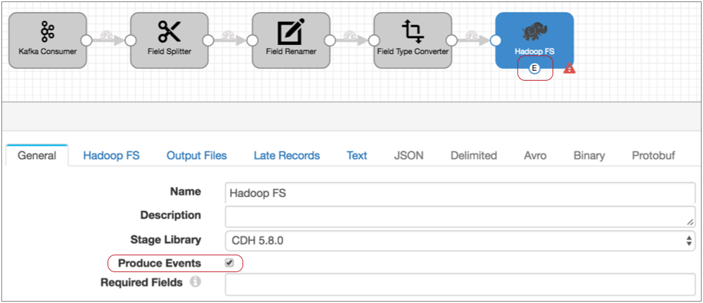

3. 将Hadoop FS事件输出流连接到MapReduce执行程序。

   现在，每次MapReduce执行程序收到一个事件时，它都会触发您配置为运行的作业。

   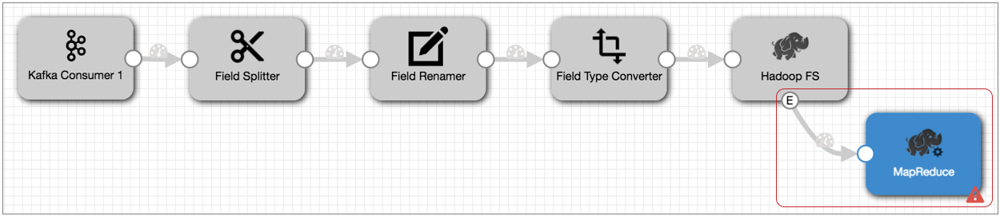

4. 配置MapReduce执行程序以运行将完成的Avro文件转换为Parquet的作业。

   在MapReduce执行程序中，配置MapReduce配置详细信息，然后选择Avro to Parquet作业类型。在“ **Avro转换”**选项卡上，配置文件输入和输出目录信息以及相关属性：

   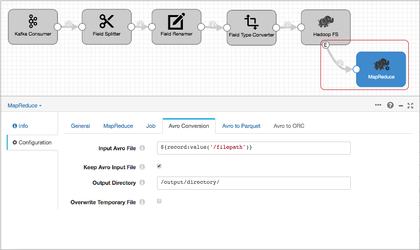

   该**输入的Avro文件**属性默认`${record:value('/filepath')}`，运行在Hadoop的FS文件关闭事件记录中指定的文件的作业。

   然后，在“从**Avro到Parquet”**选项卡上，有选择地配置高级Parquet属性。

将此事件流添加到管道后，每次Hadoop FS目标关闭文件时，它都会生成一个事件。当MapReduce执行程序收到事件时，它将启动MapReduce作业，该作业将Avro文件转换为Parquet。简单！

## 案例研究：针对Hive的DDS的Impala元数据更新

您喜欢[Hive](https://streamsets.com/documentation/controlhub/latest/help/datacollector/UserGuide/Hive_Drift_Solution/HiveDriftSolution_title.html#concept_phk_bdf_2w)的[Drift同步解决方案，](https://streamsets.com/documentation/controlhub/latest/help/datacollector/UserGuide/Hive_Drift_Solution/HiveDriftSolution_title.html#concept_phk_bdf_2w)因为它在需要时会自动更新Hive Metastore。但是，如果您将它与Impala一起使用，则尝试在每次元数据更改和文件写入之后对Invalidate Metadata命令进行计时。

您可以使用Drift Synchronization Solution for Hive管道中的事件框架来自动执行命令，而不必手动运行命令。

启用Hive Metastore目标和Hadoop FS目标以生成事件。您可以将两个事件流都连接到单个Hive Query执行程序。然后，每次Hive Metastore目标更改Hive Metastore时，以及每次Hadoop FS将文件写入Hive表时，执行程序都运行Invalidate Metadata命令。

运作方式如下：

以下针对Hive管道的Drift Synchronization Solution从目录中读取文件。Hive元数据处理器评估数据的结构变化。它将数据传递到Hadoop FS，并将元数据记录传递到Hive Metastore目标。Hive Metastore基于它收到的元数据记录在Hive中创建和更新表：

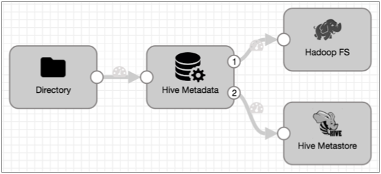

1. 配置Hive Metastore目标以生成事件。

   在 **常规**选项卡上，选择**生产事件**属性。

   现在，事件输出流变得可用，并且Hive Metastore目标在每次更新Hive Metastore时都会生成一个事件记录。事件记录包含已创建或更新的表的名称。

   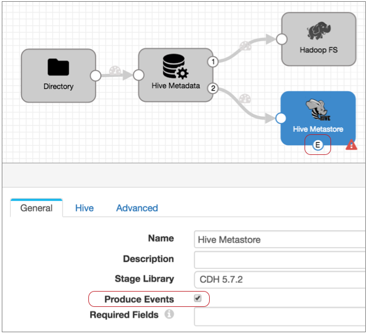

2. 我们还需要向Hadoop FS目标添加事件流，以便每次目标将文件写入Hive时都可以运行Invalidate Metadata命令。因此，在Hadoop FS目标中的“ 

   常规”

   选项卡上，选择“ 

   产生事件”

   。

   通过选择此属性，事件输出流变得可用，并且Hadoop FS每次关闭文件时都会生成事件记录：

   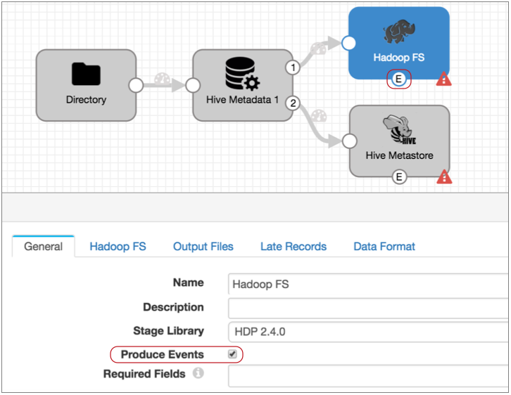

3. Hadoop FS目标生成的事件记录不包括Hive Query执行程序所需的表名，但它在文件路径中包含表名。因此，将Expression Evaluator处理器添加到事件流。创建一个新的表字段，并使用以下表达式：

   ```
   `${file:pathElement(record:value('/filepath'), -3)}`.`${file:pathElement(record:value('/filepath'), -2)}`
   ```

   此表达式使用事件记录的Filepath字段中的路径并执行以下计算：

   - 提取路径的倒数第二部分，并将其用作数据库名称。
   - 提取路径的倒数第二部分，并将其用作表名。

   因此，当Hadoop FS完成文件时，它将在文件路径字段中写入已写入文件的路径，例如users / logs / server1weblog.txt。上面的表达式正确地将数据库和表名解释为：logs.server1weblog。

   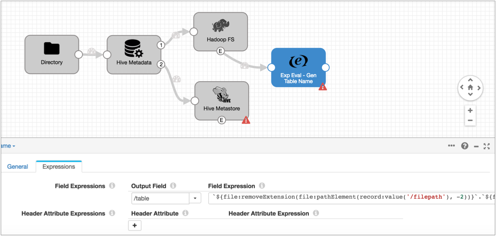

4. 添加Hive Query执行程序，并将Hive Metastore目标和Expression Evaluator连接到该执行程序。然后配置Hive Query执行程序。

   **注意：**如果要使用Impala JDBC驱动程序，请确保将驱动程序安装为Hive Query执行程序的外部库。有关更多信息，请参阅[安装Impala驱动程序](https://streamsets.com/documentation/controlhub/latest/help/datacollector/UserGuide/Executors/HiveQuery.html#concept_rfq_xk4_nbb)。使用Data Collector随附的Apache Hive JDBC驱动程序时，不需要其他步骤。

   在Hive查询执行程序中，在**Hive**选项卡上配置Hive配置详细信息。如果您在配置URL时遇到任何问题，请参阅我们的[Ask StreamSets帖子中](https://ask.streamsets.com/question/7/how-do-you-configure-a-hive-impala-jdbc-driver-for-data-collector/)的Impala驱动程序信息。

   然后，在“ **查询”**选项卡上，输入以下查询：

   ```
   invalidate metadata ${record:value('/table')}
   ```

   该查询刷新指定表的Impala缓存。该表既可以是刚刚更新的Hive Metastore事件记录中的表，也可以是Hadoop FS写入文件的表。

   这是最后的管道：

   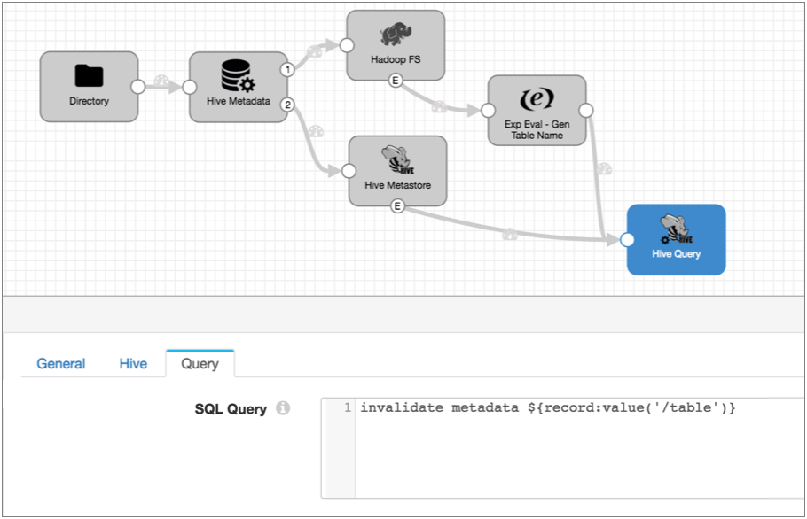

   有了这些新的事件流，Hive Metastore目标每次创建表，分区或列，并且每次Hadoop FS目标完成写入文件时，目标都会生成事件记录。当Hive Query执行程序收到事件记录时，它将运行Invalidate Metadata命令，以便Impala可以使用新信息更新其缓存。做完了！

## 案例研究：输出文件管理

默认情况下，Hadoop FS目标为输出文件和后期记录文件创建一组复杂的目录，并根据阶段配置使文件保持打开状态以供写入。很好，但是一旦文件完成，您希望将文件移动到其他位置。而且，当您使用它时，最好为写入的文件设置权限。

所以你会怎么做？

Hadoop FS目标写完输出文件后，将事件流添加到管道中以管理输出文件。然后，在事件流中使用HDFS文件元数据执行程序。

**注意：**如果愿意，可以将本地FS目标与HDFS文件元数据执行器一起使用，或者将MapR FS目标与MapR FS文件元数据执行器一起使用，而不是将Hadoop FS目标与HDFS文件元数据执行器一起使用。

这是一个使用JDBC从数据库读取，执行一些处理并写入HDFS的管道：

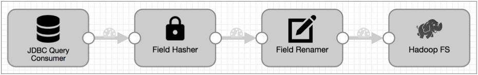

1. 要添加事件流，请首先配置Hadoop FS以生成事件：

   在Hadoop FS目标的“ **常规”**选项卡上，选择“ **产生事件”**属性。

   现在，事件输出流变得可用，并且Hadoop FS每次关闭输出文件时都会生成一个事件记录。Hadoop FS事件记录包括文件名，路径和大小的字段。

   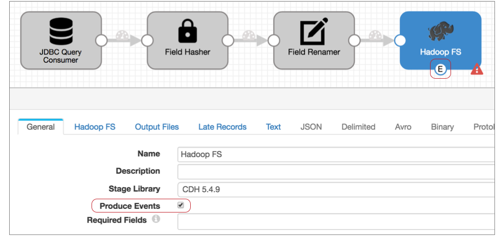

2. 将Hadoop FS事件输出流连接到HDFS文件元数据执行器。

   现在，每次HDFS文件元数据执行程序收到一个事件时，它都会触发您配置它运行的任务。

   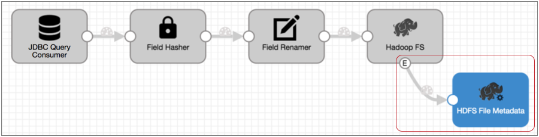

3. 配置HDFS文件元数据执行程序，以将文件移动到所需的目录并设置文件的权限。

   在“ HDFS文件元数据”执行器中，在“ **HDFS”**选项卡上配置HDFS配置详细信息。然后，在“ **任务”**选项卡上，选择**“在现有文件上更改元数据”以**配置要进行的更改。

   在这种情况下，您要将文件移动到 / new / location，并将文件许可权设置为0440以允许用户和组对文件的读取访问权限：

   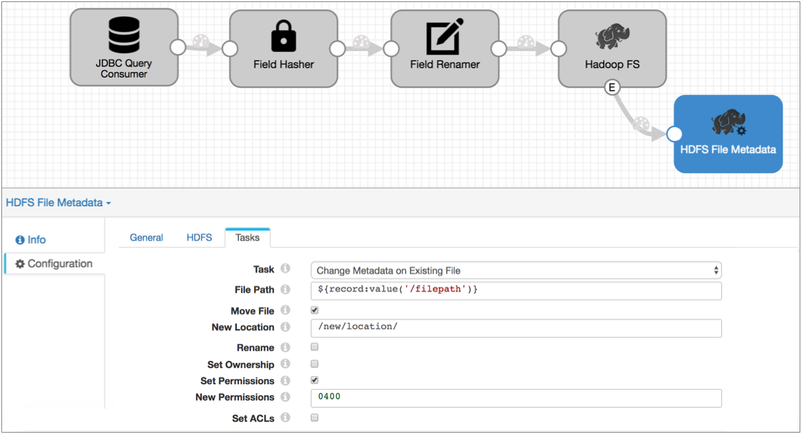

将此事件流添加到管道中后，每次Hadoop FS目标关闭文件时，它都会生成一个事件记录。当HDFS文件元数据执行程序收到事件记录时，它将移动文件并设置文件许可权。没有糊涂，没有大惊小怪。

## 案例研究：停止管道

假设您的数据流拓扑每天凌晨4点更新数据库表。您不希望管道在几分钟内处理数据并在一天的其余时间中处于空闲状态，而是想启动管道，让其处理所有数据然后停止-就像老式批次处理一样。并且您希望管道在停止时通知您。

为此，只需将no-more-data事件记录路由到Pipeline Finisher执行程序并配置通知。

以下起源产生了没有数据的事件：

- Amazon S3的起源
- Azure Data Lake Storage Gen1来源
- Azure Data Lake Storage Gen2的来源
- 目录来源
- Google Cloud Storage的起源
- Hadoop FS独立版本
- JDBC多表使用者来源
- JDBC查询使用者来源
- MongoDB的起源
- Salesforce来源
- SFTP / FTP / FTPS客户端来源
- SQL Server 2019 BDC多表使用者来源
- SQL Server CDC客户端来源
- SQL Server更改跟踪来源
- Teradata消费者来源

我们将使用JDBC查询使用者来显示更复杂的场景。

这是从数据库读取，执行一些处理并写入HDFS的基本管道：

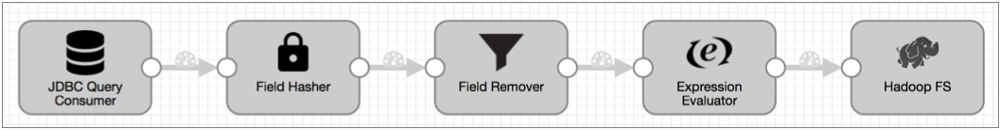

要将管道配置为在处理所有可用的查询数据后停止：

1. 配置源以生成事件：

   在“ JDBC查询使用者”来源的“ **常规”**选项卡上，选择“ **产生事件”**属性。

   事件输出流变得可用：

   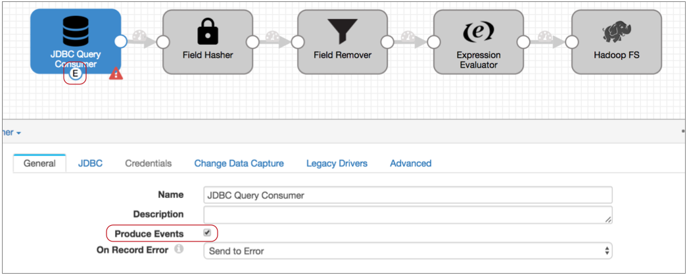

   JDBC查询使用者生成几种类型的事件：查询成功，查询失败和没有数据。我们之所以知道这一点，是因为您检查了JDBC Query Consumer文档的[Event Record部分](https://streamsets.com/documentation/controlhub/latest/help/datacollector/UserGuide/Origins/JDBCConsumer.html#concept_rzl_s1t_kz)。每个事件生成阶段在相似的部分中都有事件详细信息。

   查询成功和失败事件可能很有用，因此您可以使用流选择器将这些记录路由到单独的事件流。但是，让我们说我们不在乎那些事件，我们只是希望将no-more-data事件传递给Pipeline Finisher执行程序。

2. 将事件输出流连接到Pipeline Finisher执行程序。

   此时，源产生的所有事件都将到达执行者。由于JDBC Query Consumer起源会生成多种事件类型，因此此设置可能导致执行程序过早停止管道。

3. 为确保仅no-more-data事件进入执行程序，请配置前提条件。

   在具有前提条件的情况下，只有满足指定条件的记录才能进入阶段。

   我们知道，每个事件记录在sdc.event.type记录头属性中都包含事件类型。因此，为了确保仅没有数据事件进入该阶段，我们可以在前提条件中使用以下表达式：

   ```
   ${record:eventType() == 'no-more-data'}
   ```

4. 不满足前提条件的记录将进入错误处理阶段，因此，为了避免存储我们不关心的错误记录（即查询成功和失败事件），我们还应将

   On Record Error

   属性设置为

   Discard

   。

   这是管道整理器：

   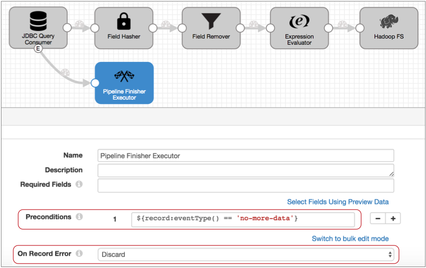

5. 现在，要在Pipeline Finisher停止管道时得到通知，请将管道配置为在管道状态更改为Finished时发送电子邮件。

   时，您可以使用此选项的数据收集器被[设置为发送电子邮件](https://streamsets.com/documentation/controlhub/latest/help/datacollector/UserGuide/Configuration/SendingEmail.html#concept_it1_wwg_xz)。您也可以使用管道状态通知来发送Webhook，或 在管道中使用[电子邮件执行程序](https://streamsets.com/documentation/controlhub/latest/help/datacollector/UserGuide/Executors/Email.html#concept_sjs_sfp_qz)来发送自定义电子邮件。由于我们只需要一个简单的通知，因此让我们根据管道状态发送基本的电子邮件：

   1. 在画布中单击以查看管道配置，然后单击“ **通知”**选项卡。
   2. 在“ **通知管道状态更改”中**，保留“ **完成”**状态，然后删除其他默认状态。
   3. 然后，输入电子邮件地址以接收电子邮件：

   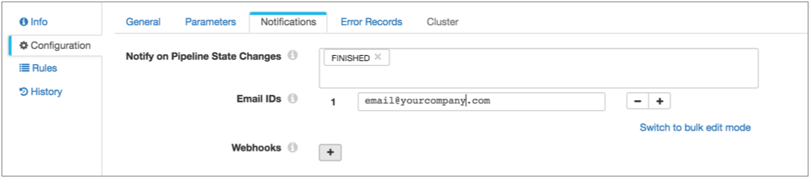

而已！

使用此设置，JDBC查询使用者在完成对查询返回的所有数据的处理后，将传递一个no-more-data事件，并且Pipeline Finisher执行程序将停止管线并将管线转换为Finished状态。由原点生成的所有其他事件都将被丢弃。Data Collector 发送通知，以便您知道管道何时完成以及下次要处理更多数据时，可以再次启动管道。

## 案例研究：将数据从关系源卸载到Hadoop

假设您要将数据从一组数据库表中批量加载到Hive，基本上是替换旧的Apache Sqoop实现。在处理新数据之前，您要删除以前的表。并且您想在管道停止触发其他应用程序的后续操作时创建一个通知文件，例如_SUCCESS文件以启动MapReduce作业。

任务分解如下：

- 批量处理

  要执行批处理，所有处理完成后管道将自动停止，您可以使用创建no-more-data事件的源，然后将该事件传递给Pipeline Finisher执行程序。我们将快速完成此过程，但是对于以Pipeline Finisher为中心的[案例研究](https://streamsets.com/documentation/controlhub/latest/help/datacollector/UserGuide/Event_Handling/EventFramework-Title.html#concept_kff_ykv_lz)，请参阅[案例研究：停止管道](https://streamsets.com/documentation/controlhub/latest/help/datacollector/UserGuide/Event_Handling/EventFramework-Title.html#concept_kff_ykv_lz)。为了处理数据库数据，我们可以使用JDBC Multitable Consumer-它生成no-more-data事件，并可以产生多个线程以提高吞吐量。有关生成no-more-data事件的来源列表，请参阅Pipeline Finisher文档中的[Related EventGeneration Stages](https://streamsets.com/documentation/controlhub/latest/help/datacollector/UserGuide/Executors/PipelineFinisher.html#concept_dct_z3v_j1b)。

- 在处理新数据之前删除现有数据

  要在管道开始处理数据之前执行任务，请使用管道开始事件。因此，例如，如果要在处理开始之前运行shell命令以执行一组任务，则可以使用Shell执行程序。

  要截断Hive表，我们将使用Hive Query执行程序。

- 管道停止时创建通知文件

  在所有处理完成之后，在管道完全停止之前，使用管道停止事件来执行任务。要创建一个空的成功文件，我们将使用HDFS File Metadata executor。

现在，让我们逐步进行：

1. 首先创建您要使用的管道。

   我们在以下简单管道中使用JDBC Multitable Consumer，但是您的管道可以根据需要复杂。

   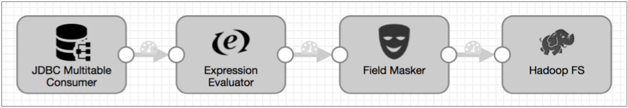

2. 要设置批处理，请通过在“ **常规”**选项卡上选择“ 

   产生事件”

   属性 来启用源中的事件生成。然后，将事件输出流连接到Pipeline Finisher执行程序。

   

   

   现在，当原点完成对所有数据的处理后，它会将no-more-data事件传递给Pipeline Finisher。并且，在完成所有管道任务之后，执行程序将停止管道。

   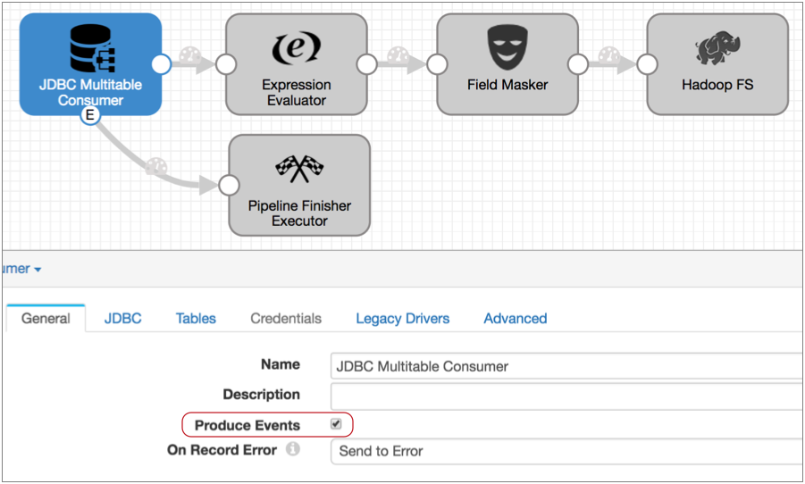

   **注意：** JDBC Multitable Consumer起源仅生成no-more-data事件，因此您不需要使用Stream Selector或executor前提条件来管理其他事件类型。但是，如果要使用的来源生成其他事件类型，则应确保仅将no-more-data事件路由到Pipeline Finisher。有关详细信息，请参阅“ [停止管道”案例研究](https://streamsets.com/documentation/controlhub/latest/help/datacollector/UserGuide/Event_Handling/EventFramework-Title.html#concept_kff_ykv_lz)。

3. 若要在处理开始之前截断Hive表，请配置管道以将管道启动事件传递给Hive查询执行程序。

   为此，在“ **常规”**选项卡上，配置“ **开始事件”**属性，并选择“ Hive查询”执行程序，如下所示：

   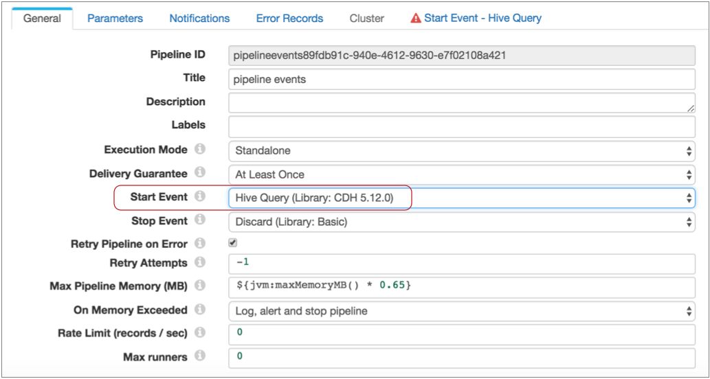

   请注意，现在将显示“ **开始事件-配置单元查询”**选项卡。这是因为管道启动和停止事件的执行程序未显示在管道画布中-您将选定的执行程序配置为管道属性的一部分。

   还要注意，您可以将每种类型的管道事件传递给一个执行者或另一种管道，以进行更复杂的处理。有关管道事件的更多信息，请参见[管道事件生成](https://streamsets.com/documentation/controlhub/latest/help/datacollector/UserGuide/Event_Handling/EventFramework-Title.html#concept_amg_2qr_t1b)。

4. 要配置执行程序，请单击

   开始事件-Hive查询

   选项卡。

   您可以根据需要配置连接属性，然后指定要使用的查询。在这种情况下，您可以使用以下查询，填写表名：

   ```
   TRUNCATE TABLE IF EXISTS <table name>
   ```

   另外，选择**“查询失败时停止”**。这样可以确保在执行程序无法完成截断查询时，管道停止并避免执行任何处理。这些属性应如下所示：

   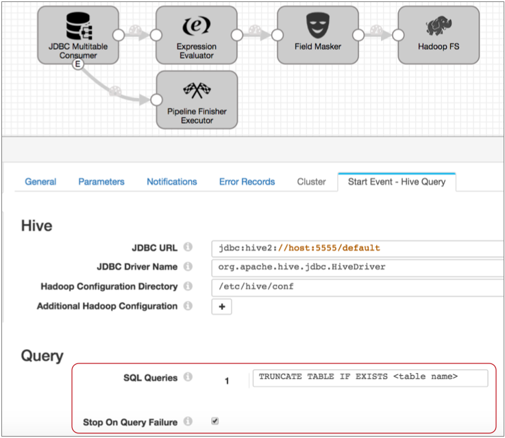

   使用此配置，当您启动管道时，Hive Query执行程序会在数据处理开始之前截断指定的表。当截断成功完成时，管道开始处理。

5. 现在，要在所有处理完成后生成成功文件，请使用

   Stop Event

   属性执行类似的步骤。

   配置管道，以将管道停止事件传递给HDFS文件元数据执行程序，如下所示：

   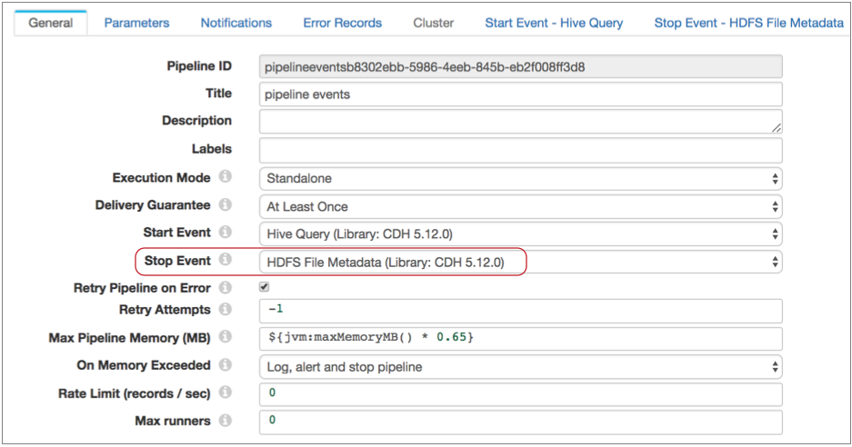

6. 然后，在“ 

   停止事件-HDFS文件元数据”

   选项卡上，指定连接信息并配置执行程序以在具有指定名称的必需目录中创建成功文件。

   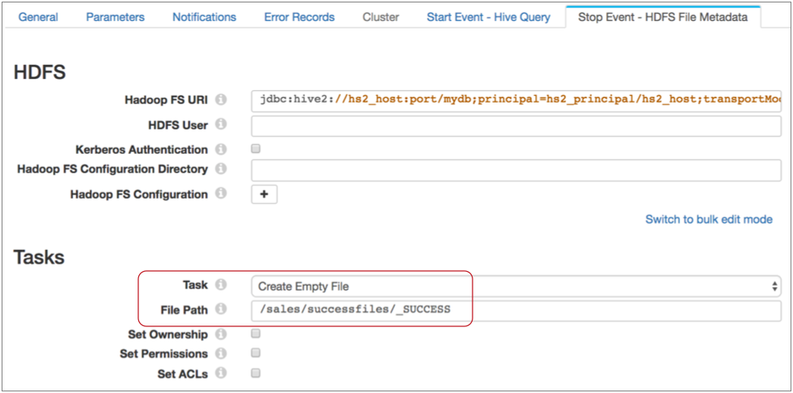

   使用这些配置后，启动管道时，Hive Query执行程序将截断查询中指定的表，然后开始管道处理。当JDBC Multitable Consumer完成所有可用数据的处理后，它将no-more-data事件传递给Pipeline Finisher执行程序。

   Pipeline Finisher执行程序允许管道停止事件触发HDFS File Metadata executor创建空文件，然后使管道平稳停止。批处理作业完成！

## 案例研究：发送电子邮件

您可以将管道配置为在[管道状态更改](https://streamsets.com/documentation/controlhub/latest/help/datacollector/UserGuide/Pipeline_Configuration/Notifications.html#concept_mtn_k4j_rz)和[触发警报](https://streamsets.com/documentation/controlhub/latest/help/datacollector/UserGuide/Alerts/RulesAlerts_title.html#task_f3v_1hw_1r)时发送电子邮件。两种方法都有其自己的用途。在本案例研究中，我们将使用电子邮件执行程序在收到事件后发送电子邮件。

假设您有一个管道，该管道使用JDBC Query Consumer源从数据库中读取数据，使用Jython评估程序评估数据并生成无效事务事件，然后写入HDFS。您希望该管道发送两种类型的电子邮件：一种是在Jython Evaluator发现无效事务时，另一种是在JDBC Query Consumer无法完成查询时。

为此，您只需将事件从来源和处理器路由到Email executor，然后配置两条电子邮件。电子邮件执行程序使您可以指定发送电子邮件的条件，并可以使用表达式来创建自定义电子邮件，以向收件人提供与事件相关的信息。

假设这是原始管道：

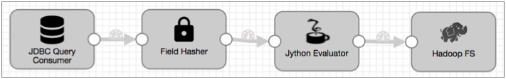

1. 首先，配置JDBC查询使用者以生成事件。

   在来源的“ **常规”**选项卡上，选择“ **产生事件”**属性。

   现在，事件输出流变得可用。请注意，JDBC查询使用者会生成几种类型的事件。之所以知道这一点，是因为您检查了JDBC Query Consumer文档的[Event Record](https://streamsets.com/documentation/controlhub/latest/help/datacollector/UserGuide/Origins/JDBCConsumer.html#concept_rzl_s1t_kz)部分。每个事件生成阶段在相似的部分中都有事件详细信息。

2. 现在，配置Jython评估器以相同的方式生成事件。

   当然，只有设置了脚本后，Jython评估器才会生成事件。但是，您还需要在“ **常规”**选项卡上启用“ **生产事件”**属性。

3. 将两个事件流都连接到电子邮件执行程序。

   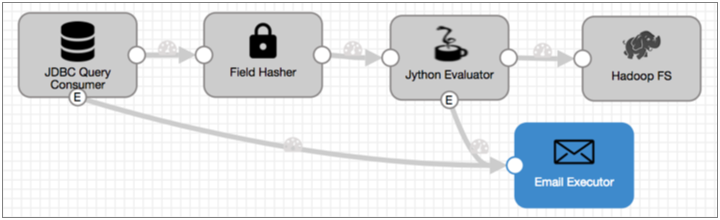

4. 现在，由于JDBC Query Consumer生成了几种类型的事件，因此您需要将Email executor配置为仅在收到查询失败事件之后才发送第一封电子邮件：

   1. 查询失败事件具有jdbc-query-failure事件类型，因此在“ 

      电子邮件”

      选项卡上，您使用以下条件：

      ```
      ${record:eventType() == 'jdbc-query-failure'}
      ```

   2. 所有电子邮件属性都允许使用表达式，因此对于电子邮件主题，您可以包括管道名称，如下所示：

      ```
      Query failure in ${pipeline:title()}!
      ```

   3. 撰写电子邮件正文时，可以使用其他表达式来包含有关管道的信息以及电子邮件中事件记录中包含的信息。

      请记住，事件记录文档列出了事件记录中的所有标题属性和字段，因此在配置电子邮件时可以参考它。有关在电子邮件中使用表达式的更多信息，请参阅《[使用表达式》](https://streamsets.com/documentation/controlhub/latest/help/datacollector/UserGuide/Executors/Email.html#concept_tgb_vbm_wz)。

      对于此电子邮件，您可能包括以下信息：

      ```
      Pipeline ${pipeline:title()} encountered an error. 
      
      At ${time:millisecondsToDateTime(record:eventCreation() * 1000)}, the JDBC Query
      Consumer failed to complete the following query: ${record:value('/query')}
      
      Only the following number of rows were processed: ${record:value('/row-count')} 
      ```

   电子邮件配置如下所示：

   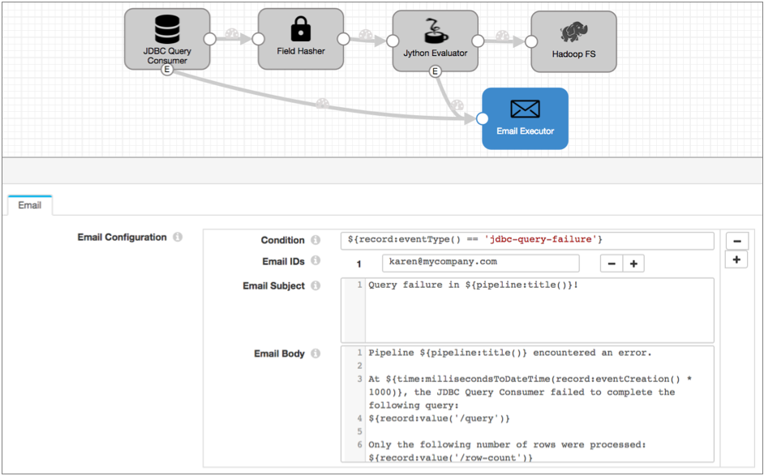

5. 单击“ 

   添加”

   图标为Jython Evaluator事件配置电子邮件。

   由于您希望为Jython Evaluator生成的每个事件发送电子邮件，因此对于该条件，您可以使用脚本中定义的事件类型。假设它是“ invalidTransaction”。与第一封电子邮件一样，您可以在电子邮件正文中包括有关管道和事件记录中数据的其他信息，如下所示：

   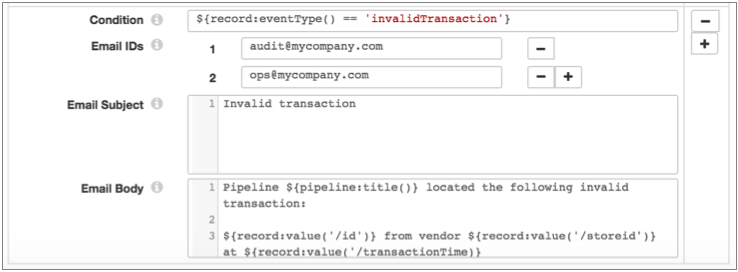

当您运行管道时，每次电子邮件执行程序收到指定的事件时，指定的电子邮件收件人都会收到自定义消息。而且，电子邮件收件人可以根据电子邮件中包含的信息采取行动，而无需费力。

## 案例研究：事件存储

存储事件记录以保留发生的事件的审核跟踪。您可以存储任何事件生成阶段中的事件记录。对于此案例研究，假设您想通过以下管道保留写入HDFS的文件的日志：

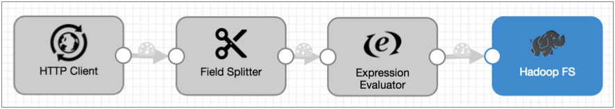

为此，您只需：

1. 配置Hadoop FS目标以生成事件。

   在 **常规**选项卡上，选择**生产事件**属性

   现在事件输出流变得可用，并且目的地在每次关闭文件时都会生成一个事件。对于此目标，每个事件记录都包含文件名，文件路径和已关闭文件的大小的字段。

   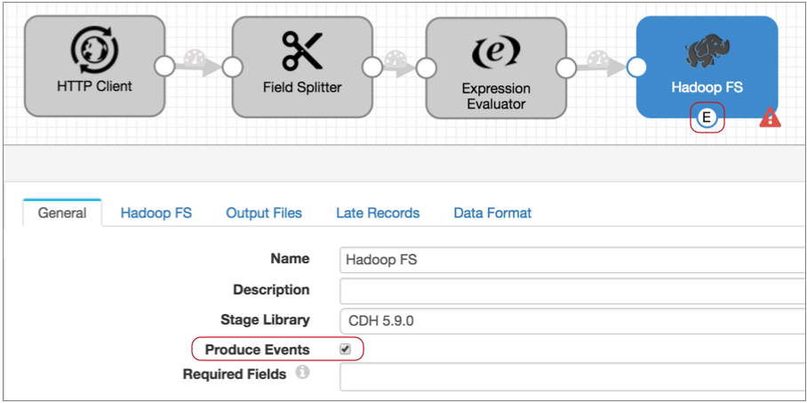

2. 您可以将事件记录写入任何目标，但假设您也希望将其写入HDFS：

   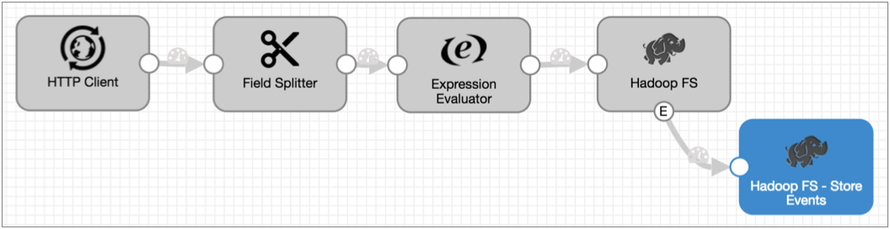

   您可以在那里完成操作，但是您想在记录中包括事件的时间，因此您确切地知道Hadoop FS目标何时关闭文件。

3. 所有事件记录的sdc.event.creation_timestamp记录头属性中都包含事件创建时间，因此您可以将表达式评估器添加到管道中，并使用以下表达式在记录中包括创建时间：

   ```
   ${record:attribute('sdc.event.creation_timestamp')}
   ```

   产生的管道如下所示：

   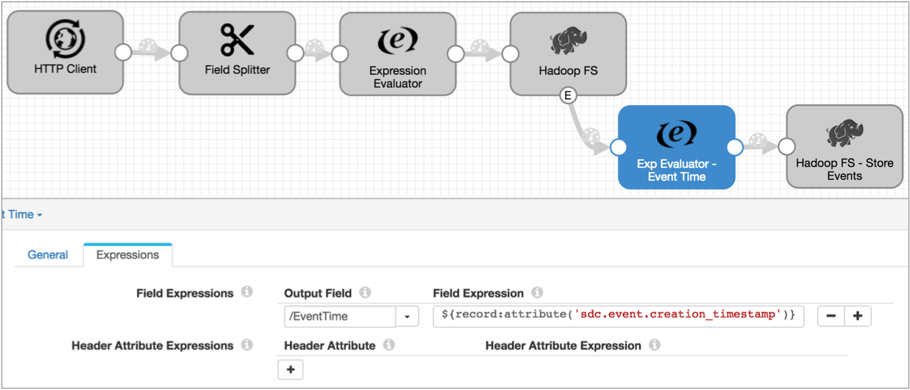

   请注意，事件创建时间用纪元或Unix时间戳表示，例如1477698601031。记录头属性将数据作为字符串提供。

   **提示：**您可以使用时间函数将时间戳转换为不同的数据类型。有关更多信息，请参见[函数](https://streamsets.com/documentation/controlhub/latest/help/datacollector/UserGuide/Expression_Language/Functions.html#concept_lhz_pyp_1r)。

## 摘要

以下是有关数据流触发器和事件框架的关键点：

1. 您可以在逻辑适合您的任何管道中使用事件框架。

2. 事件框架生成与管道相关的事件和与阶段相关的事件。

3. 您可以在独立管道中使用管道事件。

4. 管道启动和停止时会生成管道事件。有关详细信息，请参见

   管道事件生成

   。

   在Data Collector Edge管道中不可用。

5. 您可以将每个管道事件类型配置为传递给单个执行程序或传递给另一个管道，以进行更复杂的处理。

   在Data Collector Edge管道中不可用。

6. 阶段事件是基于阶段的处理逻辑生成的。有关事件生成阶段的列表，请参见[阶段事件生成](https://streamsets.com/documentation/controlhub/latest/help/datacollector/UserGuide/Event_Handling/EventFramework-Title.html#concept_zrl_mhn_lx)。

7. 事件生成

   事件记录

   以传递有关事件的相关信息，例如已关闭文件的路径。

   阶段生成的事件记录因阶段而异。有关阶段事件的描述，请参见事件发生阶段的文档中的“事件记录”。有关管道事件的描述，请参见[管道事件记录](https://streamsets.com/documentation/controlhub/latest/help/datacollector/UserGuide/Pipeline_Configuration/EventGeneration.html#concept_cv3_nqt_51b)。

8. 在最简单的用例中，您可以将阶段事件记录路由到目标以保存事件信息。

9. 您可以将阶段事件记录路由到执行者阶段，以便它可以在接收到事件后执行任务。

   有关逻辑事件生成和执行程序配对的列表，请参见[逻辑配对](https://streamsets.com/documentation/controlhub/latest/help/datacollector/UserGuide/Event_Handling/EventFramework-Title.html#concept_scs_3hh_tx)。

   在Data Collector Edge管道中不可用。 Data Collector Edge管道不支持执行器。

10. 您可以将处理器添加到阶段事件的事件流中，或添加到管道事件的消耗管道中。

    例如，您可以添加一个表达式计算器，以将事件生成时间添加到事件记录中，然后再将其写入目标。或者，您可以使用流选择器将不同类型的事件记录路由到不同的执行程序。

11. 处理阶段事件时，不能将事件流与数据流合并。

12. 您可以使用Dev Data Generator和To Event开发阶段来生成用于管道开发和测试的事件。有关开发阶段的更多信息，请参见[开发阶段](https://streamsets.com/documentation/controlhub/latest/help/datacollector/UserGuide/Pipeline_Design/DevStages.html#concept_czx_ktn_ht)。

13. 在数据预览中，阶段生成的事件记录在事件生成阶段中分别显示。之后，将它们像任何标准记录一样对待。

14. 您可以配置数据预览以生成和执行管道事件。

有关如何使用事件框架的示例，请参阅本章前面的案例研究。