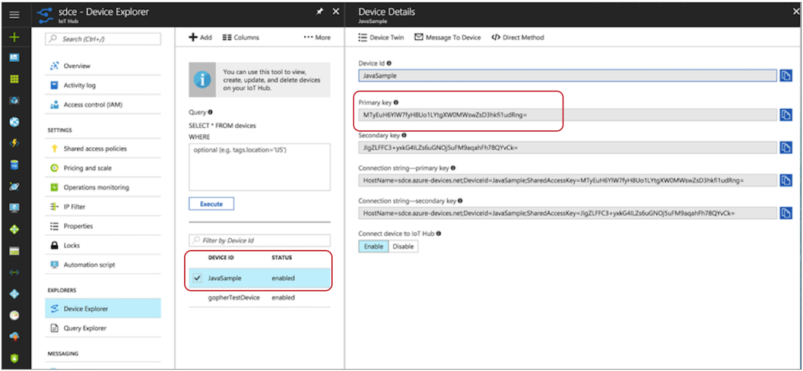

# Azure IoT中心生产者

[支持的管道类型：](https://streamsets.com/documentation/controlhub/latest/help/datacollector/UserGuide/Pipeline_Configuration/ProductIcons_Doc.html#concept_mjg_ly5_pgb) 资料收集器

Azure IoT中心生产者目标将数据写入Microsoft Azure IoT中心。若要写入Microsoft Azure Data Lake Storage，请使用Azure Data Lake Storage目标。若要写入Microsoft Azure事件中心，请使用Azure事件中心生产者目标。

若要在处理数据后将设备数据（例如温度或传感器数据）发送到Azure IoT中心，请在管道中使用Azure IoT中心生产者目标。

Data Collector 充当将消息发送到Azure IoT中心的模拟设备。在配置Azure IoT中心生产者目标之前，请在IoT中心中将Data Collector注册为模拟设备。

配置Azure IoT中心生产者目标时，您可以指定连接信息，例如IoT中心名称和设备ID。您还可以指定目标将身份验证密钥发送到IoT中心时使用的身份验证密钥。

## 将Data Collector注册为IoT中心设备

Data Collector 充当将消息发送到Azure IoT中心的模拟设备。在配置Azure IoT中心生产者目标之前，请将Data Collector注册为IoT中心中的设备。

除非Data Collector在身份注册表中具有条目，否则它无法连接到IoT中心。当您将Data Collector注册为模拟设备时，Azure IoT Hub会生成唯一的设备ID和身份验证密钥，Data Collector在将消息发送到IoT Hub时会用来标识自己。

**注意：**如果运行的管道包含多个Azure IoT中心生产者目标，则可以将每个目标配置为使用相同的Data Collector 设备ID。或者，如果需要分隔每个管道发送的数据，则可以为每个目标创建唯一的设备ID。

1. 登录到Azure门户：[https](https://portal.azure.com/) : [//portal.azure.com](https://portal.azure.com/)。

2. 打开您的物联网中心。

3. 在导航面板中，单击**设备资源管理器**。

4. 要创建设备，请单击**添加**。

5. 在“ 

   添加设备”

   页面上，输入以下信息：

   - **设备ID**：输入要用于Data Collector的ID 。设备ID区分大小写。
   - **身份验证类型**：选择**对称密钥**。
   - **自动生成密钥**：选中该复选框。
   - **将设备连接到IoT中心**：单击“ **启用”**。

6. 点击**保存**。

7. 在“ **设备资源管理器”**窗格中，选择新创建的设备。

8. 记下设备ID和主键。配置Azure IoT中心生产者目标时，请将这些值用于“设备ID”属性和“共享访问密钥”阶段属性。

   

## 资料格式

Azure IoT中心生产者目标根据您选择的数据格式将数据写入Microsoft Azure IoT中心。您可以使用以下数据格式：

- 二元

  该阶段将二进制数据写入记录中的单个字段。

- JSON格式

  目标将记录作为JSON数据写入。您可以使用以下格式之一：数组-每个文件都包含一个数组。在数组中，每个元素都是每个记录的JSON表示形式。多个对象-每个文件都包含多个JSON对象。每个对象都是记录的JSON表示形式。

- SDC记录

  目标以SDC记录数据格式写入记录。

- 文本

  目标将数据从单个文本字段写入目标系统。配置阶段时，请选择要使用的字段。

  您可以配置字符以用作记录分隔符。默认情况下，目标使用UNIX样式的行尾（\ n）分隔记录。

  当记录不包含选定的文本字段时，目标可以将缺少的字段报告为错误或忽略缺少的字段。默认情况下，目标报告错误。

  当配置为忽略缺少的文本字段时，目标位置可以丢弃该记录或写入记录分隔符以为该记录创建一个空行。默认情况下，目标丢弃记录。

## 配置Azure IoT中心生产者目标

配置Azure IoT中心生产者目标以将数据写入Microsoft Azure IoT中心。在配置目标之前，请确保将[数据收集器注册为](https://streamsets.com/documentation/controlhub/latest/help/datacollector/UserGuide/Destinations/AzureIoTHub.html#concept_cwj_dcs_1bb) IoT中心中[的设备](https://streamsets.com/documentation/controlhub/latest/help/datacollector/UserGuide/Destinations/AzureIoTHub.html#concept_cwj_dcs_1bb)。

1. 在“属性”面板的“ **常规”**选项卡上，配置以下属性：

   | 一般财产                                                     | 描述                                                         |
   | :----------------------------------------------------------- | :----------------------------------------------------------- |
   | 名称                                                         | 艺名。                                                       |
   | 描述                                                         | 可选说明。                                                   |
   | [必填项](https://streamsets.com/documentation/controlhub/latest/help/datacollector/UserGuide/Pipeline_Design/DroppingUnwantedRecords.html#concept_dnj_bkm_vq) | 必须包含用于将记录传递到阶段的记录的数据的字段。**提示：**您可能包括舞台使用的字段。根据为管道配置的错误处理，处理不包含所有必填字段的记录。 |
   | [前提条件](https://streamsets.com/documentation/controlhub/latest/help/datacollector/UserGuide/Pipeline_Design/DroppingUnwantedRecords.html#concept_msl_yd4_fs) | 必须评估为TRUE的条件才能使记录进入处理阶段。单击 **添加**以创建其他前提条件。根据为阶段配置的错误处理，处理不满足所有前提条件的记录。 |
   | [记录错误](https://streamsets.com/documentation/controlhub/latest/help/datacollector/UserGuide/Pipeline_Design/ErrorHandling.html#concept_atr_j4y_5r) | 该阶段的错误记录处理：放弃-放弃记录。发送到错误-将记录发送到管道以进行错误处理。停止管道-停止管道。 |

2. 在“ **IoT中心”**选项卡上，配置以下属性：

   | 物联网中心属性                                               | 描述                                                         |
   | :----------------------------------------------------------- | :----------------------------------------------------------- |
   | 物联网中心名称                                               | IoT中心的名称。                                              |
   | 设备编号  | 在您的IoT中心中注册的Data Collector设备的ID 。设备ID区分大小写。 |
   | 共享访问密钥  | 在IoT中心中注册的Data Collector设备的共享访问主键字符串。输入在Azure门户中创建的Data Collector设备的主键值。 |
   | 最长请求时间                                                 | 等待请求完成的最大秒数。                                     |

3. 在“ **数据格式”**选项卡上，配置以下属性：

   | 数据格式属性                                                 | 描述                                                         |
   | :----------------------------------------------------------- | :----------------------------------------------------------- |
   | 资料格式  | 消息的数据格式：二元JSON格式SDC记录 文本 |

4. 对于二进制数据，在“ **数据格式”**选项卡上，配置以下属性：

   | 二元性质     | 描述                   |
   | :----------- | :--------------------- |
   | 二进制场路径 | 包含二进制数据的字段。 |

5. 对于JSON数据，在**数据格式**选项卡上，配置以下属性：

   | JSON属性 | 描述                                                         |
   | :------- | :----------------------------------------------------------- |
   | JSON内容 | 写入JSON数据的方法：JSON对象数组-每个文件都包含一个数组。在数组中，每个元素都是每个记录的JSON表示形式。多个JSON对象-每个文件包含多个JSON对象。每个对象都是记录的JSON表示形式。 |
   | 字符集   | 写入数据时使用的字符集。                                     |

6. 对于文本数据，在“ **数据格式”**选项卡上，配置以下属性：

   | 文字属性                       | 描述                                                         |
   | :----------------------------- | :----------------------------------------------------------- |
   | 文字栏位路径                   | 包含要写入的文本数据的字段。所有数据必须合并到指定字段中。   |
   | 记录分隔符                     | 用于分隔记录的字符。使用任何有效的Java字符串文字。例如，当写入Windows时，您可能会\r\n用来分隔记录。默认情况下，目标使用 \n。 |
   | 在失落的田野上                 | 当记录不包含文本字段时，确定目标是将丢失的字段报告为错误还是忽略该丢失的字段。 |
   | 如果没有文本，则插入记录分隔符 | 当配置为忽略缺少的文本字段时，插入配置的记录分隔符字符串以创建一个空行。如果未选择，则丢弃没有文本字段的记录。 |
   | 字符集                         | 写入数据时使用的字符集。                                     |