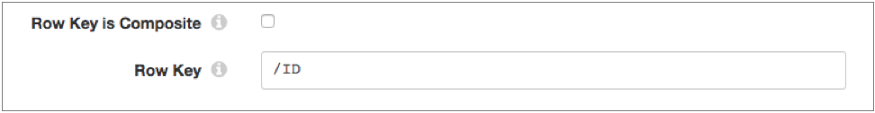
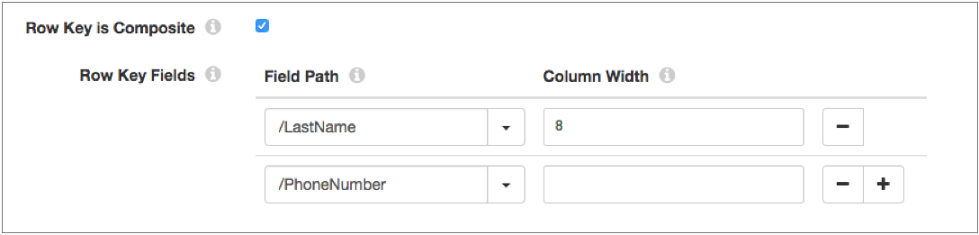
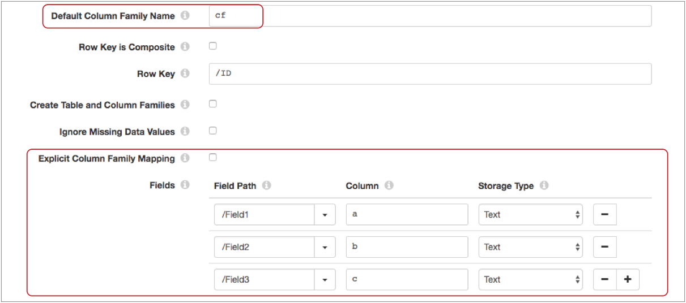
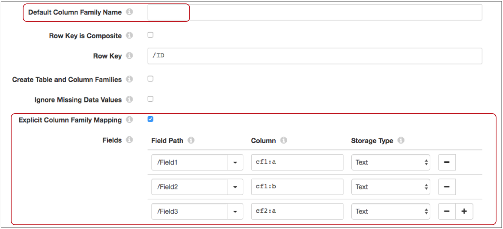
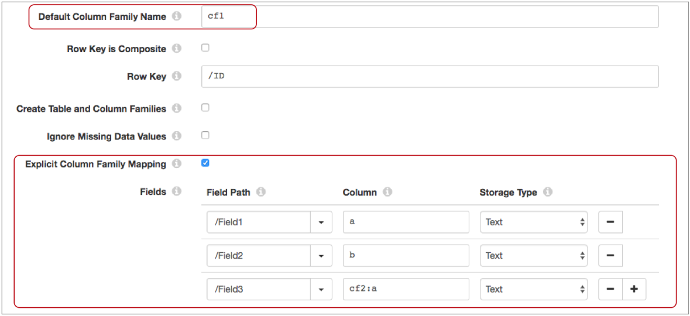

# Google Bigtable

[支持的管道类型：](https://streamsets.com/documentation/controlhub/latest/help/datacollector/UserGuide/Pipeline_Configuration/ProductIcons_Doc.html#concept_mjg_ly5_pgb) 资料收集器

Google Bigtable目标将数据写入Google Cloud Bigtable。您可以使用其他目标写入[Google BigQuery](https://streamsets.com/documentation/controlhub/latest/help/datacollector/UserGuide/Destinations/BigQuery.html#concept_hj4_brk_dbb)，[Google Cloud Storage](https://streamsets.com/documentation/controlhub/latest/help/datacollector/UserGuide/Destinations/GCS.html#concept_p4n_jrl_nbb)和[Google Pub / Sub](https://streamsets.com/documentation/controlhub/latest/help/datacollector/UserGuide/Destinations/PubSubPublisher.html#concept_qsj_hk1_v1b)。

在配置目标之前，您必须完成几个先决条件，包括安装BoringSSL库和配置Google Application Default Credentials。

配置目标时，可以定义实例ID，项目ID和要写入的表。目标可以写入现有表，也可以创建和写入新表。您为表指定行键，然后将管道中的字段映射到Cloud Bigtable列。

如有必要，您可以配置时间基准并指定要在每次向Cloud Bigtable提交时缓冲的记录数。

## 先决条件

必须先满足以下先决条件，然后才能写入Cloud Bigtable：

- 下载并安装BoringSSL库。
- 配置目标用于连接到Cloud Bigtable的Google应用默认凭据。

### 安装BoringSSL库

Google Bigtable目标需要BoringSSL库。您必须下载并安装外部库，以便Google Bigtable目标可以访问它。

从以下位置下载BoringSSL库：

https://repo1.maven.org/maven2/io/netty/netty-tcnative-boringssl-static/1.1.33.Fork19/netty-tcnative-boringssl-static-1.1.33.Fork19.jar

有关安装其他驱动程序的信息，请参阅 Data Collector 文档 中的“ [安装外部库](https://streamsets.com/documentation/datacollector/latest/help/#datacollector/UserGuide/Configuration/ExternalLibs.html%23concept_pdv_qlw_ft) ”。

### 配置Google应用程序默认凭据

配置Google Bigtable目标用来连接到Google Cloud Bigtable的Google Application默认凭据。

1. 创建一个包含Google应用程序默认凭据的JSON文件。

   要创建凭据文件，请使用Google API控制台或运行以下Google Cloud Platform命令：`gcloud auth login`。

   有关创建凭据文件的更多信息，请在Google Developer文档中搜索Google Application Default Credentials。

2. 将生成的凭证文件存储在

   Data Collector

   安装目录外部的本地目录中。

   例如，如果您将Data Collector安装在以下目录中：

   ```
   /opt/sdc/
   ```

   您可以将凭证文件存储在：

   ```
   /opt/sdc-credentials
   ```

3. 将

   ```
   GOOGLE_APPLICATION_CREDENTIALS
   ```

   环境变量添加到适当的文件，并将其指向凭据文件。

   使用安装类型所需的方法。

   如下设置环境变量：

   ```
   export GOOGLE_APPLICATION_CREDENTIALS="/opt/sdc-credentials/keyfile.json"
   ```

4. 重新启动Data Collector以启用更改。

有关环境变量的更多信息，请参阅 Data Collector 文档中的Data Collector [环境配置](https://streamsets.com/documentation/datacollector/latest/help/#datacollector/UserGuide/Configuration/DCEnvironmentConfig.html)。

## 行键

每个Google Cloud Bigtable表都有一个索引，即行键。在配置Google Bigtable目标时，您可以定义记录中要用作行键的一个或多个字段。

通过以下方式之一定义行键：

- 单个字段作为行键

  通过清除“ **行键为复合”**属性，然后定义要使用的字段，可以将单个字段定义为行键。输入每个字段的路径。例如，以下配置使用记录中的ID字段作为行键：

- 多个字段作为行键

  通过选择“ **行键为复合”**属性，然后定义要使用的多个字段，可以将多个字段定义为行键。输入每个字段的路径。

  当定义多个字段时，目标会将字段的值连接到行键中。目标按阶段配置中列出的顺序将字段添加到组合行键。

  如果在复合行键中包含具有String数据类型的字段，则还必须定义该字段的列宽。目标根据需要将字符串值填充或截断为指定的宽度。具有其他数据类型的字段使用其标准宽度，例如Long数据类型为8个字节，Integer数据类型为4个字节。目标将忽略为具有非字符串数据类型的字段定义的列宽。

  例如，假设您正在写入使用客户姓氏和电话号码作为行键的Cloud Bigtable表。在目标中，选择“ **行键是复合键”**，然后将“姓氏”和“电话号码”字段定义为行键字段。您将姓氏字段的列宽定义为8，如下所示：

  当管道运行时，将用五个二进制零填充“ Lee”的姓氏，然后将其与电话号码连接，而将“ Patterson”的姓氏截断，然后将其与电话号码连接。

  您必须将Cloud Bigtable表中的行键设计为包含相同的多个值。否则，您的Google应用程序将无法从组合行键中检索数据。有关在单个行键中使用多个值的更多信息，请参阅Google Cloud Bigtable文档。

如果缺少定义为行键的一个或多个字段，则目标会将该记录发送到管道以进行错误处理。

## 云大表数据类型

当您将记录字段映射到Google Cloud Bigtable列时，您可以指定Cloud Bigtable存储类型为文本还是二进制。目标将记录字段的数据类型转换为Cloud Bigtable存储类型。

目标无法转换数据收集器 列表和地图数据类型。目标会将日期，日期时间和时间数据类型转换为具有默认日期格式的文本存储类型。若要使用特定的日期格式，请在管道中的较早位置使用Field Type Converter处理器将Date，Datetime和Time字段转换为具有所需日期格式的String数据类型。然后，您可以将String字段映射到Text存储类型的Cloud Bigtable列。

下表列出了 目标可以将其转换为Cloud Bigtable存储类型的Data Collector数据类型：

| 数据收集器数据类型 | 云大表存储类型 |
| :----------------- | :------------- |
| 布尔型             | 文字，二进制   |
| 字节               | 文字，二进制   |
| 字节数组           | 文字，二进制   |
| 字符               | 文字，二进制   |
| 日期               | 文本           |
| 约会时间           | 文本           |
| 小数               | 文字，二进制   |
| 双                 | 文字，二进制   |
| 浮动               | 文字，二进制   |
| 整数               | 文字，二进制   |
| 长                 | 文字，二进制   |
| 短                 | 文字，二进制   |
| 串                 | 文本           |
| 时间               | 文本           |

## 列族和字段映射

配置Google Bigtable目标时，会将记录字段映射到Google Cloud Bigtable列。您可以通过定义列族和列限定符来定义要写入的Cloud Bigtable列。

您可以指定要用于所有列的默认列族，也可以使用以下格式为每个字段映射显式定义列族：`:`。根据以下情况使用默认或显式列族映射：

- 所有列都属于同一列族

  当写入表的所有列都属于同一个列族时，可以输入默认的列族，清除“ **显式列族映射”**属性，然后在将字段映射到列时仅输入限定符。**注意：**输入默认列族并清除“ **显式列族映射”时**，将忽略在字段到列映射中定义的任何列族。目标始终使用默认列族。

  例如，映射记录字段到云Bigtable的列 `cf:a`，`cf:b`和`cf:c`输入`cf`作为默认列族。清除 **显式柱族映射**，然后在现场列映射定义仅使用限定词的栏，像这样： `a`，`b`，`c`。

  下图显示了配置为对所有列使用默认列族的目标：

- 列属于不同的列族

  当写入表的列属于不同的列族时，请勿输入默认的列族。而是选择“ **显式列族映射”**属性，然后在使用以下格式将字段映射到列时输入列族和限定符 `:`。

  例如，映射记录字段到云Bigtable的列 `cf1:a`，`cf1:b`和`cf2:a`，不输入默认列族的值。选择**显式柱族映射**在现场列映射，然后，使用该定义列`:` 格式，例如：`cf1:a`，`cf1:b`， `cf2:a`。

  下图显示了配置为显式定义每个字段映射的列族的目标：

- 列属于不同的列族，但是您想对一组列使用默认值

  当写入表的列属于不同的列族时，可以将默认列族用于一组列。然后，您可以通过选择“ **显式列族映射”**属性来覆盖某些列的默认值。当您将字段映射到列时，仅输入限定符以使用默认列族。使用格式`:`覆盖默认列族的格式输入列族和限定符。

  例如，映射记录字段到云Bigtable的列 `cf1:a`，`cf1:b`以及`cf2:a`，输入`cf1`默认列族。选择“ **显式列族映射”，**以便您可以覆盖默认列族。然后在外地列映射定义列像这样，使用`:`格式覆盖默认列族：`a`，`b`，`cf2:a`。

  下图显示了配置为使用默认列族的目标，其中某些字段映射覆盖了默认值：

## 时间基础

时间基准确定为写入Google Cloud Bigtable的每一列添加的时间戳值。

您可以使用以下时间作为时间基础：

- 管道开始时间

  当您使用管道启动时间作为时间基准时，目标使用管道启动的时间作为时间戳值。时间戳值是一个纪元或UNIX时间（以毫秒为单位）。每个流水线只计算一次处理时间。

- 批量开始时间

  当您使用批处理开始时间作为时间基准时，目标将使用Data Collector开始处理当前批处理的时间作为时间戳记值。时间戳值是一个纪元或UNIX时间（以毫秒为单位）。每批次计算一次处理时间。

- 每条记录的系统时间

  当您使用系统时间作为时间基准时，当列写入Cloud Bigtable时，目标将使用Cloud Bigtable自动生成的时间戳值。时间戳值是一个纪元或UNIX时间（以毫秒为单位）。

  这是默认的时间基准。

- 记录中字段的长值

  当您使用与记录相关联的时间作为时间基准时，您可以在记录中指定一个字段，该字段包含带有纪元或UNIX时间（以毫秒为单位）的Long值。目标使用字段值作为时间戳值。如果该字段值不是Long，则目标将记录发送到管道以进行错误处理。**提示：**您可以在管道中较早的处理器中使用时间函数（例如time：dateTimeToMilliseconds或time：extractLongFromDate）将Datetime值转换为Long数据类型。

## 配置Google Bigtable目标

配置Google Bigtable目标以将数据写入Google Cloud Bigtable。

1. 在“属性”面板的“ **常规”**选项卡上，配置以下属性：

   | 一般财产                                                     | 描述                                                         |
   | :----------------------------------------------------------- | :----------------------------------------------------------- |
   | 名称                                                         | 艺名。                                                       |
   | 描述                                                         | 可选说明。                                                   |
   | [必填项](https://streamsets.com/documentation/controlhub/latest/help/datacollector/UserGuide/Pipeline_Design/DroppingUnwantedRecords.html#concept_dnj_bkm_vq) | 必须包含用于将记录传递到阶段的记录的数据的字段。**提示：**您可能包括舞台使用的字段。根据为管道配置的错误处理，处理不包含所有必填字段的记录。 |
   | [前提条件](https://streamsets.com/documentation/controlhub/latest/help/datacollector/UserGuide/Pipeline_Design/DroppingUnwantedRecords.html#concept_msl_yd4_fs) | 必须评估为TRUE的条件才能使记录进入处理阶段。单击 **添加**以创建其他前提条件。根据为阶段配置的错误处理，处理不满足所有前提条件的记录。 |
   | [记录错误](https://streamsets.com/documentation/controlhub/latest/help/datacollector/UserGuide/Pipeline_Design/ErrorHandling.html#concept_atr_j4y_5r) | 该阶段的错误记录处理：放弃-放弃记录。发送到错误-将记录发送到管道以进行错误处理。停止管道-停止管道。 |

2. 在“大**表”**选项卡上，配置以下属性：

   | 大表财产                                                     | 描述                                                         |
   | :----------------------------------------------------------- | :----------------------------------------------------------- |
   | 实例ID                                                       | Cloud Bigtable实例ID。                                       |
   | 专案编号                                                     | Cloud Bigtable专案ID。                                       |
   | 表名                                                         | 要写入的Cloud Bigtable表。输入表格名称。或定义一个计算结果为表名的表达式。例如，您可以使用表达式评估器将标题属性添加到名为“ BigtableTable”的记录，该记录定义要写入的Cloud Bigtable表。然后，您可以为此属性输入以下表达式：`${record:attribute('BigtableTable')}` |
   | 默认列族名称 [](https://streamsets.com/documentation/controlhub/latest/help/datacollector/UserGuide/Destinations/Bigtable.html#concept_sbp_vz4_1y) | 将记录中的字段映射到Cloud Bigtable列时使用的默认列系列。在以下情况下，默认列族用于字段到列的映射：显式列族映射属性被清除。选择了“显式列族映射”属性，但是到列映射的字段仅指定了限定符。 |
   | 行键是复合键[](https://streamsets.com/documentation/controlhub/latest/help/datacollector/UserGuide/Destinations/Bigtable.html#concept_asz_2gl_1y) | 确定是从记录中的单个字段还是从记录中的多个字段定义行键。清除以使用单个字段。选择以连接多个字段中的值。 |
   | 行键[](https://streamsets.com/documentation/controlhub/latest/help/datacollector/UserGuide/Destinations/Bigtable.html#concept_asz_2gl_1y) | 记录中的字段用作表的行键。输入字段的路径。                   |
   | 行键字段[](https://streamsets.com/documentation/controlhub/latest/help/datacollector/UserGuide/Destinations/Bigtable.html#concept_asz_2gl_1y) | 配置复合行键时，记录中的字段用作表的行键。目标将字段的值连接到行键中。输入每个字段的路径，并定义所有String字段的列宽。 |
   | 创建表和列族                                                 | 确定目标是否创建表和列系列（如果不存在）。清除后，目标在尝试写入不存在的表或列族时会产生错误。选中后，目标将创建表和列系列（如果不存在）。 |
   | 忽略缺失的数据值                                             | 确定目标是否忽略记录中的丢失数据。清除后，包含缺少字段的记录将发送到管道以进行错误处理。选中后，包含缺失字段的记录仍将写入Cloud Bigtable。**注意：**如果将缺少的字段定义为行键，则无论如何配置此属性，始终会将记录发送到管道以进行错误处理。 |
   | 显式列族映射[](https://streamsets.com/documentation/controlhub/latest/help/datacollector/UserGuide/Destinations/Bigtable.html#concept_sbp_vz4_1y) | 确定是否在字段到列的映射中明确定义了列族。                   |
   | 领域 [[](https://streamsets.com/documentation/controlhub/latest/help/datacollector/UserGuide/Destinations/Bigtable.html#concept_sbp_vz4_1y) | 将字段从记录映射到Cloud Bigtable列，然后在Cloud Bigtable中定义该列的存储类型。使用[简单或批量编辑模式](https://streamsets.com/documentation/controlhub/latest/help/datacollector/UserGuide/Pipeline_Configuration/SimpleBulkEdit.html#concept_alb_b3y_cbb)，单击 **添加**图标以创建其他字段映射。 |
   | 时间基础[](https://streamsets.com/documentation/controlhub/latest/help/datacollector/UserGuide/Destinations/Bigtable.html#concept_vwy_334_1y) | 添加到写入Cloud Bigtable的每个列中的时间戳记值使用的时间基准。 |
   | 时间戳记字段名称                                             | 记录中的字段，其中包含用于时间基准的时间戳记值。该字段必须包含一个Long值。 |
   | 要记录的记录数                                               | 在每次向Cloud Bigtable提交时要缓冲的记录数。输入一个介于1到1000之间的数字。如果目标正在写入大量数据，则可能需要减少该数字。默认值为1000。 |