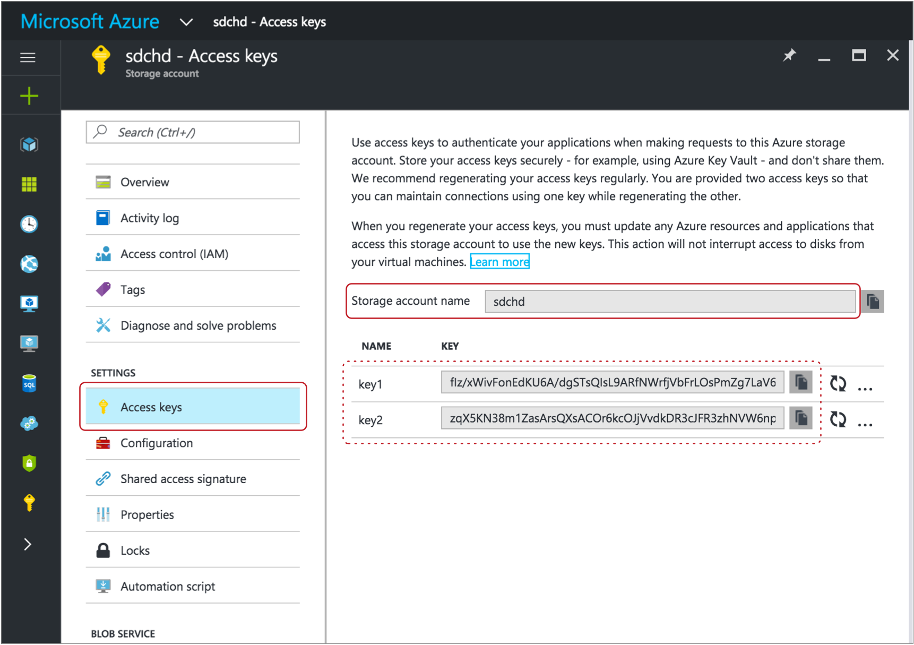
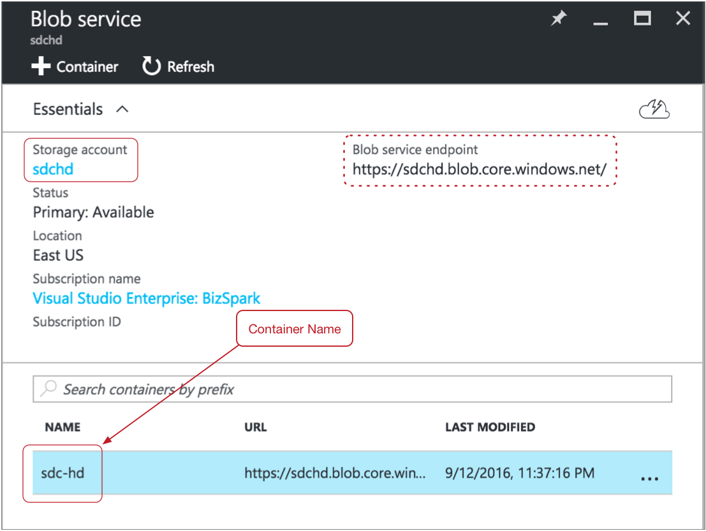
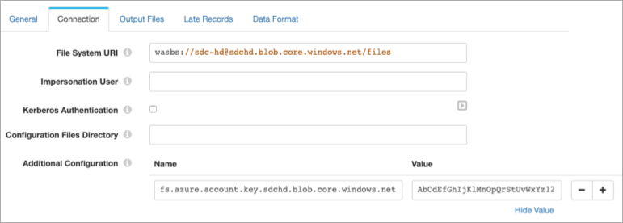

# Hadoop FS

[支持的管道类型：](https://streamsets.com/documentation/controlhub/latest/help/datacollector/UserGuide/Pipeline_Configuration/ProductIcons_Doc.html#concept_mjg_ly5_pgb) 资料收集器

Hadoop FS目标将数据写入Hadoop分布式文件系统（HDFS）。您还可以使用目标写入Azure Blob存储。

您可以将数据写为平面文件或Hadoop序列文件。您还可以使用整个文件数据格式将整个文件写入HDFS。

配置Hadoop FS目标时，可以定义目录模板和时间基础，以确定目标创建的输出目录以及写入记录的文件。

作为针对Hive的Drift同步解决方案的一部分，您可以选择使用记录标题属性来执行基于记录的写入。您可以将记录写入指定的目录，使用定义的Avro模式，并根据记录头属性滚动文件。有关更多信息，请参见[基于记录的写入的记录头属性](https://streamsets.com/documentation/controlhub/latest/help/datacollector/UserGuide/Pipeline_Design/RecordHeaderAttributes.html#concept_lmn_gdc_1w)。

您可以定义文件前缀和后缀，数据时区，以及定义目标关闭文件的时间的属性。您可以指定一条记录可以写入其关联目录的时间，以及以后的记录会发生什么。

目的地可以为事件流生成事件。有关事件框架的更多信息，请参见《[数据流触发器概述》](https://streamsets.com/documentation/controlhub/latest/help/datacollector/UserGuide/Event_Handling/EventFramework-Title.html#concept_cph_5h4_lx)。

必要时，您可以启用Kerberos身份验证。您还可以指定要模拟的Hadoop用户，定义Hadoop配置文件目录，并根据需要添加Hadoop配置属性。

您可以使用Gzip，Bzip2，Snappy，LZ4和其他压缩格式来写入输出文件。

## 目录模板

默认情况下，Hadoop FS目标使用目录模板创建输出目录和最新记录目录。Hadoop FS根据配置的时间将记录写入目录。

您也可以根据`targetDirectory`记录标题属性将记录写入目录。使用该 `targetDirectory`属性将禁用定义目录模板的功能。

定义目录模板时，可以混合使用常量，字段值和日期时间变量。您可以使用该 `every`功能从小时开始，基于小时，分钟或秒，定期创建新目录。您还可以使用该`record:valueOrDefault`功能从字段值或目录模板中的默认值创建新目录。

例如，以下目录模板基于记录的状态和时间戳创建事件数据的输出目录，以小时为最小度量单位，每小时创建一个新目录：

```
 /outputfiles/${record:valueOrDefault("/State", "unknown")}/${YY()}-${MM()}-${DD()}-${hh()}
```

您可以在目录模板中使用以下元素：

- 常数

  您可以使用任何常量，例如`output`。

- 日期时间变量

  您可以使用日期时间变量，例如`${YYYY()}` 或`${DD()}`。目标根据您使用的最小datetime变量根据需要创建目录。例如，如果最小变量是hour，则将在每天的每小时接收输出记录的情况下创建目录。

  在表达式中使用datetime变量时，请使用year变量之一和要使用的最小变量之间的所有datetime变量。不要在进度中跳过变量。例如，要每天创建目录，请使用Year变量，month变量，然后使用Day变量。您可以使用以下日期时间变量级数之一：

  `${YYYY()}-${MM()}-${DD()} ${YY()}_${MM()}_${DD()}`

  有关日期[时间变量的](https://streamsets.com/documentation/controlhub/latest/help/datacollector/UserGuide/Expression_Language/DateTimeVariables.html#concept_gh4_qd2_sv)详细信息，请参见[日期时间变量](https://streamsets.com/documentation/controlhub/latest/help/datacollector/UserGuide/Expression_Language/DateTimeVariables.html#concept_gh4_qd2_sv)。

- `every` 功能

  您可以使用`every`目录模板中的功能从小时开始，基于小时，分钟或秒，定期创建目录。间隔应为60的整数或整数倍。例如，您可以每15分钟或30秒创建一个目录。

  使用该`every`函数替换模板中使用的最小datetime变量。

  例如，以下目录模板从小时开始每5分钟创建一个目录：`/HDFS_output/${YYYY()}-${MM()}-${DD()}-${hh()}-${every(5,mm())}`

  有关该`every`功能的详细信息，请参见[其他功能](https://streamsets.com/documentation/controlhub/latest/help/datacollector/UserGuide/Expression_Language/Functions.html#concept_ddw_ld1_1s)。

- `record:valueOrDefault` 功能

  您可以`record:valueOrDefault`在目录模板中使用该函数来创建具有字段值或指定默认值的目录，如果该字段不存在或该字段为null：`${record:valueOrDefault(, )}`

  例如，以下目录模板`Product`每天都基于该字段创建一个目录，并且如果该`Product`字段为空或为null，则 `Misc`在目录路径中使用：`/${record:valueOrDefault("/Product", "Misc")}/${YY()}-${MM()}-${DD()}`

  该模板可能创建以下路径：`/Shirts/2015-07-31  /Misc/2015-07-31`

## 时间基础

使用目录模板时，时间基础有助于确定何时创建目录。它还确定Hadoop FS在写入记录时使用的目录，以及记录是否延迟。

使用`targetDirectory`记录头属性写入记录时，时间基准仅确定记录是否延迟。

您可以使用以下时间作为时间基础：

- 处理时间

  使用处理时间作为时间基准时，目标将根据处理时间和目录模板创建目录，并根据处理时间将记录写入目录。

  例如，假设目录模板每分钟创建一次目录，时间基础就是处理时间。然后，为目标写入输出记录的每一分钟创建目录。然后将输出记录写入该分钟的目录中。

  要将处理时间用作时间基准，请使用以下表达式：`${time:now()}`。这是默认的时间基准。

- 记录时间

  当您使用与记录关联的时间作为时间基准时，您可以在记录中指定日期字段。目标根据与记录关联的日期时间创建目录，并将记录写入适当的目录。

  例如，假设目录模板每小时创建一个目录，并且时间基础基于记录。然后，为每小时与输出记录关联的目录创建目录，并且目的地将记录写入相关的输出目录。

  要使用与记录关联的时间，请使用一个表达式，该表达式调用一个字段并解析为日期时间值，例如 `${record:value("/Timestamp")}`。

## 后期记录和后期记录处理


使用记录时间作为时间基准时，可以定义将记录写入其关联的输出文件的时间限制。当目标在新目录中创建新的输出文件时，在指定的延迟记录时间限制内，先前的输出文件将保持打开状态。当属于该文件的记录在时限内到达时，目标将记录写入打开的输出文件。当达到延迟记录时间限制时，将关闭输出文件，并且超过该限制的任何记录都将被视为延迟。

**提示：**如果您使用处理时间作为时间基准，则延迟记录属性不适用。如果使用处理时间，请将延迟记录时间限制设置为一秒。

您可以将延迟记录发送到延迟记录文件或阶段以进行错误处理。将记录发送到延迟记录文件时，可以定义延迟记录目录模板。

例如，您使用记录时间作为时间基准，配置一小时的延迟记录时间限制，配置延迟的记录以发送到阶段进行错误处理，并使用默认的目录模板值：

```
/tmp/out/${YYYY()}-${MM()}-${DD()}-${hh()} 
```

到达的第一条记录的日期时间在02:00到02:59之间，因此被写入02目录中的输出文件。当日期时间在03:00和03:59之间的记录到达时，目标将在03目录中创建一个新文件。目的地将使02目录中的文件保持打开状态又一个小时。

如果日期时间在02:00到02:59之间的记录在小时时间限制之前到达，则目标将记录写入02目录中的打开文件中。一小时后，目标位置将关闭02目录中的输出文件。在一个小时的时间限制之后到达的日期时间在02:00和02:59之间的任何记录都被认为是较晚的。较晚的记录将发送到阶段以进行错误处理。

## 关闭空闲文件的超时

您可以配置打开的输出文件可以保持空闲状态的最长时间。在指定时间内没有记录写入输出文件后，Hadoop FS目标将关闭该文件。

当输出文件保持打开状态且空闲时间过长时，您可能需要配置空闲超时，从而延迟另一个系统处理文件的时间。

由于以下原因，输出文件可能保持空闲状态的时间过长：

- 您配置了要写入输出文件的最大记录数或输出文件的最大大小，但是记录已停止到达。未达到最大记录数或最大文件大小的输出文件将保持打开状态，直到更多记录到达。

- 您在记录中配置了一个日期字段作为时间基准，并配置了一个较晚的记录时间限制，但是记录按时间顺序到达。创建新目录后，先前目录中的输出文件将在配置的最新记录时间限制内保持打开状态。但是，没有记录写入先前目录中的打开文件。

  例如，当到达日期时间为03:00的记录时，目标将在新的03目录中创建一个新文件。02目录中的前一个文件将保持打开状态，以保持最晚记录时间限制，默认情况下为一小时。但是，当记录按时间顺序到达时，创建03目录后，没有任何属于02目录的记录到达。

在这两种情况下，都应配置一个空闲超时，以便其他系统可以更快地处理文件，而不必等待配置的最大记录数，最大文件大小或较晚的记录条件发生。

## 复苏

在管道意外停止后，Hadoop FS目标通过在管道重新启动时重命名临时文件来支持恢复。

目标使用以下格式命名临时打开的输出文件：

```
_tmp_<prefix>_<runnerId>
```

其中 ``是为目标定义的文件前缀，``是执行管道处理的管道运行器的ID。例如，当目的地前缀被定义为 `sdc`与从单螺纹管道目的地运行时，临时文件被命名为像这样：`_tmp_sdc_0`。

当目标关闭文件时（无论是在完全写入之后，在空闲超时到期之后还是在您有意停止管道时），它都会重命名文件以删除`_tmp_`字符串，并使用随机唯一标识符替换管道运行器ID，如下所示：

```
<prefix>_e7ce67c5-013d-47a7-9496-8c882ddb28a0
```

但是，当管道意外停止时，将保留临时文件。当管道重新启动时，目标将扫描已定义目录模板的所有子目录，以重命名与目标已定义前缀匹配的所有临时文件。目标重命名临时文件后，它将继续写入新的输出文件。

**注意：**目标将重命名与已定义目录模板的所有子目录中已定义前缀匹配的所有临时文件，即使这些文件不是由该管道写入的也是如此。因此，如果您碰巧有另一个文件的名称以相同的模式开头`_tmp_`--目标也会重命名该文件。

在以下情况下，目标可能不会重命名所有临时文件：

- 目录模板包含带有record：value或record：valueOrDefault函数的表达式。

  如果record：value或record：valueOrDefault函数的计算结果为空字符串或子目录，则当管道重新启动时，目标无法确定这些位置。结果，目标无法重命名写入这些位置的任何临时文件。

  例如，假设目录模板定义如下：`/tmp/out/${YY()}-${MM()}-${DD()}/${sdc:hostname()}/${record:value('/a')}/${record:value('/b')}`

  如果表达式的`${record:value('/b')}`计算结果为空字符串或子目录（例如） `/folder1/folder2`，则在管道重新启动时，目的地无法确定这些位置。

- 该目录在targetDirectory记录头属性中定义。

  在targetDirectory记录头属性中定义目录后，管道重新启动时，目标无法确定在哪里寻找临时文件。结果，它无法重命名临时文件。

在这两种情况下，您都必须手动重命名临时文件。

文件恢复会在重新启动时减缓管道的速度。如果需要，可以将目标配置为跳过文件恢复。

## 资料格式

Hadoop FS根据您选择的数据格式将数据写入HDFS。您可以使用以下数据格式：

- 阿夫罗

  目标根据Avro架构写入记录。您可以使用以下方法之一来指定Avro模式定义的位置：

  **在“管道配置”中** -使用您在阶段配置中提供的架构。**在记录标题中** -使用avroSchema记录标题属性中包含的架构。**Confluent Schema Registry-**从Confluent Schema Registry检索架构。Confluent Schema Registry是Avro架构的分布式存储层。您可以配置目标以通过架构ID或主题在Confluent Schema Registry中查找架构。如果在阶段或记录头属性中使用Avro架构，则可以选择配置目标以向Confluent Schema Registry注册Avro架构。

  目标在每个文件中都包含架构定义。

  您可以使用Avro支持的压缩编解码器压缩数据。使用Avro压缩时，请避免在目标位置使用其他压缩属性。

- 二元

  该阶段将二进制数据写入记录中的单个字段。

- 定界

  目标将记录写为定界数据。使用此数据格式时，根字段必须是list或list-map。

  您可以使用以下定界格式类型：**默认CSV-**包含逗号分隔值的文件。忽略文件中的空行。**RFC4180 CSV-**严格遵循RFC4180准则的逗号分隔文件。**MS Excel CSV** -Microsoft Excel逗号分隔文件。**MySQL CSV** -MySQL逗号分隔文件。**制表符分隔的值** -包含制表符分隔的值的文件。**PostgreSQL CSV** -PostgreSQL逗号分隔文件。**PostgreSQL文本** -PostgreSQL文本文件。**自定义** -使用用户定义的定界符，转义符和引号字符的文件。**多字符**定界-使用多个用户定义的字符定界字段和行以及单个用户定义的转义和引号字符的文件。

- JSON格式

  目标将记录作为JSON数据写入。您可以使用以下格式之一：数组-每个文件都包含一个数组。在数组中，每个元素都是每个记录的JSON表示形式。多个对象-每个文件都包含多个JSON对象。每个对象都是记录的JSON表示形式。

- 原虫

  在每个文件中写入一批消息。

  在描述符文件中使用用户定义的消息类型和消息类型的定义在文件中生成消息。

  有关生成描述符文件的信息，请参阅[Protobuf数据格式先决条件](https://streamsets.com/documentation/controlhub/latest/help/datacollector/UserGuide/Data_Formats/Protobuf-Prerequisites.html)。

- SDC记录

  目标以SDC记录数据格式写入记录。

- 文本

  目标将数据从单个文本字段写入目标系统。配置阶段时，请选择要使用的字段。

  您可以配置字符以用作记录分隔符。默认情况下，目标使用UNIX样式的行尾（\ n）分隔记录。

  当记录不包含选定的文本字段时，目标可以将缺少的字段报告为错误或忽略缺少的字段。默认情况下，目标报告错误。

  当配置为忽略缺少的文本字段时，目标位置可以丢弃该记录或写入记录分隔符以为该记录创建一个空行。默认情况下，目标丢弃记录。

- 整个档案

  将整个文件流式传输到目标系统。目标将数据写入阶段中定义的文件和位置。如果已经存在相同名称的文件，则可以将目标配置为覆盖现有文件或将当前文件发送给错误文件。

  默认情况下，写入的文件使用目标系统的默认访问权限。您可以指定一个定义访问权限的表达式。

  您可以配置目标以生成写入文件的校验和，并将校验和信息传递到事件记录中的目标系统。

  使用此数据格式需要将**File Type**属性设置为**Whole File**。

  有关整个文件数据格式的更多信息，请参见[整个文件数据格式](https://streamsets.com/documentation/controlhub/latest/help/datacollector/UserGuide/Data_Formats/WholeFile.html#concept_nfc_qkh_xw)。

## 写入Azure Blob存储


使用HDP阶段库，Hadoop FS目标可以使用WASB协议访问Azure Blob存储。若要写入Azure Blob存储，请配置Hadoop FS目标以使用HDP阶段库并使用适当的URI和Azure凭据进行连接。

1. 在“ **常规”**选项卡上，将“ **舞台库”**属性设置为HDP舞台库版本2.4或更高版本。

2. 在“ **连接”**选项卡上，如下设置**文件系统URI**属性：

   ```
   <wasb[s]>://<container name>@<storage account name>.blob.core.windows.net
   ```

   在URI中，<容器名称>是Azure容器名称，并且<存储帐户名称>是Azure存储帐户名称。

3. 在“ **其他配置”**属性中，输入Azure凭据：

   1. 如有必要，单击**添加**图标以添加其他配置属性。
   2. 在“ **名称”**属性中，输入Azure存储帐户。
   3. 在“ **值”**属性中，输入存储帐户的纯文本密钥。

   **注意：**您也可以使用[批量编辑模式](https://streamsets.com/documentation/controlhub/latest/help/datacollector/UserGuide/Pipeline_Configuration/SimpleBulkEdit.html#concept_alb_b3y_cbb)添加配置属性。

## 使用HDInsight写入Azure Blob存储

如果[ 在Azure HDInsight上](https://streamsets.com/documentation/controlhub/latest/help/datacollector/UserGuide/Installation/AzureHDInsightInstall.html#task_vnj_rl2_wdb)[安装了Data Collector](https://streamsets.com/documentation/controlhub/latest/help/datacollector/UserGuide/Installation/AzureHDInsightInstall.html#task_vnj_rl2_wdb)，则可以使用HDInsight写入Azure Blob存储。

要使用HDInsight写入Azure Blob存储，请配置Hadoop FS目标以使用HDP阶段库并连接适当的Azure凭据和URI。

1. 在Hadoop FS目标的“ **常规”**选项卡上，将“ **舞台库”**属性设置为HDP舞台库版本2.4或更高版本。

2. 通过以下方式之一配置Azure凭据：

   - 如果在HDFS配置文件中定义了Azure凭据 

     ```
     core-site.xml
     ```

     ，请配置目标以访问该文件。

     1. 在“ **连接”**选项卡上，将“ **配置文件目录”** 属性**配置**为指向包含该文件的目录。

   - 如果未在

     ```
     core-site.xml
     ```

      文件中定义凭据，请配置目标以传递包含Azure凭据的其他配置属性：

     1. 在“ 

        连接”

        选项卡上，配置“ 

        其他配置”

        属性以传递Azure凭据。

        您可以使用[简单或批量编辑模式](https://streamsets.com/documentation/controlhub/latest/help/datacollector/UserGuide/Pipeline_Configuration/SimpleBulkEdit.html#concept_alb_b3y_cbb)来添加配置属性。

     2. 如有必要，请单击**添加**图标以添加新的其他配置属性。

     3. 在“ 

        名称”

        属性中，输入Azure存储帐户名称，如下所示：

        ```
        fs.azure.account.key.<storage account name>.blob.core.windows.net
        ```

        例如，如果存储帐户名称为

        ```
        sdchd
        ```

        ，则为属性输入以下名称：

        ```
        fs.azure.account.key.sdchd.blob.core.windows.net
        ```

        **提示：**您可以在Microsoft Azure门户的“ **访问密钥”**页面上找到Azure存储帐户名称。要在Microsoft Azure门户中查看页面，请单击**所有资源**> **存储帐户**> **访问密钥**。出现如下页面，其中包含存储帐户名称和访问密钥：

        

     4. 在“ 

        值”

        属性中，输入Azure存储帐户的访问密钥值。您可以使用任何有效密钥。

        **提示：**帐户密钥值也会显示在“ **访问密钥”**页面上。例如，在上面的图像中，您可以使用key1或key2值。

3. 在“ 

   连接”

   选项卡上，配置

   文件系统URI

   属性，如下所示：

   ```
   <wasb[s]>://<container name>@<storage account name>.blob.core.windows.net/<path to files>
   ```

   在URI中，<容器名称>是Azure容器名称，并且<存储帐户名称>是Azure存储帐户名称。

   例如，对于`sdc-hd`名为的存储帐户中的 容器 `sdchd`，而所有文件都位于文件 目录中，则应按以下方式定义文件系统URI：

   ```
   wasbs://sdc-hd@sdchd.blob.core.windows.net/files
   ```

   **提示：**您可以在Microsoft Azure门户的“ **基本”**页面上找到容器名称和存储帐户名称。对于标准存储帐户，请在Microsoft Azure门户中，单击“ **所有资源”** >“ **存储帐户”** >“ **概述”** >“ **Blob”**。对于Blob存储帐户，请单击**所有资源**> **存储帐户**> **概述**。

   该页面显示容器名称和存储帐户名称：

   

   尽管文件系统URI的主机名是 

   ```
   <storage account name>.blob.core.windows.net
   ```

   ，但您也可以使用Azure blob服务终结点的主机名作为文件系统URI的主机名。

### 例

下图显示了如何使用上面示例中的Azure帐户信息配置Hadoop FS目标以使用HDInsight写入Azure Blob存储：



## 事件产生

Hadoop FS目标 可以生成可在事件流中使用的事件。启用事件生成后，目的地每次关闭文件或完成流式传输整个文件时，目的地都会生成事件记录。

Hadoop FS事件可以任何逻辑方式使用。例如：

- 使用HDFS文件元数据执行程序可以移动或更改已关闭文件的权限。

  有关示例，请参见[案例研究：输出文件管理](https://streamsets.com/documentation/controlhub/latest/help/datacollector/UserGuide/Event_Handling/EventFramework-Title.html#concept_d1q_xl4_lx)。

- 使用Hive Query执行程序在关闭输出文件后运行Hive或Impala查询。

  有关示例，请参阅 [案例研究：Dive for Hive的Impala元数据更新](https://streamsets.com/documentation/controlhub/latest/help/datacollector/UserGuide/Event_Handling/EventFramework-Title.html#concept_szz_xwm_lx)。

- 使用MapReduce执行程序将完成的Avro文件转换为ORC文件或Parquet。

  有关示例，请参见[案例研究：实木复合地板转换](https://streamsets.com/documentation/controlhub/latest/help/datacollector/UserGuide/Event_Handling/EventFramework-Title.html#concept_jkm_rnz_kx)。

- 使用电子邮件执行程序在收到事件后发送自定义电子邮件。

  有关示例，请参阅[案例研究：发送电子邮件](https://streamsets.com/documentation/controlhub/latest/help/datacollector/UserGuide/Event_Handling/EventFramework-Title.html#concept_t2t_lp5_xz)。

- 具有用于存储事件信息的目的地。

  有关示例，请参见[案例研究：事件存储](https://streamsets.com/documentation/controlhub/latest/help/datacollector/UserGuide/Event_Handling/EventFramework-Title.html#concept_ocb_nnl_px)。

有关数据流触发器和事件框架的更多信息，请参见[数据流触发器概述](https://streamsets.com/documentation/controlhub/latest/help/datacollector/UserGuide/Event_Handling/EventFramework-Title.html#concept_cph_5h4_lx)。

### 活动记录

Hadoop FS事件记录包括以下与事件相关的记录头属性。记录标题属性存储为字符串值：

| 记录标题属性                 | 描述                                                         |
| :--------------------------- | :----------------------------------------------------------- |
| sdc.event.type               | 事件类型。使用以下类型之一：文件关闭-在目标关闭文件时生成。wholeFileProcessed-在目标完成流式传输整个文件时生成。 |
| sdc.event.version            | 整数，指示事件记录类型的版本。                               |
| sdc.event.creation_timestamp | 舞台创建事件的时间戳记。                                     |

目标可以生成以下类型的事件记录：

- 文件关闭

  当目标关闭输出文件时，它将生成文件关闭事件记录。

  文件关闭事件记录的 `sdc.event.type`记录头属性设置为`file-closed`，包括以下字段：领域描述文件路径已关闭文件的绝对路径。文件名关闭文件的文件名。长度关闭文件的大小（以字节为单位）。

- 整个文件已处理

  目标在完成流式传输整个文件时会生成事件记录。整个文件事件记录的 `sdc.event.type`记录头属性设置为，`wholeFileProcessed`并且具有以下字段：领域描述sourceFileInfo关于已处理的原始整个文件的属性映射。这些属性包括：size-整个文件的大小（以字节为单位）。其他属性取决于原始系统提供的信息。targetFileInfo关于写入目标的整个文件的属性映射。这些属性包括：path-处理后的整个文件的绝对路径。校验和为写入文件生成的校验和。仅当您将目标配置为在事件记录中包括校验和时才包括。校验和算法用于生成校验和的算法。仅当您将目标配置为在事件记录中包括校验和时才包括。

## Kerberos身份验证

您可以使用Kerberos身份验证连接到HDFS。使用Kerberos身份验证时，Data Collector 使用Kerberos主体和密钥表连接到HDFS。默认情况下，Data Collector 使用启动它的用户帐户进行连接。

Kerberos主体和密钥表在Data Collector 配置文件中定义`$SDC_CONF/sdc.properties`。要使用Kerberos身份验证，请在Data Collector 配置文件中配置所有Kerberos属性，然后在 Hadoop FS目标中启用Kerberos。

有关为Data Collector启用Kerberos身份验证的详细信息，请参阅Data Collector文档中的[Kerberos身份验证](https://streamsets.com/documentation/datacollector/latest/help/#datacollector/UserGuide/Configuration/DCConfig.html%23concept_hnm_n4l_xs)。

## 模拟用户

Data Collector 可以使用当前登录的Data Collector用户或在目标中配置的用户来写入HDFS。

可以设置需要使用当前登录的Data Collector用户的Data Collector配置属性 。如果未设置此属性，则可以在源中指定一个用户。有关Hadoop模拟和Data Collector属性的更多信息，请参阅Data Collector文档中的[Hadoop Impersonation Mode](https://streamsets.com/documentation/datacollector/latest/help/#datacollector/UserGuide/Configuration/DCConfig.html%23concept_pmr_sy5_nz)。

请注意，目标使用其他用户帐户连接到HDFS。默认情况下，Data Collector使用启动它的用户帐户连接到外部系统。使用Kerberos时，Data Collector使用Kerberos主体。

要将目标中的用户配置为写入HDFS，请执行以下任务：

1. 在Hadoop上，将用户配置为代理用户，并授权该用户模拟Hadoop用户。

   有关更多信息，请参阅Hadoop文档。

2. 在Hadoop FS目标的“ **连接”**选项卡上，配置“ **模拟用户”**属性。

## HDFS属性和配置文件

您可以将Hadoop FS目标配置为使用单个HDFS属性或HDFS配置文件：

- HDFS配置文件

  您可以将以下HDFS配置文件与Hadoop FS目标一起使用：core-site.xmlhdfs-site.xml

  要使用HDFS配置文件：将文件或指向文件的符号链接存储在Data Collector资源目录中。在Hadoop FS目标中，配置“ **配置文件目录”**属性以指定文件的位置。**注意：** 对于Cloudera Manager安装，Data Collector会自动创建一个名为的文件的符号链接 `hadoop-conf`。输入`hadoop-conf`文件在Hadoop FS目标中的位置。

- 个别属性

  您可以在目标中配置各个HDFS属性。要添加HDFS属性，请指定确切的属性名称和值。Hadoop FS目标不验证属性名称或值。**注意：**各个属性会覆盖HDFS配置文件中定义的属性。

## 配置Hadoop FS目标

配置Hadoop FS目标以将数据写入HDFS。

1. 在“属性”面板的“ **常规”**选项卡上，配置以下属性：

   | 一般财产                                                     | 描述                                                         |
   | :----------------------------------------------------------- | :----------------------------------------------------------- |
   | 名称                                                         | 艺名。                                                       |
   | 描述                                                         | 可选说明。                                                   |
   | 舞台库                                                       | 您要使用的库版本。                                           |
   | [产生事件](https://streamsets.com/documentation/controlhub/latest/help/datacollector/UserGuide/Destinations/HadoopFS-destination.html#concept_bvb_rxj_px) | 发生事件时生成事件记录。用于 [事件处理](https://streamsets.com/documentation/controlhub/latest/help/datacollector/UserGuide/Event_Handling/EventFramework-Title.html#concept_cph_5h4_lx)。 |
   | [必填项](https://streamsets.com/documentation/controlhub/latest/help/datacollector/UserGuide/Pipeline_Design/DroppingUnwantedRecords.html#concept_dnj_bkm_vq) | 必须包含用于将记录传递到阶段的记录的数据的字段。**提示：**您可能包括舞台使用的字段。根据为管道配置的错误处理，处理不包含所有必填字段的记录。 |
   | [前提条件](https://streamsets.com/documentation/controlhub/latest/help/datacollector/UserGuide/Pipeline_Design/DroppingUnwantedRecords.html#concept_msl_yd4_fs) | 必须评估为TRUE的条件才能使记录进入处理阶段。单击**添加**以创建其他前提条件。根据为阶段配置的错误处理，处理不满足所有前提条件的记录。 |
   | [记录错误](https://streamsets.com/documentation/controlhub/latest/help/datacollector/UserGuide/Pipeline_Design/ErrorHandling.html#concept_atr_j4y_5r) | 该阶段的错误记录处理：放弃-放弃记录。发送到错误-将记录发送到管道以进行错误处理。停止管道-停止管道。 |

2. 在“ **连接”**选项卡上，配置以下属性：

   | 连接属性                                                     | 描述                                                         |
   | :----------------------------------------------------------- | :----------------------------------------------------------- |
   | 文件系统URI                                                  | 可选的HDFS URI。如果未配置，那么此阶段将使用core-site.xml文件中fs.defaultFS属性定义的URI。 |
   | [模拟用户](https://streamsets.com/documentation/controlhub/latest/help/datacollector/UserGuide/Destinations/HadoopFS-destination.html#concept_u4h_lwt_ls) | HDFS用户模拟访问HDFS。使用此属性时，请确保正确配置了HDFS。未配置时，管道将使用当前登录的Data Collector用户。将Data Collector配置为使用当前登录的Data Collector用户时，不可配置。有关更多信息，请参阅Data Collector 文档 中的[Hadoop模拟模式](https://streamsets.com/documentation/datacollector/latest/help/#datacollector/UserGuide/Configuration/DCConfig.html%23concept_pmr_sy5_nz)。 |
   | [Kerberos身份验证](https://streamsets.com/documentation/controlhub/latest/help/datacollector/UserGuide/Destinations/HadoopFS-destination.html#concept_xy5_4tm_vs) | 使用Kerberos凭据连接到HDFS。选中后，将使用Data Collector配置文件中 定义的Kerberos主体和密钥表`$SDC_CONF/sdc.properties`。 |
   | [配置文件目录](https://streamsets.com/documentation/controlhub/latest/help/datacollector/UserGuide/Destinations/HadoopFS-destination.html#concept_xh5_y4d_br) | HDFS配置文件的位置。对于Cloudera Manager安装，请输入 `hadoop-conf`。对于所有其他安装，请使用Data Collector资源目录中的目录或符号链接。您可以使用以下配置文件：core-site.xmlhdfs-site.xml**注意：**配置文件中的属性被阶段中定义的单个属性覆盖。 |
   | [附加配置](https://streamsets.com/documentation/controlhub/latest/help/datacollector/UserGuide/Destinations/HadoopFS-destination.html#concept_xh5_y4d_br) | 要传递给HDFS的其他HDFS属性。这些属性优先于Hadoop配置文件中定义的属性。要添加属性，请单击 **添加**并定义属性名称和值。使用HDFS期望的属性名称和值。 |

3. 在“ **输出文件”**选项卡上，配置以下选项：

   | 输出文件属性                                                 | 描述                                                         |
   | :----------------------------------------------------------- | :----------------------------------------------------------- |
   | 文件类型                                                     | 输出文件类型：文字档序列文件整个文件-使用整个文件数据格式时选择。 |
   | 文件前缀                                                     | 用于输出文件的前缀。写入从其他来源接收文件的目录时使用。`sdc-${sdc:id()}`默认情况下使用前缀。前缀的计算结果为。`sdc-`该数据采集器 ID存储在以下文件： $ SDC_DATA / sdc.id。有关环境变量的更多信息，请参阅 Data Collector 文档中的Data Collector [环境配置](https://streamsets.com/documentation/datacollector/latest/help/#datacollector/UserGuide/Configuration/DCEnvironmentConfig.html)。 |
   | 文件后缀                                                     | 用于输出文件的后缀，例如 `txt`或`json`。使用时，目标将添加一个句点和配置的后缀，如下所示： `.`。您可以在后缀中包含句点，但不要以句点开头。不允许使用正斜杠。不适用于整个文件数据格式。 |
   | [标题中的目录](https://streamsets.com/documentation/controlhub/latest/help/datacollector/UserGuide/Pipeline_Design/RecordHeaderAttributes.html#concept_lmn_gdc_1w) | 指示在记录标题中定义了目标目录。仅在为所有记录定义了targetDirectory标头属性时使用。 |
   | [目录模板](https://streamsets.com/documentation/controlhub/latest/help/datacollector/UserGuide/Destinations/HadoopFS-destination.html#concept_cvc_skd_br) | 用于创建输出目录的模板。您可以使用常量，字段值和日期时间变量。输出目录是基于模板中最小的datetime变量创建的。 |
   | 数据时区                                                     | 目标系统的时区。用于解析目录模板中的日期时间并评估记录的写入位置。 |
   | [时间基础](https://streamsets.com/documentation/controlhub/latest/help/datacollector/UserGuide/Destinations/HadoopFS-destination.html#concept_gkz_smd_br) | 用于创建输出目录并将记录写入目录的时间基准。使用以下表达式之一：`${time:now()}` -使用处理时间作为时间基准。`${record:value()}` -使用与记录关联的时间作为时间基准。 |
   | 文件中的最大记录数                                           | 写入输出文件的最大记录数。其他记录将写入新文件。使用0退出此属性。使用整个文件数据格式时不可用。 |
   | 档案大小上限（MB）                                           | 输出文件的最大大小。其他记录将写入新文件。使用0退出此属性。使用整个文件数据格式时不可用。 |
   | [空闲超时（秒）](https://streamsets.com/documentation/controlhub/latest/help/datacollector/UserGuide/Destinations/HadoopFS-destination.html#concept_qjs_dw3_tv) | 输出文件可以保持空闲状态的最长时间。在这段时间内没有任何记录写入文件后，目标位置将关闭文件。输入以秒为单位的时间，或在表达式中使用`MINUTES`或 `HOURS`常数来定义时间增量。使用-1设置无限制。默认值为1小时，定义如下：`${1 * HOURS}`。使用整个文件数据格式时不可用。 |
   | 压缩编解码器                                                 | 输出文件的压缩类型：没有gzipbzip2活泼的LZ4其他**注意：**请勿使用Avro数据。若要压缩Avro数据，请使用“数据格式”选项卡上的“ Avro压缩编解码器”属性。 |
   | 压缩编解码器类                                               | 您要使用的其他压缩编解码器的完整类名。                       |
   | 序列文件密钥                                                 | 记录键，用于创建序列文件。使用以下选项之一：$ {record：value（<字段路径>）}$ {uuid（）} |
   | 压缩类型                                                     | 使用压缩编解码器时序列文件的压缩类型：块压缩记录压缩         |
   | [使用滚动属性](https://streamsets.com/documentation/controlhub/latest/help/datacollector/UserGuide/Pipeline_Design/RecordHeaderAttributes.html#concept_lmn_gdc_1w) | 检查记录标头是否包含roll header属性，并在存在roll属性时关闭当前文件。可以与“文件中的最大记录”和“最大文件大小”一起使用以关闭文件。 |
   | 角色属性名称                                                 | 滚动标题属性的名称。默认为滚动。                             |
   | 验证权限                                                     | 启动管道时，目标将尝试写入配置的目录模板以验证权限。如果验证失败，则管道不会启动。**注意：**当目录模板使用表达式表示整个目录时，请勿使用此选项。 |
   | [跳过文件恢复](https://streamsets.com/documentation/controlhub/latest/help/datacollector/UserGuide/Destinations/HadoopFS-destination.html#concept_uv2_vfb_vy) | 确定在管道意外停止后目标是否执行文件恢复。                   |

4. 在“ **后期记录”**选项卡上，配置以下属性：

   **提示：**这些属性与基于记录时间的时间相关。如果使用处理时间作为时间基准，请将延迟记录时间限制设置为一秒。

   | [后期记录属性](https://streamsets.com/documentation/controlhub/latest/help/datacollector/UserGuide/Destinations/HadoopFS-destination.html#concept_xgm_g4d_br) | 描述                                                         |
   | :----------------------------------------------------------- | :----------------------------------------------------------- |
   | 后期记录时间限制（秒）                                       | 输出目录接受数据的时间限制。您可以输入以秒为单位的时间，或使用表达式输入以小时为单位的时间。您还可以在默认表达式中使用MINUTES来定义时间（以分钟为单位）。 |
   | 后期记录处理                                                 | 确定如何处理最新记录：发送到错误-将记录发送到阶段以进行错误处理。发送到最新记录文件-将记录发送到最新记录文件。 |
   | [延迟记录目录模板](https://streamsets.com/documentation/controlhub/latest/help/datacollector/UserGuide/Destinations/HadoopFS-destination.html#concept_cvc_skd_br) | 用于创建最新记录目录的模板。您可以使用常量，字段值和日期时间变量。输出目录是基于模板中最小的datetime变量创建的。 |

5. 在“ **数据格式”**选项卡上，配置以下属性：

   | 数据格式属性                                                 | 描述                                                         |
   | :----------------------------------------------------------- | :----------------------------------------------------------- |
   | [资料格式](https://streamsets.com/documentation/controlhub/latest/help/datacollector/UserGuide/Destinations/HadoopFS-destination.html#concept_lww_3b3_kr) | 要写入的数据格式。使用以下选项之一：阿夫罗二元定界JSON格式原虫[SDC记录](https://streamsets.com/documentation/controlhub/latest/help/datacollector/UserGuide/Pipeline_Design/SDCRecordFormat.html#concept_qkk_mwk_br)文本[整个档案](https://streamsets.com/documentation/controlhub/latest/help/datacollector/UserGuide/Data_Formats/WholeFile.html#concept_nfc_qkh_xw) |

6. 对于Avro数据，在“ **数据格式”**选项卡上，配置以下属性：

   | Avro物业             | 描述                                                         |
   | :------------------- | :----------------------------------------------------------- |
   | Avro模式位置         | 写入数据时要使用的Avro模式定义的位置：在“管道配置”中-使用您在阶段配置中提供的架构。在记录头中-在avroSchema [记录头属性中](https://streamsets.com/documentation/controlhub/latest/help/datacollector/UserGuide/Pipeline_Design/RecordHeaderAttributes.html#concept_lmn_gdc_1w)使用架构 。仅在为所有记录定义avroSchema属性时使用。Confluent Schema Registry-从Confluent Schema Registry检索架构。 |
   | Avro模式             | 用于写入数据的Avro模式定义。您可以选择使用该`runtime:loadResource` 函数来加载存储在运行时资源文件中的架构定义。 |
   | 注册架构             | 向Confluent Schema Registry注册新的Avro架构。                |
   | 架构注册表URL        | 汇合的架构注册表URL，用于查找架构或注册新架构。要添加URL，请单击 **添加**，然后以以下格式输入URL：`http://:` |
   | 基本身份验证用户信息 | 使用基本身份验证时连接到Confluent Schema Registry所需的用户信息。`schema.registry.basic.auth.user.info`使用以下格式从Schema Registry中的设置中输入密钥和机密 ：`:`**提示：** 为了保护敏感信息，例如用户名和密码，可以使用 [运行时资源](https://streamsets.com/documentation/controlhub/latest/help/datacollector/UserGuide/Pipeline_Configuration/RuntimeValues.html#concept_bs4_5nm_2s)或凭据存储。有关凭证存储的更多信息，请参阅Data Collector文档中的[凭证存储](https://streamsets.com/documentation/datacollector/latest/help/#datacollector/UserGuide/Configuration/CredentialStores.html)。 |
   | 查找架构             | 在Confluent Schema Registry中查找架构的方法：主题-查找指定的Avro模式主题。架构ID-查找指定的Avro架构ID。 |
   | 模式主题             | Avro架构可以在Confluent Schema Registry中查找或注册。如果要查找的指定主题有多个架构版本，则目标对该主题使用最新的架构版本。要使用旧版本，请找到相应的架构ID，然后将“ **查找架构**依据**”** 属性设置为“架构ID”。 |
   | 架构编号             | 在Confluent Schema Registry中查找的Avro模式ID。              |
   | 包含架构             | 在每个文件中包含架构。**注意：**省略模式定义可以提高性能，但是需要适当的模式管理，以避免丢失与数据关联的模式的跟踪。 |
   | Avro压缩编解码器     | 要使用的Avro压缩类型。使用Avro压缩时，请勿在目标中启用其他可用压缩。 |

7. 对于二进制数据，在“ **数据格式”**选项卡上，配置以下属性：

   | 二元性质     | 描述                   |
   | :----------- | :--------------------- |
   | 二进制场路径 | 包含二进制数据的字段。 |

8. 对于定界数据，在“ **数据格式”**选项卡上，配置以下属性：

   | 定界财产   | 描述                                                         |
   | :--------- | :----------------------------------------------------------- |
   | 分隔符格式 | 分隔数据的格式：**默认CSV-**包含逗号分隔值的文件。忽略文件中的空行。**RFC4180 CSV-**严格遵循RFC4180准则的逗号分隔文件。**MS Excel CSV** -Microsoft Excel逗号分隔文件。**MySQL CSV** -MySQL逗号分隔文件。**制表符分隔的值** -包含制表符分隔的值的文件。**PostgreSQL CSV** -PostgreSQL逗号分隔文件。**PostgreSQL文本** -PostgreSQL文本文件。**自定义** -使用用户定义的定界符，转义符和引号字符的文件。 |
   | 标题行     | 指示是否创建标题行。                                         |
   | 替换换行符 | 用配置的字符串替换换行符。在将数据写为单行文本时推荐使用。   |
   | 换行符替换 | 用于替换每个换行符的字符串。例如，输入一个空格，用空格替换每个换行符。留空以删除新行字符。 |
   | 分隔符     | 自定义分隔符格式的分隔符。选择一个可用选项，或使用“其他”输入自定义字符。您可以输入使用格式\ U A的Unicode控制符*NNNN*，其中*ñ*是数字0-9或字母AF十六进制数字。例如，输入\ u0000将空字符用作分隔符，或者输入\ u2028将行分隔符用作分隔符。默认为竖线字符（\|）。 |
   | 转义符     | 自定义分隔符格式的转义符。选择一个可用选项，或使用“其他”输入自定义字符。默认为反斜杠字符（\）。 |
   | 引用字符   | 自定义分隔符格式的引号字符。选择一个可用选项，或使用“其他”输入自定义字符。默认为引号字符（“”）。 |
   | 字符集     | 写入数据时使用的字符集。                                     |

9. 对于JSON数据，在**数据格式**选项卡上，配置以下属性：

   | JSON属性 | 描述                                                         |
   | :------- | :----------------------------------------------------------- |
   | JSON内容 | 写入JSON数据的方法：JSON对象数组-每个文件都包含一个数组。在数组中，每个元素都是每个记录的JSON表示形式。多个JSON对象-每个文件包含多个JSON对象。每个对象都是记录的JSON表示形式。 |
   | 字符集   | 写入数据时使用的字符集。                                     |

10. 对于protobuf数据，在“ **数据格式”**选项卡上，配置以下属性：

    | Protobuf属性       | 描述                                                         |
    | :----------------- | :----------------------------------------------------------- |
    | Protobuf描述符文件 | 要使用的描述符文件（.desc）。描述符文件必须位于Data Collector资源目录中`$SDC_RESOURCES`。有关环境变量的更多信息，请参阅 Data Collector 文档中的Data Collector [环境配置](https://streamsets.com/documentation/datacollector/latest/help/#datacollector/UserGuide/Configuration/DCEnvironmentConfig.html)。有关生成描述符文件的信息，请参阅[Protobuf数据格式先决条件](https://streamsets.com/documentation/controlhub/latest/help/datacollector/UserGuide/Data_Formats/Protobuf-Prerequisites.html)。 |
    | 讯息类型           | 写入数据时使用的消息类型的全限定名称。使用以下格式： `.`。使用在描述符文件中定义的消息类型。 |

11. 对于文本数据，在“ **数据格式”**选项卡上，配置以下属性：

    | 文字属性                       | 描述                                                         |
    | :----------------------------- | :----------------------------------------------------------- |
    | 文字栏位路径                   | 包含要写入的文本数据的字段。所有数据必须合并到指定字段中。   |
    | 记录分隔符                     | 用于分隔记录的字符。使用任何有效的Java字符串文字。例如，当写入Windows时，您可能会\r\n用来分隔记录。默认情况下，目标使用 \n。 |
    | 在失落的田野上                 | 当记录不包含文本字段时，确定目标是将丢失的字段报告为错误还是忽略该丢失的字段。 |
    | 如果没有文本，则插入记录分隔符 | 当配置为忽略缺少的文本字段时，插入配置的记录分隔符字符串以创建一个空行。如果未选择，则丢弃没有文本字段的记录。 |
    | 字符集                         | 写入数据时使用的字符集。                                     |

12. 对于整个文件，在“ **数据格式”** 选项卡上，配置以下属性：

    | 整个文件属性                                                 | 描述                                                         |
    | :----------------------------------------------------------- | :----------------------------------------------------------- |
    | 文件名表达                                                   | 用于文件名的表达式。有关如何根据输入文件名命名文件的提示，请参阅“ [编写整个文件”](https://streamsets.com/documentation/controlhub/latest/help/datacollector/UserGuide/Data_Formats/WholeFile.html#concept_a2s_4jw_1x)。 |
    | [权限表达](https://streamsets.com/documentation/controlhub/latest/help/datacollector/UserGuide/Data_Formats/WholeFile.html#concept_ttm_ywv_1x) | 定义输出文件访问权限的表达式。表达式的计算结果应为您要使用的权限的符号或数字/八进制表示形式。默认情况下，没有指定表达式，文件将使用目标系统的默认权限。要使用原始源文件访问权限，请使用以下表达式：`${record:value('/fileInfo/permissions')}` |
    | 文件已存在                                                   | 当输出目录中已经存在同名文件时采取的措施。使用以下选项之一：发送到错误-根据阶段错误记录处理来处理记录。覆盖-覆盖现有文件。 |
    | [在事件中包括校验和](https://streamsets.com/documentation/controlhub/latest/help/datacollector/UserGuide/Data_Formats/WholeFile.html#concept_ojv_sr4_vx) | 在整个文件事件记录中包括校验和信息。仅在目标生成事件记录时使用。 |
    | 校验和算法                                                   | 生成校验和的算法。                                           |