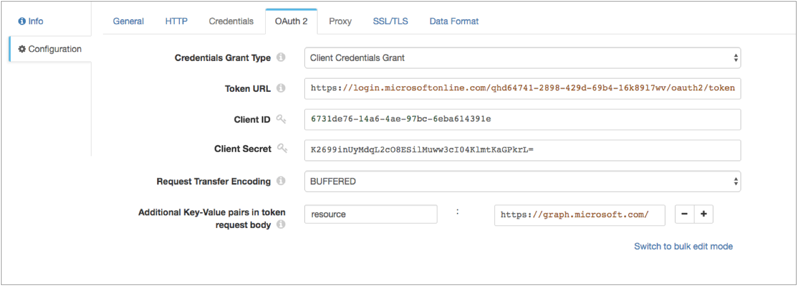

# HTTP客户端

[支持的管道类型：](https://streamsets.com/documentation/controlhub/latest/help/datacollector/UserGuide/Pipeline_Configuration/ProductIcons_Doc.html#concept_mjg_ly5_pgb) 资料收集器 数据收集器边缘

HTTP客户端目标将数据写入HTTP端点。目标将请求发送到HTTP资源URL。使用HTTP客户端目标执行一系列标准请求，或使用表达式确定每个记录的请求。

当在[微服务管道中](https://streamsets.com/documentation/controlhub/latest/help/datacollector/UserGuide/Microservice/Microservice_Title.html#concept_qfh_xdm_p2b)使用时，目的地还可以向[微服务源](https://streamsets.com/documentation/controlhub/latest/help/datacollector/UserGuide/Microservice/Microservice_Title.html#concept_rzc_rbf_kfb)发送响应。

在配置HTTP客户端目标时，您将定义用于请求的资源URL，标头和方法。您将目标配置为为每个记录生成一个请求，或者将其配置为生成包含批处理中所有记录的单个请求。

您可以配置超时，请求传输编码和身份验证类型。您可以将目标配置为使用Gzip或Snappy压缩格式来编写消息。您还可以配置处理器以记录请求和响应信息。

您可以选择使用HTTP代理并配置SSL / TLS属性。您还可以将目标配置为使用OAuth 2协议连接到HTTP服务。

当您希望目标将响应发送到微服务管道中的微服务源时，可以指定要发送的响应的类型。

## HTTP方法


您可以对HTTP客户端目标使用以下方法：

- 得到
- 放
- 开机自检
- 删除
- 头
- 补丁
- 表达式-一种表达式，其计算结果为其他方法之一。

### 表达方式

Expression方法使您可以编写计算结果为标准HTTP方法的表达式。使用Expression方法生成工作流。例如，您可以使用基于字段中的数据将数据传递到服务器（PUT）的表达式。

## 请求数

HTTP客户端目标可以为每个记录生成一个HTTP请求，也可以生成包含批处理中所有记录的单个请求。

配置目标以通过以下方式之一生成请求：

- 每批多个请求

  默认情况下，目标为批处理中的每条记录生成一个HTTP请求，并一次发送多个请求。为了保留记录顺序，目标将等待，直到整个批次的所有请求都完成为止，然后再处理下一个批次。

  当目标每批生成多个请求时，请指定最大并行请求数。默认值为1。增加并行请求的数量可以提高性能，但会增加服务器的负载。发送多个并行请求时，网络延迟也会严重影响性能。

- 每批次单一要求

  如果启用“每批次一个请求”属性，则目标将生成一个包含该批次中所有记录的HTTP请求。

  当目标每批生成一个请求时，它将忽略为最大并行请求数输入的值。每批生成一个请求可以提高性能，具体取决于请求中发送的数据量。

## 记录请求和响应数据

HTTP客户端目标可以将请求和响应数据记录到Data Collector 日志中。

启用日志记录时，可以配置以下属性：

- 细度

  要记录的消息中包括的数据类型：Headers_Only-包括请求和响应头。Payload_Text-包括请求和响应头以及任何文本有效载荷。Payload_Any-包括请求和响应头以及有效载荷，与类型无关。

- 日志级别

  要包含在数据收集器日志中的消息级别。选择级别时，还将记录更高级别的消息。即，如果选择警告日志级别，则将严重和警告消息写入数据收集器日志。

  **注意：**为Data Collector配置的日志级别可以限制所记录的详细信息级别。例如，如果将日志级别设置为“最高级”以记录详细的跟踪信息，但是将Data Collector配置为ERROR，则原始消息仅写入严重级别的消息。

  下表描述了启用日志记录所需的阶段日志级别和相应的Data Collector日志级别：阶段日志级别资料收集器描述严重错误仅显示严重故障的消息。警告警告消息警告潜在问题。信息信息信息性消息。精细调试基本跟踪信息。更细调试详细的跟踪信息。最好的跟踪高度详细的跟踪信息。

  此舞台记录器的名称为 `com.streamsets.http.RequestLogger`。

- 最大实体大小

  写入日志的消息数据的最大大小。用于限制任何单个消息写入数据收集器日志的数据量。

## 发送微服务响应

当您在微服务管道中使用目标时，HTTP客户端目标可以向微服务源发送响应。

发送对微服务源的响应时，目标可以发送以下内容之一：

- 所有成功书面记录。
- 来自目标系统的响应-有关可能的响应的信息，请参阅目标系统的文档。

## OAuth 2授权

HTTP客户端目标可以使用OAuth 2协议连接到HTTP服务。

在Data Collector Edge管道中无效。在Data Collector Edge管道中，HTTP客户端目标将忽略OAuth 2属性。

HTTP客户端目标可以使用OAuth 2协议连接到使用基本身份验证，摘要身份验证或通用身份验证，OAuth 2客户端凭据，OAuth 2用户名和密码或OAuth 2 JSON Web令牌（JWT）的HTTP服务。

OAuth 2协议授权第三方访问HTTP服务资源而无需共享凭据。HTTP客户端目标使用凭据从服务请求访问令牌。该服务将令牌返回给目标，然后目标将令牌包括在对资源URL的每个请求的标头中。

您输入的用于请求访问令牌的凭据取决于HTTP服务所需的凭据授予类型。您可以为HTTP客户端定义以下OAuth 2凭据授予类型：

- 客户凭证授予

  HTTP客户端将其自己的凭据（客户端ID和客户端机密或基本，摘要或通用身份验证凭据）发送到HTTP服务。例如，使用客户端凭据授予来处理来自Twitter API或Microsoft Azure Active Directory（Azure AD）API的数据。有关客户端凭据授予的更多信息，请参阅 https://tools.ietf.org/html/rfc6749#section-4.4。

- 资源所有者密码凭据授予

  HTTP客户端将资源所有者的凭据（资源所有者的用户名和密码）发送到HTTP服务。或者，您可以通过将存储的凭据转换为访问令牌，使用此授权类型将使用基本身份验证，摘要身份验证或通用身份验证的现有客户端迁移到OAuth 2。例如，使用此授权来处理来自Getty Images API的数据。有关使用OAuth 2连接到Getty Images API的更多信息，请参见[http://developers.gettyimages.com/api/docs/v3/oauth2.html](https://developers.gettyimages.com/api/oauth2.html)。有关资源所有者密码凭据授予的更多信息，请参见https://tools.ietf.org/html/rfc6749#section-4.3。

- JSON Web令牌（JWT）

  HTTP客户端将基于JSON的安全令牌编码发送到HTTP服务。例如，使用JSON Web令牌来处理Google API中的数据。

让我们看一下如何配置身份验证和OAuth 2授权以处理来自Twitter，Microsoft Azure AD和Google API的数据的一些示例。

### Twitter示例

要使用OAuth 2授权写入Twitter，请将HTTP客户端配置为使用基本身份验证和客户端凭据授予。

有关为Twitter配置OAuth 2授权的更多信息，请参阅https://dev.twitter.com/oauth/application-only。

1. 在**HTTP**选项卡上，将**身份验证类型**设置为**基本**，然后选择 **使用OAuth 2**。

2. 更改**资源URL**属性的默认值，以定义适用于OAuth 2授权的Twitter URL。

   使用OAuth2授权时，默认网址无效。

   例如，您可以定义以下与OAuth 2授权一起使用的URL： `https://api.twitter.com/1.1/search/tweets.json?q=%23DataOps`

3. 在“ **凭据”**选项卡上，为“ **用户名”**和“ **密码”**属性输入Twitter消费者API密钥和消费者API秘密密钥。

   **提示：**为了保护敏感信息（例如使用者API密钥），可以使用[运行时资源](https://streamsets.com/documentation/controlhub/latest/help/datacollector/UserGuide/Pipeline_Configuration/RuntimeValues.html#concept_bs4_5nm_2s)或凭证存储。有关凭证存储的更多信息，请参阅Data Collector文档中的[凭证存储](https://streamsets.com/documentation/datacollector/latest/help/#datacollector/UserGuide/Configuration/CredentialStores.html)。

4. 在**OAuth 2**标签上，为授予类型选择“ **客户端凭据授予** ”。

5. 在“ **令牌URL”**属性中，输入以下用于请求访问令牌的URL：

   ```
   https://api.twitter.com/oauth2/token
   ```

下图显示了 为Twitter配置的**OAuth 2**标签：


### Microsoft Azure AD示例

若要使用OAuth 2授权写入Microsoft Azure AD，请将HTTP客户端配置为不使用身份验证，并且将客户端凭据授予。

**注意：**本示例使用Microsoft Azure AD版本1.0。

有关为Microsoft Azure AD配置OAuth 2授权的详细信息，请参阅[https://docs.microsoft.com/zh-cn/azure/active-directory/develop/active-directory-protocols-oauth-code](https://docs.microsoft.com/en-us/azure/active-directory/develop/active-directory-protocols-oauth-code)。

1. 在“ **HTTP”**选项卡上，将“ **身份验证类型”**设置为“ **无”**，然后选择“ **使用OAuth 2”**。

2. 在**OAuth 2**标签上，为授予类型选择“ **客户端凭据授予** ”。

3. 在“ **令牌URL”**属性中，输入以下用于请求访问令牌的URL：

   ```
   https://login.microsoftonline.com/<tenant identifier>/oauth2/token
   ```

   ``Azure AD租户标识符在哪里。

4. 输入OAuth 2客户端ID和密码。

   客户端ID是在Azure经典门户中找到的向Azure AD注册应用程序时分配给您的应用程序的应用程序ID。

   客户端密钥是您在应用程序注册门户中为应用程序创建的应用程序密钥。

   **提示：**为了保护敏感信息，例如客户端ID和机密，可以使用[运行时资源](https://streamsets.com/documentation/controlhub/latest/help/datacollector/UserGuide/Pipeline_Configuration/RuntimeValues.html#concept_bs4_5nm_2s)或凭据存储。有关凭证存储的更多信息，请参阅Data Collector文档中的[凭证存储](https://streamsets.com/documentation/datacollector/latest/help/#datacollector/UserGuide/Configuration/CredentialStores.html)。

5. 在令牌请求中添加HTTP服务所需的所有键值对。

   在我们的示例中，我们正在`graph.microsoft.com`资源URL 中访问API，因此我们需要添加以下键/值对：

   ```
   resource : https://graph.microsoft.com/
   ```

下图显示了 为Microsoft Azure AD版本1.0配置的**OAuth 2**选项卡：



### Google示例

要使用OAuth 2授权写入Google服务帐户，请将HTTP客户端配置为不使用身份验证，并配置JSON Web令牌授权。

有关Google服务帐户的更多信息，请参阅Google Cloud文档：[了解服务帐户](https://cloud.google.com/iam/docs/understanding-service-accounts)。

有关为Google配置OAuth 2授权的更多信息，请参阅Google Identity Platform文档：[使用OAuth 2.0访问Google API](https://developers.google.com/identity/protocols/OAuth2)。

1. 在“ **HTTP”**选项卡上，将“ **身份验证类型”**设置为“ **无”**，然后选择“ **使用OAuth 2”**。

2. 在**OAuth 2**标签上，为授予类型选择**JSON Web令牌**。

3. 在“ **令牌URL”**属性中，输入以下用于请求访问令牌的URL：

   ```
   https://www.googleapis.com/oauth2/v4/token
   ```

4. 选择以下算法对JWT进行签名：**使用SHA-256的RSASSA-PKCS-v1_5**。

5. 输入用于签名JWT的Base64编码密钥。

   要访问密钥，请在生成Google凭据时下载JSON密钥文件。在文件中找到“ private_key”字段，其中包含密钥的字符串版本。将字符串复制到**JWT Signing Key**属性中，然后用新行替换所有“ \ n”文字。

   **提示：**为了保护诸如JWT签名密钥之类的敏感信息，您可以使用[运行时资源](https://streamsets.com/documentation/controlhub/latest/help/datacollector/UserGuide/Pipeline_Configuration/RuntimeValues.html#concept_bs4_5nm_2s)或凭据存储。有关凭证存储的更多信息，请参阅Data Collector文档中的[凭证存储](https://streamsets.com/documentation/datacollector/latest/help/#datacollector/UserGuide/Configuration/CredentialStores.html)。

6. 在**JWT Claims**属性中，以JSON格式输入要与JWT令牌请求一起使用的必需声明。

   有关调用Google API时的要求要求的信息，请参阅Google Identity Platform文档：[附录：不带OAuth的服务帐户授权](https://developers.google.com/identity/protocols/OAuth2ServiceAccount#jwt-auth)。

   有关范围声明的范围列表，请参阅Google Identity Platform文档：[Google API的OAuth 2.0范围](https://developers.google.com/identity/protocols/googlescopes)。

   例如，以以下JSON格式输入声明：

   ```
   {
      "iss":"my_name@my_account.iam.gserviceaccount.com",
      "scope":"https://www.googleapis.com/auth/drive",
      "aud":"https://www.googleapis.com/oauth2/v4/token",
      "exp":${(time:dateTimeToMilliseconds(time:now())/1000) + 50 * MINUTES},
      "iat":${time:dateTimeToMilliseconds(time:now())/1000}
   }
   ```

   您可以在JWT声明中包含表达语言。例如，在上面的样本索赔中，“ exp”（到期时间）索赔和“ iat”（发出时）索赔都包括Data Collector时间函数，用于设置到期时间和发布时间。

   **提示：** Google访问令牌会在60分钟后过期。结果，将到期时间声明设置为略少于60分钟，以便HTTP客户端可以在时限内请求新令牌。

下图显示了 为Google服务帐户配置的**OAuth 2**标签：


## 资料格式

HTTP客户端根据您选择的数据格式将数据写入HTTP端点。

在Data Collector Edge管道中， 目标仅支持Binary，JSON，SDC Record和Text数据格式。

HTTP客户端目标处理数据格式如下：

- 阿夫罗

  该阶段基于Avro模式写入记录。您可以使用以下方法之一来指定Avro模式定义的位置：

  **在“管道配置”中** -使用您在阶段配置中提供的架构。**在记录标题中** -使用avroSchema记录标题属性中包含的架构。**Confluent Schema Registry-**从Confluent Schema Registry检索架构。Confluent Schema Registry是Avro架构的分布式存储层。您可以配置目标以通过架构ID或主题在Confluent Schema Registry中查找架构。如果在阶段或记录头属性中使用Avro架构，则可以选择配置阶段以向Confluent Schema Registry注册Avro架构。您还可以选择在消息中包括架构定义。省略模式定义可以提高性能，但是需要适当的模式管理，以避免丢失与数据关联的模式的跟踪。

  您可以在输出中包括Avro模式。

  您还可以使用Avro支持的压缩编解码器压缩数据。使用Avro压缩时，请避免在阶段中配置任何其他压缩属性。

- 二元

  该阶段将二进制数据写入记录中的单个字段。

- 定界

  目标将记录写为定界数据。使用此数据格式时，根字段必须是list或list-map。

  您可以使用以下定界格式类型：**默认CSV-**包含逗号分隔值的文件。忽略文件中的空行。**RFC4180 CSV-**严格遵循RFC4180准则的逗号分隔文件。**MS Excel CSV** -Microsoft Excel逗号分隔文件。**MySQL CSV** -MySQL逗号分隔文件。**制表符分隔的值** -包含制表符分隔的值的文件。**PostgreSQL CSV** -PostgreSQL逗号分隔文件。**PostgreSQL文本** -PostgreSQL文本文件。**自定义** -使用用户定义的定界符，转义符和引号字符的文件。**多字符**定界-使用多个用户定义的字符定界字段和行以及单个用户定义的转义和引号字符的文件。

- JSON格式

  目标将记录作为JSON数据写入。您可以使用以下格式之一：数组-每个文件都包含一个数组。在数组中，每个元素都是每个记录的JSON表示形式。多个对象-每个文件都包含多个JSON对象。每个对象都是记录的JSON表示形式。

- 原虫

  在一条消息中写入一条记录。在描述符文件中使用用户定义的消息类型和消息类型的定义来生成消息。

  有关生成描述符文件的信息，请参阅[Protobuf数据格式先决条件](https://streamsets.com/documentation/controlhub/latest/help/datacollector/UserGuide/Data_Formats/Protobuf-Prerequisites.html)。

- SDC记录

  目标以SDC记录数据格式写入记录。

- 文本

  目标将数据从单个文本字段写入目标系统。配置阶段时，请选择要使用的字段。

  您可以配置字符以用作记录分隔符。默认情况下，目标使用UNIX样式的行尾（\ n）分隔记录。

  当记录不包含选定的文本字段时，目标可以将缺少的字段报告为错误或忽略缺少的字段。默认情况下，目标报告错误。

  当配置为忽略缺少的文本字段时，目标位置可以丢弃该记录或写入记录分隔符以为该记录创建一个空行。默认情况下，目标丢弃记录。

## 配置HTTP客户端目标

配置HTTP客户端目标以将数据写入HTTP端点。

1. 在“属性”面板的“ **常规”**选项卡上，配置以下属性：

   | 一般财产                                                     | 描述                                                         |
   | :----------------------------------------------------------- | :----------------------------------------------------------- |
   | 名称                                                         | 艺名。                                                       |
   | 描述                                                         | 可选说明。                                                   |
   | [必填项](https://streamsets.com/documentation/controlhub/latest/help/datacollector/UserGuide/Pipeline_Design/DroppingUnwantedRecords.html#concept_dnj_bkm_vq) | 必须包含用于将记录传递到阶段的记录的数据的字段。**提示：**您可能包括舞台使用的字段。根据为管道配置的错误处理，处理不包含所有必填字段的记录。 |
   | [前提条件](https://streamsets.com/documentation/controlhub/latest/help/datacollector/UserGuide/Pipeline_Design/DroppingUnwantedRecords.html#concept_msl_yd4_fs) | 必须评估为TRUE的条件才能使记录进入处理阶段。单击 **添加**以创建其他前提条件。根据为阶段配置的错误处理，处理不满足所有前提条件的记录。 |
   | [记录错误](https://streamsets.com/documentation/controlhub/latest/help/datacollector/UserGuide/Pipeline_Design/ErrorHandling.html#concept_atr_j4y_5r) | 该阶段的错误记录处理：放弃-放弃记录。发送到错误-将记录发送到管道以进行错误处理。停止管道-停止管道。对群集管道无效。 |

2. 在“ **HTTP”**选项卡上，配置以下属性：

   | HTTP属性                                                     | 描述                                                         |
   | :----------------------------------------------------------- | :----------------------------------------------------------- |
   | 资源网址                                                     | HTTP资源URL。                                                |
   | 标头                                                         | 要包含在请求中的标头。使用[简单或批量编辑模式](https://streamsets.com/documentation/controlhub/latest/help/datacollector/UserGuide/Pipeline_Configuration/SimpleBulkEdit.html#concept_alb_b3y_cbb)，单击 **添加**图标以添加其他标题。 |
   | [HTTP方法](https://streamsets.com/documentation/controlhub/latest/help/datacollector/UserGuide/Destinations/HTTPClient.html#concept_ry4_ct5_lz) | HTTP请求方法。使用标准方法之一，或使用“表达式”输入表达式。   |
   | [HTTP方法表达式](https://streamsets.com/documentation/controlhub/latest/help/datacollector/UserGuide/Destinations/HTTPClient.html#concept_jky_jt5_lz) | 计算结果为标准HTTP方法的表达式。仅用于表达式方法。           |
   | 请求传输编码                                                 | 使用以下编码类型之一：缓冲-标准传输编码类型。块-分块传输数据。并非所有服务器都支持。默认为缓冲。 |
   | HTTP压缩                                                     | 消息的压缩格式：没有活泼的压缩文件                           |
   | 连接超时                                                     | 等待连接的最大毫秒数。使用0无限期等待。                      |
   | 读取超时                                                     | 等待数据的最大毫秒数。使用0无限期等待。                      |
   | [最大并行请求](https://streamsets.com/documentation/controlhub/latest/help/datacollector/UserGuide/Destinations/HTTPClient.html#concept_a5r_zt5_lz) | 当目标为批处理中的每个记录生成一个请求时，一次发送到服务器的最大请求数。 |
   | [每批一个请求](https://streamsets.com/documentation/controlhub/latest/help/datacollector/UserGuide/Destinations/HTTPClient.html#concept_a5r_zt5_lz) | 允许生成包含批处理中所有记录的单个请求。                     |
   | 认证类型                                                     | 确定用于连接到服务器的身份验证类型：无-不执行身份验证。基本-使用基本身份验证。需要用户名和密码。与HTTPS一起使用，以避免传递未加密的凭据。摘要-使用摘要身份验证。需要用户名和密码。通用-建立匿名连接，然后在收到401状态和WWW-Authenticate标头请求后提供身份验证凭据。需要与基本或摘要身份验证关联的用户名和密码。仅用于响应此工作流程的服务器。OAuth-使用OAuth 1.0身份验证。需要OAuth凭据。 |
   | 使用OAuth 2                                                  | 启用使用OAuth 2授权来请求访问令牌。您可以将OAuth 2授权与无，基本，摘要或通用身份验证一起使用。在Data Collector Edge管道中无效。在Data Collector Edge管道中，HTTP Client会忽略OAuth 2属性。 |
   | 使用代理服务器                                               | 启用使用HTTP代理连接到系统。                                 |
   | 速率限制                                                     | 请求之间的最短时间（以秒为单位）。将请求发送到限速API时，设置限速。默认值为0，这意味着请求之间没有延迟。 |
   | 最长请求时间                                                 | 等待请求完成的最大秒数。                                     |

3. 使用身份验证时，在“ **凭据”**选项卡上，配置以下属性：

   | 凭证属性     | 描述                                                         |
   | :----------- | :----------------------------------------------------------- |
   | 用户名       | 基本，摘要或通用身份验证的用户名。                           |
   | 密码         | 基本，摘要或通用身份验证的密码。**提示：** 为了保护敏感信息，例如用户名和密码，可以使用 [运行时资源](https://streamsets.com/documentation/controlhub/latest/help/datacollector/UserGuide/Pipeline_Configuration/RuntimeValues.html#concept_bs4_5nm_2s)或凭据存储。有关凭证存储的更多信息，请参阅Data Collector文档中的[凭证存储](https://streamsets.com/documentation/datacollector/latest/help/#datacollector/UserGuide/Configuration/CredentialStores.html)。 |
   | 消费者密钥   | OAuth 1.0身份验证的使用者密钥。                              |
   | 消费者的秘密 | OAuth 1.0身份验证的消费者机密。                              |
   | 代币         | 用于OAuth 1.0身份验证的使用者令牌。                          |
   | 令牌秘密     | OAuth 1.0身份验证的令牌密钥。                                |

4. 使用OAuth 2授权时，在**OAuth 2**标签上，配置以下属性。

   有关OAuth 2的详细信息，例如要从Twitter，Microsoft Azure AD或Google API读取的OAuth 2配置，请参阅[OAuth 2授权](https://streamsets.com/documentation/controlhub/latest/help/datacollector/UserGuide/Destinations/HTTPClient.html#concept_yqm_h55_lz)。

   在Data Collector Edge管道中无效。在Data Collector Edge管道中，目标忽略OAuth 2属性。

   | OAuth 2属性  | 描述                                                         |
   | :----------- | :----------------------------------------------------------- |
   | 凭证授予类型 | HTTP服务所需的客户端凭据授予类型：客户凭证授予资源所有者密码凭据授予JSON Web令牌（JWT） |
   | 令牌网址     | 请求访问令牌的URL。                                          |
   | 客户编号     | HTTP服务用于标识HTTP客户端的客户端ID。输入使用客户端ID和密码进行身份验证的客户端凭据授予。或者，对于资源所有者，密码凭据授予需要客户端ID和机密。 |
   | 客户机密     | HTTP服务用来验证HTTP客户端的客户端密码。输入使用客户端ID和密码进行身份验证的客户端凭据授予。或者，对于资源所有者，密码凭据授予需要客户端ID和机密。**提示：**为了保护敏感信息，例如客户端ID和机密，可以使用[运行时资源](https://streamsets.com/documentation/controlhub/latest/help/datacollector/UserGuide/Pipeline_Configuration/RuntimeValues.html#concept_bs4_5nm_2s)或凭据存储。有关凭证存储的更多信息，请参阅Data Collector文档中的[凭证存储](https://streamsets.com/documentation/datacollector/latest/help/#datacollector/UserGuide/Configuration/CredentialStores.html)。 |
   | 用户名       | 资源所有者用户名。输入资源所有者密码凭据授予。               |
   | 密码         | 资源所有者密码。输入资源所有者密码凭据授予。**提示：** 为了保护敏感信息，例如用户名和密码，可以使用 [运行时资源](https://streamsets.com/documentation/controlhub/latest/help/datacollector/UserGuide/Pipeline_Configuration/RuntimeValues.html#concept_bs4_5nm_2s)或凭据存储。有关凭证存储的更多信息，请参阅Data Collector文档中的[凭证存储](https://streamsets.com/documentation/datacollector/latest/help/#datacollector/UserGuide/Configuration/CredentialStores.html)。 |
   | JWT签名算法  | 用于签署JSON Web令牌（JWT）的算法。默认为无。输入JSON Web令牌授予。 |
   | JWT签名密钥  | 如果选择了签名算法，则用于签名JSON Web令牌的Base64编码密钥。**提示：**为了保护诸如JWT签名密钥之类的敏感信息，您可以使用[运行时资源](https://streamsets.com/documentation/controlhub/latest/help/datacollector/UserGuide/Pipeline_Configuration/RuntimeValues.html#concept_bs4_5nm_2s)或凭据存储。有关凭证存储的更多信息，请参阅Data Collector文档中的[凭证存储](https://streamsets.com/documentation/datacollector/latest/help/#datacollector/UserGuide/Configuration/CredentialStores.html)。输入JSON Web令牌授予。 |
   | 智威汤逊索赔 | 声明要以JSON格式输入的JSON Web令牌请求中使用。输入HTTP服务所需的每个声明。您可以在JWT声明中包含表达语言。例如，要阅读Google服务帐户，请输入以下具有适当值的声明：`{  "iss":"my_name@my_account.iam.gserviceaccount.com",  "scope":"https://www.googleapis.com/auth/drive",  "aud":"https://www.googleapis.com/oauth2/v4/token",  "exp":${(time:dateTimeToMilliseconds(time:now())/1000) + 50 * 60},  "iat":${time:dateTimeToMilliseconds(time:now())/1000} }`输入JSON Web令牌授予。 |
   | 请求传输编码 | 阶段请求访问令牌时使用的编码形式：缓冲或分块。默认为分块。   |
   | 其他键值对   | 请求访问令牌时发送到令牌URL的可选键值对。例如，您可以定义OAuth 2 `scope`请求参数。使用[简单或批量编辑模式](https://streamsets.com/documentation/controlhub/latest/help/datacollector/UserGuide/Pipeline_Configuration/SimpleBulkEdit.html#concept_alb_b3y_cbb)，单击**添加**图标以添加其他键值对。 |

5. 要使用HTTP代理，请在“ **代理”**选项卡上配置以下属性：

   | HTTP代理属性 | 描述                                                         |
   | :----------- | :----------------------------------------------------------- |
   | 代理URI      | 代理URI。                                                    |
   | 用户名       | 代理用户名。                                                 |
   | 密码         | 代理密码。**提示：** 为了保护敏感信息，例如用户名和密码，可以使用 [运行时资源](https://streamsets.com/documentation/controlhub/latest/help/datacollector/UserGuide/Pipeline_Configuration/RuntimeValues.html#concept_bs4_5nm_2s)或凭据存储。有关凭证存储的更多信息，请参阅Data Collector文档中的[凭证存储](https://streamsets.com/documentation/datacollector/latest/help/#datacollector/UserGuide/Configuration/CredentialStores.html)。 |

6. 要使用SSL / TLS，请在“ **TLS”**选项卡上配置以下属性：

   在Data Collector Edge管道中，仅“ **使用TLS”**，“ **密钥库文件** ”和“ **信任库文件”**属性有效。启用TLS后，为使用PEM格式的密钥库或信任库文件输入绝对路径。在Data Collector Edge管道中，HTTP客户端目标始终使用默认协议和密码套件。它忽略所有其他TLS属性。

   | TLS属性                                                      | 描述                                                         |
   | :----------------------------------------------------------- | :----------------------------------------------------------- |
   | 使用TLS                                                      | 启用TLS的使用。                                              |
   | [密钥库文件](https://streamsets.com/documentation/controlhub/latest/help/datacollector/UserGuide/Pipeline_Configuration/SSL-TLS.html#concept_kqb_rqf_5z) | 密钥库文件的路径。输入文件的绝对路径或相对于Data Collector资源目录的路径：$ SDC_RESOURCES。有关环境变量的更多信息，请参阅 Data Collector 文档中的Data Collector [环境配置](https://streamsets.com/documentation/datacollector/latest/help/#datacollector/UserGuide/Configuration/DCEnvironmentConfig.html)。默认情况下，不使用任何密钥库。在Data Collector Edge管道中，输入使用PEM格式的文件的绝对路径。 |
   | 密钥库类型                                                   | 要使用的密钥库的类型。使用以下类型之一：Java密钥库文件（JKS）PKCS＃12（p12文件）默认值为Java密钥库文件（JKS）。 |
   | 密钥库密码                                                   | 密钥库文件的密码。密码是可选的，但建议使用。**提示：**为了保护敏感信息（如密码），可以使用[运行时资源](https://streamsets.com/documentation/controlhub/latest/help/datacollector/UserGuide/Pipeline_Configuration/RuntimeValues.html#concept_bs4_5nm_2s)或凭据存储。有关凭证存储的更多信息，请参阅Data Collector文档中的[凭证存储](https://streamsets.com/documentation/datacollector/latest/help/#datacollector/UserGuide/Configuration/CredentialStores.html)。 |
   | 密钥库密钥算法                                               | 用于管理密钥库的算法。默认值为 SunX509。                     |
   | [信任库文件](https://streamsets.com/documentation/controlhub/latest/help/datacollector/UserGuide/Pipeline_Configuration/SSL-TLS.html#concept_kqb_rqf_5z) | 信任库文件的路径。输入文件的绝对路径或相对于Data Collector资源目录的路径：$ SDC_RESOURCES。有关环境变量的更多信息，请参阅 Data Collector 文档中的Data Collector [环境配置](https://streamsets.com/documentation/datacollector/latest/help/#datacollector/UserGuide/Configuration/DCEnvironmentConfig.html)。默认情况下，不使用任何信任库。在Data Collector Edge管道中，输入使用PEM格式的文件的绝对路径。 |
   | 信任库类型                                                   | 要使用的信任库的类型。使用以下类型之一：Java密钥库文件（JKS）PKCS＃12（p12文件）默认值为Java密钥库文件（JKS）。 |
   | 信任库密码                                                   | 信任库文件的密码。密码是可选的，但建议使用。**提示：**为了保护敏感信息（如密码），可以使用[运行时资源](https://streamsets.com/documentation/controlhub/latest/help/datacollector/UserGuide/Pipeline_Configuration/RuntimeValues.html#concept_bs4_5nm_2s)或凭据存储。有关凭证存储的更多信息，请参阅Data Collector文档中的[凭证存储](https://streamsets.com/documentation/datacollector/latest/help/#datacollector/UserGuide/Configuration/CredentialStores.html)。 |
   | 信任库信任算法                                               | 用于管理信任库的算法。默认值为SunX509。                      |
   | 使用默认协议                                                 | 确定要使用的传输层安全性（TLS）协议。默认协议是TLSv1.2。要使用其他协议，请清除此选项。 |
   | [传输协议](https://streamsets.com/documentation/controlhub/latest/help/datacollector/UserGuide/Pipeline_Configuration/SSL-TLS.html#concept_mvs_cxf_5z) | 要使用的TLS协议。要使用默认TLSv1.2以外的协议，请单击“ **添加”**图标并输入协议名称。您可以使用[简单或批量编辑模式](https://streamsets.com/documentation/controlhub/latest/help/datacollector/UserGuide/Pipeline_Configuration/SimpleBulkEdit.html#concept_alb_b3y_cbb)来添加协议。**注意：**较旧的协议不如TLSv1.2安全。 |
   | [使用默认密码套件](https://streamsets.com/documentation/controlhub/latest/help/datacollector/UserGuide/Pipeline_Configuration/SSL-TLS.html#concept_cwx_dyf_5z) | 对SSL / TLS握手使用默认的密码套件。要使用其他密码套件，请清除此选项。 |
   | 密码套房                                                     | 要使用的密码套件。要使用不属于默认密码集的密码套件，请单击“ **添加”**图标并输入密码套件的名称。您可以使用[简单或批量编辑模式](https://streamsets.com/documentation/controlhub/latest/help/datacollector/UserGuide/Pipeline_Configuration/SimpleBulkEdit.html#concept_alb_b3y_cbb)来添加密码套件。输入要使用的其他密码套件的Java安全套接字扩展（JSSE）名称。 |

7. 在“ **数据格式”**选项卡上，配置以下属性：

   | 数据格式属性                                                 | 描述                                                         |
   | :----------------------------------------------------------- | :----------------------------------------------------------- |
   | [资料格式](https://streamsets.com/documentation/controlhub/latest/help/datacollector/UserGuide/Destinations/HTTPClient.html#concept_l2r_gy5_lz) | 消息的数据格式。使用以下数据格式之一：阿夫罗二元定界JSON格式原虫[SDC记录](https://streamsets.com/documentation/controlhub/latest/help/datacollector/UserGuide/Data_Formats/SDCRecordFormat.html#concept_qkk_mwk_br)文本在Data Collector Edge管道中， 目标仅支持Binary，JSON，SDC Record和Text数据格式。 |

8. 对于Avro数据，在“ **数据格式”**选项卡上，配置以下属性：

   | Avro物业             | 描述                                                         |
   | :------------------- | :----------------------------------------------------------- |
   | Avro模式位置         | 写入数据时要使用的Avro模式定义的位置：在“管道配置”中-使用您在阶段配置中提供的架构。在记录头中-在avroSchema [记录头属性中](https://streamsets.com/documentation/controlhub/latest/help/datacollector/UserGuide/Pipeline_Design/RecordHeaderAttributes.html#concept_lmn_gdc_1w)使用架构 。仅在为所有记录定义avroSchema属性时使用。Confluent Schema Registry-从Confluent Schema Registry检索架构。 |
   | Avro模式             | 用于写入数据的Avro模式定义。您可以选择使用该`runtime:loadResource` 函数来加载存储在运行时资源文件中的架构定义。 |
   | 注册架构             | 向Confluent Schema Registry注册新的Avro架构。                |
   | 架构注册表URL        | 汇合的架构注册表URL，用于查找架构或注册新架构。要添加URL，请单击 **添加**，然后以以下格式输入URL：`http://:` |
   | 基本身份验证用户信息 | 使用基本身份验证时连接到Confluent Schema Registry所需的用户信息。`schema.registry.basic.auth.user.info`使用以下格式从Schema Registry中的设置中输入密钥和机密 ：`:`**提示：** 为了保护敏感信息，例如用户名和密码，可以使用 [运行时资源](https://streamsets.com/documentation/controlhub/latest/help/datacollector/UserGuide/Pipeline_Configuration/RuntimeValues.html#concept_bs4_5nm_2s)或凭据存储。有关凭证存储的更多信息，请参阅Data Collector文档中的[凭证存储](https://streamsets.com/documentation/datacollector/latest/help/#datacollector/UserGuide/Configuration/CredentialStores.html)。 |
   | 查找架构             | 在Confluent Schema Registry中查找架构的方法：主题-查找指定的Avro模式主题。架构ID-查找指定的Avro架构ID。 |
   | 模式主题             | Avro架构可以在Confluent Schema Registry中查找或注册。如果要查找的指定主题具有多个架构版本，则阶段将使用该主题的最新架构版本。要使用旧版本，请找到相应的架构ID，然后将“ **查找架构**依据**”**属性设置为“架构ID”。 |
   | 架构编号             | 在Confluent Schema Registry中查找的Avro模式ID。              |
   | 包含架构             | 在每个消息中包含架构。**注意：**省略模式定义可以提高性能，但是需要适当的模式管理，以避免丢失与数据关联的模式的跟踪。 |
   | Avro压缩编解码器     | 要使用的Avro压缩类型。使用Avro压缩时，请勿在目标中启用其他可用压缩。 |

9. 对于二进制数据，在“ **数据格式”**选项卡上，配置以下属性：

   | 二元性质     | 描述                   |
   | :----------- | :--------------------- |
   | 二进制场路径 | 包含二进制数据的字段。 |

10. 对于定界数据，在“ **数据格式”**选项卡上，配置以下属性：

    | 定界财产   | 描述                                                         |
    | :--------- | :----------------------------------------------------------- |
    | 分隔符格式 | 分隔数据的格式：**默认CSV-**包含逗号分隔值的文件。忽略文件中的空行。**RFC4180 CSV-**严格遵循RFC4180准则的逗号分隔文件。**MS Excel CSV** -Microsoft Excel逗号分隔文件。**MySQL CSV** -MySQL逗号分隔文件。**制表符分隔的值** -包含制表符分隔的值的文件。**PostgreSQL CSV** -PostgreSQL逗号分隔文件。**PostgreSQL文本** -PostgreSQL文本文件。**自定义** -使用用户定义的定界符，转义符和引号字符的文件。 |
    | 标题行     | 指示是否创建标题行。                                         |
    | 替换换行符 | 用配置的字符串替换换行符。在将数据写为单行文本时推荐使用。   |
    | 换行符替换 | 用于替换每个换行符的字符串。例如，输入一个空格，用空格替换每个换行符。留空以删除新行字符。 |
    | 分隔符     | 自定义分隔符格式的分隔符。选择一个可用选项，或使用“其他”输入自定义字符。您可以输入使用格式\ U A的Unicode控制符*NNNN*，其中*ñ*是数字0-9或字母AF十六进制数字。例如，输入\ u0000将空字符用作分隔符，或者输入\ u2028将行分隔符用作分隔符。默认为竖线字符（\|）。 |
    | 转义符     | 自定义分隔符格式的转义符。选择一个可用选项，或使用“其他”输入自定义字符。默认为反斜杠字符（\）。 |
    | 引用字符   | 自定义分隔符格式的引号字符。选择一个可用选项，或使用“其他”输入自定义字符。默认为引号字符（“”）。 |
    | 字符集     | 写入数据时使用的字符集。                                     |

11. 对于JSON数据，在**数据格式**选项卡上，配置以下属性：

    | JSON属性 | 描述                                                         |
    | :------- | :----------------------------------------------------------- |
    | JSON内容 | 写入JSON数据的方法：JSON对象数组-每个文件都包含一个数组。在数组中，每个元素都是每个记录的JSON表示形式。多个JSON对象-每个文件包含多个JSON对象。每个对象都是记录的JSON表示形式。 |
    | 字符集   | 写入数据时使用的字符集。                                     |

12. 对于protobuf数据，在“ **数据格式”**选项卡上，配置以下属性：

    | Protobuf属性       | 描述                                                         |
    | :----------------- | :----------------------------------------------------------- |
    | Protobuf描述符文件 | 要使用的描述符文件（.desc）。描述符文件必须位于Data Collector资源目录中`$SDC_RESOURCES`。有关环境变量的更多信息，请参阅 Data Collector 文档中的Data Collector [环境配置](https://streamsets.com/documentation/datacollector/latest/help/#datacollector/UserGuide/Configuration/DCEnvironmentConfig.html)。有关生成描述符文件的信息，请参阅[Protobuf数据格式先决条件](https://streamsets.com/documentation/controlhub/latest/help/datacollector/UserGuide/Data_Formats/Protobuf-Prerequisites.html)。 |
    | 讯息类型           | 写入数据时使用的消息类型的全限定名称。使用以下格式： `.`。使用在描述符文件中定义的消息类型。 |

13. 对于文本数据，在“ **数据格式”**选项卡上，配置以下属性：

    | 文字属性                       | 描述                                                         |
    | :----------------------------- | :----------------------------------------------------------- |
    | 文字栏位路径                   | 包含要写入的文本数据的字段。所有数据必须合并到指定字段中。   |
    | 记录分隔符                     | 用于分隔记录的字符。使用任何有效的Java字符串文字。例如，当写入Windows时，您可能会\r\n用来分隔记录。默认情况下，目标使用 \n。 |
    | 在失落的田野上                 | 当记录不包含文本字段时，确定目标是将丢失的字段报告为错误还是忽略该丢失的字段。 |
    | 如果没有文本，则插入记录分隔符 | 当配置为忽略缺少的文本字段时，插入配置的记录分隔符字符串以创建一个空行。如果未选择，则丢弃没有文本字段的记录。 |
    | 字符集                         | 写入数据时使用的字符集。                                     |

14. 在微服务管道中使用目标时，在“ **响应”**选项卡上，配置以下属性。在非微服务管道中，这些属性将被忽略。

    | [响应属性](https://streamsets.com/documentation/controlhub/latest/help/datacollector/UserGuide/Destinations/HTTPClient.html#concept_fvd_cg2_rfb) | 描述                                                     |
    | :----------------------------------------------------------- | :------------------------------------------------------- |
    | 发送回复到起源                                               | 启用发送对微服务源的响应。                               |
    | 回应类型                                                     | 发送到微服务源的响应：成功写入记录。来自目标系统的响应。 |

15. 在“ **日志记录”**选项卡上，配置以下属性以记录请求和响应数据：

    | 记录属性                                                     | 描述                                                         |
    | :----------------------------------------------------------- | :----------------------------------------------------------- |
    | 启用请求记录                                                 | 启用记录请求和响应数据。                                     |
    | [日志级别](https://streamsets.com/documentation/controlhub/latest/help/datacollector/UserGuide/Destinations/HTTPClient.html#concept_e1s_mgr_hdb) | 要记录的详细信息级别。选择可用选项之一。以下列表是从最低到最高的日志记录顺序。选择级别时，由所选级别以上的级别生成的消息也将写入日志：严重-仅指示严重故障的消息。警告-消息警告潜在问题。信息-信息性消息。精细-基本跟踪信息。更精细-详细的跟踪信息。最好-高度详细的跟踪信息。**注意：**为Data Collector配置的日志级别可以限制阶段写入的消息级别。验证Data Collector日志级别是否支持您要使用的级别。 |
    | 细度                                                         | 要记录的消息中包括的数据类型：Headers_Only-包括请求和响应头。Payload_Text-包括请求和响应头以及任何文本有效载荷。Payload_Any-包括请求和响应头以及有效载荷，与类型无关。 |
    | 最大实体大小                                                 | 写入日志的消息数据的最大大小。用于限制任何单个消息写入数据收集器日志的数据量。 |