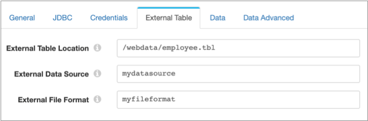

# SQL Server 2019 BDC批量加载器

[支持的管道类型：](https://streamsets.com/documentation/controlhub/latest/help/datacollector/UserGuide/Pipeline_Configuration/ProductIcons_Doc.html#concept_mjg_ly5_pgb) 资料收集器

SQL Server 2019 BDC批量加载程序目标使用批量插入将数据写入Microsoft SQL Server 2019大数据群集（BDC）。

目标根据匹配名称将数据从记录字段写入表列。您可以配置目标以自动处理SQL Server表中的数据漂移。当新表引用出现在记录中时，目标可以创建新的SQL Server或外部表，当新字段引用出现在记录中时，目标可以创建新的SQL Server列。目标无法从存储以Map，List，List_map或File_ref数据类型存储数据的记录字段中写入数据。

配置目标时，请指定连接信息，包括要写入的数据库，架构和表，以及使用的连接数。您可以指定一个行字段，列出列出要写入表的每一行中包括的字段，也可以让目标写除指定字段之外的所有行。您还可以配置目标，以使用指定的默认值替换缺少的字段或包含无效数据类型的字段，并使用指定的字符替换字符串字段中的换行符。

使用SQL Server 2019 BDC批量加载程序目标之前，必须先安装SQL Server 2019大数据群集阶段库并完成其他先决任务。SQL Server 2019 Big Data Cluster 阶段库是一个[Enterprise阶段库](https://streamsets.com/documentation/controlhub/latest/help/datacollector/UserGuide/Installation/EnterpriseStageLibraries.html#concept_s1r_1gg_dhb)，仅供开发用途免费。有关购买用于生产的舞台库的信息，请[联系StreamSets](https://streamsets.com/contact-us/)。

## 先决条件

在配置SQL Server 2019 BDC批量加载程序目标之前，请完成以下先决条件：

1. 确保您可以使用SQL Server凭据访问SQL Server 2019 BDC。
2. [安装SQL Server 2019大数据群集阶段库](https://streamsets.com/documentation/controlhub/latest/help/datacollector/UserGuide/Destinations/SQLServerBDCBulk.html#SQLServerBDCBulk_Prereq_InstallLib)。
3. 检索连接到SQL Server 2019 BDC所需的JDBC URL ，并使用该URL配置目标。

### 安装SQL Server 2019大数据群集阶段库

在使用SQL Server 2019 BDC批量加载程序目标之前，您必须安装SQL Server 2019大数据群集阶段库。SQL Server 2019大数据群集阶段库包含目标位置用来访问SQL Server 2019 BDC的JDBC驱动程序。

SQL Server 2019 Big Data Cluster 阶段库是一个Enterprise阶段库，仅供开发用途免费。有关购买用于生产的舞台库的信息，请[联系StreamSets](https://streamsets.com/contact-us/)。

您可以使用以下任何一种方法来安装SQL Server 2019 Big Data Cluster阶段库：

- 将库安装在现有的

  Data Collector中

  。使用对

  Data Collector

  安装有效的技术：

  - [使用软件包管理器进行安装](https://streamsets.com/documentation/controlhub/latest/help/datacollector/UserGuide/Destinations/SQLServerBDCBulk.html#SQLServerBDCBulk_Prereq_InstallwPack) -可用于tarball Data Collector安装。
  - [作为自定义阶段库安装](https://streamsets.com/documentation/controlhub/latest/help/datacollector/UserGuide/Destinations/SQLServerBDCBulk.html#SQLServerBDCBulk_Prereq_InstallAsCustom) -可用于tarball，RPM或Cloudera Manager Data Collector安装。

- 如果使用

  Control Hub

  ，请将库安装在业务流程框架（例如Kubernetes）一部分的预配

  Data Collector

  容器中。使用对您的环境有效的技术：

  - 在生产环境中，请参阅Control Hub主题[Provisioning Data Collectors](https://streamsets.com/documentation/controlhub/latest/help/controlhub/UserGuide/DataCollectorsProvisioned/ProvisionSteps.html#concept_wl2_snb_12b)。您必须在自定义的StreamSets Data Collector Docker映像中安装SQL Server 2019 Big Data Cluster阶段库。

  - 在开发环境中，您可以运行

    StreamSets

    开发的部署脚本，以通过Control Hub尝试使用带有Data Collector的

    SQL Server 2019 BDC

    。

    

    

    

    

    该脚本在Kubernetes群集上部署了Control Hub Provisioning代理和数据收集器。该脚本会在已部署的Data Collector中自动安装SQL Server 2019 Big Data Cluster阶段库。您可以将该数据收集器用作创作数据收集器来创建和测试SQL Server 2019 BDC管道。

    仅在开发环境中使用脚本。有关更多信息，请参见[Github中](https://github.com/streamsets/sql-server-bdc-deployment)的[部署脚本](https://github.com/streamsets/sql-server-bdc-deployment)。

#### 支持的版本

下表列出了要与特定Data Collector 版本一起使用的SQL Server 2019 Big Data Cluster阶段库的版本：

| 数据收集器版本              | 支持的舞台库版本                     |
| :-------------------------- | :----------------------------------- |
| 数据收集器 3.12.x及更高版本 | SQL Server 2019大数据群集企业库1.0.0 |

#### 使用软件包管理器安装

您可以使用程序包管理器在tarball Data Collector 安装上安装SQL Server 2019 Big Data Cluster阶段库。

1. 单击“程序包管理器”图标：。

2. 在导航面板中，单击**Enterprise Stage Libraries**。

3. 选择**SQL Server 2019大数据群集企业库**，然后单击**安装**图标： 。

4. 阅读StreamSets 订阅服务条款。如果您同意，请选中复选框，然后单击“ **安装”**。

   Data Collector将安装所选的舞台库。

5. 重新启动Data Collector。

#### 作为自定义舞台库安装

您可以在tarball，RPM或Cloudera Manager Data Collector 安装中将SQL Server 2019 Big Data Cluster Enterprise阶段库安装为自定义阶段库。

1. 要下载舞台库，请转到[StreamSets下载企业连接器](https://streamsets.com/download/enterprise-connectors/)页面。

   该网页显示按发布日期组织的Enterprise阶段库，并在页面顶部显示最新版本。

2. 单击您要下载的Enterprise阶段库名称和版本。

3. 在“ **下载企业连接器”**表单中，输入您的姓名和联系信息。

4. 阅读StreamSets订阅服务条款。如果您同意，请接受服务条款，然后单击“ **提交”**。

   舞台库下载。

5. 将Enterprise阶段库安装和管理为自定义阶段库。

   有关更多信息，请参见[Custom Stage Libraries](https://streamsets.com/documentation/controlhub/latest/help/datacollector/UserGuide/Configuration/CustomStageLibraries.html#concept_pmc_jk1_1x)。

## 外部表


在SQL Server 2019 BDC中，您可以定义外部表来访问在SQL Server中虚拟化的数据。有关更多信息，请参见[Microsoft文档](https://docs.microsoft.com/en-us/sql/relational-databases/polybase/data-virtualization?view=sqlallproducts-allversions)。

若要将SQL Server 2019 BDC批量加载器目标配置为写入现有外部表，请在JDBC选项卡上设置适当的属性：

- 将数据库属性设置为SQL Server数据库，其中SQL Server 2019 BDC虚拟化外部表。
- 设置Table属性以包括外部表的名称。

**注意：**在将目标配置为写入现有外部表时，目标无法自动处理对列的更改。

若要配置SQL Server 2019 BDC批量加载器目标以在处理表更改时写入新的外部表，请参阅[表更改](https://streamsets.com/documentation/controlhub/latest/help/datacollector/UserGuide/Destinations/SQLServerBDCBulk.html#SQLServerBDCBulk-DataDriftTables)

## 数据漂移

您可以将SQL Server 2019 BDC批量加载器目标配置为自动处理对列或表的更改，也称为数据漂移。

例如，如果一条记录突然包含一个新`Address2`字段，则配置为处理列更改`Address2`的目标将在目标表中创建一个新列。同样，如果目标根据`Region`字段中的区域名称将数据写入表， 并且一条新`SW-3`区域显示在一条记录中，则配置为处理表更改的目标将创建一个新 `SW-3`表，并将记录写入新表。

您可以使用数据漂移功能在空数据库模式中创建所有必要的表。

### 对列的更改

要将目标配置为在发生数据漂移时自动创建新列，请在“ JDBC”选项卡上选择“启用数据漂移”属性。当新字段出现在记录中时，SQL Server 2019 BDC批量加载器目标将在SQL Server表中创建新列。

**注意：**目标无法在现有外部表中创建新列。因此，目标无法自动处理对外部表中列的更改。

默认情况下，目标根据新字段中的数据创建新列，例如为十进制数据创建一个Double列。但是，您可以配置目标以将所有新列创建为Varchar。

### 表格变更

在配置为在发生数据漂移时创建新列的目标中，您还可以配置目标以根据需要创建新表。选择表自动创建属性。默认情况下，目标将这些新表创建为SQL Server表。

若要使目标创建新表作为外部表，请选择“外部表”属性，然后在“外部表”选项卡上配置外部表。目标需要使用您在SQL Server 2019 BDC中创建的外部数据源和外部文件格式。有关更多信息，请参见[Microsoft文档](https://docs.microsoft.com/en-us/sql/t-sql/statements/create-external-table-transact-sql?view=sql-server-ver15)。

例如，假设您创建了一个名为外部数据源 `mydatasource`中的SQL Server 2019 BDC写的Hadoop。您还创建了一种外部文件格式，命名为 `myfileformat`以文本分隔格式写入数据。您要配置目标以处理员工数据。当数据漂移需要新表时，您希望目标将它们写入Hadoop中/webdata/employee.tbl文件中的外部表中 。在“ JDBC”选项卡上，选择“表自动创建”属性和“外部表”属性。您可以如下配置“外部表”选项卡：



由于管道运行，该目标必须写包括一个名为新表中的数据 `ClickStream`，其中包含的字段`url`， `event_date`以及`user_IP`。目标自动创建以下SQL语句来创建外部表：

```
CREATE EXTERNAL TABLE ClickStream (
    url varchar(50),
    event_date date,
    user_IP varchar(50)
)
WITH (
        LOCATION='/webdata/employee.tbl',
        DATA_SOURCE = mydatasource,
        FILE_FORMAT = myfileformat
    )
;
```

### 生成的数据类型

在创建新表或在现有表中创建新列时，SQL Server 2019 BDC批量加载器目标根据字段名称生成新的列名称，并根据字段中数据的类型生成列数据类型。

您可以配置目标以将所有新列创建为Varchar。但是，默认情况下，SQL Server 2019 BDC批量加载程序目标创建的列如下：

| 记录字段数据类型 | SQL Server 2019 BDC栏资料类型 |
| :--------------- | :---------------------------- |
| 布尔型           | 位                            |
| 字节             | Tinyint                       |
| 字节数组         | 二元                          |
| 烧焦             | 烧焦                          |
| 日期             | 日期                          |
| 约会时间         | 约会时间                      |
| 小数             | 小数                          |
| 浮动             | 真实                          |
| 整数             | 整数                          |
| 长               | 比金特                        |
| 短               | Smallint                      |
| 串               | Varchar                       |
| 时间             | 时间                          |
| Zoned_datetime   | 日期时间偏移                  |

**注意：**目标无法写入包含Map，List_map，List或File_ref数据类型的数据的字段。遇到这些数据类型时，该阶段将生成错误记录。

## 行生成

默认情况下，SQL Server 2019 BDC批量加载程序目标包含写入SQL Server 2019 BDC 表的行中记录中的所有字段。您可以将目标配置为仅包括指定的字段。

在“行字段”属性中，在记录中指定一个映射或列表映射字段，其中包含目标从记录写入的所有数据。默认情况下，该属性设置为根字段`/`，并且目标写入记录中的所有字段。如果指定地图或列表地图字段，则目标仅从指定地图或列表地图字段中的字段写入数据，并排除所有其他记录数据。当记录 中的单个映射或列表映射字段中存在要写入SQL Server 2019 BDC的数据时，请编辑行字段属性。

如果您不想包括所有字段，并且没有包含要包含的字段的地图或列表地图字段，则可以将目标配置为忽略特定字段。编辑“要忽略的字段”属性以列出您不想写入的字段。

默认情况下，目标将字段缺失或字段中数据类型无效的记录视为错误记录。您可以配置目标以使用默认值替换缺少的字段和无效类型的数据。您还可以指定用于每种数据类型的默认值。您还可以配置目标，以使用替换字符替换字符串字段中的换行符。

## 配置SQL Server 2019 BDC批量加载程序目标

配置SQL Server 2019 BDC批量加载程序目标以将数据写入SQL Server 2019 BDC。在管道中使用目标之前，请完成[所需的先决条件](https://streamsets.com/documentation/controlhub/latest/help/datacollector/UserGuide/Destinations/SQLServerBDCBulk.html#SQLServerBDCBulk_Prereq)。

1. 在“属性”面板的“ **常规”**选项卡上，配置以下属性：

   | 一般财产                                                     | 描述                                                         |
   | :----------------------------------------------------------- | :----------------------------------------------------------- |
   | 名称                                                         | 艺名。                                                       |
   | 描述                                                         | 可选说明。                                                   |
   | [必填项](https://streamsets.com/documentation/controlhub/latest/help/datacollector/UserGuide/Pipeline_Design/DroppingUnwantedRecords.html#concept_dnj_bkm_vq) | 必须包含用于将记录传递到阶段的记录的数据的字段。**提示：**您可能包括舞台使用的字段。根据为管道配置的错误处理，处理不包含所有必填字段的记录。 |
   | [前提条件](https://streamsets.com/documentation/controlhub/latest/help/datacollector/UserGuide/Pipeline_Design/DroppingUnwantedRecords.html#concept_msl_yd4_fs) | 必须评估为TRUE的条件才能使记录进入处理阶段。单击 **添加**以创建其他前提条件。根据为阶段配置的错误处理，处理不满足所有前提条件的记录。 |
   | [记录错误](https://streamsets.com/documentation/controlhub/latest/help/datacollector/UserGuide/Pipeline_Design/ErrorHandling.html#concept_atr_j4y_5r) | 该阶段的错误记录处理：放弃-放弃记录。发送到错误-将记录发送到管道以进行错误处理。停止管道-停止管道。对群集管道无效。 |

2. 在“ **JDBC”**选项卡上，配置以下属性：

   | JDBC属性                                                     | 描述                                                         |
   | :----------------------------------------------------------- | :----------------------------------------------------------- |
   | JDBC连接字符串                                               | 用于通过JDBC驱动程序连接到SQL Server 2019 BDC的字符串。连接字符串需要以下格式：`jdbc:sqlserver://:`默认情况下，该属性包含一种表达式语言函数：`jdbc:sqlserver://${sqlServerBDC:hostAndPort("master-svc-external")}`该函数在$ SDC_RESOURCES / sql-server-bdc-resources 文件夹中搜索sql-server-ip-and-port.json文件。在文件中，该函数使用键值对搜索JSON对象， `"serviceName":"master-svc-external"`并使用该对象中`ip`和`port`键所指定的IP地址和端口。如果您使用部署脚本安装了SQL Server 2019 Big Data Cluster阶段库，则可以使用默认字符串，因为该脚本会自动创建该功能所需的文件。如果不使用部署脚本，则可以编辑连接字符串以指定IP地址和端口，也可以使用默认字符串并使用以下JSON对象创建所需的文件：`{ "serviceName": "master-svc-external", "ip": "", "port":  } ` |
   | 数据库                                                       | SQL Server 2019 BDC中要写入的数据库。若要写入[外部表](https://streamsets.com/documentation/controlhub/latest/help/datacollector/UserGuide/Destinations/SQLServerBDCBulk.html#SQLServerBDCBulk-ExternalTables)，请指定SQL Server 2019 BDC虚拟化外部表的SQL Server数据库。 |
   | 架构图                                                       | SQL Server 2019 BDC中的架构用于写入记录。                    |
   | 表                                                           | SQL Server 2019 BDC中要写入的表。                            |
   | [启用数据漂移](https://streamsets.com/documentation/controlhub/latest/help/datacollector/UserGuide/Destinations/SQLServerBDCBulk.html#SQLServerBDCBulk-DataDrift) | 当记录包含新字段时，在现有表中创建新列。**注意：** SQL Server 2019 BDC无法在现有外部表中创建新列。 |
   | [表自动创建](https://streamsets.com/documentation/controlhub/latest/help/datacollector/UserGuide/Destinations/SQLServerBDCBulk.html#SQLServerBDCBulk-DataDriftTables) | 在需要时自动创建表。选择“启用数据漂移”属性时可用。           |
   | 外部表                                                       | 创建新表作为外部表。选择表自动创建属性时可用。如果选择此属性，则还需要在“ **外部表”**选项卡上配置属性。 |
   | 将新列创建为VARCHAR                                          | 将所有新列创建为Varchar列。默认情况下，目标根据字段中的数据类型创建新列。选择“启用数据漂移”属性时可用。 |
   | 连接池大小                                                   | 用于写入SQL Server 2019 BDC的最大连接数。默认值为0，目标将连接数设置为管道使用的线程数。 |
   | 连接属性                                                     | 用于连接到SQL Server 2019 BDC的其他属性。要添加属性，请单击**添加**并定义属性名称和值。输入JDBC期望的属性名称和值。 |
   | 大写模式和字段名称                                           | 将所有数据库，模式，表和列名称以及用于列名称的字段名称转换为所有大写字母。这也适用于目的地为处理数据漂移而创建的任何新表或列的名称。 |
   | 引用对象名称                                                 | 在语句中包括数据库，表和列名称的引号。选择何时使用引号创建数据库，表或列，或者何时数据库，表或列名使用小写或大小写混合。 |

3. 在“ **凭据”**选项卡上，配置以下属性：

   | 凭证属性 | 描述                                                         |
   | :------- | :----------------------------------------------------------- |
   | 用户     | SQL Server 2019 BDC用户名。                                  |
   | 密码     | 用户密码。**提示：** 为了保护敏感信息，例如用户名和密码，可以使用 [运行时资源](https://streamsets.com/documentation/controlhub/latest/help/datacollector/UserGuide/Pipeline_Configuration/RuntimeValues.html#concept_bs4_5nm_2s)或凭据存储。有关凭证存储的更多信息，请参阅Data Collector文档中的[凭证存储](https://streamsets.com/documentation/datacollector/latest/help/#datacollector/UserGuide/Configuration/CredentialStores.html)。 |

4. 在“ **外部表”**选项卡上，为目标配置以下属性，以便在处理[表更改时将](https://streamsets.com/documentation/controlhub/latest/help/datacollector/UserGuide/Destinations/SQLServerBDCBulk.html#SQLServerBDCBulk-DataDriftTables)新表创建为外部[表](https://streamsets.com/documentation/controlhub/latest/help/datacollector/UserGuide/Destinations/SQLServerBDCBulk.html#SQLServerBDCBulk-DataDriftTables)：

   | 外部表属性   | 描述                                                         |
   | :----------- | :----------------------------------------------------------- |
   | 外部表位置   | 目的地写入数据的Hadoop或Azure Blob存储中的文件夹或文件路径以及文件名。从根文件夹中指定位置。根文件夹是在外部数据源中设置的数据位置。 |
   | 外部资料来源 | 目标写入数据的外部数据源的名称。                             |
   | 外部档案格式 | 存储文件格式类型和其他外部数据属性的对象的名称。您可以通过Azure Data Studio之类的工具在SQL Server 2019 BDC中创建对象 。 |

5. 在“ **数据”**选项卡上，配置以下属性：

   | 数据属性                                                     | 描述                                                         |
   | :----------------------------------------------------------- | :----------------------------------------------------------- |
   | [行字段](https://streamsets.com/documentation/controlhub/latest/help/datacollector/UserGuide/Destinations/SQLServerBDCBulk.html#SQLServerBDCBulk-RowGen) | 映射或列表映射字段，其中包含写入SQL Server 2019 BDC中的行的字段。使用默认值时`/`，目的地包括写入行中记录中的所有字段。 |
   | 要忽略的字段                                                 | 以逗号分隔的要忽略的字段列表。字段名称区分大小写。           |
   | 空值                                                         | 写入字符以替换空值。默认值为 `NULL`。                        |

6. 在“ **数据高级”**选项卡上，配置以下属性：

   | 数据高级属性                 | 描述                                                         |
   | :--------------------------- | :----------------------------------------------------------- |
   | 忽略缺少的字段               | 为缺少的字段写入默认值，而不是创建错误记录。写入为期望的数据类型指定的默认值。 |
   | 忽略无效类型的字段           | 替换无效数据类型的值，而不是创建错误记录。写入为期望的数据类型指定的默认值。 |
   | 二进制默认大小               | 二进制字段的默认大小，以字节为单位。输入介于1到8,000之间的值。默认值为8,000。 |
   | CHAR默认大小                 | Char字段的默认大小，以字节为单位。输入介于1到8,000之间的值。默认值为8,000。 |
   | DECIMAL默认精度              | 十进制字段中存储的最大位数。这包括小数点两边的数字。输入介于1和38之间的值。默认值为18。 |
   | DECIMAL默认比例              | 小数字段中存储在小数右边的位数。输入介于0和十进制精度之间的值。默认值为0。 |
   | FLOAT默认大小                | 浮点字段的默认大小，以尾数位表示。输入一个介于1到53之间的值。默认值为53。 |
   | VARCHAR默认大小              | Varchar字段的默认字符串大小，以字节为单位。最大大小为8,000。默认值为8,000。输入0或负值以设置最大存储大小2 GB。 |
   | TIME默认小数秒刻度           | 在“时间”字段中存储的秒数的小数位数。输入介于0和7之间的值。默认值为7。 |
   | DATETIMEOFFSET默认小数秒精度 | 在Datetimeoffset字段中存储的秒数的小数位数。输入介于0和7之间的值。默认值为7。 |
   | BIGINT默认                   | 忽略缺少的字段或字段包含无效数据类型时 ，Bigint字段中存储的默认值。默认为空。 |
   | 二进制默认                   | 当忽略缺少的字段或字段包含无效的数据类型时，默认值存储在Binary字段中。输入不带`0x` 前缀的十六进制值。默认为空。 |
   | BIT默认                      | 当忽略缺少的字段或字段包含无效的数据类型时， 默认值存储在“位”字段中。默认为空。 |
   | CHAR默认                     | 当忽略缺少的字段或字段包含无效的数据类型时， 存储在Char字段中的默认值。默认为空。 |
   | DATE默认                     | 当忽略缺少的字段或字段包含无效的数据类型时， 默认值存储在“日期”字段中。默认为空。 |
   | DATETIME默认                 | 当忽略缺少的字段或字段包含无效的数据类型时， 存储在Datetime字段中的默认值。默认为空。 |
   | DATETIME2默认                | 当忽略缺少的字段或字段包含无效的数据类型时， 存储在Datetime2字段中的默认值。默认为空。 |
   | DATETIMEOFFSET默认           | 当忽略缺少的字段或字段包含无效的数据类型时， 存储在Dateimteoffset字段中的默认值。默认为空。 |
   | DECIMAL默认                  | 当忽略缺少的字段或字段包含无效的数据类型时， 默认值存储在Decimal字段中。默认为空。 |
   | FLOAT默认                    | 当忽略缺少的字段或字段包含无效的数据类型时， 默认值存储在Float字段中。默认为空。 |
   | 图像默认                     | 当忽略缺少的字段或字段包含无效的数据类型时， 存储在“图像”字段中的默认值。默认为空。 |
   | INT默认                      | 当忽略缺少的字段或字段包含无效的数据类型时， 存储在Int字段中的默认值。默认为空。 |
   | 资金违约                     | 当忽略缺少的字段或当字段包含无效的数据类型时 ，Money字段中存储的默认值。默认为空。 |
   | NCHAR默认                    | 当忽略缺少的字段或字段包含无效的数据类型时， 默认值存储在Nchar字段中。默认为空。 |
   | NVARCHAR默认                 | 当忽略缺少的字段或字段包含无效的数据类型时 ，NVarchar字段中存储的默认值。默认为空。 |
   | NTEXT默认                    | 当忽略缺少的字段或字段包含无效的数据类型时， 默认值存储在Ntext字段中。默认为空。 |
   | NUMERIC默认                  | 当忽略缺少的字段或字段包含无效的数据类型时， 默认值存储在“数字”字段中。默认为空。 |
   | 真实默认                     | 当忽略缺少的字段或字段包含无效的数据类型时， 默认值存储在“实数”字段中。默认为空。 |
   | SMALLINT默认                 | 当忽略缺少的字段或字段包含无效的数据类型时， 存储在Smallint字段中的默认值。默认为空。 |
   | SMALLDATE默认                | 当忽略缺少的字段或字段包含无效的数据类型时， 存储在Smalldate字段中的默认值。默认为空。 |
   | 小钱默认                     | 当忽略缺少的字段或字段包含无效的数据类型时， 存储在Smallmoney字段中的默认值。默认为空。 |
   | 文字预设                     | 当忽略缺少的字段或字段包含无效的数据类型时， 存储在“文本”字段中的默认值。默认为空。 |
   | TIME默认                     | 当忽略缺少的字段或字段包含无效的数据类型时， 默认值存储在“时间”字段中。默认为空。 |
   | TINYINT默认                  | 当忽略缺少的字段或字段包含无效的数据类型时， 存储在Tinyint字段中的默认值。默认为空。 |
   | VARBINARY默认                | 当忽略缺少的字段或字段包含无效的数据类型时， 存储在Varbinary字段中的默认值。默认为空。 |
   | VARCHAR默认                  | 当忽略缺少的字段或字段包含无效的数据类型时， 存储在Varchar字段中的默认值。默认为空。 |
   | XML默认                      | 当忽略缺少的字段或字段包含无效的数据类型时， 存储在Xml字段中的默认值。默认为空。 |
   | 更换换行符                   | 用指定的字符替换换行符。                                     |
   | 换行符替换字符               | 用于替换换行符的字符。选择“替换换行”属性时可用。默认值为 `|`。 |