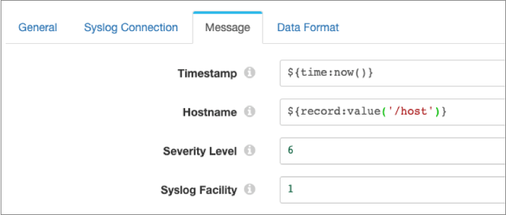

# 系统日志

[支持的管道类型：](https://streamsets.com/documentation/controlhub/latest/help/datacollector/UserGuide/Pipeline_Configuration/ProductIcons_Doc.html#concept_mjg_ly5_pgb) 资料收集器

Syslog目标将syslog消息写入Syslog服务器。

例如，您可能具有将日志消息写入平面文件的网络设备。您需要将这些平面文件发送到集中式Syslog服务器，但是首先必须将消息转换为syslog消息。您设计了一个管道，该管道读取平面文件，对数据进行一些处理，然后使用Syslog目标将数据格式化为syslog消息并将消息写入Syslog服务器。

配置Syslog目标时，可以定义Syslog服务器的主机名和端口号。您还定义使用UDP还是TCP协议将消息发送到服务器。如果使用TCP协议，则可以选择为目标启用SSL / TLS。

您可以通过指定对消息值求值的表达式来构造syslog消息内容，例如时间戳，功能代码，严重性级别，消息ID和日志消息本身。

您通常会希望使用文本数据格式编写日志消息。但是，如果需要，可以将Syslog目标配置为对日志消息使用其他数据格式。

## 协议

您将Syslog目标配置为使用以下协议之一将消息发送到Syslog服务器：

- UDP协议

  当目标使用UDP协议时，请选择目标使用的syslog消息格式。选择以下格式之一：[RFC 5424](https://tools.ietf.org/html/rfc5424)[RFC 3164](https://tools.ietf.org/html/rfc3164)

- TCP协议

  当目标使用TCP协议时，目标使用[RFC 6587](https://tools.ietf.org/html/rfc6587)消息格式。

  使用TCP协议时，还可以为目标[启用SSL / TLS](https://streamsets.com/documentation/controlhub/latest/help/datacollector/UserGuide/Destinations/Syslog.html#task_fcg_q1k_ffb)。

## 启用SSL / TLS

如果将Syslog目标配置为使用TCP协议，则可以启用该目标以使用SSL / TLS连接到Syslog服务器。

1. 在“ **系统日志连接”**选项卡中，选择“ **启用SSL”**属性。

2. 如果Syslog服务器证书由私有CA签名或不受默认Java信任库信任，请创建自定义信任库文件或修改默认Java信任库文件的副本以将CA添加到该文件中。然后配置数据收集器以使用修改后的信任库文件。

   默认情况下，Data Collector使用$ JAVA_HOME / jre / lib / security / cacerts中的Java信任库文件 。如果您的证书是由默认Java信任库文件中包含的CA签名的，则无需创建信任库文件，可以跳过此步骤。

   在这些步骤中，我们展示了如何修改默认的信任库文件，以将其他CA添加到受信任的CA列表中。如果您希望创建自定义信任库文件，请参阅[keytool文档](https://docs.oracle.com/javase/7/docs/technotes/tools/windows/keytool.html)。

   **注意：**如果已经将Data Collector配置为使用自定义信任库文件来[启用HTTPS](https://streamsets.com/documentation/controlhub/latest/help/datacollector/UserGuide/Configuration/HTTP_protocols.html#concept_xyp_lt4_cw)或[到LDAP服务器的安全连接](https://streamsets.com/documentation/controlhub/latest/help/datacollector/UserGuide/Configuration/LDAP-Step2Secure.html#task_wyf_kkw_ty)，则只需将此附加CA添加到相同的修改后的信任库文件中即可。

   1. 使用以下命令来设置JAVA_HOME环境变量：

      ```
      export JAVA_HOME=<Java home directory>
      ```

   2. 使用以下命令来设置SDC_CONF环境变量：

      ```
      export SDC_CONF=<Data Collector configuration directory>
      ```

      例如，对于RPM安装，请使用：

      ```
      export SDC_CONF=/etc/sdc
      ```

   3. 使用以下命令将默认的Java truststore文件复制到Data Collector配置目录：

      ```
      cp "${JAVA_HOME}/jre/lib/security/cacerts" "${SDC_CONF}/truststore.jks"
      ```

   4. 使用以下keytool命令将CA证书导入到信任库文件中：

      ```
      keytool -import -file <Syslog certificate> -trustcacerts -noprompt -alias <Syslog alias> -storepass <password> -keystore "${SDC_CONF}/truststore.jks"
      ```

      例如：

      ```
      keytool -import -file  mySyslogServer.pem -trustcacerts -noprompt -alias MySyslogServer -storepass changeit -keystore "${SDC_CONF}/truststore.jks"
      ```

   5. 在SDC_JAVA_OPTS环境变量中定义以下选项：

      - javax.net.ssl.trustStore- 数据收集器 计算机上信任库文件的路径。
      - javax.net.ssl.trustStorePassword -信任库密码。

      使用安装类型所需的方法。

      例如，如下定义选项：

      ```
      export SDC_JAVA_OPTS="${SDC_JAVA_OPTS} -Djavax.net.ssl.trustStore=/etc/sdc/truststore.jks -Djavax.net.ssl.trustStorePassword=mypassword -Xmx1024m -Xms1024m -server -XX:-OmitStackTraceInFastThrow"
      ```

      或者，为避免在导出命令中保存密码，请将密码保存在文本文件中，然后按如下所示定义truststore password选项： -Djavax.net.ssl.trustStorePassword = $（cat passwordfile.txt）

      然后，确保密码文件仅可由执行导出命令的用户读取。

   6. 重新启动Data Collector以启用对环境变量的更改。

## 留言内容

syslog消息包括诸如时间戳记，设施代码，严重性级别，消息ID和日志消息本身之类的字段。通过在“消息”选项卡上指定消息字段的值来构造syslog消息内容。日志消息的内容取决于您如何配置“数据格式”选项卡。

使用“消息”选项卡，通过为消息属性输入值或表达式来构造syslog消息属性。在大多数情况下，您需要定义表达式来调用记录中包含消息值的字段。

例如，下图显示了使用表达式定义的时间戳记和主机名消息属性，严重性级别和syslog工具设置为默认值6和1：



日志消息本身的内容取决于在“数据格式”选项卡上选择的数据格式。对于文本数据格式，目标将数据从记录中的单个文本字段写入日志消息字段。对于二进制数据格式，目标将数据从记录中的单个字段写入日志消息字段。对于其余的数据格式，目标将数据从记录中的所有字段写入日志消息字段。

## 资料格式

Syslog目标根据您选择的数据格式将数据写入日志消息。

目标可以使用以下数据格式：

- 阿夫罗

  该阶段基于Avro模式写入记录。您可以使用以下方法之一来指定Avro模式定义的位置：

  **在“管道配置”中** -使用您在阶段配置中提供的架构。**在记录标题中** -使用avroSchema记录标题属性中包含的架构。**Confluent Schema Registry-**从Confluent Schema Registry检索架构。Confluent Schema Registry是Avro架构的分布式存储层。您可以配置目标以通过架构ID或主题在Confluent Schema Registry中查找架构。如果在阶段或记录头属性中使用Avro架构，则可以选择配置阶段以向Confluent Schema Registry注册Avro架构。您还可以选择在消息中包括架构定义。省略模式定义可以提高性能，但是需要适当的模式管理，以避免丢失与数据关联的模式的跟踪。

  您可以在输出中包括Avro模式。

  您还可以使用Avro支持的压缩编解码器压缩数据。使用Avro压缩时，请避免在阶段中配置任何其他压缩属性。

- 二元

  该阶段将二进制数据写入记录中的单个字段。

- 定界

  目标将记录写为定界数据。使用此数据格式时，根字段必须是list或list-map。

  您可以使用以下定界格式类型：**默认CSV-**包含逗号分隔值的文件。忽略文件中的空行。**RFC4180 CSV-**严格遵循RFC4180准则的逗号分隔文件。**MS Excel CSV** -Microsoft Excel逗号分隔文件。**MySQL CSV** -MySQL逗号分隔文件。**制表符分隔的值** -包含制表符分隔的值的文件。**PostgreSQL CSV** -PostgreSQL逗号分隔文件。**PostgreSQL文本** -PostgreSQL文本文件。**自定义** -使用用户定义的定界符，转义符和引号字符的文件。**多字符**定界-使用多个用户定义的字符定界字段和行以及单个用户定义的转义和引号字符的文件。

- JSON格式

  目标将记录作为JSON数据写入。您可以使用以下格式之一：数组-每个文件都包含一个数组。在数组中，每个元素都是每个记录的JSON表示形式。多个对象-每个文件都包含多个JSON对象。每个对象都是记录的JSON表示形式。

- 原虫

  在一条消息中写入一条记录。在描述符文件中使用用户定义的消息类型和消息类型的定义来生成消息。

  有关生成描述符文件的信息，请参阅[Protobuf数据格式先决条件](https://streamsets.com/documentation/controlhub/latest/help/datacollector/UserGuide/Data_Formats/Protobuf-Prerequisites.html)。

- SDC记录

  目标以SDC记录数据格式写入记录。

- 文本

  目标将数据从单个文本字段写入目标系统。配置阶段时，请选择要使用的字段。

  您可以配置字符以用作记录分隔符。默认情况下，目标使用UNIX样式的行尾（\ n）分隔记录。

  当记录不包含选定的文本字段时，目标可以将缺少的字段报告为错误或忽略缺少的字段。默认情况下，目标报告错误。

  当配置为忽略缺少的文本字段时，目标位置可以丢弃该记录或写入记录分隔符以为该记录创建一个空行。默认情况下，目标丢弃记录。

- XML格式

  目标为每个记录创建一个有效的XML文档。目标要求记录具有一个包含其余记录数据的单个根字段。有关如何完成此操作的详细信息和建议，请参阅[记录结构要求](https://streamsets.com/documentation/controlhub/latest/help/datacollector/UserGuide/Data_Formats/WritingXML.html#concept_cmn_hml_r1b)。目的地可以包括缩进以产生人类可读的文档。它还可以验证所生成的XML是否符合指定的架构定义。具有无效架构的记录将根据为目标配置的错误处理进行处理。

## 配置系统日志目标

配置系统日志目标，以将系统日志消息写入系统日志服务器。

1. 在“属性”面板的“ **常规”**选项卡上，配置以下属性：

   | 一般财产                                                     | 描述                                                         |
   | :----------------------------------------------------------- | :----------------------------------------------------------- |
   | 名称                                                         | 艺名。                                                       |
   | 描述                                                         | 可选说明。                                                   |
   | [必填项](https://streamsets.com/documentation/controlhub/latest/help/datacollector/UserGuide/Pipeline_Design/DroppingUnwantedRecords.html#concept_dnj_bkm_vq) | 必须包含用于将记录传递到阶段的记录的数据的字段。**提示：**您可能包括舞台使用的字段。根据为管道配置的错误处理，处理不包含所有必填字段的记录。 |
   | [前提条件](https://streamsets.com/documentation/controlhub/latest/help/datacollector/UserGuide/Pipeline_Design/DroppingUnwantedRecords.html#concept_msl_yd4_fs) | 必须评估为TRUE的条件才能使记录进入处理阶段。单击 **添加**以创建其他前提条件。根据为阶段配置的错误处理，处理不满足所有前提条件的记录。 |
   | [记录错误](https://streamsets.com/documentation/controlhub/latest/help/datacollector/UserGuide/Pipeline_Design/ErrorHandling.html#concept_atr_j4y_5r) | 该阶段的错误记录处理：放弃-放弃记录。发送到错误-将记录发送到管道以进行错误处理。停止管道-停止管道。对群集管道无效。 |

2. 在“ **系统日志连接”**选项卡上，配置以下属性：

   | Syslog连接属性                                               | 描述                                                         |
   | :----------------------------------------------------------- | :----------------------------------------------------------- |
   | [协议](https://streamsets.com/documentation/controlhub/latest/help/datacollector/UserGuide/Destinations/Syslog.html#concept_bkx_srf_ffb) | 将消息发送到Syslog服务器的协议：UDP协议TCP协议               |
   | Syslog主机                                                   | Syslog服务器主机名。                                         |
   | 系统日志端口                                                 | Syslog服务器端口号。                                         |
   | 讯息格式                                                     | 对于UDP协议，系统日志消息格式使用：RFC 5424RFC 3164如果使用TCP协议，则目标使用RFC 6587消息格式。 |
   | 套接字连接超时（毫秒）                                       | 对于TCP协议，等待套接字连接的最长时间（以毫秒为单位）。      |
   | TCP连接重试                                                  | 对于TCP协议，重试TCP连接的最大次数。                         |
   | 启用SSL                                                      | 对于TCP协议，请在Data Collector和Syslog服务器之间启用SSL / TLS 。如果Syslog服务器证书由私有CA签名或不受默认Java信任库信任，则还必须在SDC_JAVA_OPTS环境变量中定义信任库文件和密码，如[启用SSL / TLS中所述](https://streamsets.com/documentation/controlhub/latest/help/datacollector/UserGuide/Destinations/Syslog.html#task_fcg_q1k_ffb)。 |

3. 在**消息**选项卡上，配置以下属性：

   | 消息属性     | 描述                                                         |
   | :----------- | :----------------------------------------------------------- |
   | 时间戳记     | syslog消息的时间戳。默认值为处理时间，由表达式定义 `${time:now()}`。要使用与记录关联的时间，请使用一个表达式，该表达式调用一个字段并解析为日期时间值，例如 `${record:value("/Timestamp")}`。 |
   | 主机名       | 用于系统日志消息的主机名。输入主机名或输入计算结果为主机名的表达式。 |
   | 严重等级     | 从0到7的数字代码表示syslog消息的严重性级别。有关代码列表，请参见 https://tools.ietf.org/html/rfc5424#section-6.2.1。输入数字代码或输入计算结果为该代码的表达式。 |
   | 系统日志功能 | 从0到23的数字代码表示syslog消息的功能。有关代码列表，请参见 https://tools.ietf.org/html/rfc5424#section-6.2.1。输入数字代码或输入计算结果为该代码的表达式。 |
   | 应用名称     | 用于syslog消息的应用程序名称。输入应用程序名称或输入一个计算得出名称的表达式。 |
   | 讯息编号     | 用于系统日志消息的消息ID。输入消息ID或输入计算结果为ID的表达式。 |
   | 进程ID       | 用于syslog消息的进程ID。输入流程ID或输入计算得出该ID的表达式。 |

4. 在“ **数据格式”**选项卡上，配置以下属性：

   | 数据格式属性                                                 | 描述                                                         |
   | :----------------------------------------------------------- | :----------------------------------------------------------- |
   | [资料格式](https://streamsets.com/documentation/controlhub/latest/help/datacollector/UserGuide/Destinations/Syslog.html#concept_udw_31l_ffb) | 要写入的数据格式。使用以下选项之一：阿夫罗二元定界JSON格式原虫[SDC记录](https://streamsets.com/documentation/controlhub/latest/help/datacollector/UserGuide/Pipeline_Design/SDCRecordFormat.html#concept_qkk_mwk_br)文本XML格式 |

5. 对于Avro数据，在“ **数据格式”**选项卡上，配置以下属性：

   | Avro物业             | 描述                                                         |
   | :------------------- | :----------------------------------------------------------- |
   | Avro模式位置         | 写入数据时要使用的Avro模式定义的位置：在“管道配置”中-使用您在阶段配置中提供的架构。在记录头中-在avroSchema [记录头属性中](https://streamsets.com/documentation/controlhub/latest/help/datacollector/UserGuide/Pipeline_Design/RecordHeaderAttributes.html#concept_lmn_gdc_1w)使用架构 。仅在为所有记录定义avroSchema属性时使用。Confluent Schema Registry-从Confluent Schema Registry检索架构。 |
   | Avro模式             | 用于写入数据的Avro模式定义。您可以选择使用该`runtime:loadResource` 函数来加载存储在运行时资源文件中的架构定义。 |
   | 注册架构             | 向Confluent Schema Registry注册新的Avro架构。                |
   | 架构注册表URL        | 汇合的架构注册表URL，用于查找架构或注册新架构。要添加URL，请单击 **添加**，然后以以下格式输入URL：`http://:` |
   | 基本身份验证用户信息 | 使用基本身份验证时连接到Confluent Schema Registry所需的用户信息。`schema.registry.basic.auth.user.info`使用以下格式从Schema Registry中的设置中输入密钥和机密 ：`:`**提示：** 为了保护敏感信息，例如用户名和密码，可以使用 [运行时资源](https://streamsets.com/documentation/controlhub/latest/help/datacollector/UserGuide/Pipeline_Configuration/RuntimeValues.html#concept_bs4_5nm_2s)或凭据存储。有关凭证存储的更多信息，请参阅Data Collector文档中的[凭证存储](https://streamsets.com/documentation/datacollector/latest/help/#datacollector/UserGuide/Configuration/CredentialStores.html)。 |
   | 查找架构             | 在Confluent Schema Registry中查找架构的方法：主题-查找指定的Avro模式主题。架构ID-查找指定的Avro架构ID。 |
   | 模式主题             | Avro架构可以在Confluent Schema Registry中查找或注册。如果要查找的指定主题具有多个架构版本，则阶段将使用该主题的最新架构版本。要使用旧版本，请找到相应的架构ID，然后将“ **查找架构**依据**”**属性设置为“架构ID”。 |
   | 架构编号             | 在Confluent Schema Registry中查找的Avro模式ID。              |
   | 包含架构             | 在每个消息中包含架构。**注意：**省略模式定义可以提高性能，但是需要适当的模式管理，以避免丢失与数据关联的模式的跟踪。 |
   | Avro压缩编解码器     | 要使用的Avro压缩类型。使用Avro压缩时，请勿在目标中启用其他可用压缩。 |

6. 对于二进制数据，在“ **数据格式”**选项卡上，配置以下属性：

   | 二元性质     | 描述                   |
   | :----------- | :--------------------- |
   | 二进制场路径 | 包含二进制数据的字段。 |

7. 对于定界数据，在“ **数据格式”**选项卡上，配置以下属性：

   | 定界财产   | 描述                                                         |
   | :--------- | :----------------------------------------------------------- |
   | 分隔符格式 | 分隔数据的格式：**默认CSV-**包含逗号分隔值的文件。忽略文件中的空行。**RFC4180 CSV-**严格遵循RFC4180准则的逗号分隔文件。**MS Excel CSV** -Microsoft Excel逗号分隔文件。**MySQL CSV** -MySQL逗号分隔文件。**制表符分隔的值** -包含制表符分隔的值的文件。**PostgreSQL CSV** -PostgreSQL逗号分隔文件。**PostgreSQL文本** -PostgreSQL文本文件。**自定义** -使用用户定义的定界符，转义符和引号字符的文件。 |
   | 标题行     | 指示是否创建标题行。                                         |
   | 替换换行符 | 用配置的字符串替换换行符。在将数据写为单行文本时推荐使用。   |
   | 换行符替换 | 用于替换每个换行符的字符串。例如，输入一个空格，用空格替换每个换行符。留空以删除新行字符。 |
   | 分隔符     | 自定义分隔符格式的分隔符。选择一个可用选项，或使用“其他”输入自定义字符。您可以输入使用格式\ U A的Unicode控制符*NNNN*，其中*ñ*是数字0-9或字母AF十六进制数字。例如，输入\ u0000将空字符用作分隔符，或者输入\ u2028将行分隔符用作分隔符。默认为竖线字符（\|）。 |
   | 转义符     | 自定义分隔符格式的转义符。选择一个可用选项，或使用“其他”输入自定义字符。默认为反斜杠字符（\）。 |
   | 引用字符   | 自定义分隔符格式的引号字符。选择一个可用选项，或使用“其他”输入自定义字符。默认为引号字符（“”）。 |
   | 字符集     | 写入数据时使用的字符集。                                     |

8. 对于JSON数据，在**数据格式**选项卡上，配置以下属性：

   | JSON属性 | 描述                                                         |
   | :------- | :----------------------------------------------------------- |
   | JSON内容 | 写入JSON数据的方法：JSON对象数组-每个文件都包含一个数组。在数组中，每个元素都是每个记录的JSON表示形式。多个JSON对象-每个文件包含多个JSON对象。每个对象都是记录的JSON表示形式。 |
   | 字符集   | 写入数据时使用的字符集。                                     |

9. 对于protobuf数据，在“ **数据格式”**选项卡上，配置以下属性：

   | Protobuf属性       | 描述                                                         |
   | :----------------- | :----------------------------------------------------------- |
   | Protobuf描述符文件 | 要使用的描述符文件（.desc）。描述符文件必须位于Data Collector资源目录中`$SDC_RESOURCES`。有关环境变量的更多信息，请参阅 Data Collector 文档中的Data Collector [环境配置](https://streamsets.com/documentation/datacollector/latest/help/#datacollector/UserGuide/Configuration/DCEnvironmentConfig.html)。有关生成描述符文件的信息，请参阅[Protobuf数据格式先决条件](https://streamsets.com/documentation/controlhub/latest/help/datacollector/UserGuide/Data_Formats/Protobuf-Prerequisites.html)。 |
   | 讯息类型           | 写入数据时使用的消息类型的全限定名称。使用以下格式： `.`。使用在描述符文件中定义的消息类型。 |

10. 对于文本数据，在“ **数据格式”**选项卡上，配置以下属性：

    | 文字属性                       | 描述                                                         |
    | :----------------------------- | :----------------------------------------------------------- |
    | 文字栏位路径                   | 包含要写入的文本数据的字段。所有数据必须合并到指定字段中。   |
    | 记录分隔符                     | 用于分隔记录的字符。使用任何有效的Java字符串文字。例如，当写入Windows时，您可能会\r\n用来分隔记录。默认情况下，目标使用 \n。 |
    | 在失落的田野上                 | 当记录不包含文本字段时，确定目标是将丢失的字段报告为错误还是忽略该丢失的字段。 |
    | 如果没有文本，则插入记录分隔符 | 当配置为忽略缺少的文本字段时，插入配置的记录分隔符字符串以创建一个空行。如果未选择，则丢弃没有文本字段的记录。 |
    | 字符集                         | 写入数据时使用的字符集。                                     |

11. 对于XML数据，在“ **数据格式”**选项卡上，配置以下属性：

    | XML属性  | 描述                                                         |
    | :------- | :----------------------------------------------------------- |
    | 漂亮格式 | 添加缩进以使生成的XML文档更易于阅读。相应地增加记录大小。    |
    | 验证架构 | 验证生成的XML是否符合指定的架构定义。具有无效架构的记录将根据为目标配置的错误处理进行处理。**要点：**无论是否验证XML模式，目的地都需要特定格式的记录。有关更多信息，请参见[记录结构要求](https://streamsets.com/documentation/controlhub/latest/help/datacollector/UserGuide/Data_Formats/WritingXML.html#concept_cmn_hml_r1b)。 |
    | XML模式  | 用于验证记录的XML模式。                                      |