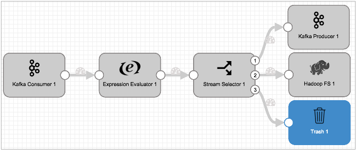

# 垃圾

[支持的管道类型：](https://streamsets.com/documentation/controlhub/latest/help/datacollector/UserGuide/Pipeline_Configuration/ProductIcons_Doc.html#concept_mjg_ly5_pgb) 资料收集器 数据收集器边缘

垃圾箱目标将丢弃记录。将“废纸destination”目标用作从管道中丢弃的记录的直观表示。或者，您可以在开发过程中将“废纸destination”目标用作临时占位符。

当您使用垃圾箱目标时，管道将丢弃记录。但是，与作为流水线或阶段错误处理的一部分丢弃记录不同，您可以创建指标和数据警报，还可以检查发送到垃圾箱的数据作为数据预览的一部分。

例如，以下管道根据不同的条件使用流选择器将数据路由到Kafka Producer和Hadoop FS目标。流选择器会将其他条件中未包含的所有记录路由到垃圾箱目标。

垃圾箱目标没有配置选项。要在管道中使用“废纸destination”目标，只需添加阶段并将管道连接到阶段即可。