# Hive Drift同步解决方案 

## 同步解决方案

Hive的漂移同步解决方案可 检测传入数据中的漂移并更新相应的Hive表。用于Hive的Drift同步解决方案以前称为Hive Drift解决方案，它 可以根据记录要求创建和更新Hive表，并根据记录头属性将数据写入HDFS或MapR FS。您可以根据需要使用解决方案的全部功能或单个组件。

用于Hive的Drift同步解决方案支持处理Avro和Parquet数据。在处理Parquet数据时，该解决方案会生成临时的Avro文件，并使用MapReduce执行程序将Avro文件转换为Parquet。

该解决方案与Impala兼容，但是需要其他步骤来刷新Impala元数据缓存。


### 一般处理

用于Hive的Drift同步解决方案 结合了Hive元数据处理器，Hive Metastore目标以及Hadoop FS或MapR FS目标，如下所示：

- 漂移检测

  在处理记录时，Hive元数据处理器会检测列状漂移以及对新表和分区的需求。它生成描述必要更改的元数据记录，并将其传递到Hive Metastore目标。

  当Hive Metastore目标接收到元数据记录时，它将提议的更改与最新的Hive元数据进行比较，并根据需要创建和更新Hive表。

  目标可以创建表和分区。它可以将列添加到表中，而忽略现有列。它不会从表中删除现有列。

- 基于记录的写入

  Hive元数据处理器还将信息添加到每个记录的标题中，并将记录传递到Hadoop FS目标或MapR FS目标。目标可以根据以下详细信息对其目标系统执行基于记录的写操作：目标目录-Hive元数据处理器基于用户定义的表达式，汇编应存储每个记录的路径。它将生成的路径写入每个记录头中的 targetDirectory属性。要将记录写入生成的路径，请配置目标以使用targetDirectory标头属性。Avro模式-处理器将Avro模式写入每个记录标题中的 avroSchema属性。它在必要时根据记录结构生成新的Avro模式。用于Avro和Parquet数据。要使用生成的Avro模式，请将目标配置为使用avroSchema标头属性。滚动文件-发生模式更改时，处理器会生成一个滚动指示符- 滚动头属性。这允许将具有更改的架构的数据写入更新的Hive表。要基于架构更改滚动文件，请使用滚动标题属性配置目标。

例如，假设您使用此解决方案将销售数据写入MapR FS。销售系统的部分升级将几个新字段添加到传入数据的子集。

使用针对Hive的Drift同步解决方案，Hive元数据处理器会记下元数据记录中的新字段，并将其传递到Hive Metastore目标。Hive Metastore目标将新列添加到Hive目标表中。然后，MapR FS目标将数据写入更新后的表。将没有新字段的数据写入更新的表时，目标将为缺少的字段插入空值。

### 实木复合地板加工

在 处理Parquet数据时，Hive的 “ 漂移同步解决方案”的工作方式存在一些差异：

- 使用事件触发Avro到Parquet MapReduce作业

  在构建管道时，必须配置数据处理目标以生成事件。然后，目标每次关闭输出文件时都会生成事件。

  然后，您可以使用MapReduce执行程序在每次收到事件时启动将Avro转换为Parquet MapReduce作业。

- 创建和更新实木复合地板表

  Hive Metastore目标会根据需要创建和更新Parquet表。 目标在生成表时使用Stored as Parquet子句，因此不需要为每次更改都生成新的架构。

- 对Avro输出文件使用临时目录

  处理Parquet数据时，Hive元数据处理器将.avro添加到它为每个记录生成的目标目录中。这样，数据处理目标就可以将Avro文件写入到Hive忽略的临时目录中。结果，目标将文件写入以下目录：`/.avro`。您可以配置MapReduce执行程序以将Parquet文件写入父生成的目录，并在处理它们后删除Avro文件。您还可以根据需要在处理文件后删除临时目录。

### Impala支持

Drift同步解决方案针对Hive编写的数据 与Impala兼容。

每当Hive元存储中发生更改时，Impala都需要使用Invalidate Metadata命令来刷新Impala元数据缓存。

处理Avro数据时，可以使用Hive Query执行程序自动刷新Impala元数据缓存。有关详细信息，请参阅[案例研究：Dive for Hive的Impala元数据更新](https://streamsets.com/documentation/controlhub/latest/help/datacollector/UserGuide/Event_Handling/EventFramework-Title.html#concept_szz_xwm_lx)。

处理Parquet数据时，您需要在Hive Metastore目标对Hive Metastore进行更改之后以及MapReduce执行程序将文件转换为Parquet之后手动运行Impala Invalidate Metadata命令。

您可以设置警报，以在Hive Metastore目标进行更改时通知您。只需在指向Hive Metastore目标的链接上添加[数据规则警报](https://streamsets.com/documentation/controlhub/latest/help/datacollector/UserGuide/Alerts/RulesAlerts_title.html#concept_tpm_rsk_zq)，并在将元数据记录传递到Hive Metastore时使警报发送电子邮件或网络挂接。

使用外部工具确定何时将Avro转换为Parquet MapReduce作业。

### 整理记录

目前，用于Hive的Drift Synchronization Solution不处理带有嵌套字段的记录。如有必要，您可以使用[Field Flattener处理器](https://streamsets.com/documentation/controlhub/latest/help/datacollector/UserGuide/Processors/FieldFlattener.html#concept_njn_3kk_fx)对带有嵌套字段的记录进行扁平化，然后再将它们传递给Hive元数据处理器。

## 基本Avro实施

您可以在适当的任何管道中将Hive Metadata处理器，Hive Metastore目标用于元数据处理，并将Hadoop FS或MapR FS目标用于数据处理。

用于Hive 来处理Avro数据的Drift同步解决方案的基本实现包括您选择的来源，连接到Hive Metastore目标以执行元数据更新的Hive Metadata处理器，以及连接到Hadoop FS或MapR FS目标以处理数据的Hive。如下：

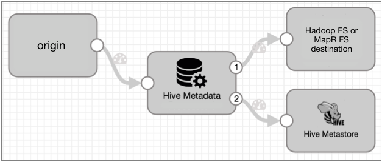

的数据流-蜂巢元数据处理器通过第一输出流通过记录。将数据流连接到Hadoop FS或MapR FS目标，以使用记录头属性将数据写入目标系统。

Hive元数据处理器将元数据记录通过第二个输出流-元数据输出流。将Hive Metastore目标连接到元数据输出流，以使目标能够在Hive中创建和更新表。元数据输出流不包含记录数据。

如果您的数据包含嵌套字段，则可以添加“字段展平器”来展平记录，如下所示：

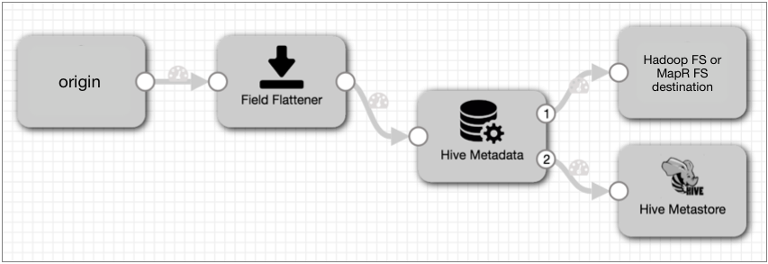

## 基本实木复合地板实施

用于Hive 来处理Parquet数据的Drift Synchronization Solution的基本实现向Avro实现添加了MapReduce执行器。

您可以使用选择的来源，将Hive Metadata处理器连接到Hive Metastore目标以执行元数据更新，并使用Hadoop FS或MapR FS目标来处理数据。您将数据处理目标配置为生成事件，然后使用MapReduce执行程序将关闭的Avro文件转换为Parquet。

基本的Parquet实现如下所示：

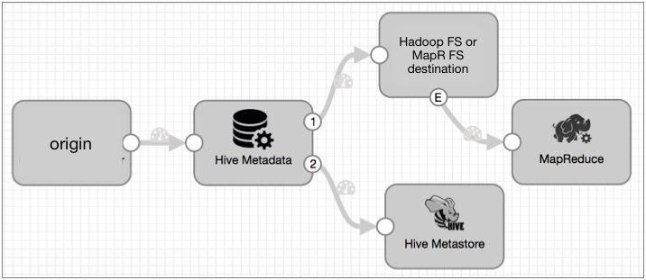

与Avro数据一样，Hive元数据处理器将记录通过第一个输出流-数据流。将数据流连接到Hadoop FS或MapR FS目标，以使用记录头属性将数据写入目标系统。每次目标关闭输出文件时，它都会创建一个文件关闭事件，该事件触发MapReduce执行程序启动从Avro到Parquet MapReduce作业。

Hive元数据处理器将元数据记录通过第二个输出流-元数据输出流。将Hive Metastore目标连接到元数据输出流，以使目标能够在Hive中创建和更新表。元数据输出流不包含记录数据。

如果您的数据包含嵌套字段，则可以添加“字段展平器”来展平记录，如下所示：

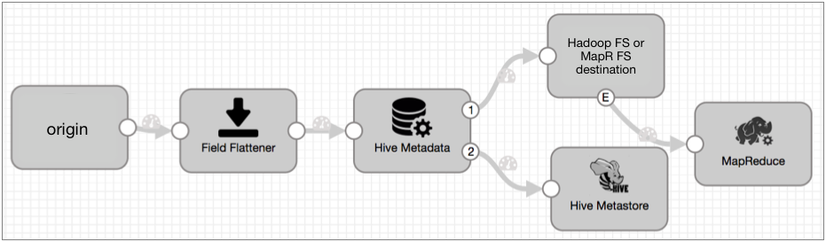

## 实施步骤

要实现Hive的漂移同步解决方案，请执行以下步骤：

1. 配置源和要使用的所有其他处理器。

   - 如果使用JDBC查询使用者作为源，请启用JDBC标头属性的创建。有关更多信息，请参见[漂移同步解决方案的标题属性](https://streamsets.com/documentation/controlhub/latest/help/datacollector/UserGuide/Origins/JDBCConsumer.html#concept_tvf_tgp_fx)。
   - 如果数据包括带有嵌套字段的记录，请在将记录传递给Hive元数据处理器之前，添加一个字段展平器来展平记录。

2. 要捕获列状漂移并启用基于记录的写入，请配置Hive元数据处理器：

   - 配置连接信息。

   - 配置数据库，表和分区表达式。

     您可以输入一个名称，也可以使用计算得出要使用的名称的表达式。如有必要，可以在管道中的较早位置使用表达式计算器，将信息写入记录字段或记录头属性。

   - 配置十进制字段精度和小数位属性名称。

     处理来自JDBC查询使用者或JDBC多表使用者来源的数据时，请使用默认属性名称“ precision”和“ scale”。这两个原点在每个小数字段的“ precision”和“ scale”字段属性中存储小数列的精度和小数位数。

     处理来自其他来源的数据时，可以在管道中更早地使用Expression Evaluator处理器为Decimal字段创建precision和scale字段属性。

   - 指定要使用的数据格式，Avro或Parquet。

   - （可选）配置高级选项，例如最大高速缓存大小，时间基准和数据时区。

   有关Hive元数据处理器的更多信息，请参见[Hive元数据](https://streamsets.com/documentation/controlhub/latest/help/datacollector/UserGuide/Processors/HiveMetadata.html#concept_rz5_nft_zv)。

3. 要处理由处理器生成的元数据记录并根据需要更改表，请将Hive Metadata处理器的元数据输出连接到Hive Metastore目标。

   **注意：**虽然您可能将某些记录过滤或路由到远离Hive Metastore目标的位置，但目标必须接收元数据记录才能更新Hive表。

4. 配置Hive Metastore目标：

   - 配置Hive连接信息。
   - （可选）配置缓存信息以及如何更新表。

   有关Hive Metastore目标的更多信息，请参见[Hive Metastore](https://streamsets.com/documentation/controlhub/latest/help/datacollector/UserGuide/Destinations/HiveMetastore.html#concept_gcr_z2t_zv)。

5. 将Hive元数据处理器的数据输出连接到Hadoop FS或MapR FS目标，以使用记录头属性将记录写入目标系统。

6. 配置Hadoop FS或MapR FS目标：

   1. 要使用targetDirectory标头属性写入记录，请在“输出文件”选项卡上，选择“标头中的目录”。
   2. 要基于滚动标题属性滚动记录，请在“输出文件”选项卡上，选择“使用滚动属性”，然后为“滚动属性名称”输入“ roll”。
   3. 要使用avroSchema标头属性写入记录，请在“数据格式”选项卡上，选择Avro数据格式，然后为“ Avro模式位置”属性选择“在记录头中”。

   有关使用记录头属性的更多信息，请参见[基于记录的写的记录头属性](https://streamsets.com/documentation/controlhub/latest/help/datacollector/UserGuide/Pipeline_Design/RecordHeaderAttributes.html#concept_lmn_gdc_1w)。

   **注意：**要压缩Avro数据，请使用“数据格式”选项卡上的Avro压缩选项，而不要使用“输出文件”选项卡上的压缩编解码器属性。

7. 处理Parquet数据时，请执行以下附加步骤：

   1. 在数据处理目标的“常规”选项卡上，选择“产生事件”。

   2. 将MapReduce执行程序连接到结果事件流，并为该阶段配置必要的连接信息。

   3. 在MapReduce执行程序的“作业”选项卡上，选择“将Avro转换为Parquet”作业类型，然后添加所需的任何其他作业参数。

   4. 在“ Avro转换”选项卡上，配置“ Avro转换”属性：

      - 使用默认的Input Avro File表达式-这使执行者可以处理刚刚关闭数据处理目标的文件。

      - 指定要使用的输出目录-要将Parquet文件写入.avro临时目录的父目录，请使用以下表达式：

        ```
        ${file:parentPath(file:parentPath(record:value('/filepath')))}
        ```

      - （可选）配置其他Avro转换属性。

   5. 在“从Avro到Parquet”选项卡上，可以选择配置压缩或其他高级Parquet属性。

## Avro案例研究

假设您有一个Data Collector 管道，该管道将Avro日志数据写入Kafka。流水线中的文件尾源处理来自多个不同Web服务的数据，并使用“标记”标头属性标记每个记录，该标头属性标识生成数据的服务。

现在，您想要一个新的管道将数据传递到HDFS，可以在其中存储和查看数据，并且您希望将数据写入基于生成数据的Web服务的表中。请注意，您也可以将数据写入MapR FS-步骤几乎与本案例研究相同，只是使用了另一个目标。

为此，添加并配置Kafka Consumer以将数据读入管道，然后将其连接到Hive元数据处理器。处理器评估记录结构，并生成描述任何所需的Hive元数据更改的元数据记录。使用标记标头属性和其他用户定义的表达式，Hive Metadata处理器可以确定要用于目标目录的数据库，表和分区，并将该信息与Avro模式一起写入记录标头，包括文件滚动指示符。必要。

您将Hive Metadata处理器元数据输出流连接到Hive Metastore目标。目的地从Hive元数据处理器接收到元数据记录后，将根据需要创建或更新Hive表。

您将Hive Metadata处理器数据输出流连接到Hadoop FS目标，并将其配置为使用记录头中的信息。然后，目标使用记录头中的目标目录和Avro模式将每个记录移至要到达的位置，并在需要时滚动文件。

现在让我们仔细看看...

### Hive元数据处理器

您设置了Kafka Consumer，并将其连接到Hive Metadata处理器。在配置处理器时，除了基本的连接详细信息之外，还需要考虑一些其他事项：

1. 记录应写入哪个数据库？

   Hadoop FS会进行写操作，但是处理器需要知道记录应该去哪里。

   让我们写到Hive默认数据库。为此，您可以将数据库属性保留为空。

2. 记录应写入哪些表？

   向Kafka提供数据的管道使用“标签”标头属性来指示原始Web服务。要使用tag属性写入表，请对表名使用以下表达式：

   ```
   ${record:attribute('tag')}
   ```

3. 您要使用什么分区（如果有）？

   让我们使用日期时间变量为分区值表达式创建每日分区，如下所示：

   ```
   ${YYYY()}-${MM()}-${DD()}
   ```

4. 您如何配置小数字段的精度和小数位数？

   尽管来自Web服务的数据不包含您知道的十进制数据，但是为了防止新的十进制数据生成错误记录，请配置十进制字段表达式。

   默认表达式用于JDBC查询使用者或JDBC多表使用者生成的数据。您可以将它们替换为其他表达式或常量。

5. 正在处理哪种类型的数据？

   在“数据格式”选项卡上，选择“ Avro”数据格式。

此时，您的管道如下所示：

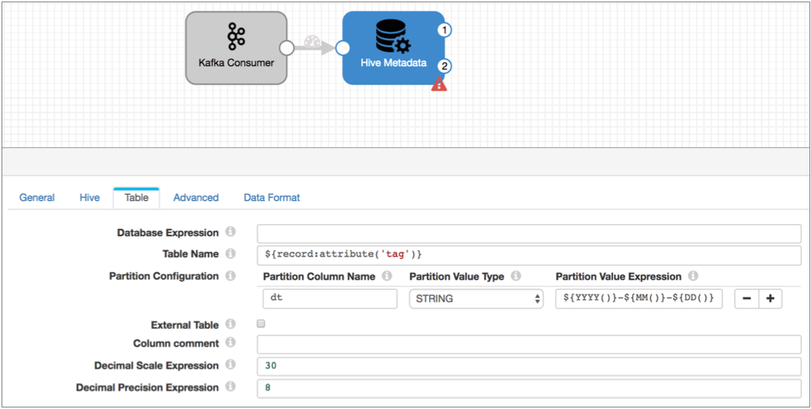

使用此配置，Hadoop FS目标将根据处理时间将每个记录写入tag属性中列出的Hive表和每日分区。

### Hive Metastore目标

现在要处理元数据记录-并在Hive中自动创建和更新表-您需要Hive Metastore目标。

将目标连接到处理器的第二个输出流并配置目标。轻松配置此目标-只需配置Hive连接信息，并可以选择配置一些高级选项。

目标以与处理器相同的方式连接到Hive，因此您可以重用该连接信息：

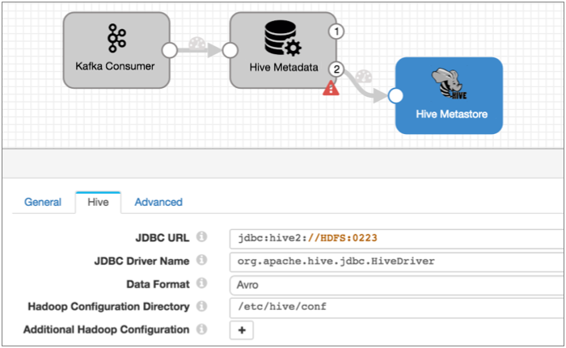

当针对Hive的Drift Synchronization Solution处理Avro数据时，默认情况下，目标[在表创建查询中](https://streamsets.com/documentation/controlhub/latest/help/datacollector/UserGuide/Destinations/HiveMetastore.html#concept_wyr_5jv_hw)包括[Stored As Avro子句](https://streamsets.com/documentation/controlhub/latest/help/datacollector/UserGuide/Destinations/HiveMetastore.html#concept_wyr_5jv_hw)。您可以在“高级”选项卡上进行更改并配置其他高级属性。通常，您可以将默认值用于高级属性，所以让我们开始吧。

现在，Hive Metastore目标的美妙之处在于：当目标获取一个元数据记录时，该记录说您需要一个新表用于新的Web服务，它将创建具有所有必要列的表，以便您可以编写记录（该元数据记录）到表中。

并且，如果要转到表的记录的结构发生了变化（例如添加了几个新字段），那么目标将更新表，以便可以将记录写入表中。

这涵盖了元数据，但是数据呢？

### 数据处理目的地

要使用记录头属性将数据写入Hive，可以使用Hadoop FS或MapR FS目标。我们将使用Hadoop FS目标。

要将数据写入HDFS，请将Hadoop FS目标连接到Hive Metadata处理器的数据输出流。

配置目标时，可以配置目标以使用记录头中的目录，而不是配置目录模板。当目标在记录头中看到“滚动”属性时，配置目标以滚动文件；在配置Avro属性时，指示该模式在记录头中。

目标的“输出文件”选项卡可能看起来像这样：

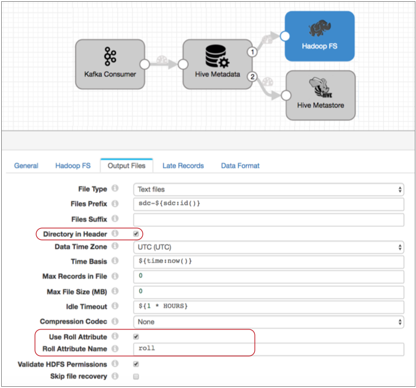

数据格式选项卡如下所示：

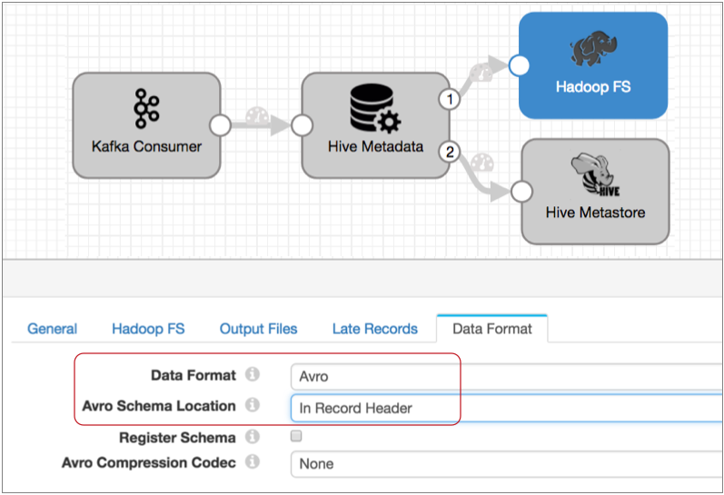

通过此配置，目标将使用记录头属性中的信息将数据写入HDFS。它将使用avroSchema标头属性中的Avro模式将每个记录写入targetDirectory标头属性中的目录。当在记录头中发现roll属性时，它将滚动文件。

请注意，目标位置还可以使用“文件中的最大记录数”，“最大文件大小”和“空闲超时”来确定何时滚动文件。

另外，如果要压缩Avro文件，请使用“数据格式”选项卡上的“ Avro压缩编解码器”属性，而不是“输出文件”选项卡上的常规压缩选项。

### 处理Avro数据

现在，当您启动管道时会发生什么？

设置此管道是根据“ tag”属性中的表名将数据写入不同的表，该属性已添加到早期管道中的记录头。

假设表名是“ weblog”和“ service”。对于每个以“ weblog”作为标签属性的记录，Hive Metadata处理器按以下方式评估记录中的字段：

- 如果这些字段与现有的Hive表匹配，则仅将必要的信息写入targetDirectory和avroSchema阶段属性中，然后Hadoop FS将记录写入Weblog表中。
- 如果记录包含新字段，则处理器将生成元数据记录，Hive Metastore目标将其用于更新Weblog表以包括新列。它还将信息写入舞台属性，以便Hadoop FS可以将记录写入更新的Weblog表。
- 如果记录中缺少字段，则处理器仅将信息写入舞台属性，而Hadoop FS将记录写入HDFS，并使用缺少字段的空值。
- 如果字段已重命名，则处理器会将其视为新字段，从而生成元数据记录，Hive Metastore目标将使用该记录来更新Weblog表。当Hadoop FS写入记录时，数据将被写入新字段，而空值将被写入旧字段。
- 如果现有字段的数据类型发生更改，则处理器会将记录视为错误记录。

对于带有“服务”标签的每个记录，处理器执行相同的操作。

**注意：**如果记录包含新标记值，则Hive Metadata处理器会生成元数据记录，Hive Metastore目标将使用该元数据记录来创建新表。Hadoop FS将记录写入新表。因此，如果启动新的Web服务，则无需触摸此管道即可让它处理新的数据集。

## 实木复合地板案例研究

假设您有要写入Hive中Parquet表的数据库数据。您想根据来源国家将数据写入不同的Parquet表。您不希望进行很多架构更改，但是希望它在发生时自动进行处理。

为此，您将从JDBC查询使用者开始将数据读入管道。您将源连接到Hive Metadata处理器，并配置用于定义相应数据库，表和分区的表达式，应在其中将每条记录写入Parquet表中。Hive元数据处理器使用此信息来评估记录并生成记录头属性，数据处理目标将其用于写入数据。它还使用该信息来生成元数据记录，Hive Metastore目标将根据该记录来创建和更新表。

您将Hive Metadata处理器数据输出流连接到Hadoop FS目标，并将其配置为使用记录头中的信息。然后，目标使用记录头中的目标目录和架构信息写入每个记录，并在架构更改时滚动文件。然后，您将目标配置为生成事件，以便每次关闭文件时都生成事件。

您将Hive Metadata处理器元数据输出流连接到Hive Metastore目标。目的地从Hive元数据处理器接收到元数据记录后，将根据需要创建或更新Parquet表。

最后，将MapReduce执行程序连接到Hadoop FS目标的事件流，并将执行程序配置为使用阶段中可用的Convert Avro to Parquet作业。因此，每次执行程序从Hadoop FS目标接收到事件时，执行程序都会处理关闭的Avro文件并将其转换为Parquet，并将其写入更新的Parquet表中。

现在让我们仔细看看...

### JDBC查询使用者

配置原点时，可以像配置任何普通管道一样配置它。指定要使用的连接字符串，要使用的查询和偏移列以及查询间隔。如果需要所有现有数据，请省略初始偏移量。使用默认的增量模式可以避免在源运行下一个查询时重新查询整个表。

使用原点处理十进制数据时，请确保原点[创建JDBC记录头属性](https://streamsets.com/documentation/controlhub/latest/help/datacollector/UserGuide/Origins/JDBCConsumer.html#concept_egw_d4c_kw)。创建记录标题属性时，原点包括记录标题属性中每个小数字段的精度和小数位数。这使Hive元数据处理器可以轻松确定十进制数据的原始精度和小数位数。

您也可以在Hive元数据处理器中输入常量，以用于记录中所有十进制字段的精度和小数位数，但可以使用JDBC记录头属性来使用特定于字段的值。默认情况下，起点将创建标头属性。

这是源中的JDBC记录标头属性属性：

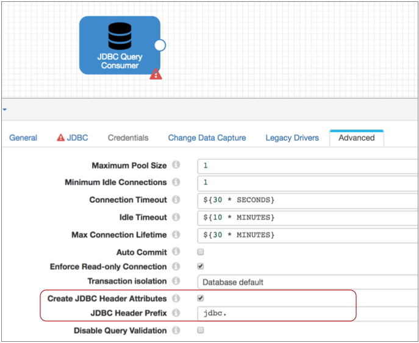

### Hive元数据处理器

将JDBC查询使用者源连接到Hive元数据处理器。在配置处理器时，除了基本的连接详细信息之外，还需要考虑一些其他事项：

1. 记录应写入哪个数据库？

   Hadoop FS会进行写操作，但是处理器需要知道记录应该去哪里。让我们写到Hive默认数据库。为此，您可以将数据库属性保留为空。

2. 记录应写入哪些表？

   您可以通过对表名属性进行硬编码来将所有数据写入单个表。但是，由于您希望根据原始国家/地区将数据写入不同的表，因此，我们使用表达式从“国家/地区”字段中提取表名称，如下所示：

   ```
   ${record:value('/Country')}
   ```

3. 您要使用哪个分区？

   让我们使用表达式中的datetime变量为每日分区创建一个dt分区列，如下所示：

   ```
   ${YYYY()}-${MM()}-${DD()}
   ```

4. 您想如何配置小数字段的精度和小数位表达式？

   由于您具有JDBC Query Consumer生成记录头属性，因此可以在处理器中使用默认表达式：

   ```
   ${record:attribute(str:concat(str:concat('jdbc.', field:field()), '.scale'))}
   ${record:attribute(str:concat(str:concat('jdbc.', field:field()), '.precision'))}
   ```

   通过这些表达式，处理器使用JDBC查询使用者为记录中的每个十进制字段编写的记录头属性的精度和小数位数。

5. 正在处理哪种类型的数据？

   在“数据格式”选项卡上，选择Parquet数据格式。

此时，管道如下所示：

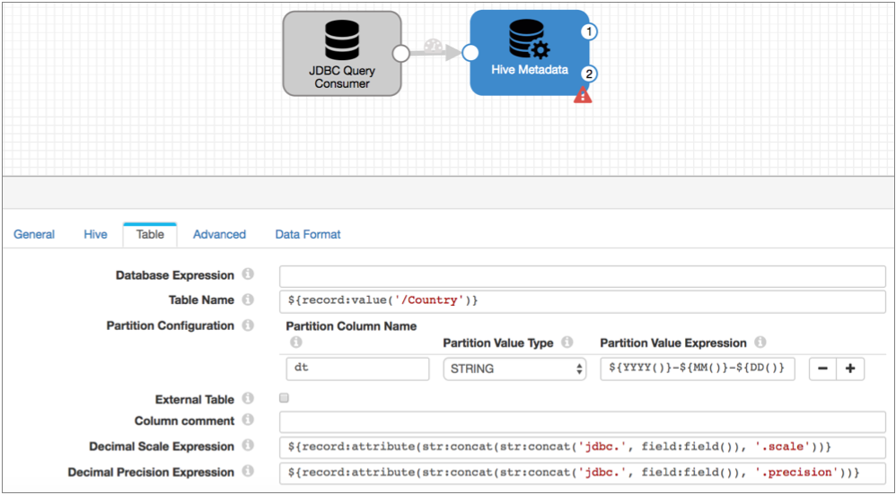

在处理记录时，Hive元数据处理器使用配置详细信息来评估记录。它使用表的记录中列出的国家/地区以及该分区的记录处理时间，为每个记录生成targetDirectory标头属性。

当记录包含架构更改时，处理器会将新架构写入avroSchema标头属性，并将滚动标头属性添加到记录。它还会为Hive Metastore目标生成一个元数据记录。这些操作的组合使Hive Metastore目标可以根据需要更新Parquet表，并且使Hadoop FS目标可以将具有模式漂移的文件写入更新后的表。

请记住，对于Parquet数据，处理器会将.avro添加到为每个记录生成的目标目录中。这样，数据处理目标就可以将Avro文件写入到Hive忽略的临时目录中。

结果，目标将文件写入以下目录：`/.avro`。

### Hive Metastore目标

现在要处理元数据记录-并在Hive中自动创建和更新Parquet表-您需要Hive Metastore目标。

将目标连接到处理器的第二个输出流并配置目标。轻松配置此目标-只需配置Hive连接信息，并可以选择配置一些高级选项。

目标以与处理器相同的方式连接到Hive，因此您可以重用该连接信息。“高级”选项卡包括一些仅适用于Avro数据的属性，以及“最大缓存大小”属性以限制Hive Metastore使用的缓存大小。默认情况下，缓存大小是无限的，所以让它保持这种状态。

现在，Hive Metastore目的地的魅力在于：当目的地获得元数据记录，表明您需要为新国家/地区创建新表时，它将创建一个包含所有必要列的新Parquet表，以便您可以编写记录（触发该元数据记录）到表中。

并且，如果要转到表的记录的结构发生了变化（例如添加了几个新字段），那么目标将更新表，以便可以将记录写入表中。 目标在生成表时使用Stored as Parquet子句，因此不需要为每次更改都生成新的架构。

这是管道在这一点上的外观：

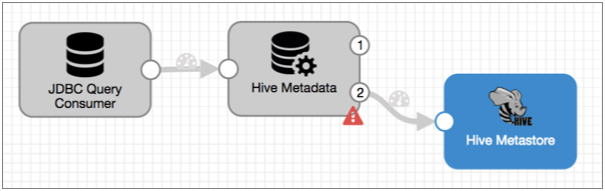

这涵盖了元数据，但是数据呢？

### 数据处理目的地

要使用记录头属性将数据写入Hive，可以使用Hadoop FS或MapR FS目标。我们将使用Hadoop FS目标。

要将Avro文件写入HDFS，请将Hadoop FS目标连接到Hive Metadata处理器的数据输出流。

首先，在“常规”选项卡上，启用目标以生成事件，如下所示：

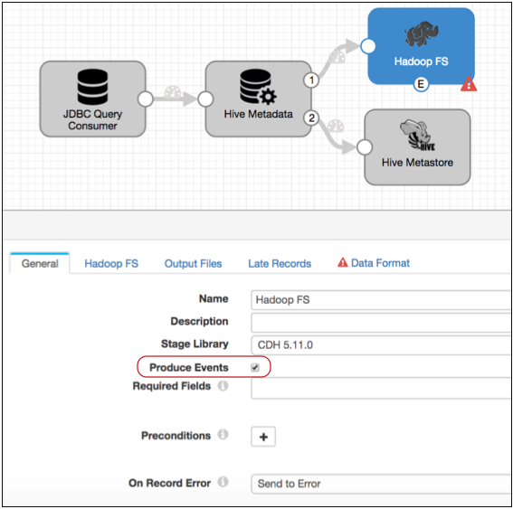

现在，目的地每次关闭输出文件时都会生成一个事件。如Hadoop FS文档的“ [事件记录”部分](https://streamsets.com/documentation/controlhub/latest/help/datacollector/UserGuide/Destinations/HadoopFS-destination.html#concept_dmx_1ln_qx)所述，事件记录包括关闭文件的文件路径和文件名。MapReduce执行程序将使用此信息将Avro文件转换为Parquet。

配置目标时，可以配置目标以使用记录头中的目录，而不是配置目录模板。当目标在记录头中看到“滚动”属性时，配置目标以滚动文件；在配置Avro属性时，指示该模式在记录头中。

目标的“输出文件”选项卡可能看起来像这样：

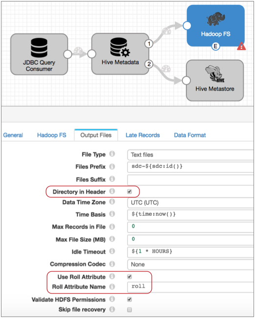

通过此配置，目标将使用记录头属性中的信息将数据写入HDFS。它将使用avroSchema标头属性中的Avro模式将每个记录写入targetDirectory标头属性中的目录。当它在记录标题中发现roll属性时，或者达到目标中配置的其他文件关闭限制时，它将关闭文件。并且每次关闭文件时都会生成一个事件。

**提示：**在将Avro文件转换为Parquet之前，数据无法用于Hive。如果要快速转换数据，请配置一个或多个文件关闭属性以确保文件定期滚动：“文件中的最大记录数”，“文件大小上限”或“空闲超时”。

### MapReduce执行器

要转换由Hadoop FS目标生成的Avro文件，请使用MapReduce执行程序中的Convert Avro to Parquet作业。与所有执行程序一样，MapReduce执行程序在被事件触发时执行任务。在这种情况下，它将是由Hadoop FS目标生成的文件关闭事件。

将Hadoop FS事件输出流连接到MapReduce执行程序。除了所需的配置详细信息之外，选择“将Avro转换为Parquet”作业类型，然后配置以下Avro转换详细信息：

- 输入Avro文件-使用此属性的默认表达式。默认情况下，执行程序使用事件记录的filepath字段中指定的目录和文件名。文件将位于.avro目录中，但此信息将在事件记录中正确记录。

- 保留Avro输入文件-如果要保留原始Avro文件，请选择此选项。默认情况下，执行程序将原始文件成功转换为Parquet后将其删除。

- 输出目录-要将Parquet文件写到期望数据的原始目录中，而不是.avro目录中，请使用以下表达式：

  ```
  ${file:parentPath(file:parentPath(record:value('/filepath')))}
  ```

  该 `file:parentPath`函数返回不带最终分隔符的文件路径。因此，此表达式从文件路径中删除/.avro/ <文件名>。

  例如，如果原始文件路径为：/sales/countries/nz/.avro/sdc-file，则`file:parentPath` 返回以下输出路径：/ sales / countries / nz。

需要时，您可以在Avro到Parquet选项卡上配置其他Parquet属性，例如要使用的压缩编码解码器或页面大小。

这是管道和MapReduce执行程序配置：

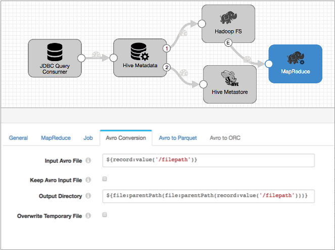

有关数据流触发器和事件框架的更多信息，请参见[数据流触发器概述](https://streamsets.com/documentation/controlhub/latest/help/datacollector/UserGuide/Event_Handling/EventFramework-Title.html#concept_cph_5h4_lx)。

### 处理木地板数据

管道运行时，将发生以下操作：

- Hive元数据处理器使用记录中的国家/地区为targetDirectory标头属性创建输出目录，来评估每个记录。
- 当记录包含架构更改时，处理器会将新架构写入avroSchema标头属性，并将滚动标头属性添加到记录。它还会为Hive Metastore目标生成一个元数据记录。这些操作的组合使Hive Metastore目标可以根据需要更新Parquet表，并且使Hadoop FS目标可以将具有模式漂移的文件写入更新后的表。
- 当Hive Metastore目标接收到元数据记录时，它将相应地更新Hive Metastore，从而创建或更新Parquet表。
- Hadoop FS目标根据targetDirectory标头中的目录将记录写入文件，并根据Roll标头属性和在此阶段配置的任何其他文件关闭属性关闭文件。
- Hadoop FS目标关闭文件时，它将事件记录发送到MapReduce执行程序，触发执行程序启动“将Avro转换为Parquet”作业。MapReduce执行程序不监视作业。
- 作业完成后，Parquet数据可用于Hive。

## Hive数据类型

下表列出了Data Collector 数据类型和相应的Hive数据类型。Hive元数据处理器在生成元数据记录时使用这些转换。Hive元数据目标在生成Hive CREATE TABLE和ALTER TABLE语句时使用这些转换。

| 数据收集器数据类型 | 蜂房数据类型 |
| :----------------- | :----------- |
| 布尔型             | 布尔型       |
| 字节               | 不支持       |
| 烧焦               | 串           |
| 日期               | 日期         |
| 约会时间           | 串           |
| 小数               | 小数         |
| 双                 | 双           |
| 浮动               | 浮动         |
| 整数               | 整数         |
| 长                 | 比金特       |
| 清单               | 不支持       |
| 列表图             | 不支持       |
| 地图               | 不支持       |
| 短                 | 整数         |
| 串                 | 串           |
| 时间               | 串           |