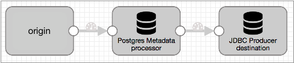
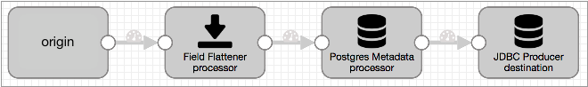
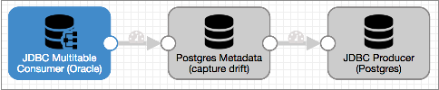
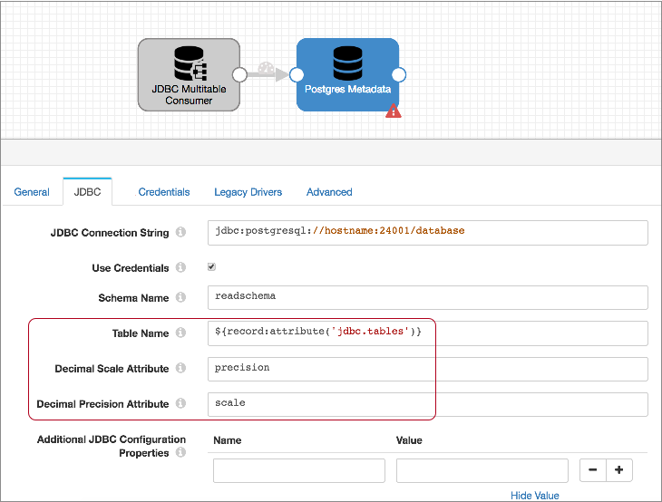
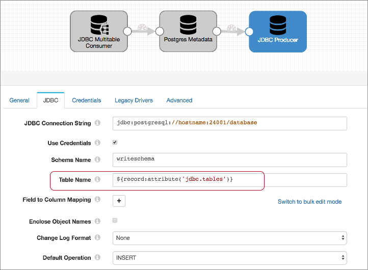

# PostgreSQL漂移同步解决方案

## PostgreSQL漂移同步解决方案

PostgreSQL的漂移同步解决方案可以检测传入数据中的漂移，并在写入数据之前根据需要自动创建或更改相应的PostgreSQL表。

例如，假设您想将全国清单数据写入PostgreSQL表。当您收购新的商店或单个商店升级其系统时，数据的结构会发生变化。要求每个存储使用相同的数据结构是可能的，但是不切实际。您更喜欢一种适应这种不断变化的环境的解决方案。

利用PostgreSQL的Drift Synchronization Solution，PostgreSQL元数据处理器可以确定何时需要新表或新字段，并向数据库提交create和alter table命令以进行这些更改。

JDBC Producer目标执行写操作。等到数据到达JDBC Producer时，就可以使用新创建或更改的数据库表了。

由PostgreSQL元数据处理器创建或更改的表中的所有列均 允许为空。在写入缺少字段的记录时，数据库将在相应的列中插入空值。

通过基于记录要求创建和更改表，用于PostgreSQL的Drift Synchronization Solution使无需更改即可将具有更改数据结构的数据写入PostgreSQL。

在部署用于PostgreSQL的Drift Synchronization Solution之前，请考虑数据库的创建和更改表速度，以及传入数据的创建和更改表要求。如果数据库无法快速执行所需的更改，则PostgreSQL漂移同步解决方案可能不是合适的解决方案。

**重要说明：**请使用此版本的Drift Synchronization Solution for PostgreSQL仅用于开发或测试。不要在生产环境中使用该解决方案。

计划在将来的版本中支持其他数据库。要声明首选项，请对此[问题](https://issues.streamsets.com/browse/SDC-8051)发表评论。

## 基本实施和处理

PostgreSQL漂移同步解决方案的基本实现包括您选择的来源，PostgreSQL元数据处理器和JDBC Producer目标：

所述漂移同步解的PostgreSQL使用PostgreSQL的元数据处理器和JDBC生产者目的地如下：

- PostgreSQL元数据处理器，用于漂移检测和表更改

  处理记录时，[PostgreSQL元数据处理器](https://streamsets.com/documentation/controlhub/latest/help/datacollector/UserGuide/Processors/PostgreSQLMetadata.html#concept_lcp_ssh_qcb)会检测到对新表和新列的需求。在检测到更改需求后，它将执行数据定义语言（DDL）以根据需要创建新的数据库表或更改现有表。这允许数据库在记录到达JDBC Producer目标之前创建或更改表。

  处理器创建表并将列添加到表中。它不会从表中删除现有列。

  **注意：** 在部署Drift Synchronization Solution for PostgreSQL之前，请考虑数据库的创建和更改表速度，以及传入数据的创建和更改表要求。如果数据库无法快速执行所需的更改，则PostgreSQL漂移同步解决方案可能不是合适的解决方案。

- 写入新表和变更表的JDBC Producer目标

  该[JDBC生产者目的地](https://streamsets.com/documentation/controlhub/latest/help/datacollector/UserGuide/Destinations/JDBCProducer.html#concept_kvs_3hh_ht)写数据到基于在阶段配置属性数据库。

  由PostgreSQL元数据处理器创建或更改的表中的所有列均 允许为空。在写入缺少字段的记录时，数据库将在相应的列中插入空值。

### 整理记录

目前，用于PostgreSQL的Drift Synchronization Solution不处理带有嵌套字段的记录。如有必要，您可以使用[Field Flattener处理器](https://streamsets.com/documentation/controlhub/latest/help/datacollector/UserGuide/Processors/FieldFlattener.html#concept_njn_3kk_fx)对带有嵌套字段的记录进行扁平化，然后再将它们传递给 PostgreSQL Metadata Processor。

带有字段展平器的PostgreSQL漂移同步解决方案的基本实现如下所示：

## 要求

要使用PostgreSQL漂移同步解决方案，您需要以下内容：

- 目标表信息

  要将记录写入数据库中的适当表，PostgreSQL元数据处理器和JDBC Producer目标必须能够确定用于每个记录的表。

  如果将所有记录写入一个表，则可以在阶段属性中指定表名。但是，通常需要将记录写入不同的表。在这种情况下，表名必须在记录内可用，例如在记录字段或记录头属性中。

  例如，如果可以将字段中的数据用作表名，则可以对表名属性使用表达式，例如 `${record:value('/')}`。

  该[JDBC查询消费](https://streamsets.com/documentation/controlhub/latest/help/datacollector/UserGuide/Origins/JDBCConsumer.html#concept_egw_d4c_kw)和[JDBC多表消费者](https://streamsets.com/documentation/controlhub/latest/help/datacollector/UserGuide/Origins/MultiTableJDBCConsumer.html#concept_xrx_11y_4y)的起源既可以发生在记录头属性原始表名。您可以使用以下表达式将属性值用于表名： `${record:attribute('')}`。

  如果记录中不存在表名，则可以使用[表达式评估器处理器](https://streamsets.com/documentation/controlhub/latest/help/datacollector/UserGuide/Processors/Expression.html#concept_zm2_pp3_wq)来生成该信息。也就是说，如果您可以通过执行计算确定要使用的表，则可以将结果表名称写入字段，然后使用该字段进行写入。

- 小数精度和小数位数信息

  为了使PostgreSQL元数据处理器能够以正确的精度和小数位数创建Decimal字段，处理器必须能够确定要使用的精度和小数位数。默认情况下，处理器会在每个“十进制”字段的“精度”和“比例”字段属性中查找信息。

  无论是[JDBC查询消费](https://streamsets.com/documentation/controlhub/latest/help/datacollector/UserGuide/Origins/JDBCConsumer.html#concept_egw_d4c_kw)和[JDBC多表消费者](https://streamsets.com/documentation/controlhub/latest/help/datacollector/UserGuide/Origins/MultiTableJDBCConsumer.html#concept_xrx_11y_4y) 的起源存储小数列的精度和规模“精确”和每个小数场“规模”字段属性。因此，在处理来自这些来源的数据时，可以使用PostgreSQL Metadata处理器的默认值。

  处理来自其他来源的数据时，可以在管道中更早地使用Expression Evaluator处理器为Decimal字段创建precision和scale字段属性。

- 数据库权限

  PostgreSQL元数据处理器中 用于连接凭据的用户帐户必须对数据库具有“创建表”和“更改表”权限。

  JDBC生产者目标中用于连接凭据的用户帐户需要“写”权限。

- 目标表的主要用途

  管道运行时，请勿更改管道可能使用的任何表。由于PostgreSQL元数据处理器缓存有关表结构的信息并创建和更改表，因此处理器必须具有有关表的准确信息。

## 实施步骤

要实现PostgreSQL漂移同步解决方案，请执行以下步骤：

1. 配置源和要使用的所有其他处理器。

   如果数据包括带有嵌套字段的记录，则在将记录传递给PostgreSQL元数据处理器之前，添加一个字段展平器来展平记录。

   如果每个记录均不包含应在其中写入记录的表或十进制字段所需的精度和小数位数信息，请使用表达式计算器生成该信息。您可以根据需要将信息写入字段，记录标题属性或字段属性。有关更多信息，请参见[需求](https://streamsets.com/documentation/controlhub/latest/help/datacollector/UserGuide/JDBC_DriftSolution/JDBC_DriftSyncSolution_title.html#concept_z2v_fp1_scb)。

2. 要捕获漂移并更改数据库表，请配置

   PostgreSQL元数据处理器

   ：

   1. 如果尚未安装 ，请为数据库安装JDBC驱动程序。您必须安装所需的驱动程序才能访问数据库。有关安装其他驱动程序的信息，请参阅 Data Collector 文档 中的“ [安装外部库](https://streamsets.com/documentation/datacollector/latest/help/#datacollector/UserGuide/Configuration/ExternalLibs.html%23concept_pdv_qlw_ft) ”。

   2. 配置连接信息。

      用于连接凭据的用户帐户必须对数据库具有“创建表”和“更改表”权限。

      **提示：**您可以为JDBC URL 设置[运行时参数](https://streamsets.com/documentation/controlhub/latest/help/datacollector/UserGuide/Pipeline_Configuration/RuntimeValues.html#concept_rjh_ntz_qr)，以使配置PostgreSQL元数据处理器和JDBC生产者更加容易。为了保护诸如用户名和密码之类的敏感信息，您可以使用 [运行时资源](https://streamsets.com/documentation/controlhub/latest/help/datacollector/UserGuide/Pipeline_Configuration/RuntimeValues.html#concept_bs4_5nm_2s)或凭据存储。有关凭证存储的更多信息，请参阅Data Collector文档中的[凭证存储](https://streamsets.com/documentation/datacollector/latest/help/#datacollector/UserGuide/Configuration/CredentialStores.html)。

   3. 配置架构名称和表名称。

      您可以输入架构和表名称，也可以使用计算结果为要使用的架构和表名称的表达式。

      在处理来自任何JDBC来源的数据时，可以将记录头属性用作表名。该JDBC多表消费者起源于写原始表名称`jdbc.tables`记录头属性。 如果要将记录写入同名的表，则可以将其`${record:attribute('jdbc.tables')}` 用于表名属性。

      同样，当将JDBC查询使用者`.tables`配置为创建记录头属性时 ，JDBC查询使用者会将其源表名称写入记录头属性中。因此，如果要将记录写到同名的表中，可以将其`${record:attribute('.tables')}`用于表名属性。

      对于来自其他来源的数据，必要时，可以在管道中更早使用表达式计算器，将信息写入记录字段或记录头属性。

   4. 配置十进制字段精度和小数位属性名称。

      处理来自JDBC查询使用者或JDBC多表使用者来源的数据时，请使用默认属性名称“ precision”和“ scale”。这两个原点在每个小数字段的“ precision”和“ scale”字段属性中存储小数列的精度和小数位数。

      处理来自其他来源的数据时，可以在管道中更早地使用Expression Evaluator处理器为Decimal字段创建precision和scale字段属性。

   5. 根据需要配置其余处理器属性。

   有关PostgreSQL元数据处理器的更多信息，请参见[PostgreSQL元数据](https://streamsets.com/documentation/controlhub/latest/help/datacollector/UserGuide/Processors/PostgreSQLMetadata.html#concept_lcp_ssh_qcb)。

3. 配置JDBC Producer目标以写入PostgreSQL表：

   1. 配置连接信息。用于连接凭据的用户帐户必须对数据库具有写权限。

      **提示：**您可以为JDBC URL 设置[运行时参数](https://streamsets.com/documentation/controlhub/latest/help/datacollector/UserGuide/Pipeline_Configuration/RuntimeValues.html#concept_rjh_ntz_qr)，以使配置PostgreSQL元数据处理器和JDBC生产者更加容易。为了保护诸如用户名和密码之类的敏感信息，您可以使用 [运行时资源](https://streamsets.com/documentation/controlhub/latest/help/datacollector/UserGuide/Pipeline_Configuration/RuntimeValues.html#concept_bs4_5nm_2s)或凭据存储。有关凭证存储的更多信息，请参阅Data Collector文档中的[凭证存储](https://streamsets.com/documentation/datacollector/latest/help/#datacollector/UserGuide/Configuration/CredentialStores.html)。

   2. 配置表名称属性。使用与PostgreSQL元数据处理器中表名相同的表达式。

   3. 使用默认的INSERT操作。

   4. 根据需要配置其余目标。

   有关JDBC Producer目标的更多信息，请参见[JDBC Producer](https://streamsets.com/documentation/controlhub/latest/help/datacollector/UserGuide/Destinations/JDBCProducer.html#concept_kvs_3hh_ht)。

## 案例分析

假设您要将一组Oracle表复制到PostgreSQL，并且需要对Oracle表进行任何更改以在PostgreSQL表中进行镜像。

为此，请从JDBC多表使用者起源开始，并将其连接到PostgreSQL元数据处理器。然后，使用JDBC Producer目标写入PostgreSQL。产生的管道如下所示：

让我们仔细看看...

### JDBC多表使用者来源

该[JDBC多表消费者的起源](https://streamsets.com/documentation/controlhub/latest/help/datacollector/UserGuide/Origins/MultiTableJDBCConsumer.html#concept_zp3_wnw_4y)可以使用多个线程来处理数据从数据库表，每个表最多一个线程，所以它是处理数据的理想产地从一个大组数据库表中。

该JDBC多表消费者起源于写原始表名称`jdbc.tables`记录头属性。原点还将在记录中每个小数字段的字段属性中存储小数列的原始精度和小数位数。

在PostgreSQL的元数据处理器使用该信息写入记录到数据库表和创建具有正确的精度和小数十进制领域。

要将PostgreSQL漂移同步解决方案与JDBC Multitable Consumer起源一起使用，您不需要配置任何特殊的起源，只需将起源配置为从要处理的Oracle表中读取并将其连接到PostgreSQL元数据处理器。

### PostgreSQL元数据处理器

的[PostgreSQL的元数据处理器](https://streamsets.com/documentation/controlhub/latest/help/datacollector/UserGuide/Processors/PostgreSQLMetadata.html#concept_lcp_ssh_qcb)执行用于繁重漂移同步解决方案对PostgreSQL。

处理数据时，PostgreSQL元数据处理器使用表名表达式来确定用于每个记录的目标表的名称。如果目标表不在处理器的缓存中，则处理器会在数据库中查询表信息并缓存结果。当目标表在高速缓存中时，处理器将记录结构与高速缓存的表结构进行比较。

当记录中包含表中不存在的字段时，PostgreSQL元数据处理器将根据需要更改表，然后更新缓存中的表信息。当将一条记录写入不存在的表中时，处理器将根据记录中的字段创建该表。

在配置PostgreSQL Metadata处理器时，可以为PostgreSQL数据库和其他标准属性配置连接信息。用于连接凭据的用户帐户必须对数据库具有“创建表”和“更改表”权限。

然后，由于JDBC多表消费者写表名到jdbc.tables记录标题属性，可以使用下面的表达式为表名称属性来调用信息：`${record:attribute('jdbc.tables')}`。

JDBC Multitable Consumer还将每个Decimal字段的精度和小数位数写入每个Decimal字段的“ precision”和“ scale”属性。因此，可以将默认值用于“小数位数”属性和“小数精度”属性。

生成的PostgreSQL元数据处理器如下所示：

### JDBC生产者目的地

要将数据写入PostgreSQL，请使用[JDBC Producer目标](https://streamsets.com/documentation/controlhub/latest/help/datacollector/UserGuide/Destinations/JDBCProducer.html#concept_kvs_3hh_ht)。

配置目标时，将配置连接信息，要写入的表以及默认操作。因为您正在复制表，所以所有字段名都将与列名匹配，因此您无需指定任何字段到列的映射。根据需要配置其他属性。

对于连接属性，请使用与PostgreSQL元数据处理器相同的连接字符串和架构名称。与凭据关联的用户帐户必须对数据库具有“写”权限。

对于“表名”属性，请使用与PostgreSQL元数据处理器中相同的表达式：`${record:attribute('jdbc.tables')}`。这使目标可以将每个记录写入到jdbc.tables记录头属性中定义的表中。必要时，PostgreSQL元数据处理器创建或更改表以允许记录写入而不会出错。

然后，将默认操作设置为INSERT。

配置的目标应类似于以下内容：

### 运行管道

管道运行时，将发生以下操作：

- 的PostgreSQL的元数据处理器评估每个记录，检查每个记录需要表中的jdbc.tables标题属性，以及对缓存的表结构进行比较记录结构。如果未缓存表，则PostgreSQL元数据处理器会 ping数据库以获取表信息，然后执行比较。

- 当记录包含新字段或更改字段时，PostgreSQL元数据处理器将alter table命令发送到数据库，然后更新其缓存中的表信息。当记录需要不存在的表时，PostgreSQL元数据处理器将根据记录结构创建表。

- 创建十进制列时，PostgreSQL元数据处理器使用相应十进制字段的precision和scale字段属性中的信息。

- JDBC Producer根据jdbc.tables标头属性中的表名将记录写入表中。

  由PostgreSQL元数据处理器创建或更改的表中的所有列均 允许为空。在写入缺少字段的记录时，数据库将在相应的列中插入空值。

  由于PostgreSQL元数据处理器根据需要创建和更改了表，因此不会因数据的结构更改而发生写入错误。

- 管道停止时，将清除PostgreSQL元数据处理器缓存。