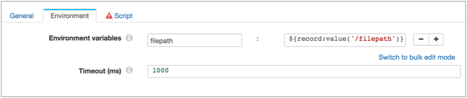

# shell执行器

Shell执行程序在每次收到事件时都会执行Shell脚本。将Shell执行程序用作事件流的一部分。

配置执行程序时，可以定义要执行的Shell脚本和环境变量，以传播该脚本的配置。您还指定运行Shell脚本的最长时间。经过指定的时间后，执行程序将停止脚本。

**注意：**在管道中使用Shell执行器时，应将Data Collector配置为使用Shell执行器模拟模式。

有关数据流触发器和事件框架的更多信息，请参见[数据流触发器概述](https://streamsets.com/documentation/controlhub/latest/help/datacollector/UserGuide/Event_Handling/EventFramework-Title.html#concept_cph_5h4_lx)。

## 数据收集器 外壳模拟模式

启用数据收集器 外壳模拟模式以启用外壳脚本的安全使用。您可以通过在Data Collector 配置文件中配置shell模拟模式属性来启用模拟模式。不需要启用模拟模式，但强烈建议您启用。您还可以根据需要配置相关的shell和sudo属性。

每次阶段接收到事件时，Shell执行程序都会运行用户定义的Shell脚本。默认情况下，Data Collector 以启动Data Collector的操作系统用户身份执行脚本。因此，使用默认配置意味着Shell脚本可以停止Data Collector以及用户有权执行的任何其他任务。

启用外壳程序模拟模式时，脚本由启动管道的用户执行。要使用此选项， 启动管道的Data Collector用户必须具有相应的操作系统用户帐户，并且必须将sudo配置为允许无密码使用。为了提高安全性，您还可以限制操作系统用户帐户的权限以限制其访问。

要将Data Collector配置为使用外壳模拟模式，请执行以下步骤：

1. 对于每个启动Shell executor管道的用户，在操作系统中创建一个匹配的用户帐户，并根据需要配置权限。

   例如，如果Data Collector用户Ops1和Ops2启动所有管道，请在操作系统中创建Ops1和Ops2用户帐户，并为其授予有限的权限。

2. 确保每个操作系统用户都具有Data Collector的无密码sudo 。

3. 在

   数据收集器

   配置文件中取消注释以下属性：

   ```
   stage.conf_com.streamsets.pipeline.stage.executor.shell.impersonation_mode=CURRENT_USER
   ```

4. 重新启动Data Collector。

有关更多信息，请参阅[数据收集](https://streamsets.com/documentation/datacollector/latest/help/#datacollector/UserGuide/Configuration/DCConfig.html)器 文档 中的[配置数据收集](https://streamsets.com/documentation/datacollector/latest/help/#datacollector/UserGuide/Configuration/DCConfig.html)器。

### 使用部分控制中心用户ID

在Control Hub中注册Data Collector时，可以将Data Collector配置为将Control Hub用户ID 的缩写形式用于外壳模拟模式。

默认情况下，在使用外壳模拟模式时， 向Control Hub注册的Data Collector 使用完整的Control Hub 用户ID作为启动管道的用户，如下所示：

```
<ID>@<organization ID>
```

您可以将Data Collector 配置为仅使用ID，而忽略“ `@`”。例如，使用`myname`代替 `myname@org`作为用户名。

当目标操作系统使用Kerberos，LDAP或其他用户身份验证方法且其用户名格式与Control Hub 格式冲突时，可能需要使用部分Control Hub用户ID 。

要 为注册的Data Collector启用部分Control Hub用户ID ，请取消注释Control Hub 配置文件中的dpm.alias.name.enabled属性。有关更多信息，请参阅[Control Hub配置文件](https://streamsets.com/documentation/controlhub/latest/help/datacollector/UserGuide/DPM/DPMConfiguration.html#concept_hrn_zz3_fx)。

## 脚本配置

在为Shell执行程序配置Shell脚本时，请注意以下详细信息：

1. 配置shell脚本时，请确保该脚本返回零（0）以指示成功执行。例如，在bash脚本中，可以使用“退出0”返回所需的零值。

   在命令行上进行测试时，不返回零的脚本可能会成功运行，但在管道中由Shell执行程序使用时将生成错误。

2. 您不能直接在shell脚本中使用表达式。要在脚本中使用

   Data Collector

   表达式：

   - 在阶段中使用“环境变量”属性来为脚本声明环境变量。为您要使用的每个表达式创建一个环境变量。
   - 根据需要在脚本中使用环境变量。

   例如，假设您要对由Hadoop FS目标关闭的文件执行操作-您无法使用HDFS File Metadata executor执行该操作。并且您想使用事件记录中的filepath字段来指定关闭文件的绝对路径。

   因此，您可以使用以下表达式定义文件路径环境变量： `${record:value('/filepath')}`如下所示，然后在脚本中使用文件路径环境变量：

   

## 配置Shell执行器

配置Shell执行程序以在阶段每次接收到事件记录时执行Shell脚本。

1. 在“属性”面板的“ **常规”**选项卡上，配置以下属性：

   | 一般财产                                                     | 描述                                                         |
   | :----------------------------------------------------------- | :----------------------------------------------------------- |
   | 名称                                                         | 艺名。                                                       |
   | 描述                                                         | 可选说明。                                                   |
   | [必填项](https://streamsets.com/documentation/controlhub/latest/help/datacollector/UserGuide/Pipeline_Design/DroppingUnwantedRecords.html#concept_dnj_bkm_vq) | 必须包含用于将记录传递到阶段的记录的数据的字段。**提示：**您可能包括舞台使用的字段。根据为管道配置的错误处理，处理不包含所有必填字段的记录。 |
   | [前提条件](https://streamsets.com/documentation/controlhub/latest/help/datacollector/UserGuide/Pipeline_Design/DroppingUnwantedRecords.html#concept_msl_yd4_fs) | 必须评估为TRUE的条件才能使记录进入处理阶段。单击 **添加**以创建其他前提条件。根据为阶段配置的错误处理，处理不满足所有前提条件的记录。 |
   | [记录错误](https://streamsets.com/documentation/controlhub/latest/help/datacollector/UserGuide/Pipeline_Design/ErrorHandling.html#concept_atr_j4y_5r) | 该阶段的错误记录处理：放弃-放弃记录。发送到错误-将记录发送到管道以进行错误处理。停止管道-停止管道。对群集管道无效。 |

2. 在“ **环境”**选项卡上，配置以下属性：

   | 环境财产     | 描述                                                         |
   | :----------- | :----------------------------------------------------------- |
   | 环境变量     | 执行shell脚本时要使用的环境变量。使用[简单或批量编辑模式](https://streamsets.com/documentation/controlhub/latest/help/datacollector/UserGuide/Pipeline_Configuration/SimpleBulkEdit.html#concept_alb_b3y_cbb)，单击 **添加**图标以添加环境变量。您可以根据需要使用Data Collector表达式。 |
   | 超时（毫秒） | 允许脚本运行的毫秒数。执行程序在指定的超时后停止执行脚本。   |

3. 在“ **脚本”**选项卡上，输入要运行的脚本。

   您不能在脚本中使用表达式，但是可以使用在“环境”选项卡上定义的环境变量。

   **注意：**确保脚本返回零（0）表示成功执行。有关更多信息，请参见[脚本配置](https://streamsets.com/documentation/controlhub/latest/help/datacollector/UserGuide/Executors/Shell.html#concept_av4_pnm_z1b)。