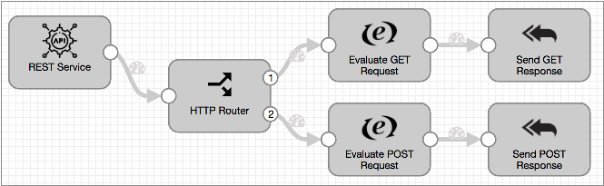

# 微服务管道

## 微服务管道

一个微服务管道是管道创建细粒度的服务来执行特定的任务。

例如，您可以使用微服务管道来验证对用户帐户的更改。您可以通过管道检查匹配的帐户来验证帐户创建请求，帐户更新和帐户删除。管道可以将请求标记为可执行或不可执行，并将所有响应发送回原始系统以进行下一步。

您可以创建使用独立执行模式的基于REST和基于消息的微服务管道。其他微服务类型和平台也计划在将来的版本中发布。

微服务管道使用微服务源来侦听或读取JSON格式的请求。在管道中，您可以根据需要使用任何可用的处理器来转换和路由记录。您还可以根据需要使用目标和执行程序来写入数据并执行其他操作。

然后，使用一个或多个微服务目标将响应发送回源，并在必要时将记录写入目标系统。然后，源将JSON格式的响应发送回源系统。

例如，您可以使用WebSocket服务器源在WebSocket端点上侦听并处理所有授权的请求。在管道中，您将使用阶段来处理数据，并根据记录是成功记录还是错误请求记录将记录路由到不同的目的地。您使用两个“向原始目的地发送响应”来返回不同的响应，“确定”为200，“错误请求”为400。然后，源将带有响应的记录传递回WebSocket端点。或者，您可以使用其他微服务目标将记录写入目标系统，同时将响应从目标系统发送回源。

有关更多信息和描述性视频，请参阅[关于微服务管道的博客文章](https://streamsets.com/blog/create-microservice-pipelines-with-streamsets-data-collector-tutorial/)。有关示例微服务管道的完整描述以及有关创建微服务管道的教程，请参见我们的GitHub教程“ [创建CRUD微服务管道”](https://github.com/streamsets/tutorials/blob/master/tutorial-crud-microservice/readme.md)。

## 微服务管道的阶段

配置微服务管道时，将使用微服务源，任何可用的Data Collector 处理器，目标和执行程序以及一个或多个微服务目标。

### 微服务的起源

微服务来源侦听或读取JSON格式的请求。它们还将响应从微服务目的地发送回原始系统。

您可以在微服务管道中使用以下来源：

- [REST服务源](https://streamsets.com/documentation/controlhub/latest/help/datacollector/UserGuide/Origins/RESTService.html#concept_hfg_2sn_p2b) - 侦听HTTP端点，解析所有授权请求的内容，并将响应发送回源REST API。创建多个线程以在多线程管道中启用并行处理。
- [WebSocket客户端起源](https://streamsets.com/documentation/controlhub/latest/help/datacollector/UserGuide/Origins/WebSocketClient.html#concept_unk_nzk_fbb) - 从WebSocket服务器端点读取数据。可以将响应作为微服务管道的一部分发送回原始系统。
- [WebSocket服务器起源](https://streamsets.com/documentation/controlhub/latest/help/datacollector/UserGuide/Origins/WebSocketServer.html#concept_u2r_gpc_3z) - 侦听WebSocket端点并处理所有授权的WebSocket客户端请求的内容。创建多个线程以在多线程管道中启用并行处理。可以将响应作为微服务管道的一部分发送回原始系统。

### 微服务目的地

大多数微服务目标执行两项任务。除了将数据写入目标系统之外，它们还将响应发送到原始阶段，然后传递到原始系统。在配置微服务目标时，可以指定是将响应是成功写入目标系统的记录还是从目标系统传递的响应。

当您不需要将数据写入目标系统时，可以使用“将响应发送到源”目标，该记录将记录和响应传递到源，而无需写入目标。

如果您想在不发送响应的情况下写入目标系统，则可以在微服务管道中使用非微服务目标。

以下微服务目的地可以将响应发送到微服务源：

- [HTTP客户端目标](https://streamsets.com/documentation/controlhub/latest/help/datacollector/UserGuide/Destinations/HTTPClient.html#concept_khl_sg5_lz) - 将数据写入HTTP端点。可以向微服务管道中的微服务源发送响应。
- [Kafka Producer目标](https://streamsets.com/documentation/controlhub/latest/help/datacollector/UserGuide/Destinations/KProducer.html#concept_oq2_5jl_zq) - 将数据写入Kafka集群。可以向微服务管道中的微服务源发送响应。
- [Kinesis生产者目的地](https://streamsets.com/documentation/controlhub/latest/help/datacollector/UserGuide/Destinations/KinProducer.html#concept_swk_h1j_yr) - 将数据写入Kinesis Streams。可以向微服务管道中的微服务源发送响应。
- [将响应发送到起点目的地](https://streamsets.com/documentation/controlhub/latest/help/datacollector/UserGuide/Destinations/SendResponse.html#concept_eyd_zx4_q2b) - 将具有指定响应的记录发送到管道中的微服务起点。不将数据写入目标系统。

## 样本管道

最初创建微服务管道时，示例微服务管道会显示在配置画布中。您可以编辑管道以适合您的需求。或者，您可以创建一个独立的管道，并在干净的画布中使用微服务阶段。

该示例管道说明了如何在微服务管道中使用REST服务源和几个将响应发送到源目的地的方法：

示例管道使用HTTP路由器处理器根据REST API请求方法和path参数将数据路由到不同的流，执行附加处理，然后将记录传递到“将响应发送到原始”目的地。目标将记录与指定的状态码一起传回REST服务源，在本例中为OK（确定）。管道错误处理还将记录与400 Bad Request状态代码一起传递回原始位置。REST服务源使用接收到的记录生成响应，并将其发送给源客户端。

管道描述包含有关使用[curl命令行](https://curl.haxx.se/) HTTP客户端与其进行交互的说明。有关示例管道的分步说明，请参阅“创建[CRUD微服务管道”教程](https://github.com/streamsets/tutorials/blob/master/tutorial-crud-microservice/readme.md)中的“创建微服务管道” 。

## 创建微服务管道

创建微服务管道以创建细粒度的微服务。

1. 在“管道存储库”视图中，单击“ **添加”**图标。
2. 在“ **新建管道”**窗口中，输入管道标题和可选描述，然后选择要创建的管道类型：
   - 数据收集器管道-选择以使用空白画布设计微服务管道。
   - 数据收集器边缘管道-请勿用于微服务管道。
   - 微服务管道-选择此选项可基于样本管道设计微服务管道或查看样本管道。
3. 然后，指定要如何开发管道：
   - 如果选择了数据收集器管道类型，请选择“ **空白管道”**以使用空白画布。
   - 如果选择了微服务管道类型，请选择“ **空白管道”**以使用示例管道。
4. 从示例管道开始时，请探索管道并根据需要进行更改。
5. 从空白画布开始时，请执行以下步骤：
   1. 在管道属性的“ **常规”**选项卡上，确保将“ **执行模式”**设置为“独立”。
   2. 在“ **错误记录”**选项卡上，要将管道错误记录传递到微服务源以作为错误记录包含在响应中，请使用“将响应发送到源”选项。
   3. （可选）在“ **错误记录-将响应发送到原始”**选项卡上，配置要与错误记录一起使用的状态代码。默认值为500，表示内部服务器错误。
   4. 根据需要使用微服务源，一个或多个微服务目的地以及其他阶段来配置管道。