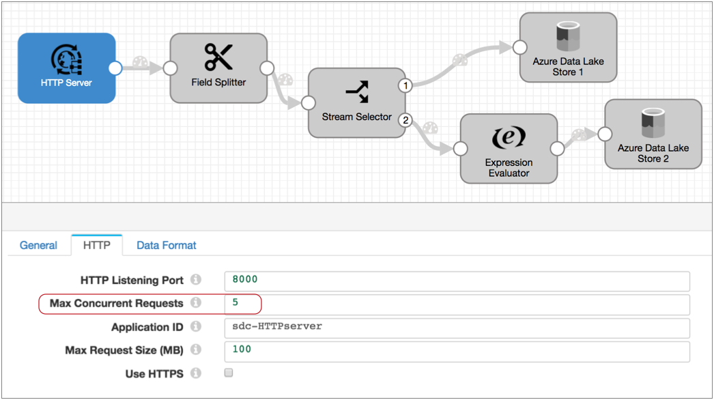
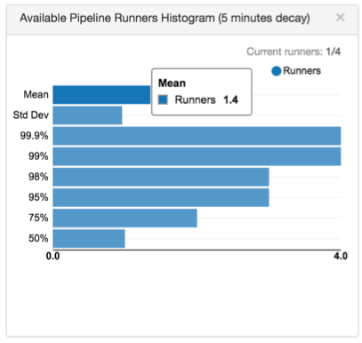

# 多线程管道

## 多线程管道概述

阿 多线程管道是一个数据收集器 管道与原点支持并行执行，使得一个管道中的多个线程中运行。

在Data Collector Edge管道中无效。 Data Collector Edge管道使用单个线程来执行处理。

多线程管道允许在一个Data Collector的单个管道中处理大量数据，从而充分利用了Data Collector 计算机上所有可用的CPU 。使用多线程管道时，请确保为管道和Data Collector分配足够的资源。

多线程管道遵循管道的已配置交付保证，但不保证处理批数据的顺序。

## 怎么运行的

配置多线程管道时，可以指定源应用于生成数据批处理的线程数。您还可以配置的最大数量 的管道亚军的是数据采集器 用来执行流水线处理。

管道运行器是无源管道实例 - 管道的实例，包括管道中的所有处理器，执行程序和目的地，并在源之后处理所有管道处理。

原始服务器会根据其使用的原始计算机系统执行多线程处理，但对于所有生成多线程管道的原始计算机，以下条件均成立：

启动管道时，原始服务器将根据原始服务器中配置的多线程属性创建多个线程。然后，Data Collector根据管道的“ Max Runners”属性创建许多管道运行器，以执行管道处理。每个线程都连接到原始系统，创建一批数据，并将该批数据传递给可用的管道运行器。

每个管道运行程序一次处理一个批处理，就像在单个线程上运行的管道一样。当数据流减慢时，管道运行器会闲置等待，直到需要它们为止，并定期生成一个空批。您可以配置“运行者空闲时间”管道属性来指定间隔或选择退出空批次生成。

多线程管道保留每个批处理中的记录顺序，就像单线程管道一样。但是由于批处理 是由不同的流水线处理程序处理的，因此无法确保将批处理写入目的地的顺序。

例如，采用以下多线程管道。HTTP服务器源处理从HTTP客户端传递的HTTP POST和PUT请求。配置源时，请指定要使用的线程数-在这种情况下，为“最大并发请求数”属性：

假设您将管道配置为选择退出“最大跑步者”属性。执行此操作时，Data Collector会为线程数生成匹配数量的管道运行器。

在“最大并发请求数”设置为5的情况下，启动管道时，源将创建五个线程，数据收集器将 创建五个管道运行器。接收到数据后，原点将批处理传递给每个管道运行器进行处理。

从概念上讲，多线程管道如下所示：

每个管道运行器执行与其余管道相关联的处理。将一批写入管道目标（在本例中为Azure Data Lake Store 1和2）后，管道运行器可用于另一批数据。与其他流水线处理程序处理的批次无关，每个批次的处理和写入速度要尽可能快，因此批次的写入顺序可能与读取顺序不同。

在任何给定的时刻，五个流水线运行者可以分别处理一个批处理，因此该多线程管道一次最多可以处理五个批处理。当传入数据变慢时，管道运行器将处于空闲状态，并在数据流增加时立即可用。

### 多线程管道的起源

您可以使用以下来源创建多线程管道：

- [Amazon S3-](https://streamsets.com/documentation/controlhub/latest/help/datacollector/UserGuide/Origins/AmazonS3.html#concept_kvs_3hh_ht)读取存储在Amazon S3中的对象。
- [Amazon SQS使用者](https://streamsets.com/documentation/controlhub/latest/help/datacollector/UserGuide/Origins/AmazonSQS.html#concept_xsh_knm_5bb) -从Amazon Simple Queue Services（SQS）中的队列读取数据。
- [Azure Data Lake Storage Gen1-](https://streamsets.com/documentation/controlhub/latest/help/datacollector/UserGuide/Origins/ADLS-G1.html#concept_osx_qgz_xhb)从Microsoft Azure Data Lake Storage Gen1读取数据。
- [Azure Data Lake Storage Gen2-](https://streamsets.com/documentation/controlhub/latest/help/datacollector/UserGuide/Origins/ADLS-G2.html#concept_osx_qgz_xhb)从Microsoft Azure Data Lake Storage Gen2读取数据。
- [Azure IoT /事件中心使用者](https://streamsets.com/documentation/controlhub/latest/help/datacollector/UserGuide/Origins/AzureEventHub.html#concept_c1z_15q_1bb) -从Microsoft Azure事件中心读取数据。
- [CoAP服务器](https://streamsets.com/documentation/controlhub/latest/help/datacollector/UserGuide/Origins/CoAPServer.html#concept_wfy_ghn_sz) -侦听CoAP端点并处理所有授权的CoAP请求的内容。
- [目录](https://streamsets.com/documentation/controlhub/latest/help/datacollector/UserGuide/Origins/Directory.html#concept_qcq_54n_jq) -从目录中读取完全写入的文件。
- [Elasticsearch-](https://streamsets.com/documentation/controlhub/latest/help/datacollector/UserGuide/Origins/Elasticsearch.html#concept_f1q_vpm_2z)从Elasticsearch集群读取数据。
- [Google Pub / Sub订阅服务器](https://streamsets.com/documentation/controlhub/latest/help/datacollector/UserGuide/Origins/PubSub.html#concept_pjw_qtl_r1b) -消费来自Google Pub / Sub订阅的邮件。
- [Groovy脚本编制](https://streamsets.com/documentation/controlhub/latest/help/datacollector/UserGuide/Origins/GroovyScripting.html#concept_chr_zjj_l3b) -运行Groovy脚本以创建Data Collector 记录。
- [Hadoop FS Standalone-](https://streamsets.com/documentation/controlhub/latest/help/datacollector/UserGuide/Origins/HDFSStandalone.html#concept_djz_pdm_hdb)读取HDFS中的完全写入的文件。
- [HTTP服务器](https://streamsets.com/documentation/controlhub/latest/help/datacollector/UserGuide/Origins/HTTPServer.html#concept_s2p_5hb_4y) -侦听HTTP端点并处理所有授权的HTTP POST和PUT请求的内容。
- [JavaScript脚本](https://streamsets.com/documentation/controlhub/latest/help/datacollector/UserGuide/Origins/JavaScriptScripting.html#concept_kn5_bvt_m3b) -运行JavaScript脚本以创建数据收集器 记录。
- [JDBC](https://streamsets.com/documentation/controlhub/latest/help/datacollector/UserGuide/Origins/MultiTableJDBCConsumer.html#concept_zp3_wnw_4y)多表[使用者](https://streamsets.com/documentation/controlhub/latest/help/datacollector/UserGuide/Origins/MultiTableJDBCConsumer.html#concept_zp3_wnw_4y) -通过JDBC连接从多个表中读取数据库数据。
- [Jython脚本](https://streamsets.com/documentation/controlhub/latest/help/datacollector/UserGuide/Origins/JythonScripting.html#concept_fxz_35t_m3b) -运行Jython脚本以创建Data Collector 记录。
- [Kafka Multitopic Consumer-](https://streamsets.com/documentation/controlhub/latest/help/datacollector/UserGuide/Origins/KafkaMultiConsumer.html#concept_ccs_fn4_x1b)从Kafka集群中的多个主题中读取数据。
- [Kinesis Consumer-](https://streamsets.com/documentation/controlhub/latest/help/datacollector/UserGuide/Origins/KinConsumer.html#concept_anh_4y3_yr)从Kinesis集群读取数据。
- [MapR DB CDC-](https://streamsets.com/documentation/controlhub/latest/help/datacollector/UserGuide/Origins/MapRdbCDC.html#concept_qwj_5vm_pbb)读取已更改的MapR DB数据，该数据已写入MapR流。
- [MapR FS Standalone-](https://streamsets.com/documentation/controlhub/latest/help/datacollector/UserGuide/Origins/MapRFSStandalone.html#concept_b43_3qc_mdb)在MapR中读取完全写入的文件。
- [MapR Multitopic Streams使用者](https://streamsets.com/documentation/controlhub/latest/help/datacollector/UserGuide/Origins/MapRStreamsMultiConsumer.html#concept_hvd_hww_lbb) -从MapR Streams集群中的多个主题读取数据。
- [Oracle Bulkload-](https://streamsets.com/documentation/controlhub/latest/help/datacollector/UserGuide/Origins/OracleBulk.html#concept_lnz_kzp_zgb)从多个Oracle数据库表中读取数据，然后停止管道。
- [REST服务](https://streamsets.com/documentation/controlhub/latest/help/datacollector/UserGuide/Origins/RESTService.html#concept_hfg_2sn_p2b) - 侦听HTTP端点，解析所有授权请求的内容，并将响应发送回原始REST API。用作[微服务管道的](https://streamsets.com/documentation/controlhub/latest/help/datacollector/UserGuide/Microservice/Microservice_Title.html#concept_qfh_xdm_p2b)一部分。
- [SQL Server 2019 BDC多表使用者](https://streamsets.com/documentation/controlhub/latest/help/datacollector/UserGuide/Origins/SQLServerBDCMultitable.html#SQLServerBDCMultitable) -通过JDBC连接从Microsoft SQL Server 2019大数据群集（BDC）读取数据。
- [SQL Server CDC客户端](https://streamsets.com/documentation/controlhub/latest/help/datacollector/UserGuide/Origins/SQLServerCDC.html#concept_ut3_ywc_v1b) -从Microsoft SQL Server CDC表读取数据。
- [SQL Server更改跟踪](https://streamsets.com/documentation/controlhub/latest/help/datacollector/UserGuide/Origins/SQLServerChange.html#concept_ewq_b2s_r1b) -处理Microsoft SQL Server更改跟踪表中的数据。
- [TCP服务器](https://streamsets.com/documentation/controlhub/latest/help/datacollector/UserGuide/Origins/TCPServer.html#concept_ppm_xb1_4z) -侦听指定的端口并通过TCP / IP连接处理传入的数据。
- [Teradata使用者](https://streamsets.com/documentation/controlhub/latest/help/datacollector/UserGuide/Origins/Teradata.html#concept_zp3_wnw_4y) -通过JDBC连接从多个表和多个模式中读取Teradata数据库数据。
- [UDP多线程源](https://streamsets.com/documentation/controlhub/latest/help/datacollector/UserGuide/Origins/UDPMulti.html#concept_wng_g5f_5bb) -从一个或多个UDP端口读取消息。
- [WebSocket服务器](https://streamsets.com/documentation/controlhub/latest/help/datacollector/UserGuide/Origins/WebSocketServer.html#concept_u2r_gpc_3z) -侦听WebSocket端点并处理所有授权的WebSocket请求的内容。
- [开发数据生成器](https://streamsets.com/documentation/controlhub/latest/help/datacollector/UserGuide/Pipeline_Design/DevStages.html#concept_czx_ktn_ht) -生成随机数据以进行开发和测试。

起源使用不同的属性，并根据它们使用的起源系统执行不同的处理。有关起点如何执行多线程处理的详细信息，请参见起点文档中的“多线程处理”。

**注意：** Data Collector 提供了多个“ to Kafka”多线程源，这些源现在已被弃用，并将在以后的版本中删除：[HTTP到Kafka](https://streamsets.com/documentation/controlhub/latest/help/datacollector/UserGuide/Origins/HTTPtoKafka.html#concept_izh_mqd_dy)，[SDC RPC到Kafka](https://streamsets.com/documentation/controlhub/latest/help/datacollector/UserGuide/Origins/SDCRPCtoKafka.html#concept_tdk_slk_pw)和[UDP到Kafka](https://streamsets.com/documentation/controlhub/latest/help/datacollector/UserGuide/Origins/UDPtoKafka.html#concept_jzq_jcz_pw)。这些来源将传入的数据直接写入Kafka，而无需进行其他处理。他们不创建完整的多线程管道。

### 处理器缓存

由于多线程管道使用多个管道运行器来运行多个无源管道实例，因此多线程管道中的处理器缓存可能不同于在单个线程上运行的管道。

通常，当处理器缓存数据时，处理器的每个实例只能缓存通过该特定管道运行器的数据。配置多线程管道时，请务必考虑此行为。

例如，如果您将查找处理器配置为创建本地缓存，则查找处理器的每个实例都会创建自己的本地缓存。这应该不成问题，因为缓存通常用于提高管道性能。

记录重复数据删除处理器是一个例外。记录重复数据删除器缓存记录以进行比较，最多可进行指定数量的记录或时间比较。在多线程管道中使用时，缓存中的记录在管道运行程序之间共享。

## 调整线程和流道

为了优化管道性能和资源使用，您可以调整多线程管道使用的线程和管道运行程序的数量。

- 线程数

  在源中配置最大线程数或并发数。

  在指定多个线程之前，请考虑原点如何使用线程。所有起源都使用线程连接到起源系统并创建一批数据，但是它们可以不同地执行此任务。

  例如，JDBC Multitable Consumer起源为每个表使用一个线程，因此将起源配置为使用比要查询的表数更多的线程毫无意义。

  相比之下，HTTP Server起源侦听HTTP端点。配置要使用的线程数时，应考虑与峰值峰值和可用管道运行器的数量相关的可行使用的最大线程数。

  请注意，空闲线程消耗的资源很少，因此配置额外的线程几乎不会带来任何危害。

- 管道流道

  使用“最大流道数”管道属性配置最大流水道数。

  管道运行程序即使在空闲时也会消耗资源。因此，在考虑要使用的运行程序的数量时，您应该决定是否要针对性能，资源使用或两者进行优化。

  管道运行器处理由原始线程创建的批处理。处理速度可能会根据流水线逻辑的复杂性，批处理大小等而有所不同。

  因此，要确定要使用的流水线数量，请在运行管道时监视可用的流水线数量。如果发现有大量可用的运行器，则可以减少允许的运行器数量。相反，如果通常无法使用流水线，增加流水线的数量可以提高性能。

例如，假设您有一条管道，其中Kinesis Consumer从4个分片读取数据。在原点中，将线程数设置为4。还将管道“最大流道”属性保留为默认值0，这将为线程创建匹配数量的管道流道-在这种情况下为4。启动管道之后并让它运行一会儿，请您回来查看并在Data Collector UI中找到以下直方图：

直方图显示平均值为1.4，这意味着在任何时候都可能有1.4个可用跑步者。

如果这是管道的峰值负载，则意味着您可以在不牺牲太多性能的情况下将管道中使用的管道运行器的数量减少到3个。如果 其他地方需要Data Collector资源，并且您不介意对管道性能造成轻微影响，则可以将管道运行程序的数量减少到2个。

## 资源使用

由于每个管道运行器都在源之后执行与管道相关的所有处理，因此多线程管道中的每个线程都需要与在单个线程上运行的相同管道大致相同的资源。

使用多线程管道时，应监视Data Collector 资源使用情况，并 在适当时增加Data Collector Java堆大小。

## 多线程管道摘要

以下几点试图总结有关多线程管道的关键细节：

- 使用多线程源来创建多线程管道。您现在可以使用以下来源：

  - [Amazon S3-](https://streamsets.com/documentation/controlhub/latest/help/datacollector/UserGuide/Origins/AmazonS3.html#concept_kvs_3hh_ht)读取存储在Amazon S3中的对象。
  - [Amazon SQS使用者](https://streamsets.com/documentation/controlhub/latest/help/datacollector/UserGuide/Origins/AmazonSQS.html#concept_xsh_knm_5bb) -从Amazon Simple Queue Services（SQS）中的队列读取数据。
  - [Azure Data Lake Storage Gen1-](https://streamsets.com/documentation/controlhub/latest/help/datacollector/UserGuide/Origins/ADLS-G1.html#concept_osx_qgz_xhb)从Microsoft Azure Data Lake Storage Gen1读取数据。
  - [Azure Data Lake Storage Gen2-](https://streamsets.com/documentation/controlhub/latest/help/datacollector/UserGuide/Origins/ADLS-G2.html#concept_osx_qgz_xhb)从Microsoft Azure Data Lake Storage Gen2读取数据。
  - [Azure IoT /事件中心使用者](https://streamsets.com/documentation/controlhub/latest/help/datacollector/UserGuide/Origins/AzureEventHub.html#concept_c1z_15q_1bb) -从Microsoft Azure事件中心读取数据。
  - [CoAP服务器](https://streamsets.com/documentation/controlhub/latest/help/datacollector/UserGuide/Origins/CoAPServer.html#concept_wfy_ghn_sz) -侦听CoAP端点并处理所有授权的CoAP请求的内容。
  - [目录](https://streamsets.com/documentation/controlhub/latest/help/datacollector/UserGuide/Origins/Directory.html#concept_qcq_54n_jq) -从目录中读取完全写入的文件。
  - [Elasticsearch-](https://streamsets.com/documentation/controlhub/latest/help/datacollector/UserGuide/Origins/Elasticsearch.html#concept_f1q_vpm_2z)从Elasticsearch集群读取数据。
  - [Google Pub / Sub订阅服务器](https://streamsets.com/documentation/controlhub/latest/help/datacollector/UserGuide/Origins/PubSub.html#concept_pjw_qtl_r1b) -消费来自Google Pub / Sub订阅的邮件。
  - [Groovy脚本编制](https://streamsets.com/documentation/controlhub/latest/help/datacollector/UserGuide/Origins/GroovyScripting.html#concept_chr_zjj_l3b) -运行Groovy脚本以创建Data Collector 记录。
  - [Hadoop FS Standalone-](https://streamsets.com/documentation/controlhub/latest/help/datacollector/UserGuide/Origins/HDFSStandalone.html#concept_djz_pdm_hdb)读取HDFS中的完全写入的文件。
  - [HTTP服务器](https://streamsets.com/documentation/controlhub/latest/help/datacollector/UserGuide/Origins/HTTPServer.html#concept_s2p_5hb_4y) -侦听HTTP端点并处理所有授权的HTTP POST和PUT请求的内容。
  - [JavaScript脚本](https://streamsets.com/documentation/controlhub/latest/help/datacollector/UserGuide/Origins/JavaScriptScripting.html#concept_kn5_bvt_m3b) -运行JavaScript脚本以创建数据收集器 记录。
  - [JDBC](https://streamsets.com/documentation/controlhub/latest/help/datacollector/UserGuide/Origins/MultiTableJDBCConsumer.html#concept_zp3_wnw_4y)多表[使用者](https://streamsets.com/documentation/controlhub/latest/help/datacollector/UserGuide/Origins/MultiTableJDBCConsumer.html#concept_zp3_wnw_4y) -通过JDBC连接从多个表中读取数据库数据。
  - [Jython脚本](https://streamsets.com/documentation/controlhub/latest/help/datacollector/UserGuide/Origins/JythonScripting.html#concept_fxz_35t_m3b) -运行Jython脚本以创建Data Collector 记录。
  - [Kafka Multitopic Consumer-](https://streamsets.com/documentation/controlhub/latest/help/datacollector/UserGuide/Origins/KafkaMultiConsumer.html#concept_ccs_fn4_x1b)从Kafka集群中的多个主题中读取数据。
  - [Kinesis Consumer-](https://streamsets.com/documentation/controlhub/latest/help/datacollector/UserGuide/Origins/KinConsumer.html#concept_anh_4y3_yr)从Kinesis集群读取数据。
  - [MapR DB CDC-](https://streamsets.com/documentation/controlhub/latest/help/datacollector/UserGuide/Origins/MapRdbCDC.html#concept_qwj_5vm_pbb)读取已更改的MapR DB数据，该数据已写入MapR流。
  - [MapR FS Standalone-](https://streamsets.com/documentation/controlhub/latest/help/datacollector/UserGuide/Origins/MapRFSStandalone.html#concept_b43_3qc_mdb)在MapR中读取完全写入的文件。
  - [MapR Multitopic Streams使用者](https://streamsets.com/documentation/controlhub/latest/help/datacollector/UserGuide/Origins/MapRStreamsMultiConsumer.html#concept_hvd_hww_lbb) -从MapR Streams集群中的多个主题读取数据。
  - [Oracle Bulkload-](https://streamsets.com/documentation/controlhub/latest/help/datacollector/UserGuide/Origins/OracleBulk.html#concept_lnz_kzp_zgb)从多个Oracle数据库表中读取数据，然后停止管道。
  - [REST服务](https://streamsets.com/documentation/controlhub/latest/help/datacollector/UserGuide/Origins/RESTService.html#concept_hfg_2sn_p2b) - 侦听HTTP端点，解析所有授权请求的内容，并将响应发送回原始REST API。用作[微服务管道的](https://streamsets.com/documentation/controlhub/latest/help/datacollector/UserGuide/Microservice/Microservice_Title.html#concept_qfh_xdm_p2b)一部分。
  - [SQL Server 2019 BDC多表使用者](https://streamsets.com/documentation/controlhub/latest/help/datacollector/UserGuide/Origins/SQLServerBDCMultitable.html#SQLServerBDCMultitable) -通过JDBC连接从Microsoft SQL Server 2019大数据群集（BDC）读取数据。
  - [SQL Server CDC客户端](https://streamsets.com/documentation/controlhub/latest/help/datacollector/UserGuide/Origins/SQLServerCDC.html#concept_ut3_ywc_v1b) -从Microsoft SQL Server CDC表读取数据。
  - [SQL Server更改跟踪](https://streamsets.com/documentation/controlhub/latest/help/datacollector/UserGuide/Origins/SQLServerChange.html#concept_ewq_b2s_r1b) -处理Microsoft SQL Server更改跟踪表中的数据。
  - [TCP服务器](https://streamsets.com/documentation/controlhub/latest/help/datacollector/UserGuide/Origins/TCPServer.html#concept_ppm_xb1_4z) -侦听指定的端口并通过TCP / IP连接处理传入的数据。
  - [Teradata使用者](https://streamsets.com/documentation/controlhub/latest/help/datacollector/UserGuide/Origins/Teradata.html#concept_zp3_wnw_4y) -通过JDBC连接从多个表和多个模式中读取Teradata数据库数据。
  - [UDP多线程源](https://streamsets.com/documentation/controlhub/latest/help/datacollector/UserGuide/Origins/UDPMulti.html#concept_wng_g5f_5bb) -从一个或多个UDP端口读取消息。
  - [WebSocket服务器](https://streamsets.com/documentation/controlhub/latest/help/datacollector/UserGuide/Origins/WebSocketServer.html#concept_u2r_gpc_3z) -侦听WebSocket端点并处理所有授权的WebSocket请求的内容。
  - [开发数据生成器](https://streamsets.com/documentation/controlhub/latest/help/datacollector/UserGuide/Pipeline_Design/DevStages.html#concept_czx_ktn_ht) -生成随机数据以进行开发和测试。

- 与基本的单线程管道不同，多线程管道不能保证数据的顺序。

  批处理中的数据按顺序处理，但是由于批处理是快速创建的并传递到不同的线程，因此批处理的顺序可能会随着写入管道目标位置而改变。

- 缓存信息的处理器通常针对管道的每个实例具有单独的缓存。记录重复数据删除器是一个例外，它可以识别所有管道运行器中的重复记录。

- 为了优化性能和资源使用，请检查“可用管道运行器”直方图，以查看是否有效地使用了管道运行器。

- 我们建议监视管道的资源使用情况和Data Collector堆使用情况，并根据需要增加它们。