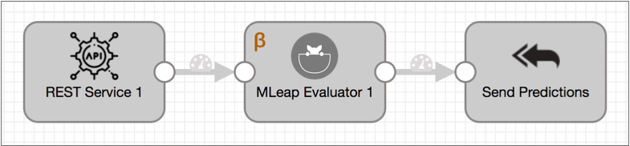
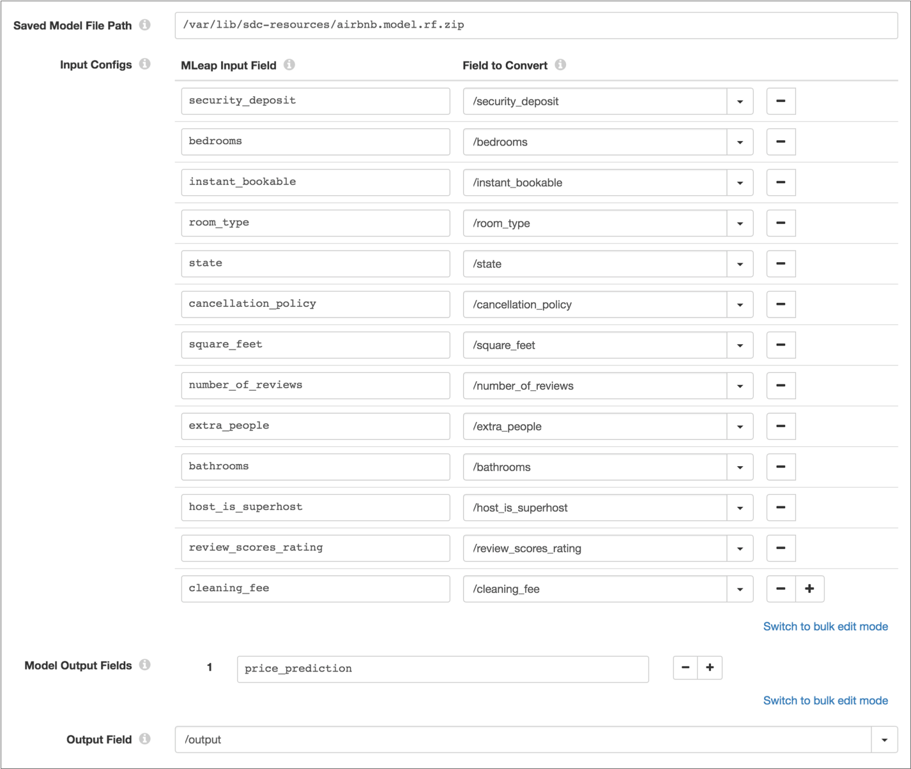

# MLeap评估师

[支持的管道类型：](https://streamsets.com/documentation/controlhub/latest/help/datacollector/UserGuide/Pipeline_Configuration/ProductIcons_Doc.html#concept_mjg_ly5_pgb) 资料收集器

MLeap评估程序处理器使用存储在MLeap捆绑软件中的机器学习模型来生成评估，评分或数据分类。

使用MLeap Evaluator处理器，您可以创建管道，以实时生成数据驱动的见解。例如，您可以设计管道来检测欺诈性交易或在数据通过管道时执行自然语言处理。

要使用MLeap Evaluator处理器，您首先要使用首选的机器学习技术来构建和训练模型。然后，您可以将训练后的模型导出到MLeap捆绑软件，并将该文件保存在 运行管道的Data Collector计算机上。

配置MLeap Evaluator处理器时，您将定义到存储在Data Collector 计算机上的已保存MLeap捆绑软件的路径。您还定义了记录中的字段和模型中的输入字段之间的映射，并定义了要输出的模型字段和要存储模型输出的记录字段。

## 先决条件


在配置MLeap Evaluator处理器之前，您必须完成以下先决条件：

1. 使用您喜欢的机器学习技术构建和训练机器学习模型。
2. 将训练后的模型导出到MLeap捆绑包。有关更多信息，请参见[MLeap文档](https://github.com/combust/mleap-docs/blob/master/core-concepts/mleap-bundles.md)。
3. 将捆绑包文件保存在运行管道的Data Collector计算机上。StreamSets建议将模型目录存储在Data Collector资源目录 $ SDC_RESOURCES中。

## MLeap模型作为微服务


当您在[微服务管道中](https://streamsets.com/documentation/controlhub/latest/help/datacollector/UserGuide/Microservice/Microservice_Title.html#concept_qfh_xdm_p2b)包含MLeap评估器处理器时，外部客户端可以使用MLeap捆绑软件中的模型来执行计算。

例如，在以下微服务管道中，REST API客户端将带有输入数据的请求发送到REST服务源。MLeap评估程序处理器使用机器学习模型来生成预测，并将包含这些预测的记录从模型传递到标记为“发送预测”的“将响应发送到源”目的地，该目标将记录发送回REST服务源。然后，源将JSON格式的响应发送回源REST API客户端。



## 示例：Airbnb模型


该[StreamSets数据采集Github上库](https://github.com/streamsets/datacollector/tree/master/mleap-lib/src/test/resources) 包含以下MLeap束基于制作的Airbnb数据训练的模型：

- airbnb.model.lr.zip –使用线性回归模型。
- airbnb.model.rf.zip –使用随机森林回归模型。

airbnb.model.rf.zip捆绑包中的模型根据输入的值（例如，卧室数量，位置和评价分数）预测出租单元的价格。例如，您可以为模型提供以下输入：

```
{
    "security_deposit": 50.0,
    "bedrooms": 3.0,
    "instant_bookable": "1.0",
    "room_type": "Entire home/apt",
    "state": "NY",
    "cancellation_policy": "strict",
    "square_feet": 1250.0,
    "number_of_reviews": 56.0,
    "extra_people": 2.0,
    "bathrooms": 2.0,
    "host_is_superhost": "1.0",
    "review_scores_rating": 90.0,
    "cleaning_fee": 30.0
}
```

该模型在`price_prediction`现场产生的预测价格为218.28美元 。

要将这个模型包含在管道中，请将MLeap捆绑软件保存在Data Collector 机器上，将MLeap Evaluator处理器添加到管道中，然后将处理器配置为使用MLeap捆绑软件，并将所需的输入字段和生成的输出字段映射到字段在记录中。下图显示了处理器配置：



## 配置MLeap评估程序处理器

配置MLeap评估程序处理器，以使用存储在MLeap捆绑软件中的机器学习模型生成数据的预测或分类。

1. 在“属性”面板的“ **常规”**选项卡上，配置以下属性：

   | 一般财产                                                     | 描述                                                         |
   | :----------------------------------------------------------- | :----------------------------------------------------------- |
   | 名称                                                         | 艺名。                                                       |
   | 描述                                                         | 可选说明。                                                   |
   | [必填项](https://streamsets.com/documentation/controlhub/latest/help/datacollector/UserGuide/Pipeline_Design/DroppingUnwantedRecords.html#concept_dnj_bkm_vq) | 必须包含用于将记录传递到阶段的记录的数据的字段。**提示：**您可能包括舞台使用的字段。根据为管道配置的错误处理，处理不包含所有必填字段的记录。 |
   | [前提条件](https://streamsets.com/documentation/controlhub/latest/help/datacollector/UserGuide/Pipeline_Design/DroppingUnwantedRecords.html#concept_msl_yd4_fs) | 必须评估为TRUE的条件才能使记录进入处理阶段。单击 **添加**以创建其他前提条件。根据为阶段配置的错误处理，处理不满足所有前提条件的记录。 |
   | [记录错误](https://streamsets.com/documentation/controlhub/latest/help/datacollector/UserGuide/Pipeline_Design/ErrorHandling.html#concept_atr_j4y_5r) | 该阶段的错误记录处理：放弃-放弃记录。发送到错误-将记录发送到管道以进行错误处理。停止管道-停止管道。对群集管道无效。 |

2. 在“ **MLeap”**选项卡上，配置以下属性：

   | MLeap物业          | 描述                                                         |
   | :----------------- | :----------------------------------------------------------- |
   | 保存的模型文件路径 | 数据收集器计算机上已保存的MLeap捆绑软件的路径。指定绝对路径或相对于Data Collector资源目录的路径。例如，如果您在Data Collector资源目录 / var / lib / sdc-resources中保存了一个名为Price.model.zip的捆绑包，则输入以下路径之一：/var/lib/sdc-resources/pricing.model.zippricing.model.zip |
   | 输入配置           | 机器学习模型中的输入字段到记录中的字段的映射。对于每个映射，输入：MLeap输入字段– MLeap捆绑包中存储的模型中的输入字段。要转换的字段–记录中的相应字段，指定为路径。 |
   | 模型输出字段       | 模型中的输出字段返回到管道。                                 |
   | 输出场             | 列表映射字段，用于在记录中存储模型输出。指定为路径           |