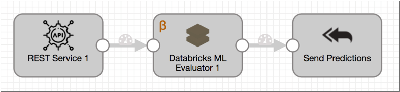
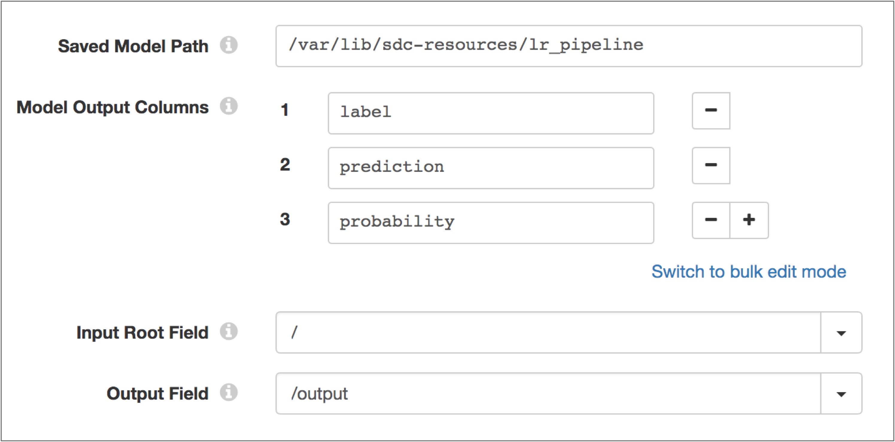

# Databricks ML评估器

[支持的管道类型：](https://streamsets.com/documentation/controlhub/latest/help/datacollector/UserGuide/Pipeline_Configuration/ProductIcons_Doc.html#concept_mjg_ly5_pgb) 资料收集器

Databricks ML评估器处理器使用通过Databricks ML模型导出导出的机器学习模型来生成评估，评分或数据分类。

使用Databricks ML Evaluator处理器，您可以创建管道，以实时生成数据驱动的见解。例如，您可以设计管道来检测欺诈性交易或在数据通过管道时执行自然语言处理。

要使用Databricks ML Evaluator处理器，您首先要使用Apache Spark MLlib构建和训练模型。然后，使用Databricks ML Model Export导出训练后的模型，并将导出的模型目录保存在 运行管道的Data Collector机器上。

当配置Databricks ML Evaluator处理器时，可以指定保存在Data Collector 机器上的导出模型的路径。您还可以在输入数据中指定用于发送模型的根字段，从模型返回的输出列以及用于存储模型输出的记录字段。

## 先决条件


在配置Databricks ML Evaluator处理器之前，您必须完成以下先决条件：

1. 使用Apache Spark MLlib构建和训练机器学习模型。
2. 使用Databricks ML模型导出导出训练后的模型。有关更多信息，请参见Databricks文档：[导出Apache Spark ML模型和管道](https://docs.databricks.com/applications/machine-learning/model-export-import/model-export.html#exporting-apache-spark-ml-models-and-pipelines)。
3. 将导出的目录保存在运行管道的Data Collector计算机上。StreamSets建议将模型目录存储在Data Collector资源目录 $ SDC_RESOURCES中。

## Databricks模型作为微服务


当您在[微服务管道中](https://streamsets.com/documentation/controlhub/latest/help/datacollector/UserGuide/Microservice/Microservice_Title.html#concept_qfh_xdm_p2b)包含Databricks ML评估器处理器时，外部客户端可以使用通过Databricks ML模型导出导出的模型来执行计算。

例如，在以下微服务管道中，REST API客户端将带有输入数据的请求发送到REST服务源。Databricks ML评估器处理器使用机器学习模型从数据生成预测。处理器将包含模型预测的记录传递到标记为“发送预测”的“向原点发送响应”目的地，该记录将记录发送回REST服务源。然后，源将JSON格式的响应发送回源REST API客户端。



## 示例：地被模型


例如，假设您使用Apache Spark MLib来构建和训练可预测森林中地面覆盖率的模型，然后使用Databricks ML Model Export导出模型。该模型根据有关土壤类型，地形和树木覆盖率的输入预测地面覆盖率。

您可以为模型提供以下输入：

```
{
  "origLabel": -1.0,
  "features": {
    "type": 0,
    "size": 13,
    "indices": [0,2,3,4,6,7,8,9,10,11,12],
    "values": [74.0,2.0,120.0,269.0,2.0,121.0,1.0,0.2,1.0,1.0,3.0]
  }
}
```

然后，该模型会生成预测的地面覆盖类型，相应的标签以及每种类型的概率，如下表所示：

| 标签 | 预测 | 可能性           |
| :--- | :--- | :--------------- |
| 苔藓 | 0    | 0 – 0.861 – 0.14 |

要将模型包含在管道中，请将模型保存在Data Collector 机器上，将Databricks ML Evaluator处理器添加到管道中，然后将处理器配置为使用保存的模型，读取所需的输入并包括生成的输出记录中的字段中的列。下图显示了处理器配置：



## 配置Databricks ML评估程序处理器

配置Databricks ML评估程序处理器，以使用通过Databricks ML模型导出导出的机器学习模型生成数据评估，评分或分类。

1. 在“属性”面板的“ **常规”**选项卡上，配置以下属性：

   | 一般财产                                                     | 描述                                                         |
   | :----------------------------------------------------------- | :----------------------------------------------------------- |
   | 名称                                                         | 艺名。                                                       |
   | 描述                                                         | 可选说明。                                                   |
   | [必填项](https://streamsets.com/documentation/controlhub/latest/help/datacollector/UserGuide/Pipeline_Design/DroppingUnwantedRecords.html#concept_dnj_bkm_vq) | 必须包含用于将记录传递到阶段的记录的数据的字段。**提示：**您可能包括舞台使用的字段。根据为管道配置的错误处理，处理不包含所有必填字段的记录。 |
   | [前提条件](https://streamsets.com/documentation/controlhub/latest/help/datacollector/UserGuide/Pipeline_Design/DroppingUnwantedRecords.html#concept_msl_yd4_fs) | 必须评估为TRUE的条件才能使记录进入处理阶段。单击 **添加**以创建其他前提条件。根据为阶段配置的错误处理，处理不满足所有前提条件的记录。 |
   | [记录错误](https://streamsets.com/documentation/controlhub/latest/help/datacollector/UserGuide/Pipeline_Design/ErrorHandling.html#concept_atr_j4y_5r) | 该阶段的错误记录处理：放弃-放弃记录。发送到错误-将记录发送到管道以进行错误处理。停止管道-停止管道。对群集管道无效。 |

2. 在“ **Databricks ML”**选项卡上，配置以下属性：

   | Databricks ML属性 | 描述                                                         |
   | :---------------- | :----------------------------------------------------------- |
   | 保存的模型路径    | 数据收集器计算机上已保存模型目录的路径。指定绝对路径或相对于Data Collector资源目录的路径。例如，如果您在 Data Collector资源目录 / var / lib / sdc-resources中保存了一个名为textAnalysis的模型目录，请输入以下任一路径：/var/lib/sdc-resources/textAnalysistextAnalysis |
   | 模型输出列        | 对输出列进行建模以返回到记录。默认情况下，处理器包括许多型号共有的以下列：标签预测可能性您可以删除不适用的列，并且可以根据需要从模型中添加其他列。 |
   | 输入根字段        | 记录中的根字段作为输入传递给模型。从下拉列表中，从记录中选择一个输入字段，以将该字段和任何子字段传递给模型，或输入/以将所有字段传递给模型。 |
   | 输出场            | 在记录中存储模型输出的地图字段。指定为路径。                 |