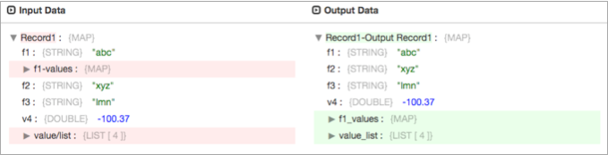
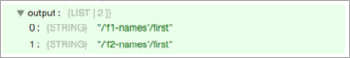
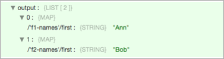

# 字段映射器

[支持的管道类型：](https://streamsets.com/documentation/controlhub/latest/help/datacollector/UserGuide/Pipeline_Configuration/ProductIcons_Doc.html#concept_mjg_ly5_pgb) 资料收集器

字段映射器处理器将表达式映射到一组字段，以更改字段路径，字段名称或字段值。例如，您可以使用Field Mapper处理器重新组织字段或从字段名称中删除特殊字符。

配置Field Mapper处理器时，必须指定以下内容：

- 映射表达式更改的部分字段，即路径，名称或值。
- 一个可选的条件表达式，用于指定受影响的字段。
- 该表达式指定如何更改路径，名称或值

必要时，您可以配置处理器以更改记录结构，追加（而不是覆盖）记录以及复制现有字段以保留当前字段。

## 栏位值

您可以使用Field Mapper处理器将表达式映射到一组字段以更改字段值。您可以通过将负数转换为正数，将所有负数设置为零或在任何字符串值后添加前缀来更改字段值。

例如，假设您想更改数据集中的数字以显示绝对值。如下表所示，您将处理器配置为执行以下操作：

- 操作字段值。
- 当字段中的值是整数或双精度时，使用条件表达式仅对字段值进行运算。
- 当值大于零时，使用映射表达式写入当前值，否则将值乘以-1以转换为正数。

| 映射器属性 | 值                                               |
| :--------- | :----------------------------------------------- |
| 操作       | 栏位值                                           |
| 条件表达式 | ${f:type() == 'INTEGER' or f:type() == 'DOUBLE'} |
| 映射表达式 | ${f:value() > 0 ? f:value() : -1 * f:value()}    |

下图显示了Field Mapper处理器将输入数据中的负数更改为输出数据中的正数：

## 栏位名称

您可以使用Field Mapper处理器来应用映射表达式，以统一更改一组字段的名称。您可以通过替换特殊字符或添加后缀来更改字段名称。更改字段名称时，可以配置处理器以更改记录结构，追加（而不是覆盖）记录以及复制现有字段，从而保留当前字段。

例如，假设您想用下划线替换字段名称中的特殊字符。如下表所示，您将处理器配置为执行以下操作：

- 操作字段名称。
- 使用映射表达式，用下划线替换名称中的特殊字符。

因为您希望将映射表达式应用于所有字段名称，所以不需要配置条件表达式。

| 映射器属性 | 值                                            |
| :--------- | :-------------------------------------------- |
| 操作       | 栏位名称                                      |
| 映射表达式 | ${str:replaceAll(f:name(), '[.\\-/()^]','_')} |

下图显示了Field Mapper处理器将连字符`f1-values`和斜线更改 `value/list`为下划线：

## 场路径

您可以使用Field Mapper处理器将表达式映射到一组字段以更改字段路径。您可以更改字段路径以按类型对字段进行分组，也可以将具有可疑名称和值的字段复制到要检查的替代路径。将多个字段映射到单个字段路径时，请指定定义如何在该路径中聚合字段的聚合表达式。更改字段路径时，可以配置处理器以更改记录结构，追加（而不是覆盖）记录，以及复制现有字段以保留当前字段。

### 示例：按类型分组字段

假设要对具有相同数据类型的字段进行分组。您可以使用Field Mapper处理器将字段移动到已定义的地图字段，其中包含每种字段类型的地图字段。

如下表所示，您将处理器配置为执行以下操作：

- 在现场路径上操作。
- 使用映射表达式将字段移动到适当的字段类型下。
- 清除聚合表达式，以便处理器将字段值写入字段记录，而不是包含该值的列表。
- 使处理器能够更改记录的结构并写入新字段。

请注意，输入记录必须已经包含路径的映射字段，在这种情况下，所有字段类型的映射字段都必须包含，例如/ outputs / STRING， / outputs / INTEGER和 / outputs / DOUBLE。

| 映射器属性   | 值                                                           |
| :----------- | :----------------------------------------------------------- |
| 操作         | 场路径                                                       |
| 映射表达式   | /outputs/${f:type()}/${f:name()}                             |
| 聚集表达     | 没有**注意：**清除默认表达式，因为映射表达式仅将一个字段映射到每个字段路径。 |
| 允许结构变更 | 已启用                                                       |

下图显示了“字段映射器” `outputs`通过适当的字段类型将具有值的字段移动到字段下 ：

### 示例：复制可疑字段

假设您要识别可疑字段，但是将这些字段保留在原位，直到您可以对其进行检查。如果字段名称包含文本`name`并且值包含特殊字符，则认为该字段可疑。您可以使用Field Mapper处理器将表达式映射到可疑字段。该表达式将可疑字段映射到已定义的映射字段以供查看。写入审阅字段时，处理器为每个可疑字段创建一个映射字段，并列出记录中的原始路径及其值。

如下表所示，您将处理器配置为执行以下操作：

- 在现场路径上操作。
- 使用条件表达式只能对与您的可疑定义相匹配的字段进行操作。
- 使用映射表达式将匹配的字段写入新路径。
- 使用聚合表达式为写入新路径的每个字段创建一个映射，并在该字段中列出原始路径和值。

在这种情况下，您还可以配置处理器以通过复制可疑字段来更改记录的结构并维护原始路径。输入记录必须包含路径的映射字段，在这种情况下为 `review`。

| 映射器属性   | 设置                                                         |
| :----------- | :----------------------------------------------------------- |
| 操作         | 场路径                                                       |
| 条件表达式   | ${f:type() == 'STRING' and str:contains(f:name(), 'name') and str:matches(f:value(), '^[;\\-*".&*\\^].*')} |
| 映射表达式   | /review/suspiciousNames                                      |
| 聚集表达     | ${map(fields, fieldByPreviousPath())}                        |
| 允许结构变更 | 已启用                                                       |
| 维持原路     | 已启用                                                       |

下图显示了Field Mapper处理器将可疑字段复制到该`review`字段，并在其中列出了该字段的原始路径及其值：

### 聚合表达式

配置配置为在字段路径上运行并将多个字段映射到同一路径的Field Mapper处理器时，必须包含一个聚合表达式，以定义处理器如何将字段聚合到结果路径中。您可以将处理器配置为：

- 返回单个值，例如字段值的总和或最小值或最大值。
- 从字段中返回值列表。
- 返回包含原始字段路径的字符串列表-即应用映射之前的字段路径。
- 返回一个字段映射列表，每个列表都包含原始字段路径和值。

在聚合表达式中，可以使用数字函数或字段函数。调用数字或字段函数时，请使用特殊变量`fields`，将字段列表传递给该函数。如果处理器具有条件表达式，则聚合表达式将传递与条件表达式匹配的字段。否则，聚合将传递所有字段。

#### 数值函数

使用数字函数将字段减少为单个值。传递给数字函数的所有字段必须为相同的数字类型。返回值的数据类型取决于输入数据类型，如下表所示：

| 输入值       | 回到 |
| :----------- | :--- |
| 整数或长整数 | 长   |
| 浮动或双     | 双   |
| 小数         | 小数 |

聚合表达式支持以下数字函数：

- 总和（字段）

  返回指定字段中值的总和。

- 分钟（字段）

  返回指定字段的最小值。

- 最大（字段）

  返回指定字段的最大值。

例如，要返回值的总和，请将聚合表达式设置为：

${sum(fields)}

#### 现场功能

使用字段函数可返回字段中的值，字段中的字段路径或字段中的字段路径和值。

聚合表达式支持以下字段函数：

- asFields（<值列表>）

  从值列表中返回字符串字段的列表。您必须与`map`和`previousPath`函数一起使用，以返回包含字段路径的字符串列表。在聚合表达式中，输入：${asFields(map(fields, previousPath()))}

- 领域

  返回这些字段的值列表。

- map（fields，<路径功能>）

  返回路径函数为每个传递的字段返回的值或映射字段的列表。可用的路径功能包括：previousPath（）返回一个包含每个传递的字段的路径的值。在`asFields`函数中使用可以返回包含字段的字段路径的字符串列表。fieldByPreviousPath（）为每个传递的字段返回一个映射字段。映射字段包含一个条目，其关键字等于传递字段的字段路径，并且值等于传递字段的值。

例如，假设您有一个条件表达式返回下表中显示的两个字段：

| 场路径            | 值   |
| :---------------- | :--- |
| / f1-名称/第一    | 安   |
| / f2-name / first | 鲍勃 |

配置映射表达式以将这些字段映射到 `output`字段时，可以在聚合表达式中使用字段函数来返回值，字段路径或字段路径和值：

- 返回值列表

  将聚合表达式设置为：${fields}处理器返回以下输出：

- 返回字段路径列表

  将聚合表达式设置为：${asFields(map(fields, previousPath()))}处理器返回以下输出：

- 返回字段路径和值的列表

  将聚合表达式设置为：${map(fields, fieldByPreviousPath())}处理器返回以下输出：

## 配置字段映射器处理器

配置Field Mapper处理器以将表达式映射到记录中的一组字段。

1. 在“属性”面板的“ **常规”**选项卡上，配置以下属性：

   | 一般财产                                                     | 描述                                                         |
   | :----------------------------------------------------------- | :----------------------------------------------------------- |
   | 名称                                                         | 艺名。                                                       |
   | 描述                                                         | 可选说明。                                                   |
   | [必填项](https://streamsets.com/documentation/controlhub/latest/help/datacollector/UserGuide/Pipeline_Design/DroppingUnwantedRecords.html#concept_dnj_bkm_vq) | 必须包含用于将记录传递到阶段的记录的数据的字段。**提示：**您可能包括舞台使用的字段。根据为管道配置的错误处理，处理不包含所有必填字段的记录。 |
   | [前提条件](https://streamsets.com/documentation/controlhub/latest/help/datacollector/UserGuide/Pipeline_Design/DroppingUnwantedRecords.html#concept_msl_yd4_fs) | 必须评估为TRUE的条件才能使记录进入处理阶段。单击 **添加**以创建其他前提条件。根据为阶段配置的错误处理，处理不满足所有前提条件的记录。 |
   | [记录错误](https://streamsets.com/documentation/controlhub/latest/help/datacollector/UserGuide/Pipeline_Design/ErrorHandling.html#concept_atr_j4y_5r) | 该阶段的错误记录处理：放弃-放弃记录。发送到错误-将记录发送到管道以进行错误处理。停止管道-停止管道。对群集管道无效。 |

2. 在“ **映射器”**选项卡上，配置以下属性：

   | 映射器属性                                                   | 描述                                                         |
   | :----------------------------------------------------------- | :----------------------------------------------------------- |
   | 操作                                                         | 要更改的部分字段：场路径栏位名称栏位值                       |
   | 条件表达式                                                   | 该表达式指定记录中要更改的字段集。不使用时，Field Mapper会将映射表达式应用于记录中的所有字段。该表达式可以包括字段，数学，记录，字符串或时间[函数](https://streamsets.com/documentation/controlhub/latest/help/datacollector/UserGuide/Expression_Language/Functions.html#concept_lhz_pyp_1r)。 |
   | 映射表达式                                                   | 表达式应用于匹配字段的路径，名称或值。您可以使用字段，数学，记录，字符串或时间[函数](https://streamsets.com/documentation/controlhub/latest/help/datacollector/UserGuide/Expression_Language/Functions.html#concept_lhz_pyp_1r)。如果映射到路径，则该路径必须已经存在于记录中。 |
   | [聚集表达](https://streamsets.com/documentation/controlhub/latest/help/datacollector/UserGuide/Processors/FieldMapper.html#concept_cg1_4gr_zgb) | 该表达式指定如何将多个字段聚合到同一路径中。当映射表达式将多个字段映射到同一路径时，输入一个表达式。您可以在聚合表达式中使用特定于处理器的数字或字段函数。您还可以使用数学，记录，字符串或时间函数。默认值为`${fields}`，它将返回每个字段的值的列表。 |
   | 允许结构变更                                                 | 使处理器能够更改记录的结构，例如通过添加新字段或更改数据类型。在字段路径或字段名称上操作时可用。 |
   | 附加列表值                                                   | 当映射表达式将字段映射到现有列表字段时，使处理器能够将值附加到列表字段。未启用时，处理器将替换列表字段中的现有值。在字段路径或字段名称上操作时可用。 |
   | 维持原路                                                     | 当映射表达式将字段映射到新名称或路径时，使处理器能够保留现有字段。未启用时，处理器会在为字段创建新名称或路径时删除现有字段。在字段路径或字段名称上操作时可用。 |