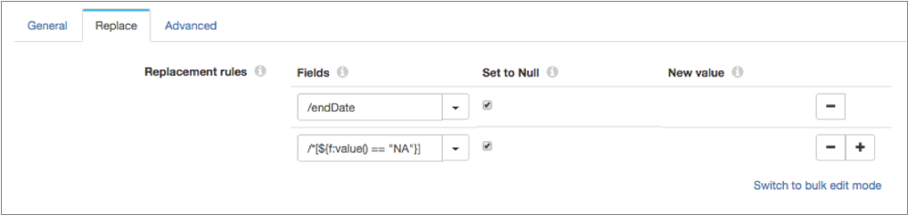
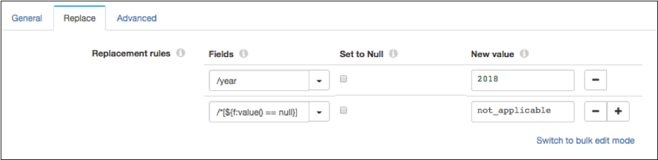

# 现场替代品

[支持的管道类型：](https://streamsets.com/documentation/controlhub/latest/help/datacollector/UserGuide/Pipeline_Configuration/ProductIcons_Doc.html#concept_mjg_ly5_pgb) 资料收集器

字段替换器用空值或新值替换字段中的值。使用字段替换器更新值或替换无效值。

配置处理器时，您定义要使用的替换规则。您可以替换指定字段中的所有值，也可以根据条件替换字段中的一组值。要基于条件替换值，请使用[字段路径表达式](https://streamsets.com/documentation/controlhub/latest/help/datacollector/UserGuide/Pipeline_Configuration/Expressions.html#concept_ir4_rxt_3cb)有条件地定义要替换的字段值。

如果定义多个替换规则，则字段替换器将按规则在处理器中列出的顺序替换值。

您也可以为字段不存在时配置错误处理。

## 用空值替换值

使用字段替换器处理器用空值替换字段中的值。您可以将所有值替换为空值，也可以根据条件替换一组值。

要替换字段中的所有值，只需指定一个字段，然后选择“ **设置为Null”即可**。

要使用基于条件的空值替换一组值，请使用字段路径表达式指定要使用的条件，然后选择“ **设置为Null”**。

例如，以下配置包括两个替换规则。第一条规则将endDate字段中的所有值设置为空值。第二条规则使用字段路径表达式有条件地仅将值为“ NA”的字段值设置为空值：



要在字段路径表达式中包含多个条件，请使用&&或||之类的逻辑运算符。例如，以下字段路径表达式返回所有设置为“ NA”或“ not_applicable”的值：

```
/*[${f:value() == "NA" || f:value() == 'not_applicable'}]
```

## 用新值替换值

使用字段替换器处理器用新值替换字段中的值。您可以替换所有值，也可以根据条件替换一组值。

要替换字段中的所有值，只需指定一个字段，然后指定新值即可。

要基于条件替换一组值，请使用字段路径表达式来指定要使用的条件，然后指定新值。

例如，以下配置包括两个替换规则。第一条规则将Year字段中的所有值设置为新值“ 2018”。第二条规则使用字段路径表达式有条件地仅将具有空值的字段值设置为新值“ not_applicable”：



要在字段路径表达式中包含多个条件，请使用&&或||之类的逻辑运算符。例如，以下字段路径表达式返回storeId字段中设置为“ 0289”的所有值：

```
/*[${f:path() == '/storeId' && f:value() == '0289'}]
```

## 有条件替换的数据类型

要基于条件替换一组值，请使用字段路径表达式来指定要使用的条件。您可以使用以下数据类型根据字段条件替换值：

- 字节
- 双
- 浮动
- 整数
- 长
- 短
- 串

## 配置字段替换器

使用字段替换器替换字段中的值。

1. 在“属性”面板的“ **常规”**选项卡上，配置以下属性：

   | 一般财产                                                     | 描述                                                         |
   | :----------------------------------------------------------- | :----------------------------------------------------------- |
   | 名称                                                         | 艺名。                                                       |
   | 描述                                                         | 可选说明。                                                   |
   | [必填项](https://streamsets.com/documentation/controlhub/latest/help/datacollector/UserGuide/Pipeline_Design/DroppingUnwantedRecords.html#concept_dnj_bkm_vq) | 必须包含用于将记录传递到阶段的记录的数据的字段。**提示：**您可能包括舞台使用的字段。根据为管道配置的错误处理，处理不包含所有必填字段的记录。 |
   | [前提条件](https://streamsets.com/documentation/controlhub/latest/help/datacollector/UserGuide/Pipeline_Design/DroppingUnwantedRecords.html#concept_msl_yd4_fs) | 必须评估为TRUE的条件才能使记录进入处理阶段。单击 **添加**以创建其他前提条件。根据为阶段配置的错误处理，处理不满足所有前提条件的记录。 |
   | [记录错误](https://streamsets.com/documentation/controlhub/latest/help/datacollector/UserGuide/Pipeline_Design/ErrorHandling.html#concept_atr_j4y_5r) | 该阶段的错误记录处理：放弃-放弃记录。发送到错误-将记录发送到管道以进行错误处理。停止管道-停止管道。对群集管道无效。 |

2. 在“ **替换”**选项卡上，为每个替换规则配置以下属性：

   | 替换规则属性                                                 | 描述                                                         |
   | :----------------------------------------------------------- | :----------------------------------------------------------- |
   | 领域                                                         | 要替换的字段。要替换字段中的所有值，请指定单个字段。要基于条件替换字段中的一组值，请使用[字段路径表达式](https://streamsets.com/documentation/controlhub/latest/help/datacollector/UserGuide/Pipeline_Configuration/Expressions.html#concept_ir4_rxt_3cb)来指定要使用的条件。**提示：**要使用所有字段，可以按如下所示使用星号通配符：`/*`。您也可以使用星号通配符表示[数组索引和映射元素](https://streamsets.com/documentation/controlhub/latest/help/datacollector/UserGuide/Pipeline_Configuration/Expressions.html#concept_vqr_sqc_wr)。 |
   | 设为空 [](https://streamsets.com/documentation/controlhub/latest/help/datacollector/UserGuide/Processors/FieldReplacer.html#concept_v4b_qmb_qcb) | 将字段值替换为null。                                         |
   | 新价值[](https://streamsets.com/documentation/controlhub/latest/help/datacollector/UserGuide/Processors/FieldReplacer.html#concept_k4w_btb_qcb) | 要使用的重置价值。输入一个值或输入一个计算结果为该值的表达式。 |

3. 使用[简单或批量编辑模式](https://streamsets.com/documentation/controlhub/latest/help/datacollector/UserGuide/Pipeline_Configuration/SimpleBulkEdit.html#concept_alb_b3y_cbb)，单击**添加**图标以添加其他替换规则。

4. 在“ **高级”**选项卡上，配置以下属性：

   | 先进物业   | 描述                                                         |
   | :--------- | :----------------------------------------------------------- |
   | 字段不存在 | 确定如何处理没有指定字段的记录：继续-通过尽可能多的处理来传递记录。发送到错误-将记录传递到管道以进行错误处理。 |