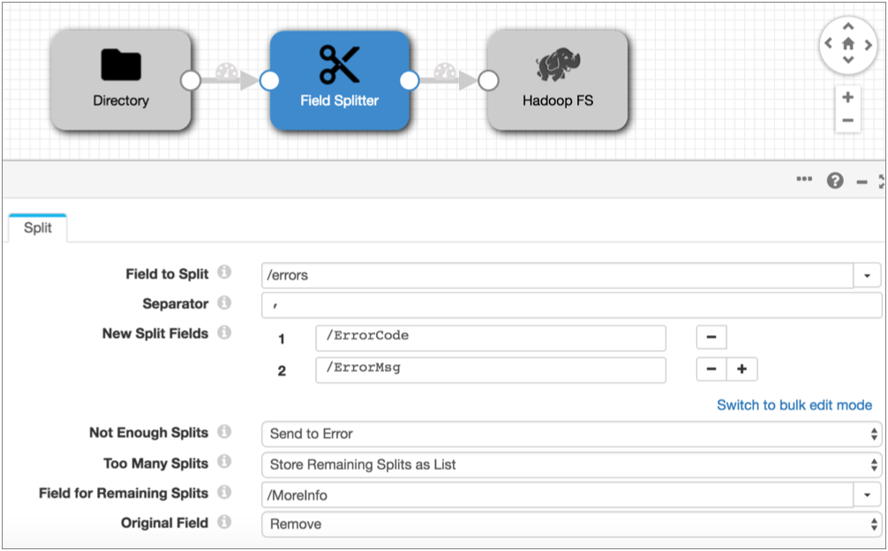

# 现场分配器

[支持的管道类型：](https://streamsets.com/documentation/controlhub/latest/help/datacollector/UserGuide/Pipeline_Configuration/ProductIcons_Doc.html#concept_mjg_ly5_pgb) 资料收集器

字段拆分器根据正则表达式拆分字符串数据，并将分离出的数据传递给新字段。使用字段拆分器将复杂的字符串值拆分为逻辑成分。

例如，如果字段包含以逗号分隔的错误代码和错误消息，则可以使用逗号将代码和消息分隔为不同的字段。

配置字段拆分器时，您可以指定要拆分的字段，用作分隔符的正则表达式以及用于拆分数据的字段。您可以配置当记录没有预期的拆分数量时该怎么办，以及当一条记录具有更多可能拆分的其他数据时该怎么办。

您可以保持原始字段被分割或丢弃。

## 拆分不足

当数据不包括处理器中列出的拆分字段数那么多的拆分时，字段没有足够的拆分。

当字段没有足够的拆分时，字段拆分器可以根据配置的阶段错误处理继续或处理记录。继续时，处理器将传递的记录与数据尽可能拆分，并为未使用的拆分字段传递空值。

例如，假设一个字段中的数据只有一个拆分分隔符。这将产生要写入两个拆分字段的数据，但是处理器具有三个列出的拆分字段。在这种情况下，处理器将根据“ **拆分不足”**属性处理记录。

## 拆分太多

当字段拆分过多时，字段拆分器可以将所有剩余数据包括在最后列出的拆分字段中，也可以将其他拆分写入指定的列表字段。

## 例

以下字段拆分器使用逗号将数据拆分为两个字段：ErrorCode和ErrorMsg。“没有足够的拆分”属性将没有足够拆分的记录发送到阶段以进行错误处理，并且该阶段被配置为丢弃错误记录。“太多拆分”属性将其他数据写入MoreInfo列表字段。

假设管道将以下记录集传递给处理器：

| **约会时间**          | **错误**                                                     |
| :-------------------- | :----------------------------------------------------------- |
| `21-09-2016 15:33:02` | `GM-302,information that you might need`                     |
| `21-09-2016 15:35:53` | `ME-3042,message about error,additional information from server, network error, driver error` |
| `21-09-2016 15:55:48` | `IMD-03234`                                                  |

当字段拆分器在错误字段中遇到逗号时，它将逗号之前的数据传递给ErrorCode字段，并将逗号之后的数据传递给ErrorMsg字段，并将任何其他字段写入MoreInfo列表字段。

字段拆分器将产生以下记录。处理器丢弃IMD-03234，因为该记录没有包含足够的数据以进行拆分，并且处理器配置为丢弃这些记录。

| **约会时间**          | **错误代码** | **错误消息**                      | **更多信息**                                                 |
| :-------------------- | :----------- | :-------------------------------- | :----------------------------------------------------------- |
| `21-09-2016 15:33:02` | `GM-302`     | `information that you might need` |                                                              |
| `21-09-2016 15:35:53` | `ME-3042`    | `message about error`             | `- additional information from server``- network error``- driver error` |

## 配置场分割器

配置字段拆分器以将数据从单个字段拆分为多个字段。您可以从单个字段拆分数据。要拆分其他字段，请在管道中添加另一个“字段拆分器”。

1. 在“属性”面板的“ **常规”**选项卡上，配置以下属性：

   | 一般财产                                                     | 描述                                                         |
   | :----------------------------------------------------------- | :----------------------------------------------------------- |
   | 名称                                                         | 艺名。                                                       |
   | 描述                                                         | 可选说明。                                                   |
   | [必填项](https://streamsets.com/documentation/controlhub/latest/help/datacollector/UserGuide/Pipeline_Design/DroppingUnwantedRecords.html#concept_dnj_bkm_vq) | 必须包含用于将记录传递到阶段的记录的数据的字段。**提示：**您可能包括舞台使用的字段。根据为管道配置的错误处理，处理不包含所有必填字段的记录。 |
   | [前提条件](https://streamsets.com/documentation/controlhub/latest/help/datacollector/UserGuide/Pipeline_Design/DroppingUnwantedRecords.html#concept_msl_yd4_fs) | 必须评估为TRUE的条件才能使记录进入处理阶段。单击 **添加**以创建其他前提条件。根据为阶段配置的错误处理，处理不满足所有前提条件的记录。 |
   | [记录错误](https://streamsets.com/documentation/controlhub/latest/help/datacollector/UserGuide/Pipeline_Design/ErrorHandling.html#concept_atr_j4y_5r) | 该阶段的错误记录处理：放弃-放弃记录。发送到错误-将记录发送到管道以进行错误处理。停止管道-停止管道。对群集管道无效。 |

2. 在“ **拆分”**选项卡上，配置以下属性：

   | 场分割器属性 | 描述                                                         |
   | :----------- | :----------------------------------------------------------- |
   | 要拆分的字段 | 要拆分的字符串字段。                                         |
   | 分隔器       | 用于拆分字段中数据的正则表达式。有关使用正则表达式的一些提示，请参见[正则表达式概述](https://streamsets.com/documentation/controlhub/latest/help/datacollector/UserGuide/Apx-RegEx/RegEx-Title.html#concept_vd4_nsc_gs)。 |
   | 新的拆分字段 | 用于传递拆分数据的新字段的名称。**注意：**每个字段名称前都带有斜线，如下所示：` /NewField`。 |
   | 拆分不足     | 当数据不包含指定数量的拆分字段时，记录处理：继续-在未使用的拆分字段中使用空值尽可能多地传递记录拆分。发送到错误-将记录发送到管道以进行错误处理。 |
   | 拆分太多     | 当数据包含的潜在拆分数超过指定数量的拆分字段时，记录处理：将剩余文本放入最后一个字段-将任何其他数据写入最后一个拆分字段。将剩余拆分存储为列表-拆分其他数据，并将拆分写入指定的“列表”字段。 |
   | 剩余拆分字段 | 剩余拆分的列表字段。当数据包含的分割数超过处理器的预期分割数时使用。 |
   | 原始领域     | 确定如何处理要拆分的原始字段：去掉保持                       |