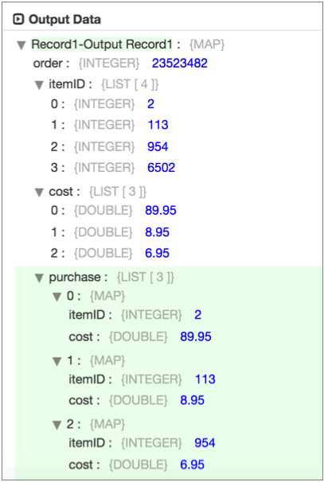
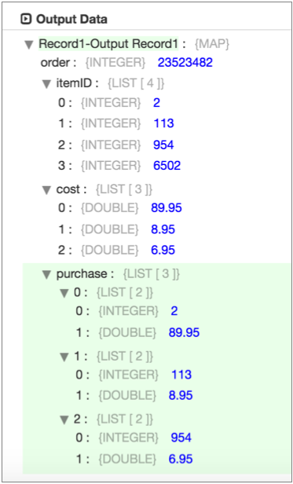
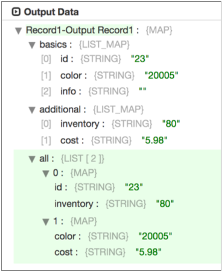
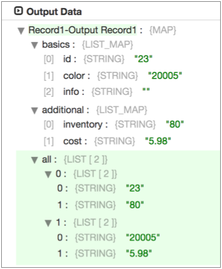

# Field Zip

[支持的管道类型：](https://streamsets.com/documentation/controlhub/latest/help/datacollector/UserGuide/Pipeline_Configuration/ProductIcons_Doc.html#concept_mjg_ly5_pgb) 资料收集器

Field Zip处理器将列表数据从两个字段合并到一个字段中。您可以使用Field Zip处理器合并两个List字段或List-Map字段。使用处理器合并相关的数据列表。

Field Zip处理器将列表数据与相应的列表合并。如果两个列表中的任何一个都比另一个列表包含更多的项目，则多余的列表项目不会合并。处理器保留原始列表字段，因此不会丢失任何数据。

配置Field Zip处理器时，可以指定要合并的两个字段和要写入合并数据的字段。默认情况下，处理器会合并列表中的字段名称和值。您可以将处理器配置为仅合并值。

如果记录中的一个或两个字段与指定的要合并的字段不匹配，则可以配置Field Zip处理器按原样传递记录而不合并任何字段，或将记录传递给管道以进行错误处理。

## 合并清单资料

在列表字段中合并数据时，Field Zip处理器会将列表中的每个项目与另一个列表中的相应项目合并。处理器使用列表的顺序合并列表，并返回Map字段的列表。

列表中没有其他列表中匹配项目的任何项目都不会合并。

例如，假设您有一个包含两个“列表”字段的记录：

| `order`  | `itemID`    | `cost`        |
| :------- | :---------- | :------------ |
| 23523482 | 21139546502 | 89.958.956.95 |

假设您将Field Zip处理器配置为合并ItemID和Cost字段，然后将数据写入Purchase字段。然后，Field Zip处理器将生成以下记录：

在“购买”字段中，合并的数据是“地图”字段的列表。每个映射在ItemID列表中具有字段名称和值，并与Cost列表中的相应字段名称和值合并。请注意，第四个ItemID / ItemID / 3未包含在合并列表中，因为它没有相应的成本信息。

如果将Field Zip处理器配置为仅合并值，则该处理器将返回相同的数据，但不包含原始字段名，如下所示：

## 合并列表地图数据

与列表字段一样，合并列表映射字段中的数据时，Field Zip处理器会将列表中的每个项目与另一个列表中的相应项目合并。处理器使用列表的顺序合并列表，并返回Map字段的列表。

区别在于，“映射”字段中的列表包含不同的信息对，而不是“列表”字段中的匹配信息对。

例如，假设您有一条包含两个List-Map字段的记录，每个字段在列表中都有一个地图：

| `basics`                       | `additional`            |
| :----------------------------- | :---------------------- |
| 0id：23颜色：20005信息：<null> | 0库存：80费用：5.98美元 |

假设您配置了Field Zip处理器以合并Basics和Additional List-Map字段，并将结果写入All字段。字段压缩生成以下记录：

注意每个地图如何包含不同的字段集。处理列表字段时，Field Zip返回匹配的字段集。还要注意，/ Basics / Info字段不包括在内，因为它在另一个List-Map字段中没有对应的项目。

如果将Field Zip处理器配置为仅合并值，则该处理器将返回相同的数据，但不包含原始字段名，如下所示：

## 透视合并列表

根据您的用例，您可能希望在将列表数据与Field Zip处理器合并之后，将Field Pivoter处理器添加到管道中。

Field Pivoter可以透视合并的列表数据，并为列表中的每个第一级项目创建一条记录。

例如，假设您使用“字段透视器”来处理在[上面](https://streamsets.com/documentation/controlhub/latest/help/datacollector/UserGuide/Processors/FieldZip.html#concept_ifv_3h1_hy)的第一个“ [列表”示例中](https://streamsets.com/documentation/controlhub/latest/help/datacollector/UserGuide/Processors/FieldZip.html#concept_ifv_3h1_hy)生成的数据 ，并且字段名称包含在合并列表中。您配置字段数据透视器以将数据透视表的数据写入名为Purchased_Item的新字段。

单个记录的枢轴将导致合并列表中的以下三个记录：

| 订购     | 物品ID      | 成本          | 采购                                                       | Purchased_Item       |
| :------- | :---------- | :------------ | :--------------------------------------------------------- | :------------------- |
| 23523482 | 21139546502 | 89.958.956.95 | itemID：2费用：89.95品名：113费用：8.95品名：954成本：6.95 | itemID：2费用：89.95 |
| 23523482 | 21139546502 | 89.958.956.95 | itemID：2费用：89.95品名：113费用：8.95品名：954成本：6.95 | 品名：113费用：8.95  |
| 23523482 | 21139546502 | 89.958.956.95 | itemID：2费用：89.95品名：113费用：8.95品名：954成本：6.95 | 品名：954成本：6.95  |

## 配置现场邮编处理器

使用Field Zip处理器合并记录中的两个对应的列表字段。

1. 在“属性”面板的“ **常规”**选项卡上，配置以下属性：

   | 一般财产                                                     | 描述                                                         |
   | :----------------------------------------------------------- | :----------------------------------------------------------- |
   | 名称                                                         | 艺名。                                                       |
   | 描述                                                         | 可选说明。                                                   |
   | [必填项](https://streamsets.com/documentation/controlhub/latest/help/datacollector/UserGuide/Pipeline_Design/DroppingUnwantedRecords.html#concept_dnj_bkm_vq) | 必须包含用于将记录传递到阶段的记录的数据的字段。**提示：**您可能包括舞台使用的字段。根据为管道配置的错误处理，处理不包含所有必填字段的记录。 |
   | [前提条件](https://streamsets.com/documentation/controlhub/latest/help/datacollector/UserGuide/Pipeline_Design/DroppingUnwantedRecords.html#concept_msl_yd4_fs) | 必须评估为TRUE的条件才能使记录进入处理阶段。单击 **添加**以创建其他前提条件。根据为阶段配置的错误处理，处理不满足所有前提条件的记录。 |
   | [记录错误](https://streamsets.com/documentation/controlhub/latest/help/datacollector/UserGuide/Pipeline_Design/ErrorHandling.html#concept_atr_j4y_5r) | 该阶段的错误记录处理：放弃-放弃记录。发送到错误-将记录发送到管道以进行错误处理。停止管道-停止管道。 |

2. 在“ **压缩”**选项卡上，配置以下属性：

   | 现场邮编属性 | 描述                                                         |
   | :----------- | :----------------------------------------------------------- |
   | 要压缩的字段 | 配置要合并的字段和输出字段，如下所示：第一个字段-要使用的第一个List或List-Map字段。第二个字段-要使用的第二个列表或列表映射字段。压缩字段的路径-处理器在其中写入合并列表数据的字段。 |
   | 仅邮编值     | 合并列表时仅包括字段值。未选择时，处理器将包括字段名称和值。有关处理器如何合并列表数据的更多信息，请参见[合并列表数据](https://streamsets.com/documentation/controlhub/latest/help/datacollector/UserGuide/Processors/FieldZip.html#concept_ifv_3h1_hy)。 |
   | 字段不存在   | 记录中不存在一个或两个列表字段时采取的措施：包括但不进行处理-按原样传递记录，而不创建合并字段。发送到错误-将记录传递到管道以进行错误处理。 |