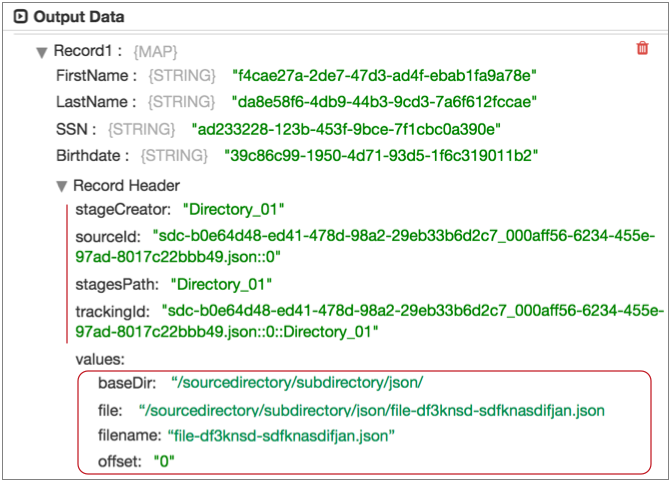

# Groovy评估器

[支持的管道类型：](https://streamsets.com/documentation/controlhub/latest/help/datacollector/UserGuide/Pipeline_Configuration/ProductIcons_Doc.html#concept_mjg_ly5_pgb) 资料收集器

Groovy评估器处理器使用Groovy代码来处理数据。使用Groovy Evaluator处理器来使用Groovy代码执行自定义处理。Groovy评估器支持Groovy 2.4版。

您可以为处理器开发以下脚本：

- 初始化脚本-可选的初始化脚本，用于设置任何必需的资源或连接。管道启动时，初始化脚本将运行一次。
- 主处理脚本-处理数据的主脚本。根据配置的处理模式，为每个记录或每批数据运行主脚本。
- 销毁脚本-可选的销毁脚本，用于关闭处理器打开的任何资源或连接。当管道停止时，destroy脚本将运行一次。

当您在管道中使用Groovy Evaluator处理器时，Data Collector会将一批数据传递给处理器，并将数据转换为脚本友好的数据结构以进行处理。

您可以从脚本中调用外部Java代码。您还可以将处理器配置为使用invokedynamic字节码指令。

该处理器提供了广泛的示例代码，可用于开发脚本。

在配置处理器时，您可以指定处理模式，输入脚本，并指定访问记录的方法以及脚本中使用的所有脚本参数。

## 处理方式

您可以选择Groovy Evaluator用于处理主脚本的处理模式。您可以在每种处理模式下使用相同的脚本。但是，在以批处理模式运行之前，应在主脚本中包括错误处理。

Groovy评估程序为主要脚本提供以下处理模式：

- 逐条记录

  处理器为每个记录调用脚本。处理器将记录作为映射传递到脚本，并分别处理每个记录。

  该脚本不需要错误处理逻辑。错误记录将传递给处理器以进行错误处理。处理器根据“记录错误”属性处理错误记录。

  使用此模式可以避免在代码中包含错误处理逻辑。由于此模式为每个记录调用脚本，因此管道性能将受到负面影响。

- 逐批处理

  处理器为每个批次调用脚本。处理器将批次作为列表传递给脚本，并一次处理该批次。

  在脚本中包括错误处理逻辑。没有错误处理逻辑，单个错误记录会将整个批次发送到处理器以进行错误处理。处理器根据“记录错误”属性处理错误记录。

  使用此模式可以一次处理一批数据来提高性能。

## Groovy脚本对象

您可以根据脚本类型在Groovy Evaluator处理器中使用不同的脚本对象：

| 脚本类型 | 有效的脚本对象                                               |
| :------- | :----------------------------------------------------------- |
| 在里面   | 您可以在初始化脚本中使用以下脚本对象：州日志直流sdcFunctions（不建议使用） |
| 主要     | 您可以在主脚本中使用以下脚本对象：记录州日志输出错误直流sdcFunctions（不建议使用） |
| 破坏     | 您可以在destroy脚本中使用以下脚本对象：州日志直流sdcFunctions（不建议使用） |

每种脚本类型中的脚本对象均相同：

- 记录

  要处理的记录的集合。记录对象根据您使用的处理模式包括不同的元素：按记录记录-记录数组包含一个记录元素。记录包含单个`value`元素。该 `value`元素包含的记录中的数据。逐批次-记录数组包含批次中的所有记录。

  映射和列表记录字段分别映射到Groovy映射和列表。

- 州

  一个对象，用于在init，main和destroy脚本的调用之间存储信息。状态是包含键/值对集合的映射对象。您可以使用该`state`对象来缓存数据，例如查找，计数器或与外部系统的连接。

  该`state`对象的功能非常类似于成员变量：该信息是暂时的，并且在管道停止或重新启动时会丢失。该`state`对象仅可用于定义它的处理器级实例。如果管道以集群模式执行，则该`state`对象不会在节点之间共享。

  该`state`对象的相同实例可用于所有三个脚本。例如，您可以使用init脚本打开与数据库的连接，然后在该`state`对象中存储对该连接的引用。在主脚本中，您可以使用`state`对象访问打开的连接。然后，在销毁脚本中，可以使用`state` 对象关闭连接。

  **警告：**该`state`对象最适合用于固定或静态数据集。在每条记录或批处理上添加到缓存中会迅速消耗分配给Data Collector的内存，并导致内存不足异常。

- 日志

  将消息写入log4j日志的对象。使用 `sdc.log`访问配置为舞台的对象。该对象包括与日志文件中的级别相对应的方法：`info(, ...)``warn(, ...)``error(, ...)``trace(, ...)`消息模板可以包含位置变量，用大括号{}表示。在编写消息时，该方法用相应位置的参数替换每个变量-即，方法将第一个{}出现的位置替换为第一个参数，依此类推。

- 输出

  将记录写入输出批处理的对象。使用 `sdc.output`访问配置为舞台的对象。该对象包括`write()` 方法。

- 错误

  传递错误记录以进行错误处理的对象。使用 `sdc.error`访问配置为舞台的对象。该对象包括`write(, )`方法。

- 直流

  一个包装对象，用于访问脚本可用的常量，方法和对象。

  该`sdc`对象包含以下常量：`userParams` -词典，其中包含脚本参数和在“高级”选项卡上配置的参数以及“脚本中的参数”属性。

  该`sdc`对象包含以下方法：`createRecord()`-返回带有传递的ID的新记录。传递一个唯一标识记录的字符串，该字符串包含足够的信息以跟踪记录源。`isPreview()` -返回一个布尔值，该值指示管道是否处于预览模式。`getFieldNull(, )` -返回以下之一：如果该值不为null，则位于指定路径的字段的值为字段类型定义的空对象，例如 `NULL_INTEGER`或 `NULL_STRING`，如果值是null`NULL`如果指定的路径上没有字段，则为未分配的空对象`createMap()` -返回地图，用作记录中的字段。通过 `true`创建列表地图字段，或 `false`创建地图字段。`createEvent(, )`-返回具有指定事件类型和版本的新事件记录。在实施事件方法之前，请验证该阶段是否启用了事件生成。`toEvent()`-将事件记录发送到事件输出流。在实施事件方法之前，请验证该阶段是否启用了事件生成。`pipelineParameters()` -返回为管道定义的所有运行时参数的映射。

- sdc功能

  运行评估或修改数据功能的对象。**重要说明：**该 `sdcFunctions`对象现已弃用，并将在以后的版本中删除。要评估和修改数据，请使用`sdc`对象中的方法。该`sdcFunctions`对象包括以下方法：`getFieldNull(, )` -返回以下之一：如果该值不为null，则位于指定路径的字段的值为字段类型定义的空对象，例如 `NULL_INTEGER`或 `NULL_STRING`，如果值是null`NULL`如果指定的路径上没有字段，则为未分配的空对象`createRecord()`-返回带有传递的ID的新记录。传递一个唯一标识记录的字符串，该字符串包含足够的信息以跟踪记录源。`createMap()` -返回地图，用作记录中的字段。通过 `true`创建列表地图字段，或 `false`创建地图字段。`createEvent(, )`-返回具有指定事件类型和版本的新事件记录。在实施事件方法之前，请验证该阶段是否启用了事件生成。`toEvent()`-将事件记录发送到事件输出流。在实施事件方法之前，请验证该阶段是否启用了事件生成。`isPreview()` -返回一个布尔值，该值指示管道是否处于预览模式。`pipelineParameters()` -返回为管道定义的所有运行时参数的映射。

## 访问记录详细信息


默认情况下，您使用脚本语言中的本机类型来访问脚本中的记录。但是，对于本机类型，您无法轻松访问Data Collector 记录的所有功能，例如字段属性。

要直接将脚本中的记录作为Data Collector 记录访问，请将“记录类型”高级属性设置为，以配置阶段以使用Data Collector Java API处理脚本中的记录`Data Collector Records`。

在脚本中，从Java包中引用所需的类`com.streamsets.pipeline.api`，然后使用适当的方法访问记录和字段。使用Data Collector Java API，脚本可以访问Data Collector 记录的所有功能。有关完整说明，请参阅[GitHub中](https://github.com/streamsets/datacollector-api/blob/master/src/main/java/com/streamsets/pipeline/api/Record.java#L64)的[Data Collector Java API](https://github.com/streamsets/datacollector-api/blob/master/src/main/java/com/streamsets/pipeline/api/Record.java#L64)。

例如，在脚本中包括以下几行，以使用Data Collector Java API执行以下操作：

- 创建一个名为的字符串字段`new`，并将其值设置为 `new-value`。
- 更新名为的现有字段，以`old`将`attr`属性的值设置 为`attr-value`。

```
import com.streamsets.pipeline.api.Field
...
record.sdcRecord.set('/new', Field.create(Field.Type.STRING, 'new-value'))
record.sdcRecord.get('/old').setAttribute('attr', 'attr-value')
...
```

## 处理列表地图数据

在处理列表地图数据的脚本中，将数据视为地图。

列表映射是一种数据收集器数据类型，它允许您使用标准记录功能来处理定界数据。当原始读取分隔的数据时，默认情况下会生成列表映射字段。

Groovy评估程序可以读取并传递列表地图数据。但是要处理列表映射字段中的数据，请将该字段视为脚本中的映射。

## 类型处理

使用 Groovy Evaluator处理器时，请注意以下类型信息：

- 空值的数据类型

  您可以将空值与数据类型相关联。例如，如果脚本为Integer字段分配了空值，则该字段将作为具有空值的整数返回给管道。在Groovy代码中使用常量来创建具有空值的特定数据类型的新字段。例如，可以通过将`NULL_STRING`类型常量分配给字段来创建具有空值的新String字段， 如下所示：`record.value['new_field'] = sdc.NULL_STRING`

- 日期字段

  使用String数据类型创建一个新字段，以特定格式存储日期。例如，以下示例代码创建一个新的String字段，该字段使用以下格式存储当前日期 `YYYY-MM-dd`：` // Define a date object to record the current date def date = new Date() for (record in records) {  try {    // Create a string field to store the current date with the specified format    record.value['date'] = date.format('YYYY-MM-dd')        // Write a record to the output    sdc.output.write(record)  } catch (e) {    // Send a record to error    sdc.log.error(e.toString(), e)    sdc.error.write(record, e.toString())  } }`

## 事件产生

您可以使用Groovy Evaluator处理器为事件流生成事件记录。当您希望舞台根据脚本逻辑生成事件记录时，请启用事件生成。

与任何记录一样，您可以将事件记录向下游传递到目标以进行事件存储，也可以传递给可以配置为使用事件的任何执行程序。有关事件和事件框架的更多信息，请参阅[数据流触发器概述](https://streamsets.com/documentation/controlhub/latest/help/datacollector/UserGuide/Event_Handling/EventFramework-Title.html#concept_cph_5h4_lx)。

生成事件：

1. 在

   常规

   选项卡上，选择

   生产事件

   属性。

   这样可以使用事件输出流。

2. 在脚本中包括

   以下两个方法：

   - ```
     sdc.createEvent(<String type>, <Integer version>)
     ```

      -创建具有指定事件类型和版本号的事件记录。您可以创建新的事件类型或使用现有的事件类型。现有事件类型在其他事件生成阶段中记录。

     事件记录不包含任何记录字段。根据需要生成记录字段。

   - `sdc.toEvent()` -用于将事件传递到事件输出流。

## 使用记录标题属性

您可以使用Groovy Evaluator处理器读取，更新或创建记录头属性。

创建或更新标题属性时，请使用地图。如果存在标头属性，则脚本将更新该值。如果不存在，脚本将创建属性并将其设置为指定的值。

所有记录都包括一组内部记录头属性，这些阶段在处理记录时会自动更新。错误记录还具有其自己的内部标头属性集。您不能在脚本中更改内部标头属性的值。

某些阶段会生成自定义记录标题属性，这些属性将以特定方式使用。例如，Oracle CDC客户端源在记录标题属性中指定记录的操作类型。事件生成阶段为事件记录创建一组事件头属性。 有关更多信息，请参见[记录头属性](https://streamsets.com/documentation/controlhub/latest/help/datacollector/UserGuide/Pipeline_Design/RecordHeaderAttributes.html#concept_wn2_jcz_dz)。

您可以使用以下记录头变量来处理头属性：

- `record.` -用于返回标头属性的值。
- `record.attributes` -用于返回自定义记录标题属性的映射，或创建或更新特定记录标题属性。

**提示：**使用数据预览可以查看记录中包含的记录标题属性。

### 查看记录标题属性

您可以使用数据预览来查看与管道中任何给定点上的记录关联的记录头属性。若要查看记录标题属性，请启用“显示记录/字段标题数据”预览属性。

例如，下图显示了由目录起源在数据预览中生成的记录。

s

“记录标题”列表在管道的这一点上显示记录中的只读内部属性集。您可以使用`record.`变量返回这些属性的值。

“值”下的标题属性是由目录来源创建的属性。您可以使用 `record.attributes`变量返回或修改这些属性。使用`record.attributes`变量创建标题属性时，在数据预览期间它将显示在此位置。

## 访问整个文件格式记录

在处理整个文件数据格式的管道中，可以使用Groovy Evaluator读取整个文件数据。

通过使用getInputStream（）API创建输入流，处理器可以访问整个文件记录中的fileref字段。例如，您可以使用处理器读取fileref字段中的文件数据，然后使用该数据创建新记录。处理器可以访问fileref字段，但不能修改该字段中的信息。

使用以下行来创建然后读取输入流：

```
input_stream = record.value['fileRef'].getInputStream()
input_stream.read()
```

处理器读取输入流后，在代码中包含以下行以关闭输入流：

```
input_stream.close()
```

**相关概念**

[整个文件数据格式](https://streamsets.com/documentation/controlhub/latest/help/datacollector/UserGuide/Data_Formats/WholeFile.html#concept_nfc_qkh_xw)

## 调用外部Java代码

您可以从Groovy Evaluator处理器调用外部Java代码。只需安装外部Java库即可使其对处理器可用。然后，从为处理器开发的Groovy脚本中调用外部Java代码。

有关安装其他驱动程序的信息，请参阅 Data Collector 文档 中的“ [安装外部库](https://streamsets.com/documentation/datacollector/latest/help/#datacollector/UserGuide/Configuration/ExternalLibs.html%23concept_pdv_qlw_ft) ”。

要从Groovy脚本调用外部Java代码，只需将import语句添加到脚本中，如下所示：

```
import <package>.<class name>
```

例如，假设您安装了Bouncy Castle JAR文件以计算SHA-3（安全哈希算法3）摘要。将以下语句添加到脚本中：

```
import org.bouncycastle.jcajce.provider.digest.SHA3
```

有关更多信息，请参见以下StreamSets博客文章： [从Script Evaluators调用外部Java代码](https://streamsets.com/blog/calling-external-java-code-script-evaluators/)。

## 授予Groovy脚本权限

如果Data Collector使用Java安全管理器，并且Groovy代码需要访问网络资源，则必须更新Data Collector安全策略以包括Groovy脚本。

默认情况下启用Java安全管理器。有关更多信息，请参阅Data Collector 文档中的[Java Security Manager](https://streamsets.com/documentation/datacollector/latest/help/datacollector/UserGuide/Configuration/DCEnvironmentConfig.html#concept_tm4_pbg_ht)。

1. 在Data Collector 配置目录中，编辑安全策略：

   ```
   $SDC_CONF/sdc-security.policy
   ```

2. 将以下行添加到文件中：

   ```
   // groovy source code
   grant codebase "file:///groovy/script" { 
     <permissions>;
   };
   ```

   ``您授予Groovy脚本的权限在哪里。

   例如，要授予`/data/files`目录和子目录中所有文件的读取权限 ，请添加以下行：

   ```
   // groovy source code
   grant codebase "file:///groovy/script" { 
     permission java.util.PropertyPermission "*", "read";
     permission java.io.FilePermission "/data/files/*", "read";
   };
   ```

3. 重新启动Data Collector。

## 配置Groovy评估器

配置Groovy Evaluator处理器以在管道中使用自定义Groovy代码。

1. 在“属性”面板的“ **常规”**选项卡上，配置以下属性：

   | 一般财产                                                     | 描述                                                         |
   | :----------------------------------------------------------- | :----------------------------------------------------------- |
   | 名称                                                         | 艺名。                                                       |
   | 描述                                                         | 可选说明。                                                   |
   | [产生事件](https://streamsets.com/documentation/controlhub/latest/help/datacollector/UserGuide/Processors/Groovy.html#concept_qcz_ssq_1y) | 发生事件时生成事件记录。用于[事件处理](https://streamsets.com/documentation/controlhub/latest/help/datacollector/UserGuide/Event_Handling/EventFramework-Title.html#concept_cph_5h4_lx)。 |
   | [必填项](https://streamsets.com/documentation/controlhub/latest/help/datacollector/UserGuide/Pipeline_Design/DroppingUnwantedRecords.html#concept_dnj_bkm_vq) | 必须包含用于将记录传递到阶段的记录的数据的字段。**提示：**您可能包括舞台使用的字段。根据为管道配置的错误处理，处理不包含所有必填字段的记录。 |
   | [前提条件](https://streamsets.com/documentation/controlhub/latest/help/datacollector/UserGuide/Pipeline_Design/DroppingUnwantedRecords.html#concept_msl_yd4_fs) | 必须评估为TRUE的条件才能使记录进入处理阶段。单击 **添加**以创建其他前提条件。根据为阶段配置的错误处理，处理不满足所有前提条件的记录。 |
   | [记录错误](https://streamsets.com/documentation/controlhub/latest/help/datacollector/UserGuide/Pipeline_Design/ErrorHandling.html#concept_atr_j4y_5r) | 该阶段的错误记录处理：放弃-放弃记录。发送到错误-将记录发送到管道以进行错误处理。停止管道-停止管道。对群集管道无效。 |

2. 在**Groovy**选项卡上，配置以下属性：

   | Groovy评估器属性                                             | 描述                                                         |
   | :----------------------------------------------------------- | :----------------------------------------------------------- |
   | [记录处理方式](https://streamsets.com/documentation/controlhub/latest/help/datacollector/UserGuide/Processors/Groovy.html#concept_ljq_z2t_gv) | 确定Groovy Evaluator如何处理主脚本：按记录记录-单独处理记录。执行错误处理。逐批处理-批量处理记录。在脚本中需要错误处理代码。默认为逐批。 |
   | 初始化脚本                                                   | 要使用的可选初始化脚本。用于设置任何必需的连接或资源。管道启动时运行一次。 |
   | 脚本                                                         | 要使用的主要处理脚本。根据配置的处理模式，为每个记录或每批数据运行。 |
   | 销毁脚本                                                     | 要使用的可选销毁脚本。用于关闭使用的所有连接或资源。管道停止时运行一次。 |

3. 在“ **高级”**选项卡上，配置以下属性：

   | 先进物业                                                     | 描述                                                         |
   | :----------------------------------------------------------- | :----------------------------------------------------------- |
   | [记录类型](https://streamsets.com/documentation/controlhub/latest/help/datacollector/UserGuide/Processors/Groovy.html#concept_osl_brr_j3b) | 脚本执行期间要使用的记录类型：数据收集器记录-选择脚本何时使用数据收集器 Java API方法访问记录。本机对象-选择脚本何时使用本机类型访问记录。默认值为“本机对象”。 |
   | 启用invokedynamic编译器选项                                  | 启用对invokedynamic字节码指令的使用。根据使用情况，这可能会对性能产生不同的影响。有关Groovy调用动态支持的更多信息，请参见http://groovy-lang.org/indy.html。 |
   | 脚本中的参数                                                 | 脚本参数及其值。脚本使用`sdc.userParams` 字典访问值。        |