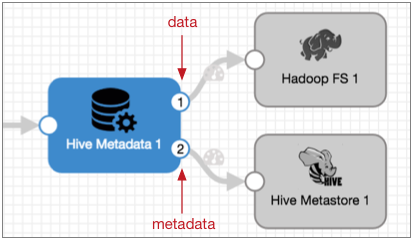

# 蜂巢元数据

[支持的管道类型：](https://streamsets.com/documentation/controlhub/latest/help/datacollector/UserGuide/Pipeline_Configuration/ProductIcons_Doc.html#concept_mjg_ly5_pgb) 资料收集器

Hive Metadata处理器可与Hive Metastore目标一起使用，而Hadoop FS或MapR FS目标则可作为Hive漂移同步解决方案的一部分。

当您希望Hive Metastore目标根据需要创建和更新表时，请使用Hive Metadata处理器将记录写入HDFS或MapR FS。处理器还生成记录头属性，Hadoop FS目标和MapR FS目标可使用它们来处理数据。

配置Hive元数据处理器时，您将定义Hive的连接信息以及用于定义记录所需的数据库，表，分区和十进制字段表达式的表达式。您还可以指定要使用的数据格式：Avro或Parquet。

您定义Hive和Hadoop配置文件的位置，并可以选择指定其他必需属性。您还可以配置高级选项，例如最大高速缓存大小，时间基础，十进制精度和小数位表达式以及元数据记录的自定义记录头属性。

有关Hive的漂移同步解决方案以及处理Avro和Parquet数据的案例研究的更多信息，请参见[Hive的漂移同步解决方案](https://streamsets.com/documentation/controlhub/latest/help/datacollector/UserGuide/Hive_Drift_Solution/HiveDriftSolution_title.html#concept_phk_bdf_2w)。有关教程，请查看我们[在GitHub上](https://github.com/streamsets/tutorials/blob/master/tutorial-hivedrift/readme.md)的[教程](https://github.com/streamsets/tutorials/blob/master/tutorial-hivedrift/readme.md)。

## 输出流

Hive元数据处理器包括数据和元数据输出流。下图显示了Hive元数据处理器的输出流：



- 数据输出流

  将记录向下传递到Hadoop FS目标或MapR FS目标。您可以在需要时在Hive元数据处理器和目标之间添加其他阶段，但是只有Hadoop FS和MapR FS目标可以使用生成的记录头属性来写入记录。

- 元数据输出流

  将元数据记录向下游传递到Hive Metastore目标。元数据输出流不传递任何类型的记录数据。您可以在需要时在Hive Metadata处理器和Hive Metastore目标之间添加其他阶段，但是只有Hive Metastore目标可以使用元数据记录来更新Hive Metastore。

## 元数据记录和记录标题属性

Hive元数据处理器产生以下专用输出：

- 元数据记录

  当遇到兼容的元数据更改时，Hive元数据处理器会生成元数据记录。元数据记录将以下信息传递到Hive Metastore目标：基于记录的兼容更改的预期表结构。兼容的更改包括新表和分区，以及记录中字段的添加或删除。数据类型的更改不兼容。在阶段中配置的任何用户定义的记录头属性。

  当Hive Metastore目标接收到元数据记录时，目标将对Hive元数据执行最终检查，并根据需要创建或更改表。

- 数据记录头属性

  Hive元数据处理器将以下属性添加到数据记录的记录头中：targetDirectory-每个记录应写入的位置。处理器基于数据库，表和分区信息为每个记录生成目录，并将其写入targetDirectory标头属性。处理Parquet数据时，Hive元数据处理器将.avro添加到它为每个记录生成的目标目录中。这样，数据处理目标就可以将Avro文件写入到Hive忽略的临时目录中。结果，目标将文件写入以下目录：`/.avro`。**注意：** 您可以配置MapReduce执行程序以将Parquet文件写入父生成的目录，并在处理它们后删除Avro文件。您还可以根据需要在处理文件后删除临时目录。要使用此标头属性，请将Hadoop FS或MapR FS目标配置为使用记录标头中的目录写入记录。avroSchema-记录的Avro模式。处理器将Avro模式写入每个记录的avroSchema标头属性中。当处理器注意到Avro模式中的兼容更改时，它将生成新的Avro模式。此属性同时用于Avro和Parquet数据。要使用此标头属性，请将Hadoop FS或MapR FS目标配置为使用记录标头中的Avro模式写入记录。roll-用于滚动与记录关联的文件的指示器。仅当Avro模式以兼容方式更改时，处理器才会生成前滚指示器。具有不兼容更改的记录将发送到阶段以进行错误处理。要使用此标头属性，请在遇到记录标头中的roll属性时，将Hadoop FS或MapR FS目标配置为滚动记录。然后，使用默认的“ roll”作为标题属性的名称。

  有关使用目标来处理这些属性的更多信息，请参见[基于记录的写入的记录头属性](https://streamsets.com/documentation/controlhub/latest/help/datacollector/UserGuide/Pipeline_Design/RecordHeaderAttributes.html#concept_lmn_gdc_1w)。有关记录标题属性的一般信息，请参见“ [记录标题属性”](https://streamsets.com/documentation/controlhub/latest/help/datacollector/UserGuide/Pipeline_Design/RecordHeaderAttributes.html#concept_wn2_jcz_dz)。

### 自定义记录标题属性

您可以配置Hive元数据处理器为该处理器生成的元数据记录创建自定义记录头属性。您可以使用常量定义自定义属性，也可以使用表达式根据记录或管道中的信息定义属性。

当您将元数据记录路由到Hive Metastore目标以外的目标时，可以使用自定义记录头属性。Hive Metastore目标使用元数据记录中的字段信息，但是大多数其他目标（例如Amazon S3或Kafka Producer目标）可以根据表达式的值将元数据记录写入不同的位置。而且，您可以配置表达式以使用您定义的自定义标头属性。

例如，假设每个传入记录都有一个SalesRegion值，您想使用该值将元数据记录写入不同的Amazon S3分区。您可以配置Hive元数据处理器以创建SRegion标头属性，并使用该 `${record:value('/SalesRegion')}`表达式定义属性。配置Amazon S3目标时，可以使用以下表达式定义分区前缀：`${record.attribute('SRegion')}`。

## 数据库，表和分区表达式

您可以在Hive元数据处理器中配置以下表达式：

- 数据库和表表达式

  数据库表达式表示Hadoop FS或MapR FS目标应在其中写入记录的数据库。如果省略数据库表达式，则处理器将使用默认的Hive数据库。

  表表达式表示要使用的表。如果该表不存在，则处理器将生成元数据记录以创建该表。

  数据库和表表达式也合并到targetDirectory中，以允许对数据库进行基于记录的写入。

  有关配置数据库和表表达式的提示：如果将所有记录都写到单个数据库或表中，则可以输入数据库或表名而不是表达式。如果可以从记录数据或标题属性中推断出数据库或表名，则可以输入一个计算结果为数据库或表名的表达式。必要时，您可以在管道中的较早位置使用表达式计算器来执行计算，并将结果写入新的字段或标头属性，以供Hive元数据处理器使用。

- 分区配置信息

  您可以选择配置分区属性以写入分区。配置分区信息时，请声明Hive分区列名称，计算结果为分区名称的表达式以及分区数据的数据格式。您可以将Int，Bigint和String数据格式用于分区数据。

  与数据库和表表达式一样，您可以根据需要配置分区表达式：如果所有记录都将写入一个分区，则可以输入表达式的分区名称。如果分区取决于记录中的信息，则可以输入一个计算结果为该分区的表达式。必要时，可以在管道中的较早位置使用表达式计算器来生成分区名称，并将其作为新字段写入记录中，或者将记录头作为标头属性写入。

  您可以使用$ {YYYY（）}或$ {DD（）}之类的日期时间变量来创建基于日期时间的分区。创建基于日期时间的分区时，请考虑要使用的时间基准。默认情况下，处理器使用处理时间作为时间基准，但是您也可以使用与记录关联的时间。

  有关日期[时间变量的](https://streamsets.com/documentation/controlhub/latest/help/datacollector/UserGuide/Expression_Language/DateTimeVariables.html#concept_gh4_qd2_sv)详细信息，请参见[日期时间变量](https://streamsets.com/documentation/controlhub/latest/help/datacollector/UserGuide/Expression_Language/DateTimeVariables.html#concept_gh4_qd2_sv)。

### 配置单元名称和支持的字符

配置单元表名称，列名称和分区名称使用小写字母创建。

下表列出了可以在名称中使用的有效字符：

| 名称     | 支持的字符                                       |
| :------- | :----------------------------------------------- |
| 表名     | 字母数字字符和下划线（_）。                      |
| 列名     | 字母数字字符和下划线，但必须以字母或下划线开头。 |
| 分区名称 | 字母数字字符和下划线，但必须以字母开头。         |

**注意：**当与记录关联的表，分区或列名包含不受支持的字符或无效格式时，处理器会将记录发送到错误。

## 小数字段表达式

小数字段表达式定义了用于小数字段的精度和小数位数。配置Hive元数据处理器时，可以为精度和小数位指定表达式。

您可以为表达式中的所有十进制字段输入表达式，以相同的精度和小数位数求值。例如，如果您的用例允许，则可以为所有小数字段使用精度10和小数位2。

或者，您可以创建一个更复杂的表达式，该表达式对于不同的十进制字段将得出不同的值。

这些属性的默认表达式使用JDBC标头属性。在处理来自JDBC Multitable Consumer或JDBC Query Consumer的数据时，可以使用以下默认表达式：

```
${record:attribute(str:concat(str:concat('jdbc.', field:field()), '.precision'))}
${record:attribute(str:concat(str:concat('jdbc.', field:field()), '.scale'))}
```

该`field:field`函数返回字段的名称。因此，默认情况下，表达式解析为：

```
${record:attribute(jdbc.<fieldname>.precision)}
${record:attribute(jdbc.<fieldname>.scale)}
```

**注意：**默认情况下，“ JDBC查询使用者”会创建JDBC标头属性，并将每个小数字段的精度和小数位写入记录标头属性。JDBC多表使用者始终创建JDBC标头属性。

在这些表达式中，“ jdbc”。表示JDBC标头属性的默认前缀。您可以在JDBC查询使用者中更改前缀。如果更改前缀，请确保在十进制字段表达式中对其进行更新。JDBC多表使用者始终使用“ jdbc”。作为前缀。

有关使JDBC查询使用者能够创建JDBC标头属性的信息，请参阅[Drift Synchronization Solution中的标头属性](https://streamsets.com/documentation/controlhub/latest/help/datacollector/UserGuide/Origins/JDBCConsumer.html#concept_tvf_tgp_fx)。

## 时间基础

时间基础有助于确定何时创建基于日期时间的分区。分区用于元数据记录中，并作为targetDirectory路径的一部分。您可以使用以下时间作为时间基础：

- 处理时间

  当您将处理时间用作时间基准时，处理器将使用处理时间和分区值表达式来确定要在元数据记录和targetDirectory标头属性的分区部分中使用的分区值。

  例如，假设一个分区值表达式每天创建一个新的分区，时间基础就是处理时间。然后，处理器会生成Hive Metastore目标用来创建每日分区的每日元数据记录。然后，处理器将每日分区值添加到targetDirectory路径。

  要将处理时间用作时间基准，请使用以下表达式： `${time:now()}`。这是默认的时间基准。

- 基于记录的时间

  当您使用与记录关联的时间作为时间基准时，您可以在记录中指定日期字段作为分区值表达式的一部分。处理器使用与记录和分区值表达式关联的日期时间来确定要在元数据记录和targetDirectory标头属性的分区部分中使用的分区值。

  例如，假设一个分区值表达式每小时创建一个目录，并且时间基础基于记录。然后，对于与记录相关联的每个小时，处理器都会生成一个元数据记录，以便Hive Metastore目标可以根据需要创建每小时的分区。然后，处理器将每小时的分区值添加到targetDirectory路径。

  要使用与记录关联的时间，请使用一个表达式，该表达式调用一个字段并解析为日期时间值，例如 `${record:value("/Timestamp")}`。

## 快取

Hive元数据处理器向Hive查询信息并缓存结果。在可能的情况下，它将缓存用于记录比较，以避免不必要的Hive查询。

处理器缓存以下Hive元数据：

- 要写入的数据库和表
- 蜂巢表属性
- 表中的列名和数据类型
- Avro模式
- 分区值

### 缓存大小和逐出

您可以配置缓存的最大大小。当缓存达到指定的限制时，它将使用LRU逐出策略，该策略将删除最近最少使用的数据，以允许将新条目写入缓存。

## Kerberos身份验证

您可以使用Kerberos身份验证连接到HDFS或MapR FS。使用Kerberos身份验证时，Data Collector 使用Kerberos主体和密钥表连接到HiveServer2。

Kerberos主体和密钥表在Data Collector 配置文件中定义` $SDC_CONF/sdc.properties`。要使用Kerberos身份验证，请在Data Collector 配置文件中配置所有Kerberos属性，并将Kerberos主体包括在HiveServer2 JDBC URL中。

## 配置单元属性和配置文件

您必须将Hive元数据配置为使用Hive和Hadoop配置文件以及各个属性。

- 配置文件

  Hive元数据处理器需要以下配置文件：core-site.xmlhdfs-site.xmlhive-site.xml

- 个别属性

  您可以在处理器中配置各个Hive属性。要添加Hive属性，请指定确切的属性名称和值。处理器不验证属性名称或值。**注意：**各个属性会覆盖配置文件中定义的属性。

## 配置Hive元数据处理器

配置Hive元数据处理器以评估Avro数据并为Hive Metastore和Hadoop FS或MapR FS目标生成Hive元数据信息。

1. 在“属性”面板的“ **常规”**选项卡上，配置以下属性：

   | 一般财产                                                     | 描述                                                         |
   | :----------------------------------------------------------- | :----------------------------------------------------------- |
   | 名称                                                         | 艺名。                                                       |
   | 描述                                                         | 可选说明。                                                   |
   | [必填项](https://streamsets.com/documentation/controlhub/latest/help/datacollector/UserGuide/Pipeline_Design/DroppingUnwantedRecords.html#concept_dnj_bkm_vq) | 必须包含用于将记录传递到阶段的记录的数据的字段。**提示：**您可能包括舞台使用的字段。根据为管道配置的错误处理，处理不包含所有必填字段的记录。 |
   | [前提条件](https://streamsets.com/documentation/controlhub/latest/help/datacollector/UserGuide/Pipeline_Design/DroppingUnwantedRecords.html#concept_msl_yd4_fs) | 必须评估为TRUE的条件才能使记录进入处理阶段。单击 **添加**以创建其他前提条件。根据为阶段配置的错误处理，处理不满足所有前提条件的记录。 |
   | [记录错误](https://streamsets.com/documentation/controlhub/latest/help/datacollector/UserGuide/Pipeline_Design/ErrorHandling.html#concept_atr_j4y_5r) | 该阶段的错误记录处理：放弃-放弃记录。发送到错误-将记录发送到管道以进行错误处理。停止管道-停止管道。对群集管道无效。 |

2. 在“ **配置单元”**选项卡上，配置以下属性：

   | 蜂巢属性         | 描述                                                         |
   | :--------------- | :----------------------------------------------------------- |
   | JDBC URL         | Hive的JDBC URL。您可以使用默认值，也可以在适当时用特定的数据库名称替换数据库名称的表达式。如果您的URL包含带有特殊字符的密码，则必须对特殊字符进行URL编码（也称为百分比编码）。否则，在验证或运行管道时将发生错误。例如，如果您的JDBC URL如下所示：`jdbc:hive2://sunnyvale:12345/default;user=admin;password=a#b!c$e`对您的密码进行URL编码，以便您的JDBC URL如下所示：`jdbc:hive2://sunnyvale:12345/default;user=admin;password=a%23b%21c%24e`要模拟与Hive的连接中的当前用户，您可以编辑 sdc.properties文件以将Data Collector配置为自动模拟该用户，而无需在URL中指定代理用户。请参阅[配置数据收集器](https://streamsets.com/documentation/controlhub/latest/help/datacollector/UserGuide/Configuration/ConfiguringDataCollector.html#task_lxk_kjw_1r)。有关指定URL的更多信息，请参见我们的[Ask StreamSets帖子](https://ask.streamsets.com/question/7/how-do-you-configure-a-hive-impala-jdbc-driver-for-data-collector/?answer=8#post-id-8)。 |
   | JDBC驱动程序名称 | 完全限定的JDBC驱动程序名称。                                 |
   | 其他JDBC配置属性 | 传递给JDBC驱动程序的其他JDBC配置属性。使用 [简单或批量编辑模式](https://streamsets.com/documentation/controlhub/latest/help/datacollector/UserGuide/Pipeline_Configuration/SimpleBulkEdit.html#concept_alb_b3y_cbb)，单击添加以添加其他属性并定义属性名称和值。使用JDBC驱动程序期望的属性名称和值。 |
   | Hadoop配置目录   | 包含Hive和Hadoop配置文件的目录的绝对路径。对于Cloudera Manager安装，请输入hive-conf。该阶段使用以下配置文件：core-site.xmlhdfs-site.xmlhive-site.xml**注意：**配置文件中的属性被此阶段定义的单个属性覆盖。 |
   | 额外的Hadoop配置 | 要使用的其他属性。使用[简单或批量编辑模式](https://streamsets.com/documentation/controlhub/latest/help/datacollector/UserGuide/Pipeline_Configuration/SimpleBulkEdit.html#concept_alb_b3y_cbb)，单击添加以添加其他属性并定义属性名称和值。使用Hive和HDFS或MapR FS期望的属性名称和值。 |

3. 在**表格**选项卡上，配置以下属性：

   | 表属性                                                       | 描述                                                         |
   | :----------------------------------------------------------- | :----------------------------------------------------------- |
   | [数据库表达](https://streamsets.com/documentation/controlhub/latest/help/datacollector/UserGuide/Processors/HiveMetadata.html#concept_zbk_jk3_fw) | 要使用的数据库的可选名称。您可以使用计算结果为数据库名称的表达式。未定义时，处理器将使用Hive默认数据库。 |
   | [表名](https://streamsets.com/documentation/controlhub/latest/help/datacollector/UserGuide/Processors/HiveMetadata.html#concept_zbk_jk3_fw) | 要使用的表的名称。您可以使用计算结果为表名的表达式。请注意，Hive表名称均为小写。 |
   | 分区列名称                                                   | Hive表中分区列的名称。请注意，Hive分区列名称均为小写。       |
   | 分区值类型                                                   | 分区值的数据类型。您可以将Int，Bigint和String数据格式用于分区数据。分区值不应包含以下字符：逗号，斜杠（/），反斜杠（\），单引号和双引号，等号（=）和方括号（[]）。 |
   | [分区值表达式](https://streamsets.com/documentation/controlhub/latest/help/datacollector/UserGuide/Processors/HiveMetadata.html#concept_zbk_jk3_fw) | 计算要使用的分区值的表达式。                                 |
   | 外部表                                                       | 指示表是否是外部表。选择以写入Hive默认位置之外的表。如果未选中，则处理器使用hive-site.xml配置文件中的hive.metastore.warehouse.dir属性定义的默认位置（通常为） `/user/hive/warehouse/`。 |
   | 专栏评论                                                     | 计算结果为列注释的表达式。                                   |
   | 表格路径模板                                                 | 该表达式定义用于外部表的路径。                               |
   | 分区路径模板                                                 | 该表达式定义在配置分区时用于外部表的分区路径。省略分区配置详细信息时，也可以跳过此属性。配置后，分区路径模板的值将附加到表路径模板的值，以确定每个记录的写入位置。对于单列分区，请使用以下格式：`=`要使用多个列分区，请使用以下格式组合它们：`=/=` |
   | [十进制精度表达式](https://streamsets.com/documentation/controlhub/latest/help/datacollector/UserGuide/Processors/HiveMetadata.html#concept_mrh_hrp_fx) | 定义小数字段精度的表达式。输入要由记录中所有小数字段使用的单个值，或者输入一个对不同字段使用不同精度的表达式。**注意：**目前，Hive中十进制数据的最大精度和小数位数为38。默认表达式根据JDBC标头属性中的信息确定精度。仅当处理来自启用了JDBC标头属性的JDBC查询使用者或JDBC多表使用者的数据时，才使用默认值。必要时，将“ jdbc”替换为配置的JDBC标头前缀。 |
   | [小数位数表达](https://streamsets.com/documentation/controlhub/latest/help/datacollector/UserGuide/Processors/HiveMetadata.html#concept_mrh_hrp_fx) | 定义小数字段的小数位的表达式。输入记录中所有十进制字段要使用的单个值，或者输入一个对不同字段使用不同比例的表达式。**注意：**目前，Hive中十进制数据的最大精度和小数位数为38。默认表达式根据JDBC标头属性中的信息确定比例。仅当处理来自启用了JDBC标头属性的JDBC查询使用者或JDBC多表使用者的数据时，才使用默认值。必要时，将“ jdbc”替换为配置的JDBC标头前缀。 |

4. 在“ **高级”**选项卡上，可以选择配置以下属性：

   | 先进物业                                                     | 描述                                                         |
   | :----------------------------------------------------------- | :----------------------------------------------------------- |
   | [最大缓存大小（条目）](https://streamsets.com/documentation/controlhub/latest/help/datacollector/UserGuide/Processors/HiveMetadata.html#concept_utk_3bt_dw) | 高速缓存中的最大条目数。当高速缓存达到最大大小时，将逐出最旧的高速缓存条目以允许新数据。默认值为-1，无限的缓存大小。 |
   | [时间基础](https://streamsets.com/documentation/controlhub/latest/help/datacollector/UserGuide/Processors/HiveMetadata.html#concept_pg1_1fl_3w) | 用于评估基于日期时间的分区值表达式的时间基准。               |
   | 数据时区                                                     | 与时基一起使用的时区，以评估基于日期时间的分区值表达式。     |
   | [标头属性表达式](https://streamsets.com/documentation/controlhub/latest/help/datacollector/UserGuide/Processors/HiveMetadata.html#concept_jv2_jjn_l1b) | 用于定义元数据记录的自定义记录头属性。使用[简单或批量编辑模式](https://streamsets.com/documentation/controlhub/latest/help/datacollector/UserGuide/Pipeline_Configuration/SimpleBulkEdit.html#concept_alb_b3y_cbb)，单击 **添加**图标以配置定制记录头属性。 |

5. 在“ **数据格式”**选项卡上，配置数据格式：

   | 资料格式 | 描述                                                         |
   | :------- | :----------------------------------------------------------- |
   | 资料格式 | 数据的数据格式。选择以下之一：阿夫罗木地板选定的数据格式确定Hive Metastore目标如何创建Hive表以及处理器如何填充targetDirectory记录头属性。有关更多信息，请参见[元数据记录和记录头属性](https://streamsets.com/documentation/controlhub/latest/help/datacollector/UserGuide/Processors/HiveMetadata.html#concept_g3p_sss_dw)。 |