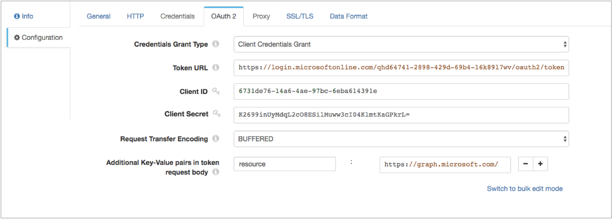
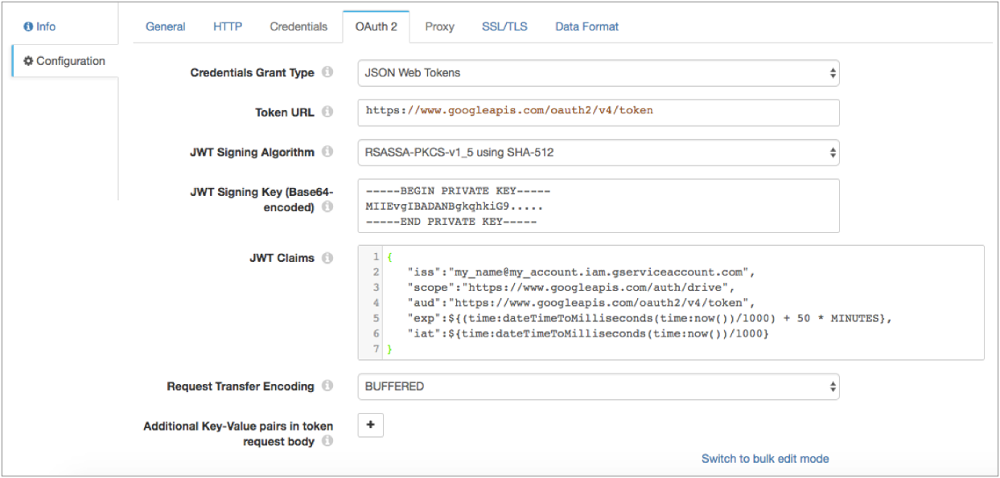

# HTTP客户端

[支持的管道类型：](https://streamsets.com/documentation/controlhub/latest/help/datacollector/UserGuide/Pipeline_Configuration/ProductIcons_Doc.html#concept_mjg_ly5_pgb) 资料收集器

HTTP客户端处理器将请求发送到HTTP资源URL，并将响应写入记录。对于每个请求，处理器都会将响应中的数据写入指定的输出字段。当响应包含多个值时，处理器可以将第一个值，所有值写入单个记录中的列表，或者将所有值写入单独的记录。

您可以使用HTTP客户端处理器执行一系列标准请求，也可以使用表达式来确定每个记录的请求。

配置HTTP客户端时，您将定义资源URL，标头属性和要使用的方法。对于某些方法，您可以指定请求正文和默认内容类型。

您可以将处理器配置为在记录中包括响应头字段，作为一组记录头属性或在记录字段中作为映射。您可以配置处理器以记录请求和响应信息。然后，您可以将已解析的请求URL写入Data Collector 日志。

您还可以配置超时，请求传输编码，最大并行请求数和身份验证类型。您可以选择使用HTTP代理并配置SSL / TLS属性。

您还可以将处理器配置为使用OAuth 2协议连接到HTTP服务。

## HTTP方法

您可以对HTTP客户端处理器使用以下方法：

- 得到
- 放
- 开机自检
- 删除
- 头
- 补丁
- 表达式-一种表达式，其计算结果为其他方法之一。

### 表达方式

Expression方法使您可以编写计算结果为标准HTTP方法的表达式。使用Expression方法生成工作流。例如，您可以使用基于字段中的数据执行查找（GET）或将数据传递到服务器（PUT）的表达式。

## 并行请求

HTTP客户端处理器一次发送多个请求。为了保留记录顺序，处理器要等到整个批次的所有请求都完成后再处理下一个批次。

您可以指定并行请求的最大数量。默认值为1。增加并行请求的数量可以提高性能，但会增加服务器的负载。网络延迟也会严重影响该处理器的性能。

## OAuth 2授权

您可以将HTTP客户端处理器配置为使用OAuth 2协议连接到使用基本身份验证，摘要身份验证或通用身份验证，OAuth 2客户端凭据，OAuth 2用户名和密码或OAuth 2 JSON Web令牌（JWT）的HTTP服务。

OAuth 2协议授权第三方访问HTTP服务资源而无需共享凭据。HTTP客户端处理器使用凭据从服务请求访问令牌。服务将令牌返回给处理器，然后处理器将令牌包括在对资源URL的每个请求中的标头中。

您输入的用于请求访问令牌的凭据取决于HTTP服务所需的凭据授予类型。您可以为HTTP客户端定义以下OAuth 2凭据授予类型：

- 客户凭证授予

  HTTP客户端将其自己的凭据（客户端ID和客户端机密或基本，摘要或通用身份验证凭据）发送到HTTP服务。例如，使用客户端凭据授予来处理来自Twitter API或Microsoft Azure Active Directory（Azure AD）API的数据。有关客户端凭据授予的更多信息，请参阅 https://tools.ietf.org/html/rfc6749#section-4.4。

- 资源所有者密码凭据授予

  HTTP客户端将资源所有者的凭据（资源所有者的用户名和密码）发送到HTTP服务。或者，您可以通过将存储的凭据转换为访问令牌，使用此授权类型将使用基本身份验证，摘要身份验证或通用身份验证的现有客户端迁移到OAuth 2。例如，使用此授权来处理来自Getty Images API的数据。有关使用OAuth 2连接到Getty Images API的更多信息，请参见[http://developers.gettyimages.com/api/docs/v3/oauth2.html](https://developers.gettyimages.com/api/oauth2.html)。有关资源所有者密码凭据授予的更多信息，请参见https://tools.ietf.org/html/rfc6749#section-4.3。

- JSON Web令牌（JWT）

  HTTP客户端将基于JSON的安全令牌编码发送到HTTP服务。例如，使用JSON Web令牌来处理Google API中的数据。

让我们看一下如何配置身份验证和OAuth 2授权以处理来自Twitter，Microsoft Azure AD和Google API的数据的一些示例。

### Twitter示例

要使用OAuth 2授权从Twitter读取信息，请将HTTP客户端配置为使用基本身份验证和客户端凭据授予。

有关为Twitter配置OAuth 2授权的更多信息，请参阅https://dev.twitter.com/oauth/application-only。

1. 在**HTTP**选项卡上，将**身份验证类型**设置为**基本**，然后选择 **使用OAuth 2**。

2. 在“ **凭据”**选项卡上，为“ **用户名”**和“ **密码”**属性输入Twitter消费者API密钥和消费者API秘密密钥。

   **提示：**为了保护敏感信息（例如使用者API密钥），可以使用[运行时资源](https://streamsets.com/documentation/controlhub/latest/help/datacollector/UserGuide/Pipeline_Configuration/RuntimeValues.html#concept_bs4_5nm_2s)或凭证存储。有关凭证存储的更多信息，请参阅Data Collector文档中的[凭证存储](https://streamsets.com/documentation/datacollector/latest/help/#datacollector/UserGuide/Configuration/CredentialStores.html)。

3. 在**OAuth 2**标签上，为授予类型选择“ **客户端凭据授予** ”。

4. 在“ **令牌URL”**属性中，输入以下用于请求访问令牌的URL：

   ```
   https://api.twitter.com/oauth2/token
   ```

下图显示了 为Twitter配置的**OAuth 2**标签：


### Microsoft Azure AD示例

若要使用OAuth 2授权从Microsoft Azure AD中读取，请将HTTP客户端配置为不使用身份验证，并且将客户端凭据授予。

**注意：**本示例使用Microsoft Azure AD版本1.0。

有关为Microsoft Azure AD配置OAuth 2授权的详细信息，请参阅[https://docs.microsoft.com/zh-cn/azure/active-directory/develop/active-directory-protocols-oauth-code](https://docs.microsoft.com/en-us/azure/active-directory/develop/active-directory-protocols-oauth-code)。

1. 在“ **HTTP”**选项卡上，将“ **身份验证类型”**设置为“ **无”**，然后选择“ **使用OAuth 2”**。

2. 在**OAuth 2**标签上，为授予类型选择“ **客户端凭据授予** ”。

3. 在“ **令牌URL”**属性中，输入以下用于请求访问令牌的URL：

   ```
   https://login.microsoftonline.com/<tenant identifier>/oauth2/token
   ```

   ``Azure AD租户标识符在哪里。

4. 输入OAuth 2客户端ID和密码。

   客户端ID是在Azure经典门户中找到的向Azure AD注册应用程序时分配给您的应用程序的应用程序ID。

   客户端密钥是您在应用程序注册门户中为应用程序创建的应用程序密钥。

   **提示：**为了保护敏感信息，例如客户端ID和机密，可以使用[运行时资源](https://streamsets.com/documentation/controlhub/latest/help/datacollector/UserGuide/Pipeline_Configuration/RuntimeValues.html#concept_bs4_5nm_2s)或凭据存储。有关凭证存储的更多信息，请参阅Data Collector文档中的[凭证存储](https://streamsets.com/documentation/datacollector/latest/help/#datacollector/UserGuide/Configuration/CredentialStores.html)。

5. 在令牌请求中添加HTTP服务所需的所有键值对。

   在我们的示例中，我们正在`graph.microsoft.com`资源URL 中访问API，因此我们需要添加以下键/值对：

   ```
   resource : https://graph.microsoft.com/
   ```

下图显示了 为Microsoft Azure AD版本1.0配置的**OAuth 2**选项卡：



### Google示例

要使用OAuth 2授权来读取Google服务帐户，请将HTTP客户端配置为不使用身份验证，并配置JSON Web令牌。

有关Google服务帐户的更多信息，请参阅Google Cloud文档：[了解服务帐户](https://cloud.google.com/iam/docs/understanding-service-accounts)。

有关为Google配置OAuth 2授权的更多信息，请参阅Google Identity Platform文档：[使用OAuth 2.0访问Google API](https://developers.google.com/identity/protocols/OAuth2)。

1. 在“ **HTTP”**选项卡上，将“ **身份验证类型”**设置为“ **无”**，然后选择“ **使用OAuth 2”**。

2. 在**OAuth 2**标签上，为授予类型选择**JSON Web令牌**。

3. 在“ **令牌URL”**属性中，输入以下用于请求访问令牌的URL：

   ```
   https://www.googleapis.com/oauth2/v4/token
   ```

4. 选择以下算法对JWT进行签名：**使用SHA-256的RSASSA-PKCS-v1_5**。

5. 输入用于签名JWT的Base64编码密钥。

   要访问密钥，请在生成Google凭据时下载JSON密钥文件。在文件中找到“ private_key”字段，其中包含密钥的字符串版本。将字符串复制到**JWT Signing Key**属性中，然后用新行替换所有“ \ n”文字。

   **提示：**为了保护诸如JWT签名密钥之类的敏感信息，您可以使用[运行时资源](https://streamsets.com/documentation/controlhub/latest/help/datacollector/UserGuide/Pipeline_Configuration/RuntimeValues.html#concept_bs4_5nm_2s)或凭据存储。有关凭证存储的更多信息，请参阅Data Collector文档中的[凭证存储](https://streamsets.com/documentation/datacollector/latest/help/#datacollector/UserGuide/Configuration/CredentialStores.html)。

6. 在**JWT Claims**属性中，以JSON格式输入要与JWT令牌请求一起使用的必需声明。

   有关调用Google API时的要求要求的信息，请参阅Google Identity Platform文档：[附录：不带OAuth的服务帐户授权](https://developers.google.com/identity/protocols/OAuth2ServiceAccount#jwt-auth)。

   有关范围声明的范围列表，请参阅Google Identity Platform文档：[Google API的OAuth 2.0范围](https://developers.google.com/identity/protocols/googlescopes)。

   例如，以以下JSON格式输入声明：

   ```
   {
      "iss":"my_name@my_account.iam.gserviceaccount.com",
      "scope":"https://www.googleapis.com/auth/drive",
      "aud":"https://www.googleapis.com/oauth2/v4/token",
      "exp":${(time:dateTimeToMilliseconds(time:now())/1000) + 50 * MINUTES},
      "iat":${time:dateTimeToMilliseconds(time:now())/1000}
   }
   ```

   您可以在JWT声明中包含表达语言。例如，在上面的样本索赔中，“ exp”（到期时间）索赔和“ iat”（发出时）索赔都包括Data Collector时间函数，用于设置到期时间和发布时间。

   **提示：** Google访问令牌会在60分钟后过期。结果，将到期时间声明设置为略少于60分钟，以便HTTP客户端可以在时限内请求新令牌。

下图显示了 为Google服务帐户配置的**OAuth 2**标签：



## 产生的输出


对于每个请求，HTTP客户端处理器都将响应写入指定的输出字段。处理器将响应主体中的数据解析为基于所选数据格式的值。您可以配置处理器如何写入多个值。处理器可以将第一个值写入单个记录，将所有值写入单个记录中的列表，也可以将所有值写入单独的记录。

对于HEAD响应，响应主体不包含任何数据。因此，处理器只将输出写入记录头属性，而将输出字段保留为空。

### 响应标题

HTTP客户端处理器可以在记录中包含响应头。您可以将数据写入记录，如下所示：

- 记录标题属性

  处理器将响应头中的数据写入相应的记录头属性。

  编写记录标题属性时，请为属性定义前缀，以避免名称冲突。然后，处理器将响应标头名称附加到前缀。

  例如，如果您定义`info-`为前缀，则内容编码响应头中的数据将写入“ info-content-encoding”记录头属性。

  有关记录标题属性的一般信息，请参见“ [记录标题属性”](https://streamsets.com/documentation/controlhub/latest/help/datacollector/UserGuide/Pipeline_Design/RecordHeaderAttributes.html#concept_wn2_jcz_dz)。

- 记录领域

  处理器还可以将响应标头写入记录中的字段。处理器将响应标头作为键-值对的映射写入记录字段，其中键是响应标头名称。

  写入字段时，您可以指定要使用的字段。如果该字段包含数据，则处理器将覆盖数据。如果该字段不存在，则处理器创建该字段。

## 记录请求和响应数据

HTTP客户端处理器可以将请求和响应数据记录到Data Collector 日志中。

启用日志记录时，可以配置以下属性：

- 细度

  要记录的消息中包括的数据类型：Headers_Only-包括请求和响应头。Payload_Text-包括请求和响应头以及任何文本有效载荷。Payload_Any-包括请求和响应头以及有效载荷，与类型无关。

- 日志级别

  要包含在数据收集器日志中的消息级别。选择级别时，还将记录更高级别的消息。即，如果选择警告日志级别，则将严重和警告消息写入数据收集器日志。

  **注意：**为Data Collector配置的日志级别可以限制所记录的详细信息级别。例如，如果将日志级别设置为“最高级”以记录详细的跟踪信息，但是将Data Collector配置为ERROR，则原始消息仅写入严重级别的消息。

  下表描述了启用日志记录所需的阶段日志级别和相应的Data Collector日志级别：阶段日志级别资料收集器描述严重错误仅显示严重故障的消息。警告警告消息警告潜在问题。信息信息信息性消息。精细调试基本跟踪信息。更细调试详细的跟踪信息。最好的跟踪高度详细的跟踪信息。

  此舞台记录器的名称为 `com.streamsets.http.RequestLogger`。

- 最大实体大小

  写入日志的消息数据的最大大小。用于限制任何单个消息写入数据收集器日志的数据量。

## 记录解析的资源URL

您可以将解析的资源URL写入Data Collector日志。

该解决资源URL是在资源URL属性解析包含在URL中任何表情之后定义的URL。

例如，假设您使用以下URL配置“资源URL”属性：

```
https://api.twitter.com/1.1/search/tweets.json?q=${record:value('/text')}
```

这允许基于每个记录的/ text字段中的信息来构建URL。因此，当记录包含`%23DataOps`在/ text字段中时，解析的URL为：

```
https://api.twitter.com/1.1/search/tweets.json?q=%23DataOps
```

要将解析的资源URL写入Data Collector 日志，请将Data Collector日志级别设置为DEBUG或更高。您不需要使用处理器中的“启用请求日志记录”属性来记录已解析的资源URL。

## 资料格式

HTTP客户端处理器基于选定的数据格式解析每个服务器响应，并将响应以选定的格式写入指定的输出字段。

您可以配置处理器如何编写包含多个值的已解析响应。处理器可以将第一个值写入单个记录，将所有值写入单个记录中的列表，也可以将所有值写入单独的记录。

可用的数据格式包括：

- 定界

  处理器将响应中的每一行解析为一个值，或者仅将第一行分隔行写入单个记录，将所有分隔行写入一条记录，并将每一行写入列表项，或者将每一行分隔为单独的记录。您可以为响应指定以下定界格式类型：**默认CSV-**包含逗号分隔值的文件。忽略文件中的空行。**RFC4180 CSV-**严格遵循RFC4180准则的逗号分隔文件。**MS Excel CSV** -Microsoft Excel逗号分隔文件。**MySQL CSV** -MySQL逗号分隔文件。**制表符分隔的值** -包含制表符分隔的值的文件。**PostgreSQL CSV** -PostgreSQL逗号分隔文件。**PostgreSQL文本** -PostgreSQL文本文件。**自定义** -使用用户定义的定界符，转义符和引号字符的文件。**多字符**定界-使用多个用户定义的字符定界字段和行以及单个用户定义的转义和引号字符的文件。

  指定的根字段确定输出字段的数据类型，即列表映射或列表。有关根字段类型的更多信息，请参见定界[数据根字段类型](https://streamsets.com/documentation/controlhub/latest/help/datacollector/UserGuide/Data_Formats/Delimited.html#concept_zcg_bm4_fs)。您可以在标题行中包括字段名称（如果有）。

  使用标题行时，可以启用带有其他列的记录处理。其他列使用自定义的前缀和顺序递增的顺序整数，如命名 `_extra_1`， `_extra_2`。当您禁止其他列时，包含其他列的记录将发送到错误。

  您也可以将字符串常量替换为空值。

  当一行超过最大记录长度时，处理器将根据为该阶段配置的错误处理来处理对象。

- JSON格式

  处理器将响应中的每个对象解析为一个值，或者仅将第一个对象写入单个记录，将所有对象写入单个记录的列表，或者将每个对象写入单独的记录。

  当对象超过指定的最大对象长度时，处理器将根据为该阶段配置的错误处理来处理对象。

- 文本

  如果指定自定义定界符，则处理器会将数据解析为基于定界符的值。否则，处理器将每一行解析为一个值。然后，处理器要么仅将第一个值写入单个记录，要么将所有值写入单个记录的列表，要么将每个值写入单独的记录。

  当一行超过指定的最大行长时，处理器会截断该行并添加一个名为Truncated的布尔字段。

- XML格式

  如果指定定界符元素，则处理器将使用定界符元素将响应解析为值。处理器只将第一个定界元素写入单个记录，将所有定界元素写入单个记录中的列表，或者将每个定界元素写入单独的记录。

  如果未指定定界符元素，则处理器会将整个响应写入单个记录。

  当一条记录超过指定的最大记录长度时，处理器将跳过该记录，并继续处理下一条记录。它将跳过的记录发送到管道以进行错误处理。

## 配置HTTP客户端处理器

配置HTTP客户端处理器以针对资源URL执行请求。


1. 在“属性”面板的“ **常规”**选项卡上，配置以下属性：

   | 一般财产                                                     | 描述                                                         |
   | :----------------------------------------------------------- | :----------------------------------------------------------- |
   | 名称                                                         | 艺名。                                                       |
   | 描述                                                         | 可选说明。                                                   |
   | [必填项](https://streamsets.com/documentation/controlhub/latest/help/datacollector/UserGuide/Pipeline_Design/DroppingUnwantedRecords.html#concept_dnj_bkm_vq) | 必须包含用于将记录传递到阶段的记录的数据的字段。**提示：**您可能包括舞台使用的字段。根据为管道配置的错误处理，处理不包含所有必填字段的记录。 |
   | [前提条件](https://streamsets.com/documentation/controlhub/latest/help/datacollector/UserGuide/Pipeline_Design/DroppingUnwantedRecords.html#concept_msl_yd4_fs) | 必须评估为TRUE的条件才能使记录进入处理阶段。单击 **添加**以创建其他前提条件。根据为阶段配置的错误处理，处理不满足所有前提条件的记录。 |
   | [记录错误](https://streamsets.com/documentation/controlhub/latest/help/datacollector/UserGuide/Pipeline_Design/ErrorHandling.html#concept_atr_j4y_5r) | 该阶段的错误记录处理：放弃-放弃记录。发送到错误-将记录发送到管道以进行错误处理。停止管道-停止管道。对群集管道无效。 |

2. 在“ **HTTP”**选项卡上，配置以下属性：

   | HTTP属性                                                     | 描述                                                         |
   | :----------------------------------------------------------- | :----------------------------------------------------------- |
   | 输出场                                                       | 用于响应的字段。您可以使用新的或现有的字段。                 |
   | 多值行为                                                     | 响应包含多个值时采取的措施：仅第一个值-写入第一个值。所有值作为列表-将所有值写入单个记录中的列表。拆分为多个记录-将所有值写入每个单独的记录中。 |
   | [标头输出位置](https://streamsets.com/documentation/controlhub/latest/help/datacollector/UserGuide/Processors/HTTPClient.html#concept_ekz_wrz_zw) | 写入响应头字段信息的位置。                                   |
   | 标头属性前缀                                                 | 写入响应头字段信息以记录头属性时使用的前缀。                 |
   | 标头输出字段                                                 | 将响应标头字段信息写入记录中的字段时使用的字段。             |
   | 资源网址                                                     | HTTP资源URL。                                                |
   | 标头                                                         | 要包含在请求中的标头。使用[简单或批量编辑模式](https://streamsets.com/documentation/controlhub/latest/help/datacollector/UserGuide/Pipeline_Configuration/SimpleBulkEdit.html#concept_alb_b3y_cbb)，单击 **添加**图标以添加其他标题。 |
   | HTTP方法                                                     | HTTP请求方法。使用标准方法之一，或使用“表达式”输入表达式。   |
   | [HTTP方法表达式](https://streamsets.com/documentation/controlhub/latest/help/datacollector/UserGuide/Processors/HTTPClient.html#concept_dc2_qwn_jw) | 计算结果为标准HTTP方法的表达式。仅用于表达式方法。           |
   | 索取资料                                                     | 请求数据以指定方法使用。可用于PUT，POST，DELETE和Expression方法。 |
   | 默认请求内容类型                                             | 要包含在请求中的Content-Type标头。仅当Content-Type标头不存在时使用。可用于PUT，POST，DELETE和Expression方法。默认值为application / json。 |
   | 请求传输编码                                                 | 使用以下编码类型之一：缓冲-标准传输编码类型。块-分块传输数据。并非所有服务器都支持。默认为缓冲。 |
   | 连接超时                                                     | 等待连接的最大毫秒数。使用0无限期等待。                      |
   | 读取超时                                                     | 等待数据的最大毫秒数。使用0无限期等待。                      |
   | [最大并行请求](https://streamsets.com/documentation/controlhub/latest/help/datacollector/UserGuide/Processors/HTTPClient.html#concept_d3m_yrn_jw) | 一次发送到服务器的最大请求数。                               |
   | 认证类型                                                     | 确定用于连接到服务器的身份验证类型：无-不执行身份验证。基本-使用基本身份验证。需要用户名和密码。与HTTPS一起使用，以避免传递未加密的凭据。摘要-使用摘要身份验证。需要用户名和密码。通用-建立匿名连接，然后在收到401状态和WWW-Authenticate标头请求后提供身份验证凭据。需要与基本或摘要身份验证关联的用户名和密码。仅用于响应此工作流程的服务器。OAuth-使用OAuth 1.0身份验证。需要OAuth凭据。 |
   | OAuth2                                                       | 启用使用OAuth 2授权来请求访问令牌。您可以将OAuth 2授权与无，基本，摘要或通用身份验证一起使用。 |
   | 使用代理服务器                                               | 启用使用HTTP代理连接到系统。                                 |
   | 最长请求时间                                                 | 等待请求完成的最大秒数。                                     |
   | 速率限制                                                     | 请求之间的最短时间（以毫秒为单位）。将请求发送到限速API时，设置限速。默认值为0，这意味着请求之间没有延迟。 |

3. 使用身份验证时，在“ **凭据”**选项卡上，配置以下属性：

   | 凭证属性     | 描述                                                         |
   | :----------- | :----------------------------------------------------------- |
   | 用户名       | 基本，摘要或通用身份验证的用户名。                           |
   | 密码         | 基本，摘要或通用身份验证的密码。**提示：** 为了保护敏感信息，例如用户名和密码，可以使用 [运行时资源](https://streamsets.com/documentation/controlhub/latest/help/datacollector/UserGuide/Pipeline_Configuration/RuntimeValues.html#concept_bs4_5nm_2s)或凭据存储。有关凭证存储的更多信息，请参阅Data Collector文档中的[凭证存储](https://streamsets.com/documentation/datacollector/latest/help/#datacollector/UserGuide/Configuration/CredentialStores.html)。 |
   | 消费者密钥   | OAuth 1.0身份验证的使用者密钥。                              |
   | 消费者的秘密 | OAuth 1.0身份验证的消费者机密。                              |
   | 代币         | 用于OAuth 1.0身份验证的使用者令牌。                          |
   | 令牌秘密     | OAuth 1.0身份验证的令牌密钥。                                |

4. 使用OAuth 2授权时，在**OAuth 2**标签上，配置以下属性。

   有关OAuth 2的详细信息，例如要从Twitter，Microsoft Azure AD或Google API读取的OAuth 2配置，请参阅[OAuth 2授权](https://streamsets.com/documentation/controlhub/latest/help/datacollector/UserGuide/Processors/HTTPClient.html#concept_s4p_15f_5y)。

   | OAuth 2属性  | 描述                                                         |
   | :----------- | :----------------------------------------------------------- |
   | 凭证授予类型 | HTTP服务所需的客户端凭据授予类型：客户凭证授予资源所有者密码凭据授予JSON Web令牌（JWT） |
   | 令牌网址     | 请求访问令牌的URL。                                          |
   | 客户编号     | HTTP服务用于标识HTTP客户端的客户端ID。输入使用客户端ID和密码进行身份验证的客户端凭据授予。或者，对于资源所有者，密码凭据授予需要客户端ID和机密。 |
   | 客户机密     | HTTP服务用来验证HTTP客户端的客户端密码。输入使用客户端ID和密码进行身份验证的客户端凭据授予。或者，对于资源所有者，密码凭据授予需要客户端ID和机密。**提示：**为了保护敏感信息，例如客户端ID和机密，可以使用[运行时资源](https://streamsets.com/documentation/controlhub/latest/help/datacollector/UserGuide/Pipeline_Configuration/RuntimeValues.html#concept_bs4_5nm_2s)或凭据存储。有关凭证存储的更多信息，请参阅Data Collector文档中的[凭证存储](https://streamsets.com/documentation/datacollector/latest/help/#datacollector/UserGuide/Configuration/CredentialStores.html)。 |
   | 用户名       | 资源所有者用户名。输入资源所有者密码凭据授予。               |
   | 密码         | 资源所有者密码。输入资源所有者密码凭据授予。**提示：** 为了保护敏感信息，例如用户名和密码，可以使用 [运行时资源](https://streamsets.com/documentation/controlhub/latest/help/datacollector/UserGuide/Pipeline_Configuration/RuntimeValues.html#concept_bs4_5nm_2s)或凭据存储。有关凭证存储的更多信息，请参阅Data Collector文档中的[凭证存储](https://streamsets.com/documentation/datacollector/latest/help/#datacollector/UserGuide/Configuration/CredentialStores.html)。 |
   | JWT签名算法  | 用于签署JSON Web令牌（JWT）的算法。默认为无。输入JSON Web令牌授予。 |
   | JWT签名密钥  | 如果选择了签名算法，则用于签名JSON Web令牌的Base64编码密钥。**提示：**为了保护诸如JWT签名密钥之类的敏感信息，您可以使用[运行时资源](https://streamsets.com/documentation/controlhub/latest/help/datacollector/UserGuide/Pipeline_Configuration/RuntimeValues.html#concept_bs4_5nm_2s)或凭据存储。有关凭证存储的更多信息，请参阅Data Collector文档中的[凭证存储](https://streamsets.com/documentation/datacollector/latest/help/#datacollector/UserGuide/Configuration/CredentialStores.html)。输入JSON Web令牌授予。 |
   | 智威汤逊索赔 | 声明要以JSON格式输入的JSON Web令牌请求中使用。输入HTTP服务所需的每个声明。您可以在JWT声明中包含表达语言。例如，要阅读Google服务帐户，请输入以下具有适当值的声明：`{  "iss":"my_name@my_account.iam.gserviceaccount.com",  "scope":"https://www.googleapis.com/auth/drive",  "aud":"https://www.googleapis.com/oauth2/v4/token",  "exp":${(time:dateTimeToMilliseconds(time:now())/1000) + 50 * 60},  "iat":${time:dateTimeToMilliseconds(time:now())/1000} }`输入JSON Web令牌授予。 |
   | 请求传输编码 | 阶段请求访问令牌时使用的编码形式：缓冲或分块。默认为分块。   |
   | 其他键值对   | 请求访问令牌时发送到令牌URL的可选键值对。例如，您可以定义OAuth 2 `scope`请求参数。使用[简单或批量编辑模式](https://streamsets.com/documentation/controlhub/latest/help/datacollector/UserGuide/Pipeline_Configuration/SimpleBulkEdit.html#concept_alb_b3y_cbb)，单击**添加**图标以添加其他键值对。 |

5. 要使用HTTP代理，请在“ **代理”**选项卡上配置以下属性：

   | HTTP代理属性 | 描述                                                         |
   | :----------- | :----------------------------------------------------------- |
   | 代理URI      | 代理URI。                                                    |
   | 用户名       | 代理用户名。                                                 |
   | 密码         | 代理密码。**提示：** 为了保护敏感信息，例如用户名和密码，可以使用 [运行时资源](https://streamsets.com/documentation/controlhub/latest/help/datacollector/UserGuide/Pipeline_Configuration/RuntimeValues.html#concept_bs4_5nm_2s)或凭据存储。有关凭证存储的更多信息，请参阅Data Collector文档中的[凭证存储](https://streamsets.com/documentation/datacollector/latest/help/#datacollector/UserGuide/Configuration/CredentialStores.html)。 |

6. 要使用SSL / TLS，请在“ **TLS”**选项卡上配置以下属性：

   | TLS属性                                                      | 描述                                                         |
   | :----------------------------------------------------------- | :----------------------------------------------------------- |
   | 使用TLS                                                      | 启用TLS的使用。                                              |
   | [密钥库文件](https://streamsets.com/documentation/controlhub/latest/help/datacollector/UserGuide/Pipeline_Configuration/SSL-TLS.html#concept_kqb_rqf_5z) | 密钥库文件的路径。输入文件的绝对路径或相对于Data Collector资源目录的路径：$ SDC_RESOURCES。有关环境变量的更多信息，请参阅 Data Collector 文档中的Data Collector [环境配置](https://streamsets.com/documentation/datacollector/latest/help/#datacollector/UserGuide/Configuration/DCEnvironmentConfig.html)。默认情况下，不使用任何密钥库。 |
   | 密钥库类型                                                   | 要使用的密钥库的类型。使用以下类型之一：Java密钥库文件（JKS）PKCS＃12（p12文件）默认值为Java密钥库文件（JKS）。 |
   | 密钥库密码                                                   | 密钥库文件的密码。密码是可选的，但建议使用。**提示：**为了保护敏感信息（如密码），可以使用[运行时资源](https://streamsets.com/documentation/controlhub/latest/help/datacollector/UserGuide/Pipeline_Configuration/RuntimeValues.html#concept_bs4_5nm_2s)或凭据存储。有关凭证存储的更多信息，请参阅Data Collector文档中的[凭证存储](https://streamsets.com/documentation/datacollector/latest/help/#datacollector/UserGuide/Configuration/CredentialStores.html)。 |
   | 密钥库密钥算法                                               | 用于管理密钥库的算法。默认值为 SunX509。                     |
   | [信任库文件](https://streamsets.com/documentation/controlhub/latest/help/datacollector/UserGuide/Pipeline_Configuration/SSL-TLS.html#concept_kqb_rqf_5z) | 信任库文件的路径。输入文件的绝对路径或相对于Data Collector资源目录的路径：$ SDC_RESOURCES。有关环境变量的更多信息，请参阅 Data Collector 文档中的Data Collector [环境配置](https://streamsets.com/documentation/datacollector/latest/help/#datacollector/UserGuide/Configuration/DCEnvironmentConfig.html)。默认情况下，不使用任何信任库。 |
   | 信任库类型                                                   | 要使用的信任库的类型。使用以下类型之一：Java密钥库文件（JKS）PKCS＃12（p12文件）默认值为Java密钥库文件（JKS）。 |
   | 信任库密码                                                   | 信任库文件的密码。密码是可选的，但建议使用。**提示：**为了保护敏感信息（如密码），可以使用[运行时资源](https://streamsets.com/documentation/controlhub/latest/help/datacollector/UserGuide/Pipeline_Configuration/RuntimeValues.html#concept_bs4_5nm_2s)或凭据存储。有关凭证存储的更多信息，请参阅Data Collector文档中的[凭证存储](https://streamsets.com/documentation/datacollector/latest/help/#datacollector/UserGuide/Configuration/CredentialStores.html)。 |
   | 信任库信任算法                                               | 用于管理信任库的算法。默认值为SunX509。                      |
   | 使用默认协议                                                 | 确定要使用的传输层安全性（TLS）协议。默认协议是TLSv1.2。要使用其他协议，请清除此选项。 |
   | [传输协议](https://streamsets.com/documentation/controlhub/latest/help/datacollector/UserGuide/Pipeline_Configuration/SSL-TLS.html#concept_mvs_cxf_5z) | 要使用的TLS协议。要使用默认TLSv1.2以外的协议，请单击“ **添加”**图标并输入协议名称。您可以使用[简单或批量编辑模式](https://streamsets.com/documentation/controlhub/latest/help/datacollector/UserGuide/Pipeline_Configuration/SimpleBulkEdit.html#concept_alb_b3y_cbb)来添加协议。**注意：**较旧的协议不如TLSv1.2安全。 |
   | [使用默认密码套件](https://streamsets.com/documentation/controlhub/latest/help/datacollector/UserGuide/Pipeline_Configuration/SSL-TLS.html#concept_cwx_dyf_5z) | 对SSL / TLS握手使用默认的密码套件。要使用其他密码套件，请清除此选项。 |
   | 密码套房                                                     | 要使用的密码套件。要使用不属于默认密码集的密码套件，请单击“ **添加”**图标并输入密码套件的名称。您可以使用[简单或批量编辑模式](https://streamsets.com/documentation/controlhub/latest/help/datacollector/UserGuide/Pipeline_Configuration/SimpleBulkEdit.html#concept_alb_b3y_cbb)来添加密码套件。输入要使用的其他密码套件的Java安全套接字扩展（JSSE）名称。 |

7. 在“ **数据格式”**选项卡上，配置以下属性：

   | 数据格式属性                                                 | 描述                                    |
   | :----------------------------------------------------------- | :-------------------------------------- |
   | [资料格式](https://streamsets.com/documentation/controlhub/latest/help/datacollector/UserGuide/Processors/HTTPClient.html#concept_jrj_hmh_jw) | 响应的数据格式：定界JSON格式文本XML格式 |

8. 对于定界数据，在“ **数据格式”**选项卡上，配置以下属性：

   | 定界财产                                                     | 描述                                                         |
   | :----------------------------------------------------------- | :----------------------------------------------------------- |
   | [压缩格式](https://streamsets.com/documentation/controlhub/latest/help/datacollector/UserGuide/Data_Formats/DataFormats-Overview.html#concept_uxr_g52_qs) | 文件的压缩格式：无-仅处理未压缩的文件。压缩文件-处理受支持的压缩格式压缩的文件。存档-处理通过支持的存档格式存档的文件。压缩存档-处理通过支持的存档和压缩格式存档和压缩的文件。 |
   | 压缩目录中的文件名模式                                       | 对于归档文件和压缩归档文件，文件名模式表示要在压缩目录中处理的文件。您可以使用UNIX样式的通配符，例如星号或问号。例如，*。json。默认值为*，它处理所有文件。 |
   | 分隔符格式类型                                               | 分隔符格式类型。使用以下选项之一：**默认CSV-**包含逗号分隔值的文件。忽略文件中的空行。**RFC4180 CSV-**严格遵循RFC4180准则的逗号分隔文件。**MS Excel CSV** -Microsoft Excel逗号分隔文件。**MySQL CSV** -MySQL逗号分隔文件。**制表符分隔的值** -包含制表符分隔的值的文件。**PostgreSQL CSV** -PostgreSQL逗号分隔文件。**PostgreSQL文本** -PostgreSQL文本文件。**自定义** -使用用户定义的定界符，转义符和引号字符的文件。**多字符**定界-使用多个用户定义的字符定界字段和行以及单个用户定义的转义和引号字符的文件。 |
   | 标题行                                                       | 指示文件是否包含标题行以及是否使用标题行。                   |
   | 允许额外的列                                                 | 使用标题行处理数据时，允许处理的记录列数超过标题行中的列数。 |
   | 额外的列前缀                                                 | 用于任何其他列的前缀。额外的列使用前缀和顺序递增的整数来命名，如下所示： ``。例如，`_extra_1`。默认值为 `_extra_`。 |
   | 最大记录长度（字符）                                         | 记录的最大长度（以字符为单位）。较长的记录无法读取。此属性可以受数据收集器解析器缓冲区大小的限制。有关更多信息，请参见[最大记录大小](https://streamsets.com/documentation/controlhub/latest/help/datacollector/UserGuide/Origins/Origins_overview.html#concept_svg_2zl_d1b)。 |
   | 分隔符                                                       | 自定义分隔符格式的分隔符。选择一个可用选项，或使用“其他”输入自定义字符。您可以输入使用格式为Unicode控制符\uNNNN，其中*ñ*是数字0-9或字母AF十六进制数字。例如，输入 \u0000以使用空字符作为分隔符或 \u2028使用行分隔符作为分隔符。默认为竖线字符（\|）。 |
   | 多字符字段定界符                                             | 用于分隔多字符定界符格式的字段的字符。默认值为两个竖线字符（\|\|）。 |
   | 多字符行定界符                                               | 以多字符定界符格式分隔行或记录的字符。默认值为换行符（\ n）。 |
   | 转义符                                                       | 自定义或多字符定界符格式的转义字符。                         |
   | 引用字符                                                     | 自定义或多字符定界符格式的引号字符。                         |
   | 启用评论                                                     | 自定义定界符格式允许注释的数据被忽略。                       |
   | 评论标记                                                     | 为自定义定界符格式启用注释时，标记注释的字符。               |
   | 忽略空行                                                     | 对于自定义分隔符格式，允许忽略空行。                         |
   | [根字段类型](https://streamsets.com/documentation/controlhub/latest/help/datacollector/UserGuide/Data_Formats/Delimited.html#concept_zcg_bm4_fs) | 要使用的根字段类型：列表映射-生成数据索引列表。使您能够使用标准功能来处理数据。用于新管道。列表-生成带有索引列表的记录，该列表带有标头和值的映射。需要使用定界数据功能来处理数据。仅用于维护在1.1.0之前创建的管道。 |
   | 跳过的线                                                     | 读取数据前要跳过的行数。                                     |
   | 解析NULL                                                     | 将指定的字符串常量替换为空值。                               |
   | 空常量                                                       | 字符串常量，用空值替换。                                     |
   | 字符集                                                       | 要处理的文件的字符编码。                                     |
   | [忽略控制字符](https://streamsets.com/documentation/controlhub/latest/help/datacollector/UserGuide/Pipeline_Design/ControlCharacters.html#concept_hfs_dkm_js) | 除去制表符，换行符和回车符以外的所有ASCII控制字符。          |

9. 对于JSON数据，在**数据格式**选项卡上，配置以下属性：

   | JSON属性                                                     | 描述                                                         |
   | :----------------------------------------------------------- | :----------------------------------------------------------- |
   | [压缩格式](https://streamsets.com/documentation/controlhub/latest/help/datacollector/UserGuide/Data_Formats/DataFormats-Overview.html#concept_uxr_g52_qs) | 文件的压缩格式：无-仅处理未压缩的文件。压缩文件-处理受支持的压缩格式压缩的文件。存档-处理通过支持的存档格式存档的文件。压缩存档-处理通过支持的存档和压缩格式存档和压缩的文件。 |
   | 压缩目录中的文件名模式                                       | 对于归档文件和压缩归档文件，文件名模式表示要在压缩目录中处理的文件。您可以使用UNIX样式的通配符，例如星号或问号。例如，*。json。默认值为*，它处理所有文件。 |
   | 最大对象长度（字符）                                         | JSON对象中的最大字符数。较长的对象将转移到管道以进行错误处理。此属性可以受数据收集器解析器缓冲区大小的限制。有关更多信息，请参见[最大记录大小](https://streamsets.com/documentation/controlhub/latest/help/datacollector/UserGuide/Origins/Origins_overview.html#concept_svg_2zl_d1b)。 |
   | 字符集                                                       | 要处理的数据的字符编码。                                     |
   | [忽略控制字符](https://streamsets.com/documentation/controlhub/latest/help/datacollector/UserGuide/Pipeline_Design/ControlCharacters.html#concept_hfs_dkm_js) | 除去制表符，换行符和回车符以外的所有ASCII控制字符。          |

10. 对于文本数据，在“ **数据格式”**选项卡上，配置以下属性：

    | 文字属性                                                     | 描述                                                         |
    | :----------------------------------------------------------- | :----------------------------------------------------------- |
    | [压缩格式](https://streamsets.com/documentation/controlhub/latest/help/datacollector/UserGuide/Data_Formats/DataFormats-Overview.html#concept_uxr_g52_qs) | 文件的压缩格式：无-仅处理未压缩的文件。压缩文件-处理受支持的压缩格式压缩的文件。存档-处理通过支持的存档格式存档的文件。压缩存档-处理通过支持的存档和压缩格式存档和压缩的文件。 |
    | 压缩目录中的文件名模式                                       | 对于归档文件和压缩归档文件，文件名模式表示要在压缩目录中处理的文件。您可以使用UNIX样式的通配符，例如星号或问号。例如，*。json。默认值为*，它处理所有文件。 |
    | 最大线长                                                     | 一行允许的最大字符数。较长的行被截断。向记录添加一个布尔字段，以指示该记录是否被截断。字段名称为“截断”。此属性可以受数据收集器解析器缓冲区大小的限制。有关更多信息，请参见[最大记录大小](https://streamsets.com/documentation/controlhub/latest/help/datacollector/UserGuide/Origins/Origins_overview.html#concept_svg_2zl_d1b)。 |
    | [使用自定义分隔符](https://streamsets.com/documentation/controlhub/latest/help/datacollector/UserGuide/Data_Formats/TextCDelim.html#concept_lg2_gcg_jx) | 使用自定义定界符来定义记录而不是换行符。                     |
    | 自定义定界符                                                 | 用于定义记录的一个或多个字符。                               |
    | 包括自定义定界符                                             | 在记录中包括定界符。                                         |
    | 字符集                                                       | 要处理的文件的字符编码。                                     |
    | [忽略控制字符](https://streamsets.com/documentation/controlhub/latest/help/datacollector/UserGuide/Pipeline_Design/ControlCharacters.html#concept_hfs_dkm_js) | 除去制表符，换行符和回车符以外的所有ASCII控制字符。          |

11. 对于XML数据，在“ **数据格式”**选项卡上，配置以下属性：

    | XML属性                                                      | 描述                                                         |
    | :----------------------------------------------------------- | :----------------------------------------------------------- |
    | [压缩格式](https://streamsets.com/documentation/controlhub/latest/help/datacollector/UserGuide/Data_Formats/DataFormats-Overview.html#concept_uxr_g52_qs) | 文件的压缩格式：无-仅处理未压缩的文件。压缩文件-处理受支持的压缩格式压缩的文件。存档-处理通过支持的存档格式存档的文件。压缩存档-处理通过支持的存档和压缩格式存档和压缩的文件。 |
    | 压缩目录中的文件名模式                                       | 对于归档文件和压缩归档文件，文件名模式表示要在压缩目录中处理的文件。您可以使用UNIX样式的通配符，例如星号或问号。例如，*。json。默认值为*，它处理所有文件。 |
    | 分隔元素                                                     | 用作分隔符的XML元素。省略定界符，将整个XML文档视为一个字段。 |
    | 最大记录长度（字符）                                         | 字段中的最大字符数。较长的字段将转移到管道以进行错误处理。此属性可以受数据收集器解析器缓冲区大小的限制。有关更多信息，请参见[最大记录大小](https://streamsets.com/documentation/controlhub/latest/help/datacollector/UserGuide/Origins/Origins_overview.html#concept_svg_2zl_d1b)。 |
    | 字符集                                                       | 要处理的文件的字符编码。                                     |
    | [忽略控制字符](https://streamsets.com/documentation/controlhub/latest/help/datacollector/UserGuide/Pipeline_Design/ControlCharacters.html#concept_hfs_dkm_js) | 除去制表符，换行符和回车符以外的所有ASCII控制字符。          |

12. 在“ **日志记录”**选项卡上，配置以下属性以记录请求和响应数据：

    | 记录属性                                                     | 描述                                                         |
    | :----------------------------------------------------------- | :----------------------------------------------------------- |
    | 启用请求记录                                                 | 启用记录请求和响应数据。有关记录已解析资源URL的信息，请参阅 [记录已解析资源URL](https://streamsets.com/documentation/controlhub/latest/help/datacollector/UserGuide/Processors/HTTPClient.html#concept_kjb_gfz_m2b)。 |
    | [日志级别](https://streamsets.com/documentation/controlhub/latest/help/datacollector/UserGuide/Processors/HTTPClient.html#concept_dhg_gmk_hdb) | 要记录的详细信息级别。选择可用选项之一。以下列表是从最低到最高的日志记录顺序。选择级别时，由所选级别以上的级别生成的消息也将写入日志：严重-仅指示严重故障的消息。警告-消息警告潜在问题。信息-信息性消息。精细-基本跟踪信息。更精细-详细的跟踪信息。最好-高度详细的跟踪信息。**注意：**为Data Collector配置的日志级别可以限制阶段写入的消息级别。验证Data Collector日志级别是否支持您要使用的级别。 |
    | 细度                                                         | 要记录的消息中包括的数据类型：Headers_Only-包括请求和响应头。Payload_Text-包括请求和响应头以及任何文本有效载荷。Payload_Any-包括请求和响应头以及有效载荷，与类型无关。 |
    | 最大实体大小                                                 | 写入日志的消息数据的最大大小。用于限制任何单个消息写入数据收集器日志的数据量。 |