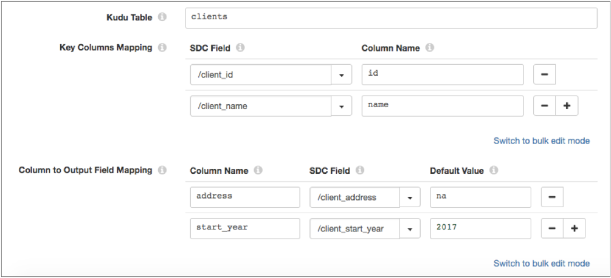

# Kudu查询

[支持的管道类型：](https://streamsets.com/documentation/controlhub/latest/help/datacollector/UserGuide/Pipeline_Configuration/ProductIcons_Doc.html#concept_mjg_ly5_pgb) 资料收集器

Kudu查找处理器在Kudu表中执行查找，并将查找值传递给字段。使用Kudu查询可使用其他数据丰富记录。

例如，您可以将处理器配置为使用department_ID字段作为主键列，以在Kudu表中查找部门名称值，并将这些值传递给新的department_name输出字段。

配置Kudu Lookup时，可以为一个或多个Kudu主数据库指定连接信息，并定义要使用的表。您定义要查找的键列，并定义要向其中写入查找值的输出字段。您还可以启用Kerberos身份验证。

当查找导致多个匹配项时，Kudu查找处理器可以返回第一个匹配值或在单独的记录中返回所有匹配值。

为了提高管道性能，您可以配置Kudu查找处理器以本地缓存Kudu表信息和从Kudu表返回的查找值。

您还可以配置操作超时和要使用的最大工作线程数。

## 列映射

在配置Kudu查找处理器时，您定义以下列映射：

- 关键列映射

  在记录中定义映射到Kudu表中的一个或多个主键列的传入字段。Kudu表的主键可以是由单列组成的简单键，也可以是由多列组成的复合键。单击**添加**图标可为复合主键添加多列。

  为了获得最佳性能，请添加主键列。您可以添加不是主键的列。但是，仅将非主键添加到“键列映射”会降低查询的性能。

- 列到输出字段的映射

  定义要查找的列，并定义记录中的字段以将列值映射到该字段。您可以选择定义一个默认值，该默认值将在查找不返回该字段的值时使用。

例如，下图显示了Kudu Lookup处理器，该处理器在`clients`具有由`id`和组成的复合主键的表中 查找值 `name`。处理器将传入`client_id`和`client_name`记录字段映射 到表中的主键。处理器返回 `address`和`start_year`列的值，并将这些值传递给记录中的new `client_address`和`client_start_year` output字段：

## Kudu数据类型

Kudu查找处理器将Kudu数据类型转换为以下兼容的Data Collector 数据类型：

| Kudu数据类型    | 数据收集器数据类型                                           |
| :-------------- | :----------------------------------------------------------- |
| 二元            | 字节数组                                                     |
| 布尔            | 布尔型                                                       |
| 小数            | 小数                                                         |
| 双              | 双                                                           |
| 浮动            | 浮动                                                         |
| 诠释8           | 字节                                                         |
| 16位            | 短                                                           |
| 32位            | 整数                                                         |
| 整数64          | 长                                                           |
| 串              | 串                                                           |
| Unixtime_micros | 约会时间Kudu Unixtime_micros数据类型存储微秒值。当转换为Data Collector Datetime数据类型时，处理器会将字段值除以1,000，以将值转换为毫秒，然后将其转换为Datetime。 |

## 查找缓存

为了提高管道性能，您可以配置Kudu查找处理器以本地缓存Kudu表信息和从Kudu表返回的查找值。

当您停止管道时，处理器将清除两个缓存。

### 缓存表信息

默认情况下，Kudu查找处理器在本地缓存有关要查找的每个Kudu表的信息，包括表名和架构。

您可以配置处理器为其缓存信息的最大表数。当达到最大数量时，处理器将从高速缓存中逐出最旧的值。

仅当您期望Kudu表架构频繁更改时，才禁用表信息的缓存。在这种情况下，您希望处理器从Kudu获取更新的架构，而不是在缓存中使用过时的架构。

若要配置可以缓存的最大表数，请配置“要缓存的最大表项”属性。若要禁用Kudu表的缓存，请清除“启用表缓存”属性。这两个属性都在处理器的“查找”选项卡上。

### 缓存查找值

默认情况下，处理器不缓存从Kudu表返回的查找值。为了提高管道性能，可以使处理器能够在本地缓存查找值。

启用后，处理器将缓存值，直到缓存达到最大大小或到期时间为止。当达到第一个限制时，处理器会将缓存中的值逐出。

您可以配置以下方式从缓存中逐出值：

- 基于规模的驱逐

  配置处理器缓存的最大值数量。当达到最大数量时，处理器将从高速缓存中逐出最旧的值。

- 基于时间的驱逐

  配置一个值可以保留在缓存中而不被写入或访问的时间。当达到到期时间时，处理器将从高速缓存中逐出该值。驱逐策略确定处理器是否测量自上次写入值或自上次访问值以来的到期时间。

  例如，您将逐出策略设置为在上次访问后到期，并将到期时间设置为60秒。处理器在60秒钟内未访问任何值后，处理器将从高速缓存中逐出该值。

## Kerberos身份验证

您可以使用Kerberos身份验证连接到Kudu群集。使用Kerberos身份验证时，Data Collector 使用Kerberos主体和keytab连接到Kudu。默认情况下，Data Collector 使用启动它的用户帐户进行连接。

Kerberos主体和密钥表在Data Collector 配置文件中定义`$SDC_CONF/sdc.properties`。要使用Kerberos身份验证，请在数据收集器 配置文件中配置所有Kerberos属性。

有关为Data Collector启用Kerberos身份验证的详细信息，请参阅Data Collector文档中的[Kerberos身份验证](https://streamsets.com/documentation/datacollector/latest/help/#datacollector/UserGuide/Configuration/DCConfig.html%23concept_hnm_n4l_xs)。

## 配置Kudu查找

配置Kudu查找处理器以在Kudu中执行查找。

1. 在“属性”面板的“ **常规”**选项卡上，配置以下属性：

   | 一般财产                                                     | 描述                                                         |
   | :----------------------------------------------------------- | :----------------------------------------------------------- |
   | 名称                                                         | 艺名。                                                       |
   | 描述                                                         | 可选说明。                                                   |
   | 舞台库                                                       | 您要使用的库版本。                                           |
   | [必填项](https://streamsets.com/documentation/controlhub/latest/help/datacollector/UserGuide/Pipeline_Design/DroppingUnwantedRecords.html#concept_dnj_bkm_vq) | 必须包含用于将记录传递到阶段的记录的数据的字段。**提示：**您可能包括舞台使用的字段。根据为管道配置的错误处理，处理不包含所有必填字段的记录。 |
   | [前提条件](https://streamsets.com/documentation/controlhub/latest/help/datacollector/UserGuide/Pipeline_Design/DroppingUnwantedRecords.html#concept_msl_yd4_fs) | 必须评估为TRUE的条件才能使记录进入处理阶段。单击 **添加**以创建其他前提条件。根据为阶段配置的错误处理，处理不满足所有前提条件的记录。 |
   | [记录错误](https://streamsets.com/documentation/controlhub/latest/help/datacollector/UserGuide/Pipeline_Design/ErrorHandling.html#concept_atr_j4y_5r) | 该阶段的错误记录处理：放弃-放弃记录。发送到错误-将记录发送到管道以进行错误处理。停止管道-停止管道。对群集管道无效。 |

2. 在“ **Kudu”**选项卡上，配置以下属性：

   | 酷渡地产                                                     | 描述                                                         |
   | :----------------------------------------------------------- | :----------------------------------------------------------- |
   | 苦杜大师                                                     | Kudu主设备使用的连接信息列表，以逗号分隔。使用以下格式：`:`  |
   | Kudu表                                                       | 查表。输入以下内容之一：现有Kudu表的名称。如果该表不存在，则管道无法启动。该表达式的计算结果为现有Kudu表的名称。例如，如果表名称存储在“ tableName”记录属性中，请输入以下表达式：`${record:attribute('tableName')}`如果该表不存在，则将这些记录视为错误记录。**注意：**使用由Impala创建的表时，请使用前缀，`impala::` 后跟数据库名称和表名称。例如：`impala::. ` |
   | [关键列映射](https://streamsets.com/documentation/controlhub/latest/help/datacollector/UserGuide/Processors/KuduLookup.html#concept_cs4_vj1_s1b) | 将记录中的输入字段映射到主键列或Kudu表中的列。输入以下内容：SDC字段-记录中包含主键列或列值的一个或多个现有字段的名称。列-Kudu表中一个或多个主键列的名称。Kudu表的主键可以是由单列组成的简单键，也可以是由多列组成的复合键。使用[简单或批量编辑模式](https://streamsets.com/documentation/controlhub/latest/help/datacollector/UserGuide/Pipeline_Configuration/SimpleBulkEdit.html#concept_alb_b3y_cbb)，单击 **添加**图标可为复合主键添加多列。 |
   | [列到输出字段的映射](https://streamsets.com/documentation/controlhub/latest/help/datacollector/UserGuide/Processors/KuduLookup.html#concept_cs4_vj1_s1b) | 映射要在Kudu表中查找的列到记录中的输出字段。输入以下内容：列名-包含查找值的Kudu列的名称。输入列名或输入定义该列名的表达式。SDC字段-记录中接收查找值的字段的名称。您可以指定现有字段或新字段。如果该字段不存在，则Kudu Lookup将创建该字段。默认值-当查询不返回该字段的值并且选择了忽略缺失值时使用的可选默认值。如果清除了“忽略缺少的值”，则即使查找定义了默认值，当查找不返回任何值时，处理器会将记录发送到错误。使用[简单或批量编辑模式](https://streamsets.com/documentation/controlhub/latest/help/datacollector/UserGuide/Pipeline_Configuration/SimpleBulkEdit.html#concept_alb_b3y_cbb)，单击 **添加**图标以创建其他字段映射。 |
   | 区分大小写                                                   | 启用区分大小写的列名。当Kudu列名称使用大小写混合时选择。当Kudu列名称使用小写字母时清除。 |
   | 忽略缺失值                                                   | 确定处理器是否忽略缺少的查找值。清除后，如果查找未返回任何值，则处理器会将记录发送到错误。选中后，如果查找未返回任何值并且“到输出字段的列映射”定义了默认值，则处理器将继续处理记录。如果“到输出字段的列映射”未定义默认值，则处理器会将记录发送到错误。 |

3. 在“ **高级”**选项卡上，配置以下属性：

   | 先进物业               | 描述                                                         |
   | :--------------------- | :----------------------------------------------------------- |
   | 多值行为               | 找到多个匹配值时要采取的措施：仅第一个值-返回第一个值。拆分为多个记录-返回单独记录中的每个匹配值。 |
   | 最大工作线程数         | 用于执行阶段处理的最大线程数。默认值是Kudu默认值–是Data Collector计算机上可用内核数的两倍。使用此属性可以限制可以使用的线程数。要使用默认值，请保留空白或输入0。 |
   | 操作超时（毫秒）       | 允许进行查找等操作的毫秒数。默认值为10000，即10秒。          |
   | 管理员操作超时（毫秒） | 允许进行管理员类型操作（例如打开表或获取表模式）的毫秒数。默认值为30000，即30秒。 |

4. 在“ **查找”**选项卡上，配置以下属性：

   | 查找属性                                                     | 描述                                                         |
   | :----------------------------------------------------------- | :----------------------------------------------------------- |
   | [启用表缓存](https://streamsets.com/documentation/controlhub/latest/help/datacollector/UserGuide/Processors/KuduLookup.html#concept_eqf_dh3_x1b) | 指定是否在本地缓存要查找的Kudu表的名称和架构。               |
   | 要缓存的最大表条目                                           | 要缓存的最大表条目数。当达到最大数量时，处理器将从高速缓存中逐出最旧的值。默认值为-1，表示无限制。 |
   | [启用本地缓存](https://streamsets.com/documentation/controlhub/latest/help/datacollector/UserGuide/Processors/KuduLookup.html#concept_xr1_fh3_x1b) | 指定是否在本地缓存返回的值。                                 |
   | 缓存的最大条目数                                             | 要缓存的最大值数。当达到最大数量时，处理器将从高速缓存中逐出最旧的值。默认值为-1，表示无限制。 |
   | 驱逐政策类型                                                 | 过期时间过后，用于从本地缓存中逐出值的策略：上次访问后过期-计算自上次通过读取或写入访问值以来的过期时间。上次写入后过期-测量自创建值或上次替换值以来的过期时间。 |
   | 到期时间                                                     | 一个值可以保留在本地缓存中而没有被访问或写入的时间。默认值为1秒。 |
   | 时间单位                                                     | 到期时间的时间单位。默认值为秒。                             |