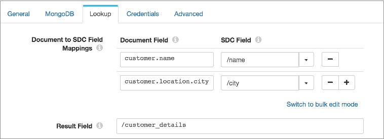

# MongoDB查询

[支持的管道类型：](https://streamsets.com/documentation/controlhub/latest/help/datacollector/UserGuide/Pipeline_Configuration/ProductIcons_Doc.html#concept_mjg_ly5_pgb) 资料收集器

MongoDB查找处理器在MongoDB中执行查找，并将所有值从返回的文档传递到记录中的新列表映射字段。使用MongoDB查找处理器可以用其他数据丰富记录。

例如，您在MongoDB中有多个部门文档，其中列出了部门中的员工。您将处理器配置为使用记录中的department_ID字段来查找部门文档，并将所有值从匹配的文档传递到记录中的新department_employees字段。

在配置MongoDB查找处理器时，您将定义连接信息，例如连接字符串和MongoDB凭据。您定义要查找的字段和返回值的字段。

当查找导致多个匹配的文档时，MongoDB查找处理器可以从第一个匹配的文档中返回值，或者从单独的记录中的所有匹配的文档中返回值。

为了提高性能，您可以将处理器配置为本地缓存文档值。

您可以选择配置高级选项，这些选项确定处理器如何连接到MongoDB，包括为处理器启用SSL / TLS。

**注意：** StreamSets已使用MongoDB 4.0测试了此阶段。

## 场映射

在配置MongoDB查找处理器时，您将定义要在MongoDB中查找的文档字段。您将这些文档字段映射到包含要查找的值的记录中的字段。

定义文档字段时，请使用点符号在嵌入式文档中定义字段，如下所示：

```
<嵌入式文档>。<字段名称>。<嵌入式字段名称>
```

在记录中定义字段时，请按以下方式[引用该字段](https://streamsets.com/documentation/controlhub/latest/help/datacollector/UserGuide/Pipeline_Configuration/Expressions.html#concept_hjk_b4l_vq)：

```
/<field name>
```

您可以定义多个字段映射。处理器使用配置的字段映射`find()`在MongoDB中生成并运行查询。

定义字段映射后，定义一个新的列表映射字段以存储返回文档中的所有值。

例如，您的MongoDB集合包含具有以下结构的客户文档：

```
{
  _id: 123,
  customer: {
       name: "Ed Martinez",
       status: "gold",
	phone: "123-456-7891",
	location: {
	  city: "San Francisco",
	  state: "California"
	}
  }
}
```

您的管道从包含客户名称和城市的来源进行读取，但是您想通过客户状态和电话号码来丰富该客户数据。配置处理器时，将`customer.name`和 `customer.location.city`文档字段映射到记录的`name`和`city`字段中存储的值 。要存储查找结果，请定义一个名为的新字段`customer_details`。下图显示了配置的字段映射和结果字段：



运行管道时，处理器将使用字段映射`find()`在MongoDB中生成并运行 查询。处理器将所有值从返回的文档传递到新的结果字段。

## 查找缓存

为了提高管道性能，您可以配置MongoDB查找处理器以本地缓存从MongoDB返回的文档值。

处理器缓存值，直到缓存达到最大大小或到期时间。当达到第一个限制时，处理器会将缓存中的值逐出。

您可以配置以下方式从缓存中逐出值：

- 基于规模的驱逐

  配置处理器缓存的最大值数量。当达到最大数量时，处理器将从高速缓存中逐出最旧的值。

- 基于时间的驱逐

  配置一个值可以保留在缓存中而不被写入或访问的时间。当达到到期时间时，处理器将从高速缓存中逐出该值。驱逐策略确定处理器是否测量自上次写入值或自上次访问值以来的到期时间。

  例如，您将逐出策略设置为在上次访问后到期，并将到期时间设置为60秒。处理器在60秒钟内未访问任何值后，处理器将从高速缓存中逐出该值。

当您停止管道时，处理器将清除缓存。

## 证书

根据MongoDB服务器使用的身份验证，将处理器配置为不使用身份验证，用户名/密码身份验证或LDAP身份验证。使用用户名/密码身份验证时，还可以使用委托身份验证。

默认情况下，处理器不使用身份验证。

要使用用户名/密码或LDAP认证，请通过以下方式之一输入所需的凭据：

- MongoDB选项卡中的连接字符串

  在MongoDB选项卡的连接字符串中输入凭据。

  要输入用于用户名/密码身份验证的凭据，请在主机名之前输入用户名和密码。使用以下格式：`mongodb://**username:password@**host[:port][/[database][?options]]`

  要输入用于LDAP身份验证的凭据，请在主机名之前输入用户名和密码，并将authMechanism选项设置为PLAIN。使用以下格式：`mongodb://**username:password@**host[:port][/[database]**?authMechanism=PLAIN**`

- 凭据选项卡

  在“凭据”选项卡中选择“用户名/密码”或“ LDAP身份验证”类型。然后输入身份验证类型的用户名和密码。

如果同时在连接字符串和“凭据”选项卡中输入凭据，则“凭据”选项卡优先。

## 阅读偏好

您可以配置MongoDB查找处理器使用的读取首选项。

读取首选项确定处理器如何从MongoDB副本集的不同成员读取数据。

您可以使用以下MongoDB读取首选项：

- 主要-要求主要成员阅读。
- 首选首选-首选从首选读取，但允许从二级读取。
- 二级-需要二级成员阅读。
- 首选二级-首选从二级读取，但在必要时允许从一级读取。
- 最近-从成员那里读取的网络延迟最少。

默认情况下，源使用“首选优先级”以避免对主要成员进行不必要的请求。

## BSON时间戳

处理来自MongoDB 2.6版和更高版本的数据时，MongoDB查找处理器支持MongoDB BSON Timestamp数据类型。

MongoDB BSON时间戳是一种MongoDB数据类型，其中包括时间戳和以下序数：

```
<BSON Timestamp field name>:Timestamp(<timestamp>, <ordinal>)
```

MongoDB处理器将BSON时间戳转换为地图，如下所示：

```
<BSON Timestamp field name>{MAP}:
    Timestamp{DATETIME}:<UTC timestamp>
    Ordinal{INTEGER}:<integer ordinal>
```

例如，交易BSON时间戳记为 `(1485449409, 1)`，将转换为以下“交易映射”字段：

```
"Transaction":{
    "Timestamp":Jan 26, 2016 14:50:09PM
    "Ordinal":1
}
```

## 启用SSL / TLS

您可以启用MongoDB查找处理器以使用SSL / TLS连接到MongoDB。

1. 在该阶段的“ **高级”**选项卡中，选择“ **启用SSL”**属性。

2. 如果MongoDB证书由私有CA签名或不受默认Java信任库信任，请创建一个自定义信任库文件或修改默认Java信任库文件的副本以将CA添加到该文件中。然后配置数据收集器以使用修改后的信任库文件。

   默认情况下，Data Collector 使用$ JAVA_HOME / jre / lib / security / cacerts中的Java信任库文件 。如果您的证书是由默认Java信任库文件中包含的CA签名的，则无需创建信任库文件，可以跳过此步骤。

   在这些步骤中，我们展示了如何修改默认的信任库文件，以将其他CA添加到受信任的CA列表中。如果您希望创建自定义信任库文件，请参阅[keytool文档](https://docs.oracle.com/javase/7/docs/technotes/tools/windows/keytool.html)。

   **注意：**如果已经将Data Collector配置为使用自定义信任库文件来[启用HTTPS](https://streamsets.com/documentation/controlhub/latest/help/datacollector/UserGuide/Configuration/HTTP_protocols.html#concept_xyp_lt4_cw)或[到LDAP服务器的安全连接](https://streamsets.com/documentation/controlhub/latest/help/datacollector/UserGuide/Configuration/LDAP-Step2Secure.html#task_wyf_kkw_ty)，则只需将此附加CA添加到相同的修改后的信任库文件中即可。

   1. 使用以下命令来设置JAVA_HOME环境变量：

      ```
      export JAVA_HOME=<Java home directory>
      ```

   2. 使用以下命令来设置SDC_CONF环境变量：

      ```
      export SDC_CONF=<Data Collector configuration directory>
      ```

      例如，对于RPM安装，请使用：

      ```
      export SDC_CONF=/etc/sdc
      ```

   3. 使用以下命令将默认的Java truststore文件复制到Data Collector 配置目录：

      ```
      cp "${JAVA_HOME}/jre/lib/security/cacerts" "${SDC_CONF}/truststore.jks"
      ```

   4. 使用以下keytool命令将CA证书导入到信任库文件中：

      ```
      keytool -import -file <MongoDB certificate> -trustcacerts -noprompt -alias <MongoDB alias> -storepass <password> -keystore "${SDC_CONF}/truststore.jks"
      ```

      例如：

      ```
      keytool -import -file  myMongoDB.pem -trustcacerts -noprompt -alias MyMongoDB -storepass changeit -keystore "${SDC_CONF}/truststore.jks"
      ```

   5. 在SDC_JAVA_OPTS环境变量中定义以下选项：

      - javax.net.ssl.trustStore- 数据收集器 计算机上信任库文件的路径。
      - javax.net.ssl.trustStorePassword -信任库密码。

      使用安装类型所需的方法。

      例如，如下定义选项：

      ```
      export SDC_JAVA_OPTS="${SDC_JAVA_OPTS} -Djavax.net.ssl.trustStore=/etc/sdc/truststore.jks -Djavax.net.ssl.trustStorePassword=mypassword -Xmx1024m -Xms1024m -server -XX:-OmitStackTraceInFastThrow"
      ```

      或者，为避免在导出命令中保存密码，请将密码保存在文本文件中，然后按如下所示定义truststore password选项： -Djavax.net.ssl.trustStorePassword = $（cat passwordfile.txt）

      然后，确保密码文件仅可由执行导出命令的用户读取。

   6. 重新启动Data Collector 以启用更改。

## 配置MongoDB查找

配置MongoDB查找处理器以在MongoDB中执行查找。

1. 在“属性”面板的“ **常规”**选项卡上，配置以下属性：

   | 一般财产                                                     | 描述                                                         |
   | :----------------------------------------------------------- | :----------------------------------------------------------- |
   | 名称                                                         | 艺名。                                                       |
   | 描述                                                         | 可选说明。                                                   |
   | [必填项](https://streamsets.com/documentation/controlhub/latest/help/datacollector/UserGuide/Pipeline_Design/DroppingUnwantedRecords.html#concept_dnj_bkm_vq) | 必须包含用于将记录传递到阶段的记录的数据的字段。**提示：**您可能包括舞台使用的字段。根据为管道配置的错误处理，处理不包含所有必填字段的记录。 |
   | [前提条件](https://streamsets.com/documentation/controlhub/latest/help/datacollector/UserGuide/Pipeline_Design/DroppingUnwantedRecords.html#concept_msl_yd4_fs) | 必须评估为TRUE的条件才能使记录进入处理阶段。单击 **添加**以创建其他前提条件。根据为阶段配置的错误处理，处理不满足所有前提条件的记录。 |
   | [记录错误](https://streamsets.com/documentation/controlhub/latest/help/datacollector/UserGuide/Pipeline_Design/ErrorHandling.html#concept_atr_j4y_5r) | 该阶段的错误记录处理：放弃-放弃记录。发送到错误-将记录发送到管道以进行错误处理。停止管道-停止管道。对群集管道无效。 |

2. 在“ **MongoDB”**选项卡上，配置以下属性：

   | MongoDB属性                                                  | 描述                                                         |
   | :----------------------------------------------------------- | :----------------------------------------------------------- |
   | 连接字符串                                                   | MongoDB实例的连接字符串。使用以下格式：`mongodb://host1[:port1][,host2[:port2],...[,hostN[:portN]]][/[database][?options]]`连接到集群时，输入其他节点信息以确保连接。如果MongoDB服务器使用用户名/密码或LDAP身份验证，可以在连接字符串中的凭据，如在[凭证](https://streamsets.com/documentation/controlhub/latest/help/datacollector/UserGuide/Processors/MongoDBLookup.html#concept_bbw_hg2_ffb)。 |
   | 启用单模                                                     | 选择以连接到单个MongoDB服务器或节点。如果在连接字符串中定义了多个节点，则该阶段仅连接到第一个节点。请谨慎使用此选项。如果阶段无法连接或连接失败，则管道将停止。 |
   | 数据库                                                       | MongoDB数据库的名称。                                        |
   | 采集                                                         | 要使用的MongoDB集合的名称。                                  |
   | [阅读偏好](https://streamsets.com/documentation/controlhub/latest/help/datacollector/UserGuide/Processors/MongoDBLookup.html#concept_vsl_m32_ffb) | 确定处理器如何从MongoDB副本集的不同成员读取数据。            |

3. 在“ **查找”**选项卡上，配置以下属性：

   | 查找属性                                                     | 描述                                                         |
   | :----------------------------------------------------------- | :----------------------------------------------------------- |
   | 文档到SDC [字段映射](https://streamsets.com/documentation/controlhub/latest/help/datacollector/UserGuide/Processors/MongoDBLookup.html#concept_hw2_2mx_2fb) | 在MongoDB中要查找的文档字段列表，这些字段映射到包含查找值的记录中的字段。输入以下内容：文档字段-要查找的文档字段的名称。使用点符号在嵌入式文档中定义字段，如下所示：`..`SDC字段-记录中包含查找值的字段的名称。使用[简单或批量编辑模式](https://streamsets.com/documentation/controlhub/latest/help/datacollector/UserGuide/Pipeline_Configuration/SimpleBulkEdit.html#concept_alb_b3y_cbb)，单击 **添加**图标以创建其他字段映射。 |
   | 结果字段                                                     | 记录中新列表映射字段的名称，该字段从返回的文档接收所有值。   |
   | 多值行为                                                     | 找到多个匹配的文档时要采取的措施：仅第一个值-为第一个匹配文档的返回值生成一条记录。拆分为多个记录-为每个匹配文档的返回值生成单独的记录。 |
   | 价值观缺失行为                                               | 没有找到可退还的文件时应采取的措施：发送到错误-将记录发送到错误。沿管道传递记录不变-传递没有查找返回值的记录。 |
   | [启用本地缓存](https://streamsets.com/documentation/controlhub/latest/help/datacollector/UserGuide/Processors/MongoDBLookup.html#concept_btf_w22_ffb) | 指定是否在本地缓存返回的值。                                 |
   | 缓存的最大条目数                                             | 要缓存的最大值数。当达到最大数量时，处理器将从高速缓存中逐出最旧的值。默认值为-1，表示无限制。 |
   | 驱逐政策类型                                                 | 过期时间过后，用于从本地缓存中逐出值的策略：上次访问后过期-计算自上次通过读取或写入访问值以来的过期时间。上次写入后过期-测量自创建值或上次替换值以来的过期时间。 |
   | 到期时间                                                     | 一个值可以保留在本地缓存中而没有被访问或写入的时间。默认值为1秒。 |
   | 时间单位                                                     | 到期时间的时间单位。默认值为秒。                             |

4. 要与MongoDB连接字符串分开输入凭据，请单击“ **凭据”**选项卡并配置以下属性：

   | 证书     | 描述                                                         |
   | :------- | :----------------------------------------------------------- |
   | 认证类型 | MongoDB服务器使用的身份验证：用户名/密码或LDAP。             |
   | 用户名   | MongoDB或LDAP用户名。                                        |
   | 密码     | MongoDB或LDAP密码。**提示：** 为了保护敏感信息，例如用户名和密码，可以使用 [运行时资源](https://streamsets.com/documentation/controlhub/latest/help/datacollector/UserGuide/Pipeline_Configuration/RuntimeValues.html#concept_bs4_5nm_2s)或凭据存储。有关凭证存储的更多信息，请参阅Data Collector文档中的[凭证存储](https://streamsets.com/documentation/datacollector/latest/help/#datacollector/UserGuide/Configuration/CredentialStores.html)。 |
   | 认证来源 | 可选的备用数据库名称，用于执行委托的身份验证。可用于“用户名/密码”选项。 |

5. （可选）单击“ **高级”**选项卡以配置处理器如何连接到MongoDB。

   这些属性的默认值在大多数情况下都应该起作用：

   | 先进物业               | 描述                                                         |
   | :--------------------- | :----------------------------------------------------------- |
   | 每个主机的连接         | 每个主机的最大连接数。默认值为100。                          |
   | 每个主机的最小连接数   | 每个主机的最小连接数。默认值为0。                            |
   | 连接超时               | 等待连接的最长时间（以毫秒为单位）。默认值为10,000。         |
   | 最大连接空闲时间       | 池化连接可以保持空闲状态的最长时间（以毫秒为单位）。当池化连接超过空闲时间时，连接将关闭。使用0退出此属性。默认值为0。 |
   | 最大连接寿命           | 池化连接可以活动的最长时间（以毫秒为单位）。当池化连接超过生存期时，该连接将关闭。使用0退出此属性。默认值为0。 |
   | 最长等待时间           | 线程可以等待连接可用的最长时间（以毫秒为单位）。使用0退出此属性。使用负值无限期等待。默认值为120,000。 |
   | 服务器选择超时         | 在抛出异常之前，Data Collector等待服务器选择的最长时间（以毫秒为单位）。如果使用0，则在没有服务器可用时立即引发异常。使用负值无限期等待。默认值为30,000。 |
   | 允许阻塞的连接乘数线程 | 乘数，确定可以等待池中的连接可用的最大线程数。此数字乘以“每个主机的连接数”值确定最大线程数。默认值为5。 |
   | 心跳频率               | Data Collector尝试确定集群中每个服务器的当前状态的频率（以毫秒为单位）。默认值为10,000。 |
   | 最小心跳频率           | 最小心跳频率（以毫秒为单位）。在检查每个服务器的状态之前，Data Collector至少要等待这么长时间。默认值为500。 |
   | 心跳连接超时           | 等待用于群集心跳的连接的最长时间（以毫秒为单位）。默认值为20,000。 |
   | 心跳套接字超时         | 用于集群心跳的连接的套接字超时的最长时间（以毫秒为单位）。默认值为20,000。 |
   | 本地阈值               | 本地阈值（以毫秒为单位）。将请求发送到其ping时间小于或等于具有最快ping时间加本地阈值的服务器的服务器。默认值为15。 |
   | 必需副本集名称         | 用于集群的必需副本集名称。                                   |
   | 启用了游标终结器       | 指定是否启用游标终结器。                                     |
   | 套接字保持活动         | 指定是否启用套接字保持活动状态。                             |
   | 套接字超时             | 套接字超时的最长时间（以毫秒为单位）。使用0退出此属性。默认值为0。 |
   | 启用SSL                | 在Data Collector和MongoDB 之间启用SSL / TLS 。如果MongoDB证书是由私有CA签名的，或者不受默认Java信任库信任的，那么您还必须在SDC_JAVA_OPTS环境变量中定义信任库文件和密码，如[启用SSL / TLS中所述](https://streamsets.com/documentation/controlhub/latest/help/datacollector/UserGuide/Processors/MongoDBLookup.html#task_gqy_hm2_ffb)。 |
   | 允许的SSL无效主机名    | 指定在SSL / TLS证书中是否允许使用无效的主机名。              |