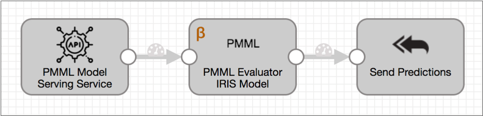
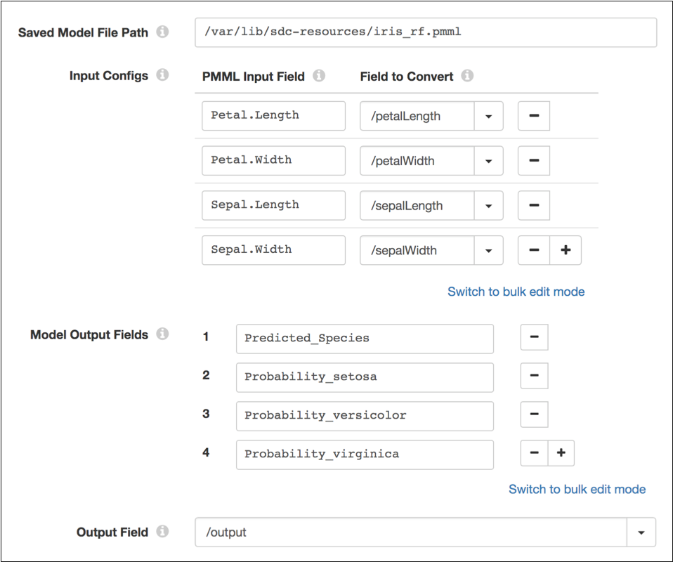

# PMML评估器


[支持的管道类型：](https://streamsets.com/documentation/controlhub/latest/help/datacollector/UserGuide/Pipeline_Configuration/ProductIcons_Doc.html#concept_mjg_ly5_pgb) 资料收集器

PMML评估器处理器使用以预测模型标记语言（PMML）格式存储的机器学习模型来生成数据的预测或分类。

使用PMML评估程序处理器，您可以创建管道来预测数据中已知模式的存在并获得实时见解。例如，您可以设计当数据通过管道时检测欺诈或所需维护的管道。

PMML评估程序处理器可通过付费订阅获得。有关详细信息，请[联系StreamSets](https://streamsets.com/contact-us/)。

要使用PMML评估程序处理器，您首先需要使用首选的机器学习技术来构建和训练模型。然后，您将训练后的模型导出到PMML文档，并将该文件保存在 运行管道的Data Collector计算机上。

在配置PMML评估程序处理器时，您将定义存储在Data Collector 计算机上的已保存PMML文档的路径。您还定义了记录中的字段和模型中的输入字段之间的映射，并定义了要输出的模型字段和要存储模型输出的记录字段。

## 先决条件


在配置PMML评估程序处理器之前，您必须完成以下先决条件：

1. 使用您喜欢的机器学习技术构建和训练机器学习模型。
2. 将训练后的模型导出为PMML文档。有关更多信息，请访问[Data Mining Group网站](http://dmg.org/)。
3. 将PMML文档保存在运行管道的Data Collector计算机上。StreamSets建议将文档存储在Data Collector资源目录 $ SDC_RESOURCES中。
4. 在Data Collector计算机上安装PMML阶段库。

### 安装PMML阶段库


要使用PMML评估程序处理器，您必须具有付费订阅并安装PMML阶段库。

1. 使用从StreamSets收到的电子邮件中的链接下载包含PMML阶段库的tarball。

2. 提取压缩包。

   压缩包被解压缩到以下目录：

   ```
   streamsets-datacollector-pmml-lib
   ```

3. 将提取的PMML阶段库存储为自定义阶段库。

   请参阅“ [定制舞台库”，](https://streamsets.com/documentation/controlhub/latest/help/datacollector/UserGuide/Configuration/CustomStageLibraries.html#concept_pmc_jk1_1x)然后按照安装类型的步骤进行操作。

## PMML模型作为微服务


当您在[微服务管道中](https://streamsets.com/documentation/controlhub/latest/help/datacollector/UserGuide/Microservice/Microservice_Title.html#concept_qfh_xdm_p2b)包含PMML评估器处理器时，外部客户端可以使用另存为PMML文档的模型来执行计算。

例如，在以下微服务管道中，REST API客户端将带有输入数据的请求发送到标记为PMML模型服务服务的REST服务源。PMML评估程序处理器使用机器学习模型从数据生成预测。处理器将包含模型预测的记录传递到标记为“发送预测”的“向原点发送响应”目的地，该记录将记录发送回REST服务源。然后，源将JSON格式的响应发送回源REST API客户端。



## 示例：虹膜分类


例如，假设您构建并训练了一个虹膜分类模型，并将该模型保存为PMML格式。该模型根据花朵的花瓣和萼片的长度和宽度测量结果来预测虹膜的种类。

您可以为模型提供以下输入：

```
{
  "petalLength": 6.4,
  "petalWidth": 2.8,
  "sepalLength": 5.6,
  "sepalWidth": 2.2
}
```

该模型生成以下四个输出，这些输出给出了预测的物种以及三种物种中每种物种的概率：

| 输出场                 | 值       |
| :--------------------- | :------- |
| 预测种类               | 维吉尼亚 |
| 概率_setosa            | 0.0      |
| Probability_versicolor | 0.12     |
| Probability_virginica  | 0.88     |

要将模型包含在管道中，请将模型文档保存在Data Collector 机器上，将PMML Evaluator处理器添加到管道中，然后配置处理器以使用PMML文档并将所需的输入字段和生成的输出字段映射到字段在记录中。下图显示了处理器配置：



## 配置PMML评估程序处理器

使用保存为PMML文档的机器学习模型，配置PMML评估程序处理器以生成数据的预测或分类。

1. 在“属性”面板的“ **常规”**选项卡上，配置以下属性：

   | 一般财产                                                     | 描述                                                         |
   | :----------------------------------------------------------- | :----------------------------------------------------------- |
   | 名称                                                         | 艺名。                                                       |
   | 描述                                                         | 可选说明。                                                   |
   | [必填项](https://streamsets.com/documentation/controlhub/latest/help/datacollector/UserGuide/Pipeline_Design/DroppingUnwantedRecords.html#concept_dnj_bkm_vq) | 必须包含用于将记录传递到阶段的记录的数据的字段。**提示：**您可能包括舞台使用的字段。根据为管道配置的错误处理，处理不包含所有必填字段的记录。 |
   | [前提条件](https://streamsets.com/documentation/controlhub/latest/help/datacollector/UserGuide/Pipeline_Design/DroppingUnwantedRecords.html#concept_msl_yd4_fs) | 必须评估为TRUE的条件才能使记录进入处理阶段。单击 **添加**以创建其他前提条件。根据为阶段配置的错误处理，处理不满足所有前提条件的记录。 |
   | [记录错误](https://streamsets.com/documentation/controlhub/latest/help/datacollector/UserGuide/Pipeline_Design/ErrorHandling.html#concept_atr_j4y_5r) | 该阶段的错误记录处理：放弃-放弃记录。发送到错误-将记录发送到管道以进行错误处理。停止管道-停止管道。对群集管道无效。 |

2. 在“ **PMML”**选项卡上，配置以下属性：

   | PMML属性           | 描述                                                         |
   | :----------------- | :----------------------------------------------------------- |
   | 保存的模型文件路径 | 数据收集器计算机上已保存的PMML文档的路径。指定绝对路径或相对于Data Collector资源目录的路径。例如，如果您在数据收集器资源目录 / var / lib / sdc-resources中保存了一个名为maint.model.pmml的PMML文档，请输入以下任一路径：/var/lib/sdc-resources/maint.model.pmmlmaint.model.pmml |
   | 输入配置           | 机器学习模型中的输入字段到记录中的字段的映射。对于每个映射，输入：PMML输入字段– PMML模型中的输入字段。要转换的字段–记录中的对应字段，指定为路径。 |
   | 模型输出字段       | 模型中的输出字段返回到管道。                                 |
   | 输出场             | 列表映射字段，用于在记录中存储模型输出。指定为路径。         |