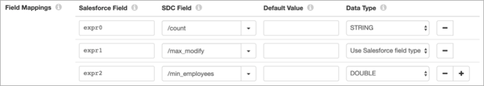

# Salesforce查询

[支持的管道类型：](https://streamsets.com/documentation/controlhub/latest/help/datacollector/UserGuide/Pipeline_Configuration/ProductIcons_Doc.html#concept_mjg_ly5_pgb) 资料收集器

Salesforce查找处理器在Salesforce对象中执行查找，并将查找值传递给字段。使用Salesforce查找使用其他数据丰富记录。

例如，您可以将处理器配置为使用account_number字段作为在Salesforce对象中查找帐户名称值的字段，并将这些值传递给新的account_name输出字段。

当查找导致多个匹配项时，Salesforce查找处理器可以返回第一个匹配值或在单独的记录中返回所有匹配值。

在配置Salesforce查找处理器时，您将定义处理器用于连接到Salesforce的连接信息，包括Salesforce API版本。

您指定查找模式和相关属性，返回值的输出字段以及多重匹配行为。您可以选择定义一个默认值以用于缺少值的字段，并为缺少值和没有默认值的字段设置行为。您还可以将处理器配置为本地缓存查找值，以提高性能。

当使用SOQL查询查找模式以及SOAP API或Bulk API版本39.0或更高版本时，可以将处理器配置为从Salesforce回收站中检索已删除的记录。

处理器生成Salesforce字段属性，这些属性提供有关每个字段的其他信息。

您可以选择使用HTTP代理连接到Salesforce。在Salesforce中启用后，您可以将处理器配置为使用相互身份验证来连接到Salesforce。

## 查找模式

Salesforce查找处理器可以使用两种模式来查找Salesforce数据。选择以下模式之一：

- 取回

  在检索模式下，Salesforce查找处理器使用指定的Id字段执行查找，一次调用一次[Sales（）Salesforce API](https://developer.salesforce.com/docs/atlas.en-us.api.meta/api/sforce_api_calls_retrieve.htm)最多可调用2000条记录。如果API调用中包含的一个或多个ID无效，则Salesforce拒绝整个记录集。然后，Salesforce查找处理器使用该阶段配置的错误处理将记录发送到错误。

  您无法在“检索”模式下访问已删除的记录。

  使用检索模式时，您可以指定用于查找的ID字段，要返回的Salesforce字段以及要使用的对象类型。

  该对象必须在Salesforce中是可检索的，即，该对象的可检索属性必须列为“ true”。例如，您应该能够从User检索数据，但是UserRecordAccess当前无法检索。请注意，此属性可以随Salesforce版本而更改。

  可以使用模式时，检索模式可改善管道性能。无法使用检索模式时，请使用SOQL查询模式。

- SOQL查询

  在SOQL查询模式下，Salesforce查找处理器对每个记录进行API调用。处理器默认使用[query（）API](https://developer.salesforce.com/docs/atlas.en-us.api.meta/api/sforce_api_calls_query.htm)调用，并在结果中包括已删除的记录时使用[queryAll（）API](https://developer.salesforce.com/docs/atlas.en-us.api.meta/api/sforce_api_calls_queryall.htm)调用。

  使用SOQL查询模式时，可以配置SOQL查询以用于查找以及是否在结果中包括已删除的记录。

  配置查询时，请使用以下格式：`SELECT ,  FROM  WHERE   `SELECT语句可以包含[SOQL聚合函数](https://streamsets.com/documentation/controlhub/latest/help/datacollector/UserGuide/Processors/SalesforceLookup.html#concept_oc2_zsj_lhb)。该表达式可以包括StreamSets表达式语言中的[记录函数](https://streamsets.com/documentation/controlhub/latest/help/datacollector/UserGuide/Expression_Language/Functions.html#concept_p1z_ggv_1r)和[时间函数](https://streamsets.com/documentation/controlhub/latest/help/datacollector/UserGuide/Expression_Language/Functions.html#concept_qkr_trf_sw)。

  例如，要使用记录中的帐号字段在Salesforce帐户对象中查找帐户名称字段，请使用以下查询：`SELECT Name FROM Account WHERE AccountNumber = '${record:value('/account_number')}'`如果`SELECT * FROM `在SOQL查询中指定，则处理器将扩展`*`到Salesforce对象中所有可供配置用户访问的字段。

  请注意，处理器将复合字段的组件添加到查询中，而不是添加复合字段本身。例如，来源添加BillingStreet，BillingCity等，而不是添加BillingAddress。同样，它添加Location__Latitude__s和Location__Longitude__s而不是Location__c。

### SOQL查询中的聚合函数


在SOQL查询模式下，可以在SOQL查询的SELECT语句中包括SOQL聚合函数。除了一个例外，处理器将查询的第一个功能 `expr0`的结果放入`expr1`字段中，同一查询的第二个功能的结果放入字段中，依此类推。唯一的例外是使用的COUNT函数没有字段名-处理器始终将结果放入 `count`领域。生成的字段类型取决于函数和查询的字段。该阶段不会为聚合函数生成的字段生成字段标题属性。按非聚合字段分组时，只能在同一SELECT语句中同时包含聚合函数和非聚合字段。

以下示例演示了SOQL查询中聚合函数的某些用法。每个示例都会检查Account对象中的数据，该对象的名称以`prefix`当前记录的字段中的值开头 。

#### COUNT功能

假设您要对匹配的Salesforce记录进行计数。

您可以输入COUNT函数（带或不带字段名称）：

- 如果没有字段名称，请输入以下查询：

  ```
  SELECT COUNT() FROM Account 
  WHERE Name LIKE '${record:value('/prefix')}%'
  ```

  当COUNT函数未指定任何字段名称时，SELECT语句不能包含其他元素。

  在这种情况下，阶段会将函数的结果放入 `count`Integer字段。

- 使用字段名称，输入以下查询：

  ```
  SELECT COUNT(Id) FROM Account 
  WHERE Name LIKE '${record:value('/prefix')}%'
  ```

  当COUNT函数包含字段名称时，SELECT语句可以包括其他聚合函数。

  在这种情况下，阶段会将函数的结果放入 `expr0`Integer字段。

有关使用带有或不带有字段名称的COUNT函数的更多信息，请参阅[Salesforce开发人员文档](https://developer.salesforce.com/docs/atlas.en-us.soql_sosl.meta/soql_sosl/sforce_api_calls_soql_select_count.htm)。

#### 多种汇总功能

您可以在单个查询中使用多个聚合函数。

假设对于匹配的Salesforce记录，您需要计数，记录更改的最新日期以及任何记录中最少的员工人数。

您可以输入以下查询：

```
SELECT COUNT(Id), MAX(LastModifiedDate), MIN(NumberOfEmployees) FROM Account 
WHERE Name LIKE '${record:value('/prefix')}%'
```

该阶段将查询的结果放入以下字段：

- `expr0` -整数字段包含记录数
- `expr1` -日期时间字段包含上次修改的日期
- `expr2` -整数字段包含员工人数

#### 按条款分组

您可以将聚合函数与GROUP BY子句结合使用，以计算Salesforce记录组的值。

假设对于匹配的Salesforce记录，您需要该`Industry`字段中的唯一值 以及记录数，上次修改日期和每个行业的最小雇员数。

您可以输入以下查询：

```
SELECT Industry, COUNT(Id), MAX(LastModifiedDate), MIN(NumberOfEmployees) FROM Account 
WHERE Name LIKE '${record:value('/prefix')}%'
GROUP BY Industry
```

该阶段将查询的结果放入以下字段：

- `Industry` -字符串字段
- `expr0` -整数字段包含计数
- `expr1` -日期时间字段包含上次修改的日期
- `expr2` -整数字段包含员工人数

#### 现场别名

您可以在查询中使用字段别名来指定阶段放置函数结果的字段名称。

假设您希望将记录的数量放入该`cnt`字段，将记录更改的最新日期放入该 `max_modify`字段，并将最少的雇员数量放入该`min_employees`字段。

您可以输入以下查询：

```
SELECT COUNT(Id) cnt, MAX(LastModifiedDate) max_modify, MIN(NumberOfEmployees) min_employees FROM Account
WHERE Name LIKE '${record:value('/prefix')}%'
```

该阶段将查询的结果放入以下字段：

- `cnt` -整数字段
- `max_modify` -日期时间字段
- `min_employees` -整数字段

您不能将SOQL关键字（例如）指定`count`为别名。

在Salesforce查找处理器中，您可以在“查找”选项卡上使用字段映射，而不是使用字段别名。在Salesforce字段属性中，输入默认字段，例如`expr0`。在“ SDC字段”属性中，输入首选的字段名称以放置函数结果。使用字段映射时，可以使用SOQL关键字，例如`count`。您还可以转换数据类型。

例如，要将查询结果放入“ `count` 字符串”字段，“ `max_modify`日期时间”字段和“ `min_employees`双精度”字段，请 按如下所示在“查找”选项卡上配置“字段映射”属性：



## 查找缓存

为了提高管道性能，您可以配置Salesforce查找处理器以本地缓存从Salesforce对象返回的值。

处理器缓存值，直到缓存达到最大大小或到期时间。当达到第一个限制时，处理器会将缓存中的值逐出。

您可以配置以下方式从缓存中逐出值：

- 基于规模的驱逐

  配置处理器缓存的最大值数量。当达到最大数量时，处理器将从高速缓存中逐出最旧的值。

- 基于时间的驱逐

  配置一个值可以保留在缓存中而不被写入或访问的时间。当达到到期时间时，处理器将从高速缓存中逐出该值。驱逐策略确定处理器是否测量自上次写入值或自上次访问值以来的到期时间。

  例如，您将逐出策略设置为在上次访问后到期，并将到期时间设置为60秒。处理器在60秒钟内未访问任何值后，处理器将从高速缓存中逐出该值。

当您停止管道时，处理器将清除缓存。

## Salesforce属性

Salesforce查找处理器生成Salesforce字段属性，这些属性提供有关每个字段的其他信息。来源从Salesforce接收这些详细信息。

Salesforce属性包括用户定义的前缀，以将Salesforce属性与其他属性区分开。默认情况下，前缀为“ salesforce”。您可以更改处理器使用的前缀，并且可以配置处理器不创建Salesforce属性。

您可以使用`record:fieldAttribute`或 `record:fieldAttributeOrDefault`函数来访问属性中的信息。

Salesforce查找处理器可以提供以下Salesforce字段属性：

| Salesforce字段属性              | 描述                                     |
| :------------------------------ | :--------------------------------------- |
| <Salesforce前缀> salesforceType | 提供该字段的原始Salesforce数据类型。     |
| <Salesforce前缀>长度            | 提供所有字符串和textarea字段的原始长度。 |
| <Salesforce前缀>精度            | 为所有双字段提供原始精度。               |
| <Salesforce前缀>规模            | 提供所有双字段的原始比例。               |
| <Salesforce前缀>数字            | 提供所有整数字段的最大位数。             |

有关字段属性的更多信息，请参见[字段属性](https://streamsets.com/documentation/controlhub/latest/help/datacollector/UserGuide/Pipeline_Design/FieldAttributes.html#concept_xfm_wtp_1z)。

## 更改API版本

Data Collector随附43.0版的Salesforce Web服务连接器库。如果需要访问版本43.0中不存在的功能，则可以使用其他Salesforce API版本 。

1. 在**Salesforce**选项卡上，将**API Version**属性设置为要使用的版本，例如39.0。

2. 从Salesforce Web服务连接器（WSC）下载以下JAR文件的相关版本：

   - WSC JAR文件-force-wsc- <version> .0.0.jar
   - 合作伙伴API JAR文件-force-partner-api- <版本> .0.0.jar

   其中<version>是API版本号，例如39。

   有关从Salesforce WSC下载库的信息，请参阅https://developer.salesforce.com/page/Introduction_to_the_Force.com_Web_Services_Connector。

3. 在以下Data Collector目录中，将默认的force-wsc-43.0.0.jar和force-partner-api-43.0.0.jar文件替换为您下载的版本化JAR文件：

   ```
   $SDC_DIST/streamsets-libs/streamsets-datacollector-salesforce-lib/lib/
   ```

4. 重新启动Data Collector， 以使更改生效。

## 配置Salesforce查找

配置Salesforce查找处理器以在Salesforce对象中执行查找。

1. 在“属性”面板的“ **常规”**选项卡上，配置以下属性：

   | 一般财产                                                     | 描述                                                         |
   | :----------------------------------------------------------- | :----------------------------------------------------------- |
   | 名称                                                         | 艺名。                                                       |
   | 描述                                                         | 可选说明。                                                   |
   | [必填项](https://streamsets.com/documentation/controlhub/latest/help/datacollector/UserGuide/Pipeline_Design/DroppingUnwantedRecords.html#concept_dnj_bkm_vq) | 必须包含用于将记录传递到阶段的记录的数据的字段。**提示：**您可能包括舞台使用的字段。根据为管道配置的错误处理，处理不包含所有必填字段的记录。 |
   | [前提条件](https://streamsets.com/documentation/controlhub/latest/help/datacollector/UserGuide/Pipeline_Design/DroppingUnwantedRecords.html#concept_msl_yd4_fs) | 必须评估为TRUE的条件才能使记录进入处理阶段。单击 **添加**以创建其他前提条件。根据为阶段配置的错误处理，处理不满足所有前提条件的记录。 |
   | [记录错误](https://streamsets.com/documentation/controlhub/latest/help/datacollector/UserGuide/Pipeline_Design/ErrorHandling.html#concept_atr_j4y_5r) | 该阶段的错误记录处理：放弃-放弃记录。发送到错误-将记录发送到管道以进行错误处理。停止管道-停止管道。对群集管道无效。 |

2. 在“ **Salesforce”**选项卡上，配置以下属性：

   | Salesforce财产                                               | 描述                                                         |
   | :----------------------------------------------------------- | :----------------------------------------------------------- |
   | 用户名                                                       | Salesforce用户名，采用以下电子邮件格式： `@.com`。           |
   | 密码                                                         | Salesforce密码。如果运行Data Collector的计算机不在Salesforce环境中配置的受信任IP范围内，则必须生成安全令牌，然后将此属性设置为密码，后跟安全令牌。例如，如果密码为`abcd`，安全令牌为`1234`，则将此属性设置为abcd1234。有关生成安全令牌的更多信息，请参阅[重置安全令牌](https://help.salesforce.com/articleView?id=user_security_token.htm&type=0)。**提示：** 为了保护敏感信息，例如用户名和密码，可以使用 [运行时资源](https://streamsets.com/documentation/controlhub/latest/help/datacollector/UserGuide/Pipeline_Configuration/RuntimeValues.html#concept_bs4_5nm_2s)或凭据存储。有关凭证存储的更多信息，请参阅Data Collector文档中的[凭证存储](https://streamsets.com/documentation/datacollector/latest/help/#datacollector/UserGuide/Configuration/CredentialStores.html)。 |
   | 验证端点                                                     | Salesforce SOAP API身份验证端点。输入以下值之一：`login.salesforce.com` -用于连接到Production或Developer Edition组织。`test.salesforce.com` -用于连接到沙盒组织。默认值为`login.salesforce.com`。 |
   | API版本 [](https://streamsets.com/documentation/controlhub/latest/help/datacollector/UserGuide/Processors/SalesforceLookup.html#task_rjz_lck_fy) | 用于连接到Salesforce的Salesforce API版本。默认值为43.0。如果更改版本，则还必须从Salesforce Web服务连接器（WSC）下载相关的JAR文件。 |

3. 在“ **查找”**选项卡上，配置以下属性：

   | 查找属性                                                     | 描述                                                         |
   | :----------------------------------------------------------- | :----------------------------------------------------------- |
   | 查找模式[](https://streamsets.com/documentation/controlhub/latest/help/datacollector/UserGuide/Processors/SalesforceLookup.html#concept_ow1_lj3_xbb) | 使用的查找模式：检索-用于根据指定的ID字段一次从指定的对象中查找多达2000条记录。尽可能使用以改善管道性能。SOQL查询-用于基于指定的查询执行逐条记录的查找。可以检索已删除的记录并访问相关对象中的数据。默认为SOQL查询。 |
   | SOQL查询                                                     | SOQL查询用于在Salesforce中查找数据。使用以下语法进行查询：`SELECT ,  FROM  WHERE   `有关更多信息，请参见[查阅模式](https://streamsets.com/documentation/controlhub/latest/help/datacollector/UserGuide/Processors/SalesforceLookup.html#concept_ow1_lj3_xbb)。仅适用于SOQL查询模式。 |
   | 包括已删除的记录                                             | 确定SOQL查询是否还从Salesforce回收站中检索已删除的记录。当阶段使用Salesforce SOAP API或Bulk API版本39.0或更高版本时，查询可以检索已删除的记录。早期版本的Bulk API不支持检索已删除的记录。仅适用于SOQL查询模式。 |
   | 编号栏位                                                     | 记录中包含用于查询的Salesforce记录ID的字段。仅用于检索模式。 |
   | Salesforce字段                                               | 以逗号分隔的要返回的Salesforce字段列表。仅用于检索模式。     |
   | 对象类型                                                     | 用于查找的对象类型。Salesforce必须认为对象类型是可检索的。仅用于检索模式。 |
   | 场映射                                                       | 用于覆盖默认字段映射。默认情况下，Salesforce字段将写入相同名称的Data Collector字段。输入以下内容：Salesforce字段-包含查找值的Salesforce字段的名称。输入字段名称或输入定义该字段名称的表达式。SDC字段-记录中接收查找值的字段的名称。您可以指定现有字段或新字段。如果该字段不存在，则Salesforce查找将创建该字段。默认值-查询不返回字段值时使用的可选默认值。如果查询不返回任何值，并且未定义此属性，则处理器将根据“缺失值行为”属性处理记录。数据类型-用于SDC字段的数据类型。指定默认值时为必需。处理器默认使用Salesforce数据类型。使用[简单或批量编辑模式](https://streamsets.com/documentation/controlhub/latest/help/datacollector/UserGuide/Pipeline_Configuration/SimpleBulkEdit.html#concept_alb_b3y_cbb)，单击 **添加**图标以创建其他字段映射。 |
   | 多值行为                                                     | 找到多个匹配值时要采取的措施：仅第一个值-返回第一个值。拆分为多个记录-返回单独记录中的每个匹配值。 |
   | 价值观缺失行为                                               | 在未定义默认值的字段中找不到返回值时采取的措施：发送到错误-将记录发送到错误。沿管道传递记录不变-传递没有查找返回值的记录。 |
   | 启用本地缓存[](https://streamsets.com/documentation/controlhub/latest/help/datacollector/UserGuide/Processors/SalesforceLookup.html#concept_s1h_1mk_fy) | 指定是否在本地缓存返回的值。                                 |
   | 缓存的最大条目数                                             | 要缓存的最大值数。当达到最大数量时，处理器将从高速缓存中逐出最旧的值。默认值为-1，表示无限制。 |
   | 驱逐政策类型                                                 | 过期时间过后，用于从本地缓存中逐出值的策略：上次访问后过期-计算自上次通过读取或写入访问值以来的过期时间。上次写入后过期-测量自创建值或上次替换值以来的过期时间。 |
   | 到期时间                                                     | 一个值可以保留在本地缓存中而没有被访问或写入的时间。默认值为1秒。 |
   | 时间单位                                                     | 到期时间的时间单位。默认值为秒。                             |

4. 在“ **高级”**选项卡上，配置以下属性：

   | 先进物业                                                     | 描述                                                         |
   | :----------------------------------------------------------- | :----------------------------------------------------------- |
   | 创建Salesforce属性 [[](https://streamsets.com/documentation/controlhub/latest/help/datacollector/UserGuide/Processors/SalesforceLookup.html#concept_nl4_3q2_kz) | 将Salesforce字段属性添加到字段。默认情况下，原点创建Salesforce属性。 |
   | Salesforce属性前缀                                           | Salesforce属性的前缀。                                       |
   | 使用代理服务器                                               | 指定是否使用HTTP代理连接到Salesforce。                       |
   | 代理主机名                                                   | 代理主机。                                                   |
   | 代理端口                                                     | 代理端口。                                                   |
   | 代理需要凭证                                                 | 指定代理是否需要用户名和密码。                               |
   | 代理用户名                                                   | 代理凭据的用户名。                                           |
   | 代理密码                                                     | 代理凭证的密码。**提示：** 为了保护敏感信息，例如用户名和密码，可以使用 [运行时资源](https://streamsets.com/documentation/controlhub/latest/help/datacollector/UserGuide/Pipeline_Configuration/RuntimeValues.html#concept_bs4_5nm_2s)或凭据存储。有关凭证存储的更多信息，请参阅Data Collector文档中的[凭证存储](https://streamsets.com/documentation/datacollector/latest/help/#datacollector/UserGuide/Configuration/CredentialStores.html)。 |
   | 使用相互认证                                                 | 在Salesforce中启用后，您可以使用SSL / TLS相互身份验证来连接到Salesforce。默认情况下，在Salesforce中未启用相互身份验证。要启用相互身份验证，请联系Salesforce。在启用相互身份验证之前，必须将[相互身份验证证书](https://help.salesforce.com/articleView?id=security_keys_uploading_mutual_auth_cert.htm&type=0)存储在Data Collector资源目录中。有关更多信息，请参阅[密钥库和信任库配置](https://streamsets.com/documentation/controlhub/latest/help/datacollector/UserGuide/Pipeline_Configuration/SSL-TLS.html#concept_kqb_rqf_5z)。 |
   | [密钥库文件](https://streamsets.com/documentation/controlhub/latest/help/datacollector/UserGuide/Pipeline_Configuration/SSL-TLS.html#concept_kqb_rqf_5z) | 密钥库文件的路径。输入文件的绝对路径或相对于Data Collector资源目录的路径：$ SDC_RESOURCES。有关环境变量的更多信息，请参阅 Data Collector 文档中的Data Collector [环境配置](https://streamsets.com/documentation/datacollector/latest/help/#datacollector/UserGuide/Configuration/DCEnvironmentConfig.html)。默认情况下，不使用任何密钥库。 |
   | 密钥库类型                                                   | 要使用的密钥库的类型。使用以下类型之一：Java密钥库文件（JKS）PKCS＃12（p12文件）默认值为Java密钥库文件（JKS）。 |
   | 密钥库密码                                                   | 密钥库文件的密码。密码是可选的，但建议使用。**提示：**为了保护敏感信息（如密码），可以使用[运行时资源](https://streamsets.com/documentation/controlhub/latest/help/datacollector/UserGuide/Pipeline_Configuration/RuntimeValues.html#concept_bs4_5nm_2s)或凭据存储。有关凭证存储的更多信息，请参阅Data Collector文档中的[凭证存储](https://streamsets.com/documentation/datacollector/latest/help/#datacollector/UserGuide/Configuration/CredentialStores.html)。 |
   | 密钥库密钥算法                                               | 用于管理密钥库的算法。默认值为 SunX509。                     |