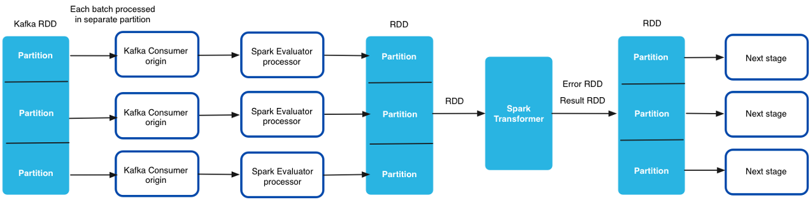

# 火花评估器


[支持的管道类型：](https://streamsets.com/documentation/controlhub/latest/help/datacollector/UserGuide/Pipeline_Configuration/ProductIcons_Doc.html#concept_mjg_ly5_pgb) 资料收集器

Spark评估程序根据您开发的Spark应用程序在管道内执行自定义处理。

当您需要在管道中执行繁重的自定义处理（例如图像分类）时，Spark Evaluator处理器特别有用。

完成以下常规任务以使用Spark Evaluator：

1. 使用Java或Scala编写Spark应用程序。然后，打包包含该应用程序的JAR文件。

2. 安装应用程序及其依赖项。

3. 配置Spark Evaluator处理器以提交Spark应用程序。

   配置处理器时，可以定义开发的自定义Spark类的名称，并定义要传递给`init`自定义Spark类中的方法的参数 。

**注意：**包含Spark Evaluator的阶段库包含处理器所需的所有依赖项。Spark Evaluator不需要任何安装先决条件。

## Spark版本和舞台库

Spark Evaluator处理器仅支持Spark 2.1或更高版本。

使用Spark Evaluator处理器时，请确保所有相关组件的Spark版本都相同，如下所示：

- 确保所选阶段库中使用的Spark版本与用于构建应用程序的Spark版本匹配。

  例如，如果您使用Spark 2.1构建应用程序，请使用Spark 2.1阶段库之一中提供的Spark Evaluator。

- 在集群流传输管道中使用处理器时，所选阶段库中的Spark版本也必须与集群使用的Spark版本匹配。

  例如，如果您的集群使用Spark 2.2，请使用包含Spark 2.2的阶段库。

Spark Evaluator 在多个CDH和MapR阶段库中可用。要验证舞台库包含的Spark版本，请参阅CDH或MapR文档。有关包含Spark Evaluator的阶段库的更多信息，请参阅Data Collector 文档 中的[Available Stage Libraries](https://streamsets.com/documentation/datacollector/latest/help/#datacollector/UserGuide/Installation/AddtionalStageLibs.html%23concept_evs_xkm_s5)。

## 独立管道

在独立管道中使用时，Spark Evaluator处理器将启动本地Spark应用程序。它将一批数据作为弹性分布式数据集（RDD）传递到Spark应用程序。`SparkContext`只要管道运行，Spark应用程序 即运行。Spark应用程序将作业提交到StreamSets Spark Transformer API，处理数据，然后将结果和错误返回到管道以进行进一步处理。

在独立管道中使用Spark Evaluator时，请为Spark Evaluator定义并行度值。Spark应用程序为每批记录创建此数量的分区。Spark Transformer并行处理每个分区，然后将结果和错误返回到管道。

**注意：**编写用于独立管道的自定义Spark应用程序时，请勿使用该`RDD.checkpoint()`方法。当Spark Evaluator在独立管道中时，检查点RDD会导致管道失败。

## 集群管道

您可以在集群管道中使用Spark Evaluator处理器，该集群管道以集群流模式处理来自Kafka或MapR集群的数据。您不能在以集群批处理模式或HDFS处理来自MapR集群的数据的集群管道中使用处理器。

在集群管道中，集群管理器 为Kafka或MapR集群中的每个主题分区生成一个Data Collector worker。Spark Streaming每隔几秒钟就会为管道生成一批。然后，每个Data Collector 工作程序都从单个分区处理批处理。

弹性分布式数据集（RDD）由跨所有Data Collector工作器接收的数据生成 。然后将RDD传递到在驱动程序上运行的Spark Transformer。

传递给Spark Transformer的RDD指向整个集群中的数据。Spark Transformer处理 在集群中所有Data Collector工作程序中接收到的所有数据，同时处理多个批次。仅当您的自定义Spark代码对数据进行混洗时，数据才会从一个节点移动到另一个节点。Spark Transformer将结果和错误返回给在Data Collector 工作程序上运行的每个Spark Evaluator处理器。该数据采集 工人并行处理剩余的流水线阶段。

下图显示了Spark Transformer如何处理跨集群中所有工作程序接收的数据：



在编写Spark应用程序并为集群管道配置处理器时，请使用以下规则和准则：

- 确保用于构建应用程序的Spark版本与集群和Spark Evaluator阶段库使用的Spark版本匹配。

- 要维护在应用程序中多次使用的RDD的状态，请在自定义Spark应用程序中使用

  ```
  RDD.checkpoint()
  ```

  或 

  ```
  RDD.cache()
  ```

  方法。当您检查点或缓存RDD时，Spark Transformer可以访问以前批次中的RDD。

  当管道重新启动或Spark应用程序重新启动时，Spark Evaluator处理器会清理检查点。要在管道运行之间或Spark应用程序重新启动之间维护每个RDD的状态，必须在外部存储（例如HDFS或HBase）中维护RDD。

- 配置处理器时，请勿为处理器定义并行度值。Kafka Consumer来源中定义的分区数决定了整个集群管道中使用的分区数。

- 配置处理器时，请为`init` 方法参数使用常量值。在群集管道中，Spark Evaluator处理器无法在方法参数中评估Data Collector表达式`init`。

**相关概念**

[集群管道概述](https://streamsets.com/documentation/controlhub/latest/help/datacollector/UserGuide/Cluster_Mode/ClusterPipelines.html#concept_hmh_kfn_1s)

## 开发Spark应用程序

要开发自定义Spark应用程序，请编写Spark应用程序，然后打包包含该应用程序的JAR文件。

使用Java或Scala编写实现StreamSets Spark Transformer API的自定义Spark类：[https](https://github.com/streamsets/datacollector-plugin-api/tree/master/streamsets-datacollector-spark-api) : [//github.com/streamsets/datacollector-plugin-api/tree/master/streamsets-datacollector-spark-api](https://github.com/streamsets/datacollector-plugin-api/tree/master/streamsets-datacollector-spark-api)。

在自定义类中包括以下方法：

- 在里面

  可选的。`init`当管道开始读取您在Spark Evaluator处理器中配置的参数时，将调用该方法一次。使用该`init`方法建立与外部系统的连接或从外部系统读取配置详细信息或现有数据。

- 转变

  需要。`transform`将为管道处理的每批记录调用该方法。Spark Evaluator处理器将一批数据`transform`作为弹性分布式数据集（RDD）传递给该方法。该方法根据定制代码处理数据。

- 破坏

  可选的。如果包含`init`建立与外部系统的连接的方法，则还应包含`destroy`关闭连接的方法。`destroy`管道停止时调用该方法。

完成编写自定义Spark类后，请打包包含Spark应用程序的JAR文件。针对用于Spark Evaluator处理器的同一阶段库版本进行编译。例如，如果您正在使用阶段库中包含的Spark Evaluator处理器来处理Hadoop的Cloudera CDH版本5.9，则针对集成到Cloudera CDH版本5.9中的Spark生成应用程序。

如果使用Scala编写自定义Spark类，请使用Scala 2.11编译应用程序。

## 安装应用程序

将Spark应用程序JAR文件安装为Data Collector的外部库。如果您的自定义Spark应用程序依赖于streamets-datacollector-api，streamsets-datacollector-spark-api和spark-core库以外的外部库，则也应将这些库安装在同一位置。

**提示：**要包含自定义Spark应用程序中使用的所有依赖库，可以使用Apache Maven依赖插件。有关依赖插件的更多信息，请参见http://maven.apache.org/plugins/maven-dependency-plugin/。

有关安装其他驱动程序的信息，请参阅 Data Collector 文档 中的“ [安装外部库](https://streamsets.com/documentation/datacollector/latest/help/#datacollector/UserGuide/Configuration/ExternalLibs.html%23concept_pdv_qlw_ft) ”。

**注意：** Spark Evaluator处理器包含在多个CDH和MapR阶段库中。在为处理器安装外部库时，必须使它们可被正在使用的阶段库访问。

## 配置Spark评估程序

配置Spark评估程序以基于自定义Spark应用程序处理数据。

1. 在“属性”面板的“ **常规”**选项卡上，配置以下属性：

   | 一般财产                                                     | 描述                                                         |
   | :----------------------------------------------------------- | :----------------------------------------------------------- |
   | 名称                                                         | 艺名。                                                       |
   | 描述                                                         | 可选说明。                                                   |
   | 舞台库                                                       | 您要使用的库版本。                                           |
   | [必填项](https://streamsets.com/documentation/controlhub/latest/help/datacollector/UserGuide/Pipeline_Design/DroppingUnwantedRecords.html#concept_dnj_bkm_vq) | 必须包含用于将记录传递到阶段的记录的数据的字段。**提示：**您可能包括舞台使用的字段。根据为管道配置的错误处理，处理不包含所有必填字段的记录。 |
   | [前提条件](https://streamsets.com/documentation/controlhub/latest/help/datacollector/UserGuide/Pipeline_Design/DroppingUnwantedRecords.html#concept_msl_yd4_fs) | 必须评估为TRUE的条件才能使记录进入处理阶段。单击 **添加**以创建其他前提条件。根据为阶段配置的错误处理，处理不满足所有前提条件的记录。 |
   | [记录错误](https://streamsets.com/documentation/controlhub/latest/help/datacollector/UserGuide/Pipeline_Design/ErrorHandling.html#concept_atr_j4y_5r) | 该阶段的错误记录处理：放弃-放弃记录。发送到错误-将记录发送到管道以进行错误处理。停止管道-停止管道。对群集管道无效。 |

2. 在“ **Spark”**选项卡上，配置以下属性：

   | 星火地产                                                     | 描述                                                         |
   | :----------------------------------------------------------- | :----------------------------------------------------------- |
   | 平行性                                                       | 对于独立模式，每批记录要创建的分区数。例如，如果设置为4，则Spark Transformer同时运行4个并行作业以处理批处理。根据数据收集器计算机上可用处理器的数量设置值。**注意：**当处理器包含在群集管道中时，不使用。Spark Transformer使用在Kafka Consumer或MapR Streams Consumer来源中定义的分区数。 |
   | 应用名称                                                     | 对于独立模式，Spark应用程序的名称。Spark在日志文件中显示此应用程序名称。如果运行包含多个Spark Evaluator处理器的管道，请确保为每个管道使用唯一的应用程序名称，以简化调试。默认值为“ SDC Spark App”。**注意：**当处理器包含在群集管道中时，不使用。 |
   | 火花变压器类 [](https://streamsets.com/documentation/controlhub/latest/help/datacollector/UserGuide/Processors/Spark.html#concept_lfl_dvd_1y) | 实现StreamSets Spark Transformer API的自定义Spark类的全限定名称。使用以下格式输入类名称：`com.streamsets.spark.`例如，假设您开发了一个`GetCreditCardType`实现Spark Transformer API 的类，如下所示：`public class GetCreditCardType extends SparkTransformer implements Serializable { ... }`然后，您将输入类名称，如下所示：`com.streamsets.spark.GetCreditCardType` |
   | 初始化方法参数[](https://streamsets.com/documentation/controlhub/latest/help/datacollector/UserGuide/Processors/Spark.html#concept_lfl_dvd_1y) | 传递给`init`自定义Spark类中的方法的参数。输入自定义Spark类所需的参数。在独立模式下，为参数值输入常量或表达式。在群集模式下，仅输入常量值。在群集管道中，Spark Evaluator处理器无法评估`init` 方法参数中定义的Data Collector表达式。使用[简单或批量编辑模式](https://streamsets.com/documentation/controlhub/latest/help/datacollector/UserGuide/Pipeline_Configuration/SimpleBulkEdit.html#concept_alb_b3y_cbb)，单击 **添加**图标以添加其他参数。 |