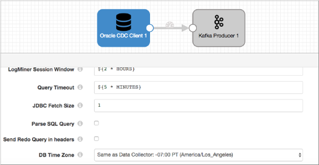
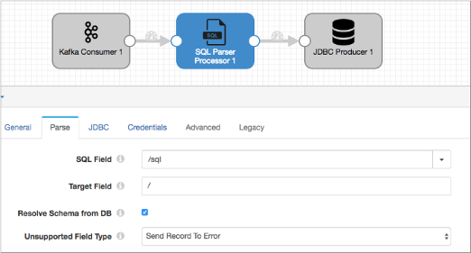

# SQL解析器

[支持的管道类型：](https://streamsets.com/documentation/controlhub/latest/help/datacollector/UserGuide/Pipeline_Configuration/ProductIcons_Doc.html#concept_mjg_ly5_pgb) 资料收集器

SQL分析器在字符串字段中分析SQL查询。解析查询时，处理器根据SQL查询中定义的字段生成字段，并在记录头属性中指定CRUD操作，表和模式信息。

将Oracle CDC客户端源配置为跳过解析时，使用处理器来解析写入字段的SQL查询。这样可以避免重做日志在处理之前切换的可能性。有关更多信息，请参见[使用多个管道](https://streamsets.com/documentation/controlhub/latest/help/datacollector/UserGuide/Processors/SQLParser.html#concept_rr3_p12_wdb)。

配置SQL解析器时，您将定义包含要解析的SQL语句的字段，以及将要添加来自SQL查询的字段的目标字段。如果记录中不存在来自SQL查询的字段，则会创建它们。如果它们已经存在，则将其覆盖。

您可以指定处理器连接到数据库以解析未知的字段类型。

如果您的数据库区分大小写，则可以将处理器配置为解释区分大小写的架构，表和列名。

处理器还在记录头属性中包含CDC和CRUD信息，因此启用CRUD的目标可以轻松处理记录。

## 使用多条管道

当数据库包含非常宽的表时，由于Oracle CDC客户端现在必须处理大量信息，因此它需要更多时间来读取更改数据和解析SQL查询。请注意，读取更改数据受I / O约束约束，而解析SQL查询则受CPU约束约束。

重做日志可以非常频繁地切换。如果读取更改数据和解析SQL查询所花费的时间比重做日志切换所花费的时间长，则数据将丢失。

一种解决方案是使用SQL Parser处理器和多个管道。第一个管道包含起点和中间端点，例如本地文件系统或Kafka。通过清除“ **解析SQL查询”**属性，将源配置为不解析SQL查询。第二个管道将记录从中间端点传递到SQL解析器，以解析SQL查询并更新字段。

使用多个管道的原因是默认情况下管道是同步的。如果Oracle CDC客户端源和SQL Parser处理器在同一管道中，则该源仅在管道完成对前一批的处理之后才读取数据。这会导致相同的问题，即重做日志可以在管道完成数据处理之前切换。

使用中间端点会使管道异步。意思是，一个管道可以独立于另一个处理一批。使用这种方法，源服务器可以读取重做日志，而无需等待SQL解析器完成，因此不会丢失任何数据。

### 例

您要创建两个管道并使用SQL Parser而不是Oracle CDC Client处理SQL查询。第一个管道包含Oracle CDC客户端和一个中间端点，例如Kafka。例如：



第二个管道从中间端点读取记录，并将记录传递到SQL Parser处理器。处理器解析位于/ sql字段中的SQL查询，然后JDBC处理器将数据写入最终目标。



## 解决方案


对于INSERT操作，您可以指定要将新字段添加为子字段的位置。使用 **来自数据库的解析架构**来解析所有字段类型。如果不选择此选项，则所有字段都将以字符串形式返回，它们以它们在SQL语句中的形式出现。

**注意：**当读取表的第一条记录时，将发生字段类型解析，然后仅在读取表中以前未遇到的字段时，才发生字段类型解析。

选择此选项时，必须为数据库安装JDBC驱动程序并配置JDBC连接属性。有关安装其他驱动程序的更多信息，请参见[安装外部库](https://streamsets.com/documentation/controlhub/latest/help/datacollector/UserGuide/Configuration/ExternalLibs.html#concept_pdv_qlw_ft)。

**注意：** StreamSets已将Oracle 11g的SQL Parser处理器与Oracle 11.2.0 JDBC驱动程序一起测试。

当数据库包含区分大小写的模式，表和列**名称**时，请使用区分大小写的名称。如果未选择此选项，则SQL Parser处理器将使用所有大写字母提交名称。

## 不支持的数据类型

您可以配置处理器如何处理包含不受支持的数据类型的记录。处理器可以执行以下操作：

- 将记录传递到没有不支持的数据类型的管道中。
- 将记录传递给错误，而不包含不支持的数据类型。
- 丢弃记录。

SQL Parser不支持Oracle CDC客户端不支持的相同Oracle数据类型。有关不支持的数据类型的完整列表，请参见《[Oracle CDC客户端不支持的数据类型》](https://streamsets.com/documentation/controlhub/latest/help/datacollector/UserGuide/Origins/OracleCDC.html#concept_gwp_d4n_n1b)。

## 生成的记录

SQL解析器解析字段中的SQL查询，并根据查询创建字段。处理器还在sdc.operation.type记录头属性中包含CRUD操作类型。这使启用CRUD的目标能够确定在处理记录时要使用的操作类型。

在配置SQL分析器时，您可以指定包含SQL查询的字段。例如，如果SQL解析器处理位于/ sql字段中的以下SQL查询语句：

```
INSERT INTO mc("Part", "Cost") VALUES('levers', 250)
```

它将以下字段写入记录：

| 部分 | 成本 |
| :--- | :--- |
| 杠杆 | 250  |

如果“零件和成本”字段已经存在，则处理器将覆盖这些字段。如果它们不存在，则处理器创建它们。

SQL Parser支持以下操作：

- 插入
- 更新
- 删除

### CRUD操作标头属性

与Oracle CDC客户端一样，SQL解析器在以下两个记录头属性中指定操作类型：

- sdc.operation.type

  SQL Parser评估与其处理的每个条目关联的Oplog操作类型，并在适当时将操作类型写入sdc.operation.type记录头属性。

- oracle.cdc.operation

  SQL分析器还将Oplog CRUD操作类型写入oracle.cdc.operation记录标头属性。

  启用CRUD的目标在检查sdc.operation.type属性后，会为该操作类型检查此属性。

有关更多信息，请参见[Oracle CDC客户端CRUD操作标头属性](https://streamsets.com/documentation/controlhub/latest/help/datacollector/UserGuide/Origins/OracleCDC.html#concept_x4h_m42_5y)。


### CDC标头属性

如果以下CDC标头属性已存在，则SQL Parser处理器将保留它们；如果不存在，则会创建它们：

- TABLE_NAME
- sql.table
- TABLE_SCHEM

SQL分析器将覆盖以下标头属性：

- jdbc。<列名称> .precision
- jdbc。<列名称> .scale

这些是表列名称，而不是字段名称。例如，如果列名称为 `part`，则标题为jdbc.part.precision和jdbc.part.scale。

## 配置SQL解析器处理器

配置SQL解析器以解析SQL查询。

1. 在“属性”面板的“ **常规”**选项卡上，配置以下属性：

   | 一般财产                                                     | 描述                                                         |
   | :----------------------------------------------------------- | :----------------------------------------------------------- |
   | 名称                                                         | 艺名。                                                       |
   | 描述                                                         | 可选说明。                                                   |
   | [必填项](https://streamsets.com/documentation/controlhub/latest/help/datacollector/UserGuide/Pipeline_Design/DroppingUnwantedRecords.html#concept_dnj_bkm_vq) | 必须包含用于将记录传递到阶段的记录的数据的字段。**提示：**您可能包括舞台使用的字段。根据为管道配置的错误处理，处理不包含所有必填字段的记录。 |
   | [前提条件](https://streamsets.com/documentation/controlhub/latest/help/datacollector/UserGuide/Pipeline_Design/DroppingUnwantedRecords.html#concept_msl_yd4_fs) | 必须评估为TRUE的条件才能使记录进入处理阶段。单击 **添加**以创建其他前提条件。根据为阶段配置的错误处理，处理不满足所有前提条件的记录。 |
   | [记录错误](https://streamsets.com/documentation/controlhub/latest/help/datacollector/UserGuide/Pipeline_Design/ErrorHandling.html#concept_atr_j4y_5r) | 该阶段的错误记录处理：放弃-放弃记录。发送到错误-将记录发送到管道以进行错误处理。停止管道-停止管道。对群集管道无效。 |

2. 在“ **解析”**选项卡上，配置以下属性：

   | SQL解析器属性            | 描述                                                         |
   | :----------------------- | :----------------------------------------------------------- |
   | SQL字段                  | 包含SQL查询的字段的名称。                                    |
   | 目标领域                 | SQL查询生成的字段将放置在其中的字段。您可以指定现有字段或新字段。如果该字段存在，则将由于SQL查询而产生的任何新字段添加为子字段并覆盖现有字段。如果该字段不存在，则SQL Parser将创建该字段。 |
   | 从数据库解析架构         | 查询数据库以解析模式并将字段解析为正确的数据类型。如果不选择此选项，则所有字段都将以字符串形式返回，它们以它们在SQL语句中的形式出现。选择此选项时，必须为数据库安装JDBC驱动程序并配置JDBC连接属性。有关安装其他驱动程序的更多信息，请参见[安装外部库](https://streamsets.com/documentation/controlhub/latest/help/datacollector/UserGuide/Configuration/ExternalLibs.html#concept_pdv_qlw_ft)。 |
   | 不支持的字段类型         | 确定处理器在记录中遇到不受支持的数据类型时的行为：将记录发送到管道-处理器将忽略不支持的数据类型，并将仅具有支持的数据类型的记录传递到管道。发送记录到错误-处理器根据为该阶段配置的错误记录处理来处理记录。错误记录仅包含支持的数据类型。丢弃记录-处理器丢弃记录。SQL Parser不支持Oracle CDC客户端不支持的相同Oracle数据类型。有关不支持的数据类型的列表，请参见[不支持的数据类型](https://streamsets.com/documentation/controlhub/latest/help/datacollector/UserGuide/Origins/OracleCDC.html#concept_gwp_d4n_n1b)。 |
   | 将不支持的字段添加到记录 | 在记录中包括具有不受支持的数据类型的字段。包括字段名称和不支持的字段的未解析的字符串值。 |
   | 区分大小写的名称         | 启用使用区分大小写的架构，表和列名称。未启用时，处理器会将所有名称更改为大写。 |
   | 日期格式                 | 传入SQL中日期字段的格式。                                    |
   | 具有本地时区格式的时间戳 | 带有本地时区的时间戳类型的字段的格式。                       |
   | 分区DateTime格式         | 日期，日期时间或时间数据的格式（如果使用分区的日期时间格式）。例如，您可以将yyyy-MM-dd'T'HH：mm：ssX [VV]用于具有UTC偏移量和时区的日期时间值。如果datetime值不包含UTC偏移量，则阶段将使用指定时间标记的最小偏移量。 |
   | 数据库时区               | 数据库的时区。指定数据库何时在不同于Data Collector的时区中运行。 |

3. 在“ **JDBC”**选项卡上，配置以下属性。仅当选择**“从数据库解析模式”时，**才配置此选项卡。

   | JDBC属性         | 描述                                                         |
   | :--------------- | :----------------------------------------------------------- |
   | JDBC连接字符串   | 用于连接数据库的连接字符串。某些数据库（例如PostgreSQL）需要连接字符串中的模式。使用数据库所需的连接字符串格式。 |
   | 使用凭证         | 在“凭据”选项卡上启用输入凭据。在JDBC连接字符串中不包括凭据时使用。 |
   | 其他JDBC配置属性 | 要使用的其他JDBC配置属性。要添加属性，请单击 **添加**并定义JDBC属性名称和值。使用JDBC期望的属性名称和值。 |

4. 如果在**JDBC**选项卡上将源配置为与JDBC连接字符串分开输入JDBC凭据，则在“ **凭据”** 选项卡上配置以下属性：

   | 凭证属性 | 描述                                                         |
   | :------- | :----------------------------------------------------------- |
   | 用户名   | JDBC连接的用户名。                                           |
   | 密码     | JDBC帐户的密码。**提示：** 为了保护敏感信息，例如用户名和密码，可以使用 [运行时资源](https://streamsets.com/documentation/controlhub/latest/help/datacollector/UserGuide/Pipeline_Configuration/RuntimeValues.html#concept_bs4_5nm_2s)或凭据存储。有关凭证存储的更多信息，请参阅Data Collector文档中的[凭证存储](https://streamsets.com/documentation/datacollector/latest/help/#datacollector/UserGuide/Configuration/CredentialStores.html)。 |