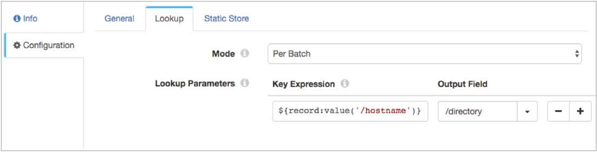
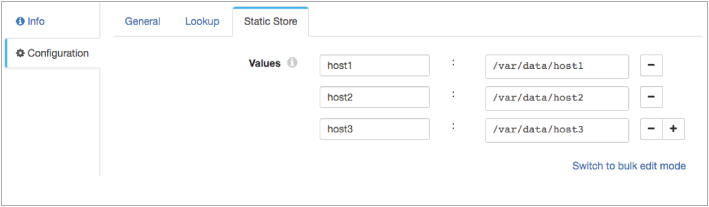

# 静态查询

[支持的管道类型：](https://streamsets.com/documentation/controlhub/latest/help/datacollector/UserGuide/Pipeline_Configuration/ProductIcons_Doc.html#concept_mjg_ly5_pgb) 资料收集器

静态查找处理器执行存储在本地内存中的键值对的查找，并将查找值传递给字段。使用静态查找将字符串值存储在内存中，管道可以在运行时查找这些值，以用其他数据丰富记录。

配置静态查找处理器时，可以指定处理器是对批处理中的所有键执行批量查找，还是对记录中的每个键执行单独查找。您可以使用表达式来定义要在本地内存中查找的键，并指定用于将查找值写入其中的String输出字段。您还定义了键值对以存储在本地内存中。

## 例

假设您需要开发一个管道来读取由多个主机创建的日志文件。每个日志文件都包含主机名。您要根据创建日志文件的主机来处理日志数据并将其写入不同的本地目录。

在“静态查找”处理器的“查找”选项卡上，输入一个表达式，该表达式将主机名字段定义为要查找的键。您指定一个新的目录字段，将查找值写入其中，如下所示：



在“静态查找”处理器的“静态存储”选项卡上，将每个主机名和关联的目录定义为要存储在本地内存中的键值对：



在本地FS目标中，将目录字段的值包括在目录模板的表达式中，如下所示：

```
${record:value('/directory')}/tmp/out/${YYYY()}-${MM()}-${DD()}-${hh()}
```

运行管道时，静态查找处理器将静态键值对存储在内存中。处理器查找主机名字段的值，并将相应的值传递到目录输出字段。当本地FS目标将数据写入输出文件时，目标会将文件写入每个主机的相应目录。

## 配置静态查找处理器

配置静态查找处理器以在内存中执行键值查找。

1. 在“属性”面板的“ **常规”**选项卡上，配置以下属性：

   | 一般财产                                                     | 描述                                                         |
   | :----------------------------------------------------------- | :----------------------------------------------------------- |
   | 名称                                                         | 艺名。                                                       |
   | 描述                                                         | 可选说明。                                                   |
   | [必填项](https://streamsets.com/documentation/controlhub/latest/help/datacollector/UserGuide/Pipeline_Design/DroppingUnwantedRecords.html#concept_dnj_bkm_vq) | 必须包含用于将记录传递到阶段的记录的数据的字段。**提示：**您可能包括舞台使用的字段。根据为管道配置的错误处理，处理不包含所有必填字段的记录。 |
   | [前提条件](https://streamsets.com/documentation/controlhub/latest/help/datacollector/UserGuide/Pipeline_Design/DroppingUnwantedRecords.html#concept_msl_yd4_fs) | 必须评估为TRUE的条件才能使记录进入处理阶段。单击 **添加**以创建其他前提条件。根据为阶段配置的错误处理，处理不满足所有前提条件的记录。 |
   | [记录错误](https://streamsets.com/documentation/controlhub/latest/help/datacollector/UserGuide/Pipeline_Design/ErrorHandling.html#concept_atr_j4y_5r) | 该阶段的错误记录处理：放弃-放弃记录。发送到错误-将记录发送到管道以进行错误处理。停止管道-停止管道。对群集管道无效。 |

2. 在“ **查找”**选项卡上，配置以下属性：

   | 查找属性 | 描述                                                         |
   | :------- | :----------------------------------------------------------- |
   | 模式     | 用于执行查找的模式：每批次-对批次中的所有密钥执行批量查找。处理器对每个批次执行一次查找。每个记录中的每个键-对每个记录中的每个键执行单独的查找。如果配置多个键表达式，则处理器将为每个记录执行多个查找。默认值为“每批”。 |
   | 关键表达 | 在本地内存中查找的键。输入密钥名称或输入定义该密钥的表达式。例如，输入以下表达式以将主机名字段中的数据用作查找关键字：`${record:value('/hostname')}` |
   | 输出场   | 记录中要传递查找值的String字段的名称。您可以指定现有字段或新字段。如果该字段不存在，则静态查找将创建该字段。 |

3. 在“ **静态存储”**选项卡上，配置键值对以存储在本地内存中。处理器将每个值存储为字符串。

   单击**添加**以创建要存储的其他键值对。