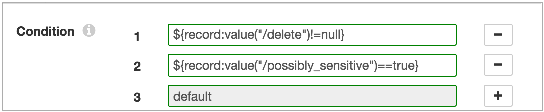
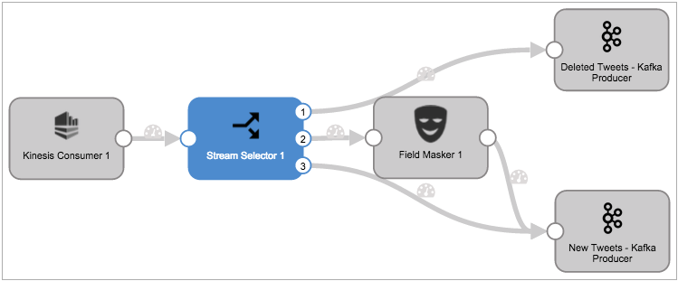

# 流选择器

[支持的管道类型：](https://streamsets.com/documentation/controlhub/latest/help/datacollector/UserGuide/Pipeline_Configuration/ProductIcons_Doc.html#concept_mjg_ly5_pgb) 资料收集器 数据收集器边缘

流选择器根据条件将数据传递到流。为要创建的每个数据流定义一个条件。流选择器使用默认流来传递与用户定义条件不匹配的记录。

定义条件时，流选择器将创建一个输出，该输出将连接到管道的下游分支。

流选择器将记录传递到记录与条件匹配的所有流。例如，您创建以下条件：

```
Stream 1: ${record:value("/State")==CA}
Stream 2: ${record:value("/ID")==null}
```

当您运行管道时，来自加利福尼亚的记录将传递到流1，具有丢失ID的记录将传递到流2，来自加利福尼亚的具有丢失ID的任何记录将传递到两个流。

## 默认流

默认流将捕获与用户定义条件不匹配的记录。使用默认流来管理不匹配的记录。

配置流选择器时，将每个流连接到管道中的一个分支。默认流是阶段中的最后一个流。

您可以为默认流配置分支，以执行其他处理或直接写入目标。如果不需要默认流中的记录，则可以将流连接到垃圾箱目标。

例如，下图显示了处理推文数据的流选择器的条件：



第一个条件评估已删除的记录。第二个条件评估标记为敏感的记录。第三个默认条件捕获所有剩余的记录。

下图显示了管道中的流选择器：



第一流将已删除的推文传递到“已删除的推文”目的地。第二个流将带有敏感语言的新推文传递给Field Masker，以掩盖不适当的文本。第三流（默认流）将所有剩余的tweet直接传递到New Tweets目标。

## 流的样本条件

条件定义了传递到关联流的数据。满足条件的所有记录都将传递到流中。使用表达语言来定义条件。

定义条件时，通常将其基于记录中一个或多个字段中的值。

### 样品条件

以下条件是您可能适合使用的常见方案：

- `${str:contains(record:value("/line"), "ERROR")}`

  检查“行”字段中文本“ ERROR”的数据。

  如果字段包含“ ERROR”，则记录将传递到流。

- `${str:contains(str:toLower(record:value("/message")), "fatal")}`

  在“消息”字段中将字符串值小写，然后检查该字段中的数据是否“致命”。

  如果字段包含“致命”，则记录将传递到流。

- `${record:value("/priority") > 1}`

  如果“优先级”字段中的值大于1，则记录将传递到流。

- `${record:value("/AccountID")==null}`

  如果AccountID字段为null，则记录将传递到流。

**相关概念**

[表达式配置](https://streamsets.com/documentation/controlhub/latest/help/datacollector/UserGuide/Pipeline_Configuration/Expressions.html#concept_ofb_1cm_xq)

[表达语言](https://streamsets.com/documentation/controlhub/latest/help/datacollector/UserGuide/Expression_Language/ExpressionLanguage_overview.html#concept_p54_4kl_vq)

## 配置流选择器

使用流选择器根据条件将数据路由到不同的流。

1. 在“属性”面板的“ **常规”**选项卡上，配置以下属性：

   | 一般财产                                                     | 描述                                                         |
   | :----------------------------------------------------------- | :----------------------------------------------------------- |
   | 名称                                                         | 艺名。                                                       |
   | 描述                                                         | 可选说明。                                                   |
   | [必填项](https://streamsets.com/documentation/controlhub/latest/help/datacollector/UserGuide/Pipeline_Design/DroppingUnwantedRecords.html#concept_dnj_bkm_vq) | 必须包含用于将记录传递到阶段的记录的数据的字段。**提示：**您可能包括舞台使用的字段。根据为管道配置的错误处理，处理不包含所有必填字段的记录。 |
   | [前提条件](https://streamsets.com/documentation/controlhub/latest/help/datacollector/UserGuide/Pipeline_Design/DroppingUnwantedRecords.html#concept_msl_yd4_fs) | 必须评估为TRUE的条件才能使记录进入处理阶段。单击 **添加**以创建其他前提条件。根据为阶段配置的错误处理，处理不满足所有前提条件的记录。 |
   | [记录错误](https://streamsets.com/documentation/controlhub/latest/help/datacollector/UserGuide/Pipeline_Design/ErrorHandling.html#concept_atr_j4y_5r) | 该阶段的错误记录处理：放弃-放弃记录。发送到错误-将记录发送到管道以进行错误处理。停止管道-停止管道。对群集管道无效。 |

2. 在“ **条件”**选项卡上， 为要创建的每个条件单击“ **添加”**图标。您可以使用[简单或批量编辑模式](https://streamsets.com/documentation/controlhub/latest/help/datacollector/UserGuide/Pipeline_Configuration/SimpleBulkEdit.html#concept_alb_b3y_cbb)添加条件。

   每个新条件都会创建一个对应的输出位置。您无法编辑或删除默认流的条件。

3. 输入每个输出位置的条件。

   （可选）单击**Ctrl +空格键**以帮助创建表达式。

**相关概念**