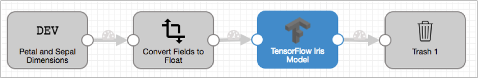
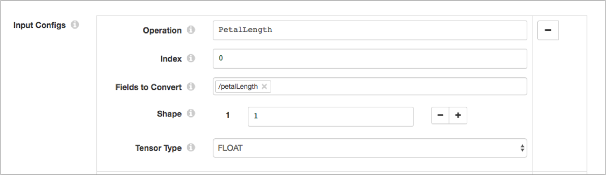
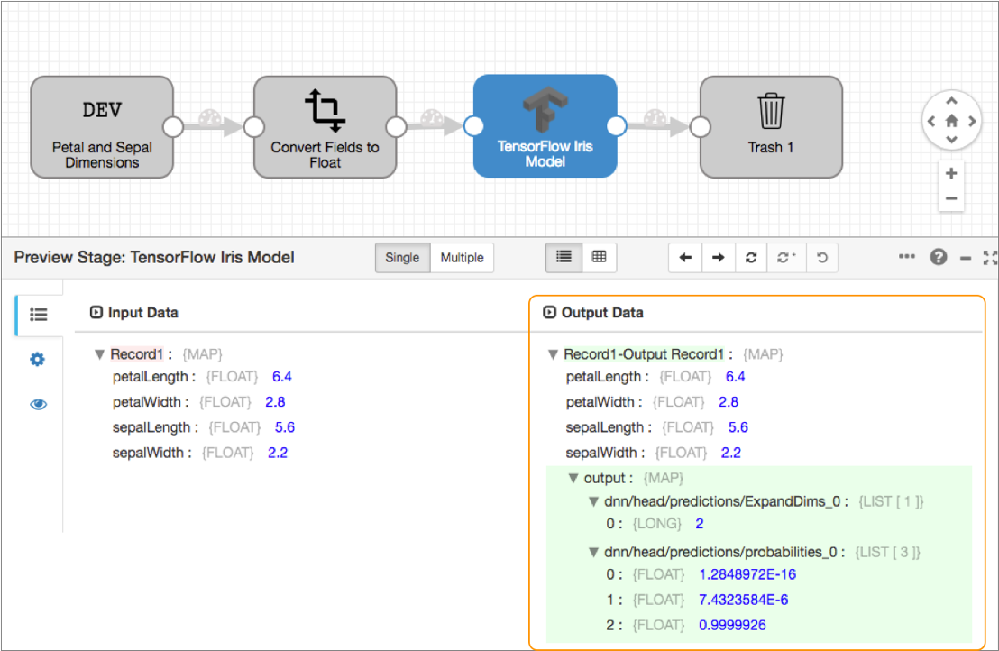

# ensorFlow评估器

[支持的管道类型：](https://streamsets.com/documentation/controlhub/latest/help/datacollector/UserGuide/Pipeline_Configuration/ProductIcons_Doc.html#concept_mjg_ly5_pgb) 资料收集器 数据收集器边缘

TensorFlow评估器处理器使用TensorFlow机器学习模型来生成数据的预测或分类。

使用TensorFlow评估器处理器，您可以设计读取数据的管道，然后在管道处理期间生成数据的预测或分类-实时生成数据驱动的见解。例如，您可以设计管道来检测欺诈性交易或在数据通过管道时执行自然语言处理。

要使用TensorFlow评估器处理器，您首先需要在TensorFlow中构建和训练模型。然后，您可以将经过训练的模型保存到文件中，并将保存的模型目录存储在运行管道的Data Collector或 Data Collector Edge（SDC Edge）机器上。

当配置TensorFlow Evaluator处理器时，您将定义存储在Data Collector或 SDC Edge机器上的已保存模型的路径。您还可以定义在模型的构建和训练期间配置的输入和输出张量信息。

您可以配置处理器是评估每个记录还是一次评估整个批次。当评估整个批次时，处理器将预测或分类结果写入事件。

## 先决条件

在配置TensorFlow Evaluator处理器之前，请完成以下先决条件：

- 在TensorFlow中构建和训练模型

  在TensorFlow中构建和训练模型。该处理器使用1.10 TensorFlow客户端库并支持所有TensorFlow版本。

  有关构建和训练TensorFlow模型的[教程](https://www.tensorflow.org/tutorials/)，请参见[TensorFlow教程](https://www.tensorflow.org/tutorials/)。

- 将训练后的模型保存并存储在Data Collector或SDC Edge机器上

  将训练后的模型保存为[SavedModel格式的](https://www.tensorflow.org/guide/saved_model)文件。当您以SavedModel格式保存模型时，TensorFlow会创建一个包含以下子目录和文件的目录：`assets/ assets.extra/ variables/ saved_model.pb`

  将完整的SavedModel目录存储在计划运行管道的Data Collector或SDC Edge计算机上。对于Data Collector，StreamSets建议将模型目录存储在Data Collector资源目录$ SDC_RESOURCES中。对于SDC Edge，将目录存储在边缘设备上的任何位置。

## 评估方法

TensorFlow评估程序处理器可以评估每个记录或一次评估整个批次。

根据张量期望的输入，将处理器配置为使用以下评估方法之一：

- 评估每条记录

  如果张量需要一个输入才能产生一个输出，请配置TensorFlow评估程序处理器以评估每条记录。默认情况下，处理器评估每条记录，每条记录产生一个输出。

  处理器将每个记录作为一个输入接收，执行张量计算以预测或分类数据，然后生成一个输出。输出包括记录中的所有原始字段以及包含预测或分类结果的附加输出字段。输出字段是映射或列表字段，其中包含您为处理器配置的每个输出的字段。要评估每个记录，请确保清除以下处理器属性：在**常规**选项卡上，清除 **生产事件**属性。在**TensorFlow**选项卡上，清除 **整个批处理**属性。

- 评估整个批次

  如果张量需要多个输入才能产生一个输出，请配置TensorFlow评估程序处理器以评估整个批次。

  在评估批次时，处理器将等待直到接收到批次中的所有记录，然后执行张量计算以预测或分类数据，然后生成一个输出作为整个批次的事件。处理器输出包括每个记录中的原始字段。事件输出包括预测或分类结果。

  要评估整个批次，请确保选择以下处理器属性：在**常规**选项卡上，选择**生产事件**属性。在**TensorFlow**选项卡上，选择**整个批处理**属性。

  然后，将事件流从TensorFlow评估器处理器连接到目标，以存储预测或分类结果，如 [事件生成中所述](https://streamsets.com/documentation/controlhub/latest/help/datacollector/UserGuide/Processors/TensorFlow.html#concept_xhj_bxm_bfb)。

  在Data Collector Edge管道中无效。不要在Data Collector Edge管道中使用此评估方法。

### 示例：每条记录

在此示例中，我们将研究如何配置TensorFlow Evaluator处理器以使用示例虹膜分类模型评估每个记录。

该模型根据萼片和花瓣的大小预测鸢尾花的种类。每个传入记录都包含带有花瓣和萼片测量值的字段。处理器预测每个记录的种类，将以下长值之一分配给添加到每个记录的输出字段：

- 0-代表鸢尾花。
- 1-表示鸢尾花。
- 2-代表鸢尾花。

在此示例中，我们将创建以下简单管道：



我们只想在示例中预览TensorFlow Evaluator处理器的输出，因此我们仅使用垃圾箱目标。随意使用您选择的另一个目的地。

完成以下步骤来配置TensorFlow Evaluator处理器以预测虹膜花的种类：

1. 从

   StreamSets Data Collector GitHub存储库

   下载示例Iris张量模型，并将模型存储在

   Data Collector

    资源目录$ SDC_RESOURCES中。

   例如：

   ```
   /var/lib/sdc-resources/iris_saved_model
   ```

   由于示例虹膜分类模型已经构建并经过训练，因此对于本示例，我们可以跳过该先决条件。有关如何构建和训练模型的更多信息，请参见TensorFlow文档中的[预制估算器](https://www.tensorflow.org/guide/premade_estimators)。

2. 创建一个

   Data Collector

    管道并添加一个Dev Raw Data Source来源。

   将以下原始数据添加到原始数据，然后配置原始数据以处理JSON数据格式：

   ```
   {
     "petalLength": 6.4,
     "petalWidth": 2.8,
     "sepalLength": 5.6,
     "sepalWidth": 2.2
   }
   {
     "petalLength": 5.0,
     "petalWidth": 2.3,
     "sepalLength": 3.3,
     "sepalWidth": 1.0
   }
   {
     "petalLength": 4.9,
     "petalWidth": 2.5,
     "sepalLength": 4.5,
     "sepalWidth": 1.7
   }
   {
     "petalLength": 4.9,
     "petalWidth": 3.1,
     "sepalLength": 1.5,
     "sepalWidth": 0.1
   }
   ```

3. 样本Iris模型期望将浮点数据作为输入，因此将Field Type Converter处理器添加到管道中。

   在处理器的“ **转换”**选项卡上，将转换方法设置为“ **按字段名称”**，然后按如下所示配置转换属性，以将所有字段转换为浮点型：

   - **要转换的字段** -/ *
   - **转换类型** -FLOAT

4. 将TensorFlow Evaluator处理器添加到管道中。

   在“ **常规”**选项卡上，确保清除了“ **生产事件”**，因为我们需要处理器评估每个记录。

   在**TensorFlow**选项卡上，如下定义保存的模型路径和模型标签：

   - **保存的模型路径** -输入在Data Collector机器上保存模型的绝对路径。例如： `/var/lib/sdc-resources/iris_saved_model`。
   - **型号标签** -服务

   使用以下值配置四个输入配置：

   | 运作方式    | 指数 | 要转换的字段  | 形状 | 张量类型 |
   | :---------- | :--- | :------------ | :--- | :------- |
   | 花瓣长度    | 0    | /花瓣长度     | 1个  | 浮动     |
   | 花瓣宽度    | 0    | / petalWidth  | 1个  | 浮动     |
   | SepalLength | 0    | / sepalLength | 1个  | 浮动     |
   | SepalWidth  | 0    | / sepalWidth  | 1个  | 浮动     |

   例如，第一个输入配置应如下所示：

   

   使用以下值配置两个输出配置：

   | 运作方式                              | 指数 | 张量类型 |
   | :------------------------------------ | :--- | :------- |
   | dnn / head / predictions / ExpandDims | 0    | 浮动     |
   | DNN /头/预测/概率                     | 0    | 浮动     |

   确保清除**整个批处理**，然后为**输出字段**保留默认值/ output 。

5. 最后，将垃圾箱目标添加到管道。

当我们运行预览并查看TensorFlow Evaluator处理器的输出时，我们可以看到记录中的每个字段都未经修改地通过了处理器。处理器为每个记录生成一个输出映射字段，其中包含我们在输出配置中定义的两个字段中的预测结果。如下所示，处理器预测第一个记录的物种为2，代表鸢尾鸢尾的物种：



要添加到我们的示例中，我们可以在TensorFlow Evaluator处理器之后添加一个Expression Evaluator处理器，以评估存储在输出字段中的预测值0、1或2，然后使用以下适当值之一创建一个新字段：

- 鸢尾鸢尾
- 杂色鸢尾
- 鸢尾

## 事件产生

当配置为评估整个批次时，TensorFlow评估器处理器可以生成事件。这些事件包含对该批次进行的预测或分类的结果。

**重要：**将TensorFlow Evaluator处理器配置为仅在将处理器配置为[评估整个批次](https://streamsets.com/documentation/controlhub/latest/help/datacollector/UserGuide/Processors/TensorFlow.html#concept_zvm_qtm_bfb)时才生成事件。

TensorFlow Evaluator事件可以任何逻辑方式使用。例如：

- 具有用于存储事件信息的目的地。

  有关示例，请参见[案例研究：事件存储](https://streamsets.com/documentation/controlhub/latest/help/datacollector/UserGuide/Event_Handling/EventFramework-Title.html#concept_ocb_nnl_px)。

- 具有

  数据警报

  以发送通知。

  您可以在事件流上配置数据警报，以在达到指定阈值时进行通知。

在Data Collector Edge管道中，您只能将事件传递到目标进行存储。Data Collector Edge管道不支持警报。

有关数据流触发器和事件框架的更多信息，请参见[数据流触发器概述](https://streamsets.com/documentation/controlhub/latest/help/datacollector/UserGuide/Event_Handling/EventFramework-Title.html#concept_cph_5h4_lx)。

### 活动记录

由TensorFlow Evaluator处理器生成的事件记录具有以下与事件相关的记录头属性。记录标题属性存储为字符串值：

| 记录标题属性                 | 描述                                                         |
| :--------------------------- | :----------------------------------------------------------- |
| sdc.event.type               | 事件类型。使用以下事件类型：tensorflow-event-包含批生产的预测或分类结果。 |
| sdc.event.version            | 整数，指示事件记录类型的版本。                               |
| sdc.event.creation_timestamp | 舞台创建事件的时间戳记。                                     |

当处理器完成对批处理中所有记录的处理时，TensorFlow Evaluator处理器会生成一个tensorflow事件记录。事件记录是一个Map字段，其中包含您为处理器定义的每个输出配置的字段。

## 服务于TensorFlow模型

如果在微服务管道中包括TensorFlow评估器处理器，则可以在运行的管道中为TensorFlow模型提供服务。

当您提供TensorFlow模型时，外部客户端可以使用该模型执行计算。在[微服务管道中](https://streamsets.com/documentation/controlhub/latest/help/datacollector/UserGuide/Microservice/Microservice_Title.html#concept_qfh_xdm_p2b)，客户端对源进行REST API调用。微服务管道执行所有处理-可以包括由TensorFlow评估程序处理器做出的预测或分类。具有TensorFlow预测或分类结果的记录将发送回微服务管道源。然后，源将JSON格式的响应发送回源REST API客户端。

## 配置TensorFlow评估器

配置TensorFlow评估器处理器以使用TensorFlow机器学习模型来生成数据的预测或分类。

1. 在“属性”面板的“ **常规”**选项卡上，配置以下属性：

   | 一般财产                                                     | 描述                                                         |
   | :----------------------------------------------------------- | :----------------------------------------------------------- |
   | 名称                                                         | 艺名。                                                       |
   | 描述                                                         | 可选说明。                                                   |
   | [产生事件](https://streamsets.com/documentation/controlhub/latest/help/datacollector/UserGuide/Processors/TensorFlow.html#concept_xhj_bxm_bfb) | 发生事件时生成事件记录。用于[事件处理](https://streamsets.com/documentation/controlhub/latest/help/datacollector/UserGuide/Event_Handling/EventFramework-Title.html#concept_cph_5h4_lx)。 |
   | [必填项](https://streamsets.com/documentation/controlhub/latest/help/datacollector/UserGuide/Pipeline_Design/DroppingUnwantedRecords.html#concept_dnj_bkm_vq) | 必须包含用于将记录传递到阶段的记录的数据的字段。**提示：**您可能包括舞台使用的字段。根据为管道配置的错误处理，处理不包含所有必填字段的记录。 |
   | [前提条件](https://streamsets.com/documentation/controlhub/latest/help/datacollector/UserGuide/Pipeline_Design/DroppingUnwantedRecords.html#concept_msl_yd4_fs) | 必须评估为TRUE的条件才能使记录进入处理阶段。单击 **添加**以创建其他前提条件。根据为阶段配置的错误处理，处理不满足所有前提条件的记录。 |
   | [记录错误](https://streamsets.com/documentation/controlhub/latest/help/datacollector/UserGuide/Pipeline_Design/ErrorHandling.html#concept_atr_j4y_5r) | 该阶段的错误记录处理：放弃-放弃记录。发送到错误-将记录发送到管道以进行错误处理。停止管道-停止管道。对群集管道无效。 |

2. 在**TensorFlow**选项卡上，配置以下属性：

   | TensorFlow属性                                               | 描述                                                         |
   | :----------------------------------------------------------- | :----------------------------------------------------------- |
   | 保存的模型路径                                               | 数据收集器或SDC Edge计算机上已保存的TensorFlow模型的路径。指定绝对路径或相对于Data Collector资源目录的路径。例如，如果将名为my_saved_model的模型保存到Data Collector资源目录 / var / lib / sdc-resources，则输入以下路径之一：/var/lib/sdc-resources/my_saved_modelmy_saved_model |
   | 型号标签                                                     | 在构建和训练模型时，将标签应用于TensorFlow模型。             |
   | 输入配置                                                     | 在构建和训练模型期间配置的张量输入信息。定义一个或多个输入配置，为每个配置以下属性：操作-对输入执行的操作。索引-此输入在输入矩阵中的位置。要转换的字段-记录中的字段，根据输入操作的要求转换为张量字段。形状-每个维度中的元素数。张量类型-张量的数据类型。使用[简单或批量编辑模式](https://streamsets.com/documentation/controlhub/latest/help/datacollector/UserGuide/Pipeline_Configuration/SimpleBulkEdit.html#concept_alb_b3y_cbb)，单击 **添加**图标以定义另一个输入配置。 |
   | 输出配置                                                     | 在构建和训练模型期间配置的Tensor输出信息。定义一个或多个输出配置，为每个配置以下属性：操作-在输出上执行的操作。索引-此输出在输出矩阵中的位置。张量类型-张量的数据类型。使用[简单或批量编辑模式](https://streamsets.com/documentation/controlhub/latest/help/datacollector/UserGuide/Pipeline_Configuration/SimpleBulkEdit.html#concept_alb_b3y_cbb)，单击 **添加**图标以定义另一个输出配置。 |
   | [整批](https://streamsets.com/documentation/controlhub/latest/help/datacollector/UserGuide/Processors/TensorFlow.html#concept_zvm_qtm_bfb) | 一次评估整个批次。在TensorFlow模型需要许多输入才能生成一个输出时选择。当TensorFlow模型需要一个输入才能生成一个输出时清除。默认值已清除。如果选中，则还必须将处理器配置为[生成事件，](https://streamsets.com/documentation/controlhub/latest/help/datacollector/UserGuide/Processors/TensorFlow.html#concept_xhj_bxm_bfb)以便处理器为整个批次生成一个输出作为事件。事件输出包括预测或分类结果。在Data Collector Edge管道中无效。不要在Data Collector Edge管道中使用此评估方法。 |
   | 输出场                                                       | 如果[评估每个记录](https://streamsets.com/documentation/controlhub/latest/help/datacollector/UserGuide/Processors/TensorFlow.html#concept_zvm_qtm_bfb)，则为预测或分类结果的输出字段。处理器将输出字段添加到每个记录。 |