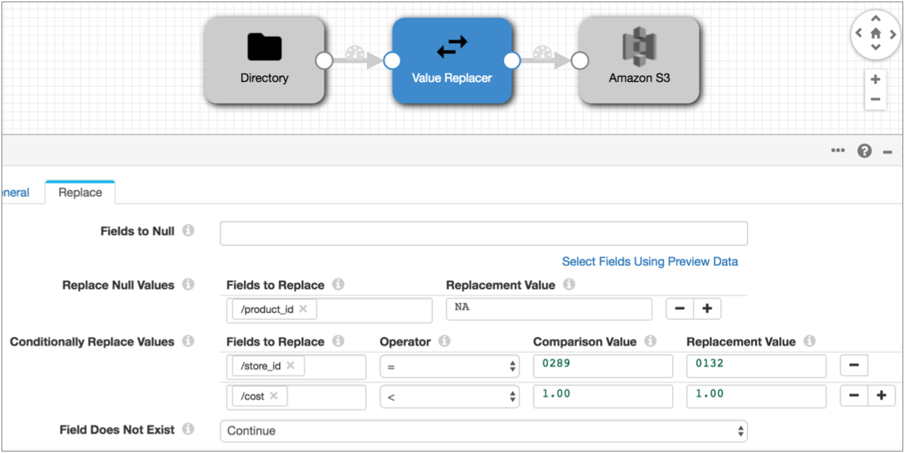

# 值替换器（不建议使用）

值替换器替换字段中的值。但是，值替换器现在已被弃用，并将在以后的版本中删除。我们建议使用[现场替换](https://streamsets.com/documentation/controlhub/latest/help/datacollector/UserGuide/Processors/FieldReplacer.html#concept_rw4_2d3_4cb)器处理器。

您可以使用值替换器执行以下任务：

- 将字段值替换为空值（视情况而定）
- 用常量替换指定字段中的空值
- 根据条件用常量替换字段值

配置处理器时，可以指定要使用的字段，并在适当时指定条件和替换值。您可以为每种类型的值替换列出多个字段。而且，您可以为字段不存在时配置错误处理。

## 加工订单

值替换器按属性在处理器中显示的顺序替换值：

1. **字段为空** - **将空**值替换为空值（视情况而定）。
2. **替换空值** -用指定的常量替换空值。
3. **有条件地替换值** -根据条件用常量替换指定的值。

例如，在以下“值替换器”中，处理器首先替换**product_id**字段中的空值，然后将“ 0289”商店ID替换为“ 0132”。最后，它将**成本**字段中小于1.00的值替换 为“ 1.00”：



当您在属性中列出多个字段时，值替换器也会按照列出的顺序处理它们。

## 用空值替换值

您可以使用值替换器将字段中的值替换为空值。您可以将所有值替换为null，也可以根据条件替换值。

使用表达式指定要使用的条件。例如，可以使用以下条件在字符串字段中将空值替换为空值：

```
${str:length(record:value('/stringField')) == 0}
```

如果要用空值替换负值，则可以使用以下条件：

```
${record:value('/intField') < 0}
```

使用“ **字段为空”**属性将值替换为null。输入条件时，它适用于所有列出的字段。

## 用常量替换值

您可以根据简单条件用常量替换字段中的值。

您可以使用条件替换来更新代码或其他更改的值，或者替换无效的值。

配置条件时，请使用以下运算符之一：

- 小于（<）-将所有小于指定值的值转换为替换值。
- 大于（>）-将所有大于指定值的值转换为替换值。
- 等于（=）-将指定值转换为替换值。
- ALL-将字段中的所有值转换为替换值。

使用“ **有条件替换值”**属性可以用常量替换值。

**提示：**要使用表达式替换值，请使用表达式计算器。

### 有条件替换的数据类型

您可以根据条件替换以下字段类型的值：

- 字节
- 双
- 浮动
- 整数
- 长
- 短
- 串

## 配置值替换器

使用值替换器替换字段中的空值或将字段中的值替换为空。

1. 在“属性”面板的“ **常规”**选项卡上，配置以下属性：

   | 一般财产                                                     | 描述                                                         |
   | :----------------------------------------------------------- | :----------------------------------------------------------- |
   | 名称                                                         | 艺名。                                                       |
   | 描述                                                         | 可选说明。                                                   |
   | [必填项](https://streamsets.com/documentation/controlhub/latest/help/datacollector/UserGuide/Pipeline_Design/DroppingUnwantedRecords.html#concept_dnj_bkm_vq) | 必须包含用于将记录传递到阶段的记录的数据的字段。**提示：**您可能包括舞台使用的字段。根据为管道配置的错误处理，处理不包含所有必填字段的记录。 |
   | [前提条件](https://streamsets.com/documentation/controlhub/latest/help/datacollector/UserGuide/Pipeline_Design/DroppingUnwantedRecords.html#concept_msl_yd4_fs) | 必须评估为TRUE的条件才能使记录进入处理阶段。单击 **添加**以创建其他前提条件。根据为阶段配置的错误处理，处理不满足所有前提条件的记录。 |
   | [记录错误](https://streamsets.com/documentation/controlhub/latest/help/datacollector/UserGuide/Pipeline_Design/ErrorHandling.html#concept_atr_j4y_5r) | 该阶段的错误记录处理：放弃-放弃记录。发送到错误-将记录发送到管道以进行错误处理。停止管道-停止管道。对群集管道无效。 |

2. 在“ **替换”**选项卡上，配置以下属性：

   | 价值替代者属性                                               | 描述                                                         |
   | :----------------------------------------------------------- | :----------------------------------------------------------- |
   | 字段为空 [](https://streamsets.com/documentation/controlhub/latest/help/datacollector/UserGuide/Processors/ValueReplacer.html#concept_ppg_ztk_3y) | 一个或多个用空值替换的字段。配置以下属性：字段-要使用的字段。您可以指定单个字段，也可以使用[字段路径表达式](https://streamsets.com/documentation/controlhub/latest/help/datacollector/UserGuide/Pipeline_Configuration/Expressions.html#concept_ir4_rxt_3cb)指定一组字段。**提示：**要使用所有字段，可以按如下所示使用星号通配符：`/*`。您也可以使用星号通配符表示[数组索引和映射元素](https://streamsets.com/documentation/controlhub/latest/help/datacollector/UserGuide/Pipeline_Configuration/Expressions.html#concept_vqr_sqc_wr)。条件-用于用空值替换值的可选条件。省略时，处理器将字段中的所有值替换为空值。使用表达式，例如： `${str:length(record:value('/stringField')) == 0}` |
   | 替换空值                                                     | 将空值替换为常量。单击 **添加**以包含更多字段。配置以下属性：要替换的字段-要使用的字段名称。您可以指定单个字段，也可以使用[字段路径表达式](https://streamsets.com/documentation/controlhub/latest/help/datacollector/UserGuide/Pipeline_Configuration/Expressions.html#concept_ir4_rxt_3cb)指定一组字段。**提示：**要使用所有字段，可以按如下所示使用星号通配符：`/*`。您也可以使用星号通配符表示[数组索引和映射元素](https://streamsets.com/documentation/controlhub/latest/help/datacollector/UserGuide/Pipeline_Configuration/Expressions.html#concept_vqr_sqc_wr)。替换值-替换字段中空值的常量。 |
   | 有条件地替换值[](https://streamsets.com/documentation/controlhub/latest/help/datacollector/UserGuide/Processors/ValueReplacer.html#concept_gqv_1sk_3y) | 用常量替换指定的值。单击 **添加**以包含更多字段。配置以下属性：要替换的字段-要使用的字段名称。您可以指定单个字段，也可以使用[字段路径表达式](https://streamsets.com/documentation/controlhub/latest/help/datacollector/UserGuide/Pipeline_Configuration/Expressions.html#concept_ir4_rxt_3cb)指定一组字段。**提示：**要使用所有字段，可以按如下所示使用星号通配符：`/*`。您也可以使用星号通配符表示[数组索引和映射元素](https://streamsets.com/documentation/controlhub/latest/help/datacollector/UserGuide/Pipeline_Configuration/Expressions.html#concept_vqr_sqc_wr)。运算符-用于条件的运算符。比较值-用于条件的常数。替换值-用于替换符合条件的值的常量。 |
   | 字段不存在                                                   | 确定如何处理没有指定字段的记录：继续-通过尽可能多的处理来传递记录。发送到错误-将记录传递到管道以进行错误处理。 |