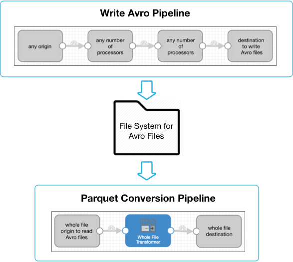
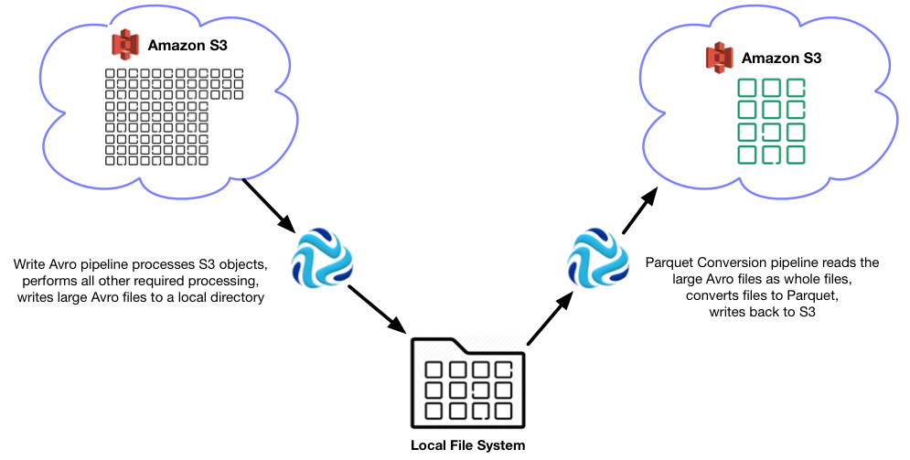
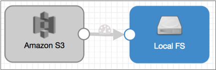
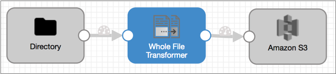

# 整个文件转换器

[支持的管道类型：](https://streamsets.com/documentation/controlhub/latest/help/datacollector/UserGuide/Pipeline_Configuration/ProductIcons_Doc.html#concept_mjg_ly5_pgb) 资料收集器

Whole File Transformer处理器将完全写入的Avro文件转换为高效的柱状Parquet文件。在将Avro文件读取为整个文件并将转换后的Parquet文件写入整个文件的管道中使用Whole File Transformer。

支持整个文件的来源和目的地包括Amazon S3，Azure Data Lake Storage和Google Cloud Storage等云存储阶段，以及Local FS，SFTP / FTP / FTPS Client和Hadoop FS等本地和远程文件系统。有关整个文件来源和目的地的完整列表，或有关整个文件数据格式的更多信息，请参见[整个文件数据格式](https://streamsets.com/documentation/controlhub/latest/help/datacollector/UserGuide/Data_Formats/WholeFile.html#concept_nfc_qkh_xw)。

您可以使用“整个文件转换器”在管道中将Avro文件转换为Parquet。如果有Hadoop集群可用，则可以使用[MapReduce执行](https://streamsets.com/documentation/controlhub/latest/help/datacollector/UserGuide/Executors/MapReduce.html#concept_bj2_zlk_fx)程序将Avro文件转换为Parquet而不是Whole File Transformer。MapReduce执行程序将转换任务委托给Hadoop集群。有关使用MapReduce执行程序捕获数据漂移并生成Parquet文件的[案例研究](https://streamsets.com/documentation/controlhub/latest/help/datacollector/UserGuide/Hive_Drift_Solution/HiveDriftSolution_title.html#concept_vl3_v2f_zz)，请参阅[Parquet案例研究](https://streamsets.com/documentation/controlhub/latest/help/datacollector/UserGuide/Hive_Drift_Solution/HiveDriftSolution_title.html#concept_vl3_v2f_zz)。

在将Avro文件转换为Parquet时，整个文件转换器会在内存中执行转换，然后在Data Collector计算机的本地目录中写入一个临时的Parquet文件。确保Data Collector 具有执行此处理所需的内存和存储。

配置整个文件转换器时，可以指定要使用的本地目录。您可以为生成的Parquet文件以及处理Avro文件的缓冲区大小和速率配置前缀和后缀。您还可以配置标准Parquet属性，例如压缩编解码器，行组大小和页面大小。

通常，当使用全文件转换器处理器时，将使用单独的管道来处理数据并生成要转换的Avro文件。但是，如果您有第三方生成的Avro文件，则只需创建管道即可将文件转换为Parquet。

## 实施概述

使用Whole File Transformer处理器时，通常将配置两个管道。包括“整个文件转换器”的管道必须是整个文件管道，不允许对文件数据进行额外处理。因此，您需要的任何处理都必须在单独的管道中进行。

这个独立的管道包括一个读取任何数据格式的数据的源，所需的处理器以及一个用于写入Avro文件的基于文件的目标。我们将此管道称为Write Avro管道。如果您已经准备好Avro文件，则可以跳过此管道。

然后，第二个管道使用[整个文件数据格式](https://streamsets.com/documentation/controlhub/latest/help/datacollector/UserGuide/Data_Formats/WholeFile.html#concept_nfc_qkh_xw)读取Avro文件，使用[整个文件](https://streamsets.com/documentation/controlhub/latest/help/datacollector/UserGuide/Data_Formats/WholeFile.html#concept_nfc_qkh_xw)转换器将文件转换为Parquet，然后将Parquet文件写为整个文件。我们称其为Parquet Conversion管道。

在一起，实现看起来像这样：

### 编写Avro管道

Write Avro管道从源读取数据，执行任何必需的处理，并使用基于文件的Avro目标（例如Local FS）将Avro文件写入文件系统。

目标文件系统充当暂存区。当Write Avro管道关闭每个Avro文件时，Parquet Conversion管道可以开始处理文件并将其转换为Parquet。

由于最终将每个Avro文件转换为相应的Parquet文件，因此Avro文件应具有足够大的大小，以利用Parquet功能。建议使用2 GB。

Write Avro管道包括任何源，任何数量的处理器以及启用了Avro的基于文件的目标，如下所示：

有关支持编写Avro的目标的列表，请参阅[数据格式支持](https://streamsets.com/documentation/controlhub/latest/help/datacollector/UserGuide/Apx-DataFormats/DataFormat_Title.html#concept_bcw_qzb_kv)。

### 实木复合地板转换管道

Parquet Conversion流水线将关闭的Avro文件作为整个文件进行处理，从而提高了整个文件数据格式的效率。该管道使用Whole File Transformer处理器将Avro文件转换为Parquet。

Parquet Conversion流水线必须使用为整个文件启用的基于文件的源（例如目录源）来处理大型Avro文件。

Whole File Transformer处理器将每个Avro文件转换为Parquet，并将每个Parquet文件临时写入用户定义的Data Collector 目录。然后，整个文件目标（例如Google Cloud Storage）将Parquet文件移动到目标系统。

整个文件只能由“整个文件转换器”处理，因此该管道不执行任何其他处理。

结果，Parquet Conversion管道如下所示：

有关创建这些管道的分步指南，请参阅[实现示例](https://streamsets.com/documentation/controlhub/latest/help/datacollector/UserGuide/Processors/WholeFileTransformer.html#concept_ch5_z3g_n2b)。

有关整个文件来源和目的地的完整列表，请参见[数据格式支持](https://streamsets.com/documentation/controlhub/latest/help/datacollector/UserGuide/Apx-DataFormats/DataFormat_Title.html#concept_bcw_qzb_kv)。

## 内存和存储要求

在将Avro文件转换为Parquet时，整个文件转换器会在内存中执行转换，然后在Data Collector计算机的本地目录中写入一个临时的Parquet文件。确保Data Collector 具有执行此处理所需的内存和存储。

可用内存由[Data Collector Java堆大小确定](https://streamsets.com/documentation/controlhub/latest/help/datacollector/UserGuide/Configuration/JavaHeapSize.html#concept_mdc_shg_qr)。可用存储是Data Collector 计算机上的可用磁盘空间。根据要转换的最大Avro文件的大小，使用Whole File Transformer处理器的管道需要可用的内存和存储空间。

例如，在转换最大2 GB的文件时，请确保管道运行时Data Collector至少具有2 GB的可用内存和存储。

## 产生的记录

处理整个文件时，整个文件转换器处理器会更新整个文件记录中的文件信息，并添加记录头属性。

[整个文件记录](https://streamsets.com/documentation/controlhub/latest/help/datacollector/UserGuide/Data_Formats/WholeFile.html#concept_kxr_kqh_xw)包括包含文件参考信息的字段。该记录不包括要传输的文件中的任何实际数据。

Whole File Transformer处理器将管道起点生成的fileInfo映射字段中的现有信息移动到名为的新记录头属性中 `sourceFileInfo`。然后，它将使用临时Parquet文件的信息（例如更新的路径和文件位置）来更新fileInfo字段。

**提示：** 您可以使用数据预览来确定fileInfo字段中包含的信息和字段名称。信息和字段名称可能会因来源系统而异。

## 实施示例：Amazon S3 Parquet转换

假设我们在Amazon S3中有数千个小对象。我们希望将众多的小对象转换为大型Parquet对象，以便可以更快地分析数据。

为此，我们建立了两个管道。第一个管道读取Amazon S3对象，并将大型Avro文件写入本地文件系统。这是Write Avro管道。第二个Parquet转换管道将Avro文件作为整个文件读取，并将每个文件转换为相应的Parquet文件，然后将其写回到S3。

产生的工作流程如下所示：

### 编写Avro管道

Write Avro管道可以非常简单-它只需要写入大型Avro文件。您可以通过执行其他处理来使其复杂化，但是最基本的是，要写入Avro文件，需要一个源和一个基于Avro的基于文件的目标。

Write Avro管道使用Amazon S3来源读取大量的小型S3对象。然后，它使用Local FS目标将Avro文件写入本地文件系统，如下所示：

请注意以下配置详细信息：

- Amazon S3的起源

  Amazon S3来源不需要特殊配置。我们只需将其配置为访问要处理的对象并指定数据的数据格式。根据需要配置错误处理，后处理和其他属性。

- 本地FS目的地

  在本地FS目标中，我们仔细配置以下属性：目录模板-此属性确定将Avro文件写入的位置。我们使用的目录模板确定第二条管道的原始位置在哪里拾取Avro文件。我们将使用 `/avro2parquet/`。文件前缀-这是输出文件名的可选前缀。写入文件时，本地FS目标会创建一个`tmp_`用作文件名前缀的临时文件。为了确保第二个管道仅拾取完全编写的输出文件，我们为输出文件定义了文件前缀。它可以很简单，例如 `avro_`。读取顺序-要按写入顺序读取文件，请使用 `Last Modified Timestamp`。最大文件大小-Avro文件在第二个管道中转换为Parquet文件，因此我们要确保这些输出文件相当大。假设我们希望Parquet文件的大小大约为3 GB，因此我们将“最大文件大小”设置为`3 GB`。**重要：**要转换Avro文件，整个文件转换器 [需要Data Collector的内存和存储空间](https://streamsets.com/documentation/controlhub/latest/help/datacollector/UserGuide/Processors/WholeFileTransformer.html#concept_bgy_5bs_m2b)等于最大文件大小。设置最大文件大小时，请考虑此要求。数据格式-我们选择`Avro`作为数据格式，并指定要使用的Avro模式的位置。

### 实木复合地板转换管道

Parquet Conversion管道也很简单。它使用[整个文件](https://streamsets.com/documentation/controlhub/latest/help/datacollector/UserGuide/Data_Formats/WholeFile.html#concept_nfc_qkh_xw)数据格式，因此，除了将Avro文件转换为Parquet之外，不会对文件数据进行任何处理。

我们使用目录原点和整个文件数据格式来读取完全写入的Avro文件。然后是用于Parquet转换的Whole File Transformer处理器，以及Amazon S3目标，用于将Parquet文件作为整个文件写回到S3。

Parquet Conversion管道如下所示：

请注意以下配置详细信息：

- 目录来源

  在目录来源中，我们仔细配置以下属性：文件目录-要读取第一个管道写入的文件，请将其指向“本地FS目录模板”属性中使用的目录：`/avro2parquet/`。文件名模式-要拾取所有输出文件，请使用glob作为文件名模式：`avro_*`。我们`avro_`在模式中使用 前缀以避免读取本地FS目标生成的活动临时文件。数据格式-我们用于`Whole File`将数据流式传输到整个文件转换器。

  我们根据需要配置其他属性。

- 整文件转换器处理器

  Whole File Transformer处理器将Avro文件转换为内存中的Parquet，然后将临时的Parquet文件写入本地目录。然后，将这些整个文件从本地目录流式传输到Amazon S3。

  使用整文件转换器时，我们必须确保Data Collector计算机具有所需的可用内存和存储空间。由于我们将Write Avro管道中的最大文件大小设置为3 GB，因此在运行此管道之前，必须确保 Data Collector具有3 GB的[可用内存和存储](https://streamsets.com/documentation/controlhub/latest/help/datacollector/UserGuide/Processors/WholeFileTransformer.html#concept_bgy_5bs_m2b)。

  在整个文件转换器中，我们还有以下属性要配置：工作类型-我们正在使用`Convert Avro to Parquet` 工作。临时文件目录-这是临时Parquet文件在Data Collector本地的目录。我们可以使用默认值 `/tmp/out/.parquet`。

  我们也可以配置其他临时的Parquet文件属性和Parquet转换属性，但是在这种情况下，默认值是合适的。

- Amazon S3目的地

  Amazon S3目标将临时Parquet文件从Whole File Transformer临时文件目录流式传输到Amazon S3。

  我们将此阶段配置为写入Amazon S3，然后选择`Whole File`数据格式。

### 运行

我们同时启动两个管道。

Write Avro管道处理Amazon S3对象，并将3 GB Avro文件写入 `/avro2parquet/`目录。输出文件名为 `avro_`。

写入第一个文件后，Parquet Conversion管道将拾取该文件。它将文件从目录源流式传输到Whole File Transformer处理器。整个文件转换器将Avro文件转换为内存中的Parquet，并将其写入指定的临时目录`/tmp/out/.parquet`。然后，临时文件从“整个文件转换器”流到目标中定义的Amazon S3位置。

最后，大量的Avro文件被转换成大型的柱状Parquet文件，并流回到Amazon S3，以便于分析。两个简单的管道，一个完整的文件转换器，您就完成了！

## 配置整个文件转换器

配置Whole File Transformer处理器以将Avro整个文件转换为Parquet。

1. 在“属性”面板的“ **常规”**选项卡上，配置以下属性：

   | 一般财产                                                     | 描述                                                         |
   | :----------------------------------------------------------- | :----------------------------------------------------------- |
   | 名称                                                         | 艺名。                                                       |
   | 描述                                                         | 可选说明。                                                   |
   | [必填项](https://streamsets.com/documentation/controlhub/latest/help/datacollector/UserGuide/Pipeline_Design/DroppingUnwantedRecords.html#concept_dnj_bkm_vq) | 必须包含用于将记录传递到阶段的记录的数据的字段。**提示：**您可能包括舞台使用的字段。根据为管道配置的错误处理，处理不包含所有必填字段的记录。 |
   | [前提条件](https://streamsets.com/documentation/controlhub/latest/help/datacollector/UserGuide/Pipeline_Design/DroppingUnwantedRecords.html#concept_msl_yd4_fs) | 必须评估为TRUE的条件才能使记录进入处理阶段。单击 **添加**以创建其他前提条件。根据为阶段配置的错误处理，处理不满足所有前提条件的记录。 |
   | [记录错误](https://streamsets.com/documentation/controlhub/latest/help/datacollector/UserGuide/Pipeline_Design/ErrorHandling.html#concept_atr_j4y_5r) | 该阶段的错误记录处理：放弃-放弃记录。发送到错误-将记录发送到管道以进行错误处理。停止管道-停止管道。对群集管道无效。 |

2. 在“ **作业”**选项卡上，配置以下属性：

   | 工作性质                                                     | 描述                                                         |
   | :----------------------------------------------------------- | :----------------------------------------------------------- |
   | 工作类型                                                     | 工作类型。使用Avro到Parquet作业。                            |
   | 临时文件目录                                                 | 每个临时Parquet文件驻留在Data Collector本地的目录，直到将其流式传输到目标为止。定义目录时，可以使用常量和 [记录函数](https://streamsets.com/documentation/controlhub/latest/help/datacollector/UserGuide/Expression_Language/Functions.html#concept_p1z_ggv_1r)。确保Data Collector计算机具有[处理所需](https://streamsets.com/documentation/controlhub/latest/help/datacollector/UserGuide/Processors/WholeFileTransformer.html#concept_bgy_5bs_m2b)的[存储](https://streamsets.com/documentation/controlhub/latest/help/datacollector/UserGuide/Processors/WholeFileTransformer.html#concept_bgy_5bs_m2b)。 |
   | 文件前缀                                                     | 临时Parquet文件的文件名前缀。默认值为 `.avro_to_parquet_tmp_conversion_`。 |
   | 文件后缀                                                     | 临时Parquet文件的文件名后缀。默认值为 `.parquet`。           |
   | 缓冲区大小（字节）                                           | 用于传输数据的缓冲区大小。                                   |
   | [每秒速率](https://streamsets.com/documentation/controlhub/latest/help/datacollector/UserGuide/Data_Formats/WholeFile.html#concept_prp_jzd_py) | 要使用的传输速率。输入数字以指定速率（以字节/秒为单位）。使用表达式指定每秒使用不同度量单位的速率，例如$ {5 * MB}。使用-1退出此属性。默认情况下，原点不使用传输速率。 |

3. 在“从**Avro到Parquet”**选项卡上，配置以下属性：

   | 阿夫罗到镶木地板属性 | 描述                                                         |
   | :------------------- | :----------------------------------------------------------- |
   | 压缩编解码器         | 要使用的压缩编解码器。如果您不输入压缩代码，则执行程序对Parquet使用默认的压缩编解码器。 |
   | 行组大小             | 实木复合地板行组大小。使用-1以使用Parquet默认值。            |
   | 页面大小             | 实木复合地板页面大小。使用-1以使用Parquet默认值。            |
   | 词典页面大小         | 实木复合地板字典页面大小。使用-1以使用Parquet默认值。        |
   | 最大填充尺寸         | 实木复合地板的最大填充尺寸。使用-1以使用Parquet默认值。      |