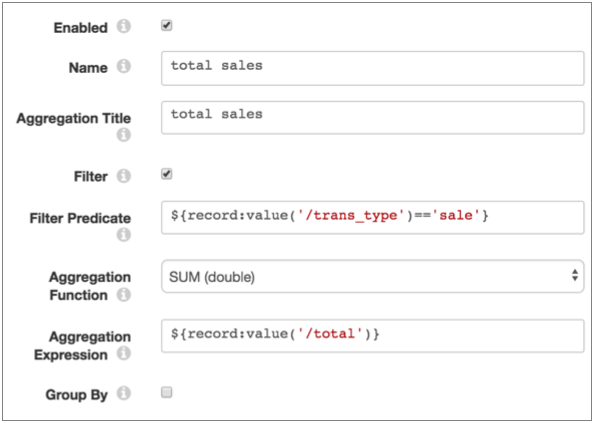
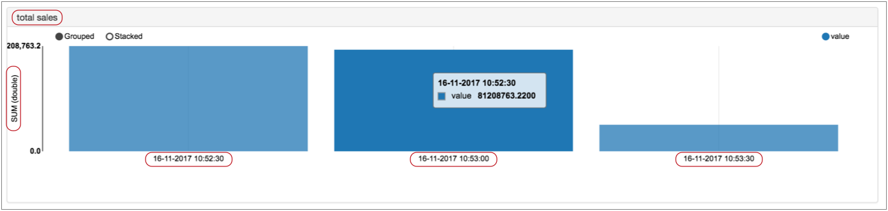
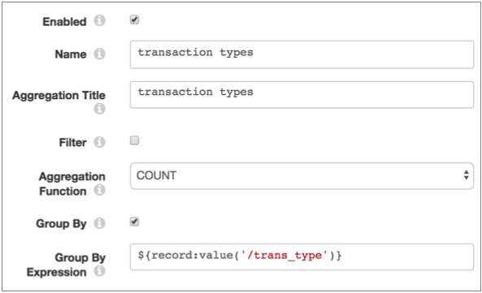
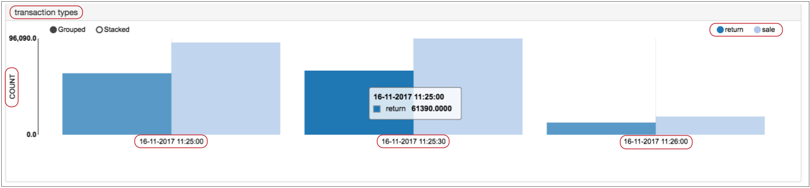

# 窗口聚合器

[支持的管道类型：](https://streamsets.com/documentation/controlhub/latest/help/datacollector/UserGuide/Pipeline_Configuration/ProductIcons_Doc.html#concept_mjg_ly5_pgb) 资料收集器

Windowing Aggregator处理器在一个时间窗口内执行一个或多个聚合。Windowing Aggregator处理器以“监视器”模式显示结果，并且可以将结果写入事件记录。处理器不更新数据流中的记录。

您可以将汇总结果与Data Collector 数据警报一起使用以生成阈值通知。或者，您可以将事件写入数据存储，并使用第三方仪表板应用程序可视化数据。

配置Windowing Aggregator时，可以指定要使用的窗口类型和时间窗口。此信息确定处理器如何显示数据和生成事件。您还可以指定要使用的时区和要执行的汇总。

配置聚合时，可以指定聚合名称和显示标题以及要使用的聚合功能。您可以选择定义一个过滤器表达式来处理数据的子集，并定义一个表达式来基于组进行汇总。

要将聚合结果写入事件，启用事件生成，配置要创建的事件记录的类型，以及可选地指定要使用的根字段的类型。有关数据流触发器和事件框架的一般信息，请参阅[数据流触发器概述](https://streamsets.com/documentation/controlhub/latest/help/datacollector/UserGuide/Event_Handling/EventFramework-Title.html#concept_cph_5h4_lx)。

## 窗口类型，时间窗口和信息显示

聚合窗口类型确定Windowing Aggregator处理器用于计算聚合的时间窗口。它还确定处理器如何生成图表和事件。

时间窗口是用于指定窗口类型的时间段。时间窗口行为特定于您选择的窗口类型。

例如，当您将滚动窗口类型配置为一个小时的时间窗口时，处理器会使用每小时在每个小时通过处理器的记录在每小时的每小时进行一次聚合。

从概念上讲，您可能会说，在滚动窗口中，记录在发生记录的窗口内是静态的。当记录成为特定时间窗口的一部分时，它们将保留在那里。并且一旦完成时间窗口的计算，它们也将保持静态。

相反，当您为滑动窗口类型选择一个小时的时间窗口时，聚合始终基于过去一小时通过处理器的记录，从而定期更新计算。

从概念上讲，滑动窗口被锁定在当前时间，并记录滑动窗口中的时间。移过窗口的记录不再是滑动窗口计算的一部分。

### 滚动窗

当使用滚动窗口时，Windowing Aggregator处理器对在特定时间窗口内通过处理器的记录集执行聚合。使用滚动窗口生成对通过管道的数据的定期历史分析。

如果滚动窗口少于一个小时，则时间窗口将根据小时的开始而不是管道的开始时间来增加。

例如，当您选择一个15分钟的时间窗口时，从小时开始每15分钟计算一次汇总。因此，如果您在8:09启动管道，则第一次聚合发生在8:15，随后的聚合发生在8：30、8：45、9：00，依此类推。实际上，如果您在8:01到8:14之间的任何地方启动管道，则聚合将从8:15开始并每15分钟继续一次。

使用一个小时或更长的滚动窗口时，时间窗口会根据一天的开始时间（上午12:00）增加。

例如，当您选择一个六小时的时间窗口时，聚合将在12 AM，6 AM，12 PM和6 PM进行计算。因此，如果您在10:10 AM启动管道，则第一次聚集发生在12 PM，第二次聚集在6 PM，依此类推。

对于滚动窗口，处理器根据时间窗口和“要记住的时间窗口数”以“监视”模式创建图表。例如，如果将属性设置为4，并使用15分钟的时间窗口，则结果图表将显示四个15分钟的时间窗口。

处理器还根据时间窗口创建事件，并带有计算结果。因此，在15分钟的时间窗口内，它会基于小时每15分钟生成一次事件。

请注意，由于上述原因，第一个事件的计算可能包含少于整个记录窗口的时间。同样，在管道停止时生成的最后一个事件可以包括少于完整记录窗口的计算。

### 滑动窗

当使用滑动窗口类型时，Windowing Aggregator处理器对指定时间窗口内的最新记录集执行聚合。对于滑动窗口，时间窗口始终相对于当前时间。

滑动窗口不像滚动窗口那样捕获计算历史，而是提供对当前集合的更新。使用滑动窗口可提供有关通过处理器的数据的实时信息。

例如，假设您配置一个带有30秒时间窗口的滑动窗口。在运行管道时，处理器将显示一个图表，其中包含最近30秒钟通过处理器的记录中的信息。并且它会定期更新单个图表。

在监控器模式下，所有时间窗口间隔内每隔几秒钟更新一次计算和结果图表。图表显示了上次更新的时间。

生成事件时，处理器基于指定的时间窗口以规则的时间间隔生成事件，该事件从管道启动开始就开始。

例如，对于时间窗口为一小时的滑动窗口类型，处理器每分钟生成一次事件。因此，如果您在9:08开始管道，则处理器将生成事件，并从9：09、9：10、9：11等开始计算结果。

请注意，第一个小时的计算结果包含的数据少于指定的一小时时间窗口。在10:08，处理器提供第一个小时时间窗口的结果。在10:09，处理器将计算中最后一小时的所有最新记录包括在计算中，删除由于它们不在时间范围之外而在9:08和9:09之间到达的记录。

下表描述了每个滑动时间窗口生成事件记录的频率：

| 滑动时间窗 | 事件发生...            |
| :--------- | :--------------------- |
| 1分钟      | 从管道开始每隔5秒      |
| 5分钟      | 从管道开始每隔5秒      |
| 10分钟     | 从管道开始起每隔10秒   |
| 30分钟     | 从管道开始起每30秒     |
| 1小时      | 从管道开始每隔1分钟    |
| 6个小时    | 从管道开始起每隔5分钟  |
| 12小时     | 从管道开始起每隔10分钟 |
| 24小时     | 从管道开始起每隔20分钟 |

## 计算组件

您可以使用以下组件来配置要执行的计算：

- 聚合功能和表达

  选择要使用的[聚合函数](https://streamsets.com/documentation/controlhub/latest/help/datacollector/UserGuide/Processors/Aggregator.html#concept_bvw_d2f_wbb)时，通常还需要配置一个聚合表达式。除COUNT函数外，所有聚合函数都需要一个表达式。

  例如，要确定时间窗口中所有交易数据的总销售额，可以将合计函数设置为SUM（双精度）并使用以下表达式：`${record:value('/total')}`

  该表达式对时间窗口中所有记录的总字段求和。

- 过滤

  配置过滤器以限制计算中使用的记录。过滤器是一个计算结果为布尔值的表达式。汇总中包含评估结果为true的记录。

  例如，以下过滤器确保仅处理具有已知信用卡类型的信用卡交易：`${record:value('/transaction_type')=="credit" AND record:value('/cc_type')!="unknown"}`使用此过滤器后，Windowing Aggregator排除了现金购买和未知的信用卡类型。

- 按表情分组

  “按表达式分组”是用于在执行计算之前对数据进行分组的表达式。使用“按表达式分组”可以在结果中添加其他维度。

  上面的示例为所有已知信用卡类型的信用卡交易产生一个总和。要按信用卡类型细分该数字，可以按以下表达式使用以下分组：`${record:value('/cc_type')}`

  在执行聚合之前，此表达式将按cc_type字段中的不同值（例如Visa或Mastercard）对数据进行分组。

有关其他示例以及有关聚合结果如何在“监视”模式下显示的信息，请参阅[监视聚合](https://streamsets.com/documentation/controlhub/latest/help/datacollector/UserGuide/Processors/Aggregator.html#concept_qxw_k42_wbb)。

## 汇总功能

配置聚合时，请选择要使用的聚合功能。适当时，您可以选择用于聚合结果的数据类型。

您可以使用以下聚合函数：

- 平均（整数或双精度）
- 计数（仅整数）
- 最小值（整数或双精度）
- 最大值（整数或双精度）
- StdDev（整数或双精度）
- 总和（整数或双精度）

## 事件产生

Windowing Aggregator处理器可以生成包含聚合结果的事件。处理器可以生成包括所有聚合结果的事件。它还可以为每个聚合的结果生成事件。

Windowing Aggregator处理器事件可以任何逻辑方式使用。例如：

- 具有用于存储事件信息的目的地。

  有关示例，请参见[案例研究：事件存储](https://streamsets.com/documentation/controlhub/latest/help/datacollector/UserGuide/Event_Handling/EventFramework-Title.html#concept_ocb_nnl_px)。

- 具有

  数据警报

  以发送通知。

  您可以在事件流上配置数据警报，以在达到指定阈值时进行通知。

- 使用电子邮件执行程序在收到事件后发送自定义电子邮件。

  有关示例，请参阅[案例研究：发送电子邮件](https://streamsets.com/documentation/controlhub/latest/help/datacollector/UserGuide/Event_Handling/EventFramework-Title.html#concept_t2t_lp5_xz)。

有关数据流触发器和事件框架的更多信息，请参见[数据流触发器概述](https://streamsets.com/documentation/controlhub/latest/help/datacollector/UserGuide/Event_Handling/EventFramework-Title.html#concept_cph_5h4_lx)。

### 事件记录根字段

默认情况下，Windowing Aggregator处理器通过将记录数据作为JSON字符串写入String根字段来生成事件记录。您可以像其他事件记录一样，通过将JSON数据写入Map根字段来配置处理器以生成事件记录。

两种记录格式都提供相同的数据。在同一管道中对事件记录执行其他处理时，使用“映射根目录”字段应该更有效。将事件记录写入目标而不进行其他处理时，使用字符串根字段应该更有效。

选择看起来更适合您的用例的选项。使用“事件”选项卡上的“使用文本字段生成事件记录”属性来指定要使用的根字段。

### 活动记录

Windowing Aggregator处理器生成的事件记录具有以下与事件相关的记录头属性。记录标题属性存储为字符串值：

| 记录标题属性                 | 描述                                                         |
| :--------------------------- | :----------------------------------------------------------- |
| sdc.event.type               | 事件类型。使用以下事件类型之一：<window type> .window.aggregator-包含单个聚合的结果。例如，对于一个滚动窗口聚合，事件类型为rolling.window.aggregator。<window type> .window.all.aggregators-包含所有已配置聚合的结果。当处理器配置为在一个事件中包括所有聚合时生成。例如，对于一组滑动窗口聚合，事件类型为slide.window.all.aggregators。 |
| sdc.event.version            | 整数，指示事件记录类型的版本。                               |
| sdc.event.creation_timestamp | 舞台创建事件的时间戳记。                                     |

Windowing Aggregator处理器可以生成以下事件记录：

- 单次聚集事件

  您可以将Windowing Aggregator处理器配置为创建单个聚合事件。每个事件都包含单个聚合的结果。也就是说，当您将处理器配置为生成单个聚合事件时，每次处理器执行计算时，处理器都会生成一组事件。事件发生的频率取决于所选的[窗口类型和时间窗口](https://streamsets.com/documentation/controlhub/latest/help/datacollector/UserGuide/Processors/Aggregator.html#concept_abn_qyd_wbb)。

  例如，如果您的处理器配置了三个聚合，滚动时间窗口为十分钟，并且启用了单个聚合事件，则Windowing Aggregator处理器每十分钟生成三个单个聚合事件。

  当管道停止时，处理器还生成事件，以提供最终时间窗口的结果。此最终事件很可能是不完整的时间窗口，可能会产生意外的聚合结果。

  您可以根据每个事件的时间值之间的差异来评估时间窗口是否完整。例如，假设您希望聚合每30秒发生一次，并且与事件记录相关的时间是：1511295390、1511295420和1511295440。您可以评估上一个事件是20秒时间窗而不是30秒时间窗口，可能是由于管道停止而发生的。

  要生成单个聚合事件，请配置以下两个属性：在常规选项卡上，选择产生事件。在“事件”选项卡上，选择“每个聚合器事件”。

  单个聚合事件的sdc.event.type设置为<window type> .window.aggregator，并包括以下字段：事件记录字段描述名称阶段中定义的聚合名称。时间计算发生并生成事件的时期。可聚合的一个映射字段，其中包含用于执行聚合的信息。当聚合不包括按表达式分组时，映射将包括以下字段：name-聚合的名称，如阶段中所定义。type-聚合类型，例如Avg（整数）聚合函数的LongAvgAggregatable。<与聚合相关的字段>-基于聚合中使用的聚合函数的其他信息。当聚合包括按表达式分组时，可聚合字段列出每个分组。每个组字段包括上述字段。

  下表根据聚合中使用的聚合函数描述了事件记录中可以包含的其他字段：汇总功能其他栏位平均count-计算中包含的值数。总计-计算中使用的总计。平均值-计算结果。计数count-计算结果。最高max-计算结果。敏min-计算结果。标准差总计-计算中使用的总计。count-计算中使用的值数。totalSquare-总数的平方。stdDev-计算结果。和sum-计算结果。count-计算中包含的值数。

- 所有聚集事件

  您可以将Windowing Aggregator处理器配置为创建一个包含所有已配置聚合结果的所有聚合事件。事件发生的频率取决于所选的[窗口类型和时间窗口](https://streamsets.com/documentation/controlhub/latest/help/datacollector/UserGuide/Processors/Aggregator.html#concept_abn_qyd_wbb)。

  单个聚合事件的sdc.event.type设置为<window type> .window.all.aggregators，并且包括聚合列表。每个聚合列表项都是一个映射字段，其中包含与上述单个聚合事件相同的字段。

  要生成所有聚合事件，请配置以下两个属性：在常规选项卡上，选择产生事件。在“事件”选项卡上，选择“所有聚合器事件”。

## 监控汇总

除了标准阶段统计信息外，Windowing Aggregator处理器还提供了聚合图表，您可以在运行管道时对其进行[监视](https://streamsets.com/documentation/controlhub/latest/help/datacollector/UserGuide/Pipeline_Monitoring/PipelineMonitoring.html#concept_hsp_tnt_lq)。处理器使用图表名称的指定标题为每种汇总生成一个图表。

图表的内容和显示取决于聚合和阶段属性。例如，当使用按表达式分组时，图表将为每个分组显示一个条形图。

使用滑动窗口时，图表将显示图表的最后更新日期和时间。

使用滚动窗口时，图表将基于“要记住的时间窗口数”属性包含多个时间窗口的结果。图表显示时间窗口关闭的日期和时间。最新的时间窗口可能正在进行中，随着处理器继续在该时间窗口内聚合数据，显示最新的详细信息。

例如，假设您有一个使用滚动窗口和30秒时间窗口的Windowing Aggregator处理器。它被配置为记住三个时间窗口，并使用以下汇总执行所有销售的总和，并使用过滤器排除退货：

处理器生成以下“销售总额”图表：

注意，聚合函数SUM（双精度）显示在图表的左侧，每个时间段的末尾显示在每个条形下方。您可以看到时间窗口之间的间隔为30秒，如阶段中所配置。

第三个时间窗口的结果似乎很低，但这是因为时间窗口仍处于活动状态-计算正在进行，并且结果将更新直到时间窗口关闭。与其他Data Collector 图表一样，当您将鼠标悬停在特定部分上时，将显示相关详细信息。在这种情况下，“值”是在时间窗口中发生的销售总额。

在同一Windowing Aggregator处理器中，您可以使用以下聚合配置来确定销售和退货数量。通过表达式分组可以对每种交易类型进行计数：

在生成的“交易类型”图表中，COUNT函数显示在左侧，单独的条形表示退货和销售组：

要查看Windowing Aggregator图表和统计信息，请在“监视器”模式下查看管道，然后选择“ Windowing Aggregator”处理器。

## 配置窗口聚合器

配置Windowing Aggregator处理器以在时间窗口内执行聚合。

1. 在“属性”面板的“ **常规”**选项卡上，配置以下属性：

   | 一般财产                                                     | 描述                                                         |
   | :----------------------------------------------------------- | :----------------------------------------------------------- |
   | 名称                                                         | 艺名。                                                       |
   | 描述                                                         | 可选说明。                                                   |
   | 产生事件  | 发生事件时生成事件记录。用于[事件处理](https://streamsets.com/documentation/controlhub/latest/help/datacollector/UserGuide/Event_Handling/EventFramework-Title.html#concept_cph_5h4_lx)。 |
   | [必填项](https://streamsets.com/documentation/controlhub/latest/help/datacollector/UserGuide/Pipeline_Design/DroppingUnwantedRecords.html#concept_dnj_bkm_vq) | 必须包含用于将记录传递到阶段的记录的数据的字段。**提示：**您可能包括舞台使用的字段。根据为管道配置的错误处理，处理不包含所有必填字段的记录。 |
   | [前提条件](https://streamsets.com/documentation/controlhub/latest/help/datacollector/UserGuide/Pipeline_Design/DroppingUnwantedRecords.html#concept_msl_yd4_fs) | 必须评估为TRUE的条件才能使记录进入处理阶段。单击 **添加**以创建其他前提条件。根据为阶段配置的错误处理，处理不满足所有前提条件的记录。 |
   | [记录错误](https://streamsets.com/documentation/controlhub/latest/help/datacollector/UserGuide/Pipeline_Design/ErrorHandling.html#concept_atr_j4y_5r) | 该阶段的错误记录处理：放弃-放弃记录。发送到错误-将记录发送到管道以进行错误处理。停止管道-停止管道。对群集管道无效。 |

2. 在“ **聚合”**选项卡上，配置以下属性：

   | 聚集性质                                                     | 描述                                                         |
   | :----------------------------------------------------------- | :----------------------------------------------------------- |
   | 视窗类型 | 使用的窗口类型：滚动-根据小时按固定间隔计算聚合。滑动-根据最新的数据间隔计算聚合。 |
   | 时间窗 [ | 要包含在聚合中的记录的时间窗口。[对于滚动窗口](https://streamsets.com/documentation/controlhub/latest/help/datacollector/UserGuide/Processors/Aggregator.html#concept_h5b_bf2_wbb)，时间窗口还确定处理器何时在“监视器”模式下更新图表以及处理器何时生成事件。[对于滑动窗口](https://streamsets.com/documentation/controlhub/latest/help/datacollector/UserGuide/Processors/Aggregator.html#concept_qtg_ff2_wbb)，时间窗口仅确定要包括在聚合中的记录的时间窗口。图表和事件是分别生成的。 |
   | 时区                                                         | 用于建立时间窗口的时区。                                     |
   | 需要记住的时间范围 | 在“监视”模式下显示的时间窗口数。仅与滚动窗口一起使用。       |
   | 集合体                                                       | 汇总要执行的计算。要配置其他聚合，请单击 **添加**图标。      |
   | 已启用                                                       | 启用聚合。清除此选项可禁用聚合，同时保留聚合以备将来使用。   |
   | 名称                                                         | 聚合名称。为聚合指定一个名称，该名称在处理器内是唯一的。     |
   | 汇总标题                                                     | 聚合标题。用于汇总生成的图表的标题。                         |
   | 过滤                                                         | 启用创建过滤器表达式。                                       |
   | 过滤谓词 [ | 筛选条件以减少计算中包含的记录数。输入一个布尔表达式。评估中包含评估为是的记录。 |
   | 汇总功能 | 要使用的聚合函数。您可以使用以下聚合函数：平均（整数或双精度）计数（仅整数）最小值（整数或双精度）最大值（整数或双精度）StdDev（整数或双精度）总和（整数或双精度） |
   | 聚集表达 | 所选集合函数的表达式。                                       |
   | 通过...分组                                                  | 允许在计算中使用按表达式分组。                               |
   | 按表达式分组 | 用于在执行计算之前对记录进行分组的表达式。                   |

3. 在“ **事件”**选项卡上，配置以下属性：

   | 活动属性                   | 描述                                                         |
   | :------------------------- | :----------------------------------------------------------- |
   | 所有聚合事件               | 每次处理器执行计算时，都会生成包含所有已配置聚合结果的事件。有关何时生成事件记录的更多信息，请参阅[事件记录](https://streamsets.com/documentation/controlhub/latest/help/datacollector/UserGuide/Processors/Aggregator.html#concept_bc4_c42_wbb)。 |
   | 每个聚合器事件             | 每次处理器执行计算时，都会生成一组事件，每个配置的聚合事件一组。有关何时生成事件记录的更多信息，请参阅[事件记录](https://streamsets.com/documentation/controlhub/latest/help/datacollector/UserGuide/Processors/Aggregator.html#concept_bc4_c42_wbb)。 |
   | 产生带有文本字段的事件记录 | 确定[事件记录根字段](https://streamsets.com/documentation/controlhub/latest/help/datacollector/UserGuide/Processors/Aggregator.html#concept_dld_z2q_vcb)的数据类型。默认情况下，处理器将记录数据写入String根字段。要生成标准事件记录并将记录数据写入Map根字段，请清除此选项。 |