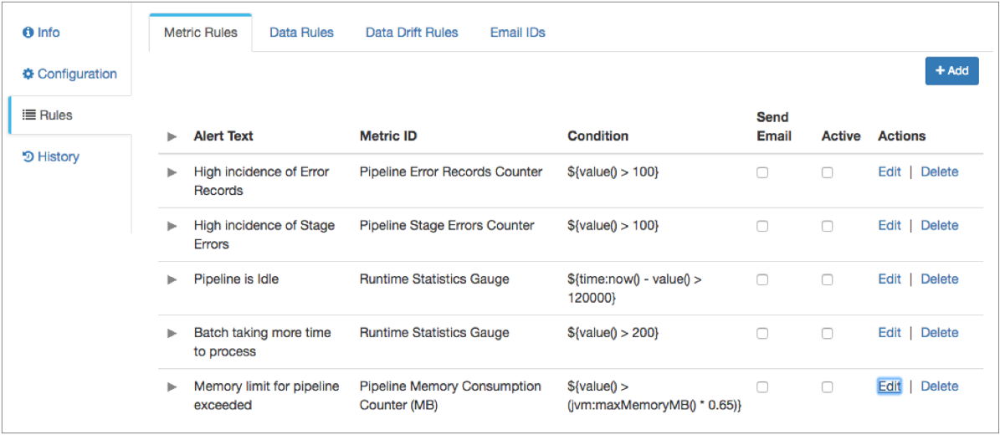

# 规则和警报

## 规则和警报概述

您可以定义规则以启用捕获有关正在运行的管道的信息。您可以启用警报，以在发生指定条件时通知任何规则。

在Data Collector Edge管道中无效。 Data Collector Edge管道将忽略任何已配置的规则或警报。

由控制中心管理的管道的规则和警报是由 运行它 的执行数据收集器基于为每个本地管道实例处理的数据触发的。由独立Data Collector运行的管道规则和警报是根据Data Collector 处理的管道数据触发的。

您可以创建以下类型的规则：

- 度量标准规则-收集有关管道的统计信息，例如管道空闲时间或错误记录计数。启用时提供警报。
- 数据规则-在两个阶段之间传递数据时收集有关数据的详细信息。可以提供仪表和警报。
- 数据漂移规则-当数据在两个阶段之间传递时，收集有关数据漂移的详细信息。可以提供仪表和警报。

启用警报后，可以通过以下方式将警报通知您：

- Webhooks-所有警报都会触发所有已配置的Webhooks。
- 电子邮件-您可以配置规则以发送电子邮件警报。
- Control Hub UI-由执行Data Collector触发的警报显示在Control Hub警报视图上，并在您监视运行管道的作业时作为警报。它们还将显示在执行Data Collector UI中，如本章其余部分所述。

## 公制规则和警报

度量标准规则和警报提供有关管道实时统计信息的通知。

您可以定义并启用度量标准规则，以便在统计信息达到特定阈值时向您发送警报。

启用度量标准规则时，它将自动为该规则启用警报。您还可以配置度量标准规则，以将电子邮件警报发送到与管道关联的所有电子邮件地址。

配置管道时，可以配置度量标准规则。 Data Collector 提供了一组默认度量标准规则，您可以对其进行编辑并为任何管道启用。度量标准规则在启用后生效。

您还可以创建自定义指标规则。创建自定义指标规则时，请选择指标类型。度量标准类型确定哪个统计信息将触发警报。您配置触发警报的条件，然后输入要在警报中显示的文本。

### 默认指标规则

Data Collector 提供了一组默认度量标准规则，您可以对其进行编辑并为任何管道启用。

您可能需要编辑默认度量标准规则，以修改警报文本或规则条件。默认情况下，未启用任何规则。选择 **活动**以启用规则。

Data Collector提供以下默认度量标准规则：



### 指标类型

创建度量标准规则时，可以使用不同的度量标准类型。度量标准类型确定哪个统计信息将触发警报。

选择度量标准类型之后，您可以选择度量标准ID，该ID指定要使用的度量。例如，度量标准ID可以是运行时统计量表或输入记录表。然后，选择定义度量标准的度量标准元素。度量标准元素可以是计数，比率，中位数，最小值，最大值或百分比。可能的度量标准ID和度量标准元素因度量标准类型而异。

#### 量规

量规度量标准类型根据最后处理的批次的输入，输出或错误记录的数量提供警报。它还提供有关当前批处理的时间，阶段处理批处理所花费的时间或Data Collector 上次从源接收记录的时间的警报。

指标度量标准类型包括一个度量标准ID，即“运行时统计量表”。您可以配置警报以触发以下指标元素：

- 最后一批输入，输出或错误记录计数
- 最后一批错误消息计数
- 当前批处理年龄
- 当前阶段的时间
- 上次收到记录的时间

例如，您可以配置一个度量标准规则，当管道处理批处理超过5分钟时，该规则将触发警报。

#### 计数器

计数器度量标准类型根据管道或管道中某个阶段的输入，输出或错误记录的数量提供警报。


计数器度量标准类型包括以下度量标准ID：

- 管道批次计数。
- 管道或管道中某个阶段的输入记录，输出记录，错误记录或阶段错误的数量。

对于任何选定的度量标准ID，您可以配置警报以在计数度量标准元素上触发。

例如，您可以配置一个计数器指标规则，当管道遇到1000条以上的错误记录时触发警报。

#### 直方图

直方图度量标准类型基于管道或管道中某个阶段的不同记录类型和阶段错误的直方图提供警报。

直方图度量标准类型提供有关管道或阶段的“每批记录直方图”统计信息的警报 。

直方图度量标准类型包括管道或管道中某个阶段的输入记录，输出记录，错误记录或阶段错误的度量标准ID。您可以配置警报以触发监视直方图中显示的度量标准元素：平均值，标准偏差，百分比或计数。

例如，您可以配置直方图度量标准规则，该规则在管道处理的所有输入记录的平均值达到10,000时触发警报。

#### 仪表

仪表度量标准类型基于管道或管道中某个阶段的不同记录类型的速率和阶段错误来提供警报。

计量指标类型可以提供有关管道处理的批次数量的警报。计量指标类型还可以提供有关管道或阶段的“记录计数”和“记录吞吐量”统计信息的警报。


仪表度量标准类型包括管道批次计数以及管道或管道中某个阶段的输入记录，输出记录，错误记录或阶段错误的度量标准ID。您可以配置警报以在“记录计数”和“记录吞吐量”统计信息中显示的以下指标元素上触发：计数，时间率或平均值。

例如，您可以配置一个仪表度量标准规则，当一个阶段处理的输出记录的数量在一分钟内达到5,000个时，该规则将触发警报。

#### 计时器

计时器度量标准类型基于管道或管道中某个阶段的批处理计时器提供警报。

计时器度量标准类型提供有关管道或阶段的批处理吞吐量和批处理计时器统计信息的警报。

计时器度量标准类型包括以下度量标准ID：

- 管道批处理计时器-管道处理批处理的时间。
- <stage_name>批处理计时器-阶段处理批处理的时间。

您可以配置警报以在“批处理计时器”统计信息中显示的以下指标元素上触发：平均值，标准偏差，百分比，时间率或计数。

例如，您可以配置计时器度量标准规则，该规则将在管道处理批处理的平均时间达到10分钟时触发警报。

### 公制条件

配置度量标准规则时，将配置条件，该条件定义度量标准规则触发警报的阈值。使用表达语言来配置条件。

表达式语言提供以下用于创建度量标准条件的功能：

- 值（）

  返回在指标规则中选择的当前指标的值。在条件中用于任何类型的度量标准。例如，“管道错误记录计数器”度量标准的默认规则包括以下条件：`${value() > 100}`当管道遇到100条以上的错误记录时，将触发警报。

- 是时候了（）

  以java.util.Date对象的形式返回Data Collector计算机的当前时间。在用于量规度量标准的条件中使用。例如，用于检查管道是否空闲的运行时统计量度指标的默认规则包括以下条件：`${time:now() - value() > 120000}`当前时间比最后接收到的记录的时间大120,000毫秒时，将触发警报。

- jvm：maxMemoryMB（）

  返回以MB为单位分配给Data Collector的Java堆大小。在条件中用于反制衡规则。例如，“管道内存消耗计数器”度量标准的默认规则包括以下条件：`${value() > (jvm:maxMemoryMB() * 0.65)}`当管道使用分配给Data Collector的Java堆大小的65％时，将触发警报。

有关使用表达语言的更多信息，请参见[表达语言](https://streamsets.com/documentation/controlhub/latest/help/datacollector/UserGuide/Expression_Language/ExpressionLanguage_overview.html#concept_p54_4kl_vq)。

### 配置度量标准规则和警报

创建自定义指标规则，以在实时统计信息达到特定阈值时接收警报。您可以在配置管道时创建度量标准规则和警报。如果未启用度量标准规则，则可以编辑或删除它们。

根据度量标准类型，度量标准，与度量标准关联的元素和条件来配置度量标准规则。

1. 在“属性”面板中，单击“ **度量标准规则”**选项卡，然后单击“ **添加”**图标。

2. 在“ **度量标准规则”**对话框中，配置以下属性：

   | 度量规则属性                                                 | 描述                                                         |
   | :----------------------------------------------------------- | :----------------------------------------------------------- |
   | 警报文字                                                     | 触发警报时显示的文本。输入说明警报原因的文本。例如，“超过1000条管道错误记录”。 |
   | 公制类型 [](https://streamsets.com/documentation/controlhub/latest/help/datacollector/UserGuide/Alerts/RulesAlerts_title.html#concept_y4d_tcw_1r) | 警报基于的度量标准信息的类型：量规计数器直方图仪表计时器     |
   | 指标ID                                                       | 使用度量。根据指标类型提供可用指标的列表。                   |
   | 公制元素                                                     | 要使用的指标元素。提供基于度量标准ID的可用元素列表。         |
   | 条件 [](https://streamsets.com/documentation/controlhub/latest/help/datacollector/UserGuide/Alerts/RulesAlerts_title.html#concept_qyv_1tf_qv) | 触发警报的条件。使用表达语言来配置条件。                     |
   | 发送电子邮件                                                 | 触发警报时发送电子邮件。要发送电子邮件，请添加警报的电子邮件地址并配置Data Collector电子邮件属性。有关更多信息，请参阅[配置警报电子邮件](https://streamsets.com/documentation/controlhub/latest/help/datacollector/UserGuide/Alerts/RulesAlerts_title.html#task_f3v_1hw_1r)。 |

3. 点击**保存**。

   新的度量标准规则将显示在列表中。

4. 要启用规则，请选择“ **活动”**。

   您可以从规则列表中启用和禁用电子邮件警报。

## 数据规则和警报

数据规则定义您想要查看的有关阶段之间传递的数据的信息。您可以基于管道中的任何链接创建数据规则。您还可以启用指标并为数据规则创建警报。


您可以在配置管道时配置数据规则。要创建数据规则，您需要熟悉要处理的数据。您可以预览数据以帮助确定如何配置数据规则。

### 配置数据规则和警报

创建数据规则以查看度量，样本数据和基于规则的警报。您可以在配置管道时配置数据规则和警报。如果未启用数据规则，则可以编辑或删除它们。

1. 在“属性”面板中，单击“ **数据规则”**选项卡，然后单击“ **添加”**图标。

2. 在“ **数据规则”**对话框中，配置以下属性：

   | 数据规则属性 | 描述                                                         |
   | :----------- | :----------------------------------------------------------- |
   | 流           | 为数据规则选择的链接。                                       |
   | 标签         | 要显示的数据规则标签。                                       |
   | 条件         | 定义数据规则的条件。使用表达语言来配置条件。有关使用表达语言的更多信息，请参见[表达语言](https://streamsets.com/documentation/controlhub/latest/help/datacollector/UserGuide/Expression_Language/ExpressionLanguage_overview.html#concept_p54_4kl_vq)。 |
   | 抽样比例     | 采样以生成数据规则信息的记录百分比。较高的百分比可以提供更高的准确性，但会在Data Collector计算机上使用更多的资源。 |
   | 保留采样记录 | 要保存在内存中以供显示的采样记录数。                         |
   | 启用仪表     | 启用收集数据规则的信息。                                     |
   | 启用警报     | 根据数据规则启用警报。发生配置的条件时显示警报。             |
   | 警报文字     | 触发警报时显示的文本。输入说明警报原因的文本。例如，“缺少100多个电话号码”。您可以使用表达语言来定义警报文本。例如，使用该 `record:errorMessage()`功能在警报文本中显示错误消息。有关使用表达语言的更多信息，请参见 [表达语言](https://streamsets.com/documentation/controlhub/latest/help/datacollector/UserGuide/Expression_Language/ExpressionLanguage_overview.html#concept_p54_4kl_vq)。 |
   | 门槛类型     | 定义警报何时生效的阈值类型：计数-指定数量的记录。百分比-记录的指定百分比。 |
   | 门槛值       | 定义规则触发警报的阈值的值。                                 |
   | 最小音量     | 在评估百分比阈值类型之前要处理的最小记录数。                 |
   | 发送电子邮件 | 触发警报时发送电子邮件。要发送电子邮件，请添加警报的电子邮件地址并配置 Data Collector电子邮件属性。有关更多信息，请参阅[配置警报电子邮件](https://streamsets.com/documentation/controlhub/latest/help/datacollector/UserGuide/Alerts/RulesAlerts_title.html#task_f3v_1hw_1r)。 |

3. 点击**保存**。

   新数据规则将显示在列表中。

4. 要启用新规则，请点击**活动**。

   您可以从规则列表中启用和禁用电表和警报。您可以编辑和删除禁用的规则。

## 数据漂移规则和警报

您可以创建数据漂移规则以指示数据结构何时更改。您可以在管道中的任何链接上创建数据漂移规则。您还可以启用指标并为数据漂移规则创建警报。

表达式语言提供了用于创建数据漂移规则的数据漂移功能。您可以在每个函数中使用特定的字段类型。下表描述了可以在不同字段类型上生成的数据漂移规则的类型：

| 数据漂移规则 | 漂移功能        | 有效的字段数据类型 |
| :----------- | :-------------- | :----------------- |
| 栏位名称变更 | `drift:name()`  | 列表图地图         |
| 现场订单变更 | `drift:order()` | 列表图             |
| 栏数         | `drift:size()`  | 清单列表图地图     |
| 现场数据类型 | `drift:type()`  | 任何               |

有关数据漂移功能的详细信息，请参见[数据漂移功能](https://streamsets.com/documentation/controlhub/latest/help/datacollector/UserGuide/Expression_Language/Functions.html#concept_hpn_xfk_p5)。

### 数据漂移警报触发器

当记录之间发生指定类型的更改时，将触发数据漂移警报。

例如，您有一个警报，当记录中的字段数更改时触发。处理具有以下列数的记录时，第三条和第四条记录都会触发警报：

| 记录编号 | 列数 |
| :------- | :--- |
| 1个      | 10   |
| 2        | 10   |
| 3        | 15   |
| 4        | 10   |

数据漂移功能包括ignoreWhenMissing标志，用于确定指定字段不存在时的行为。当指定的字段丢失并且ignoreWhenMissing设置为true时，不会触发警报。

当指定的字段丢失并且ignoreWhenMissing标志设置为false时，该表达式将触发该丢失字段的警报，并在存在该字段时触发下一条记录的警报。

例如，以下表达式检查将ignoreWhenMissing设置为false的ID列的数据类型：

```
${drift:type('/UserID', false)}
```

假设所有记录都包含UserID字段，然后传递一条没有UserID字段的记录。此表达式触发具有缺少字段的记录的警报，并在到达包含UserID字段的下一条记录时再次触发警报。

### 配置数据漂移规则和警报

创建数据漂移规则，以基于该规则查看指标，样本数据和警报。您可以在配置管道时配置数据漂移规则和警报。未启用时，您可以编辑或删除数据漂移规则。

1. 在“属性”面板中，单击“ **数据漂移规则”**选项卡，然后单击“ **添加”**图标。

2. 在“ **数据漂移规则”**对话框中，配置以下属性：

   | 数据规则属性                                                 | 描述                                                         |
   | :----------------------------------------------------------- | :----------------------------------------------------------- |
   | 流                                                           | 为数据漂移规则选择的链接。                                   |
   | 标签                                                         | 为数据漂移规则显示的标签。                                   |
   | 条件 [](https://streamsets.com/documentation/controlhub/latest/help/datacollector/UserGuide/Expression_Language/Functions.html#concept_hpn_xfk_p5) | 定义数据漂移规则的条件。您可以使用数据漂移函数和表达式语言的其他方面来配置条件。 |
   | 抽样比例                                                     | 采样以生成数据漂移规则信息的记录百分比。较高的百分比可以提供更高的准确性，但会在Data Collector计算机上使用更多的资源。 |
   | 保留采样记录                                                 | 要保存在内存中以供显示的采样记录数。                         |
   | 启用仪表                                                     | 启用数据漂移规则的收集信息。                                 |
   | 启用警报                                                     | 根据数据漂移规则启用警报。发生配置的条件时显示警报。         |
   | 警报文字                                                     | 触发警报时显示的文本。您可以使用表达语言来定义警报文本。有关使用表达语言的更多信息，请参见[表达语言](https://streamsets.com/documentation/controlhub/latest/help/datacollector/UserGuide/Expression_Language/ExpressionLanguage_overview.html#concept_p54_4kl_vq)。默认情况下，使用以下表达式返回与漂移警报相关的文本： `${alert:info()}`。 |
   | 发送电子邮件                                                 | 触发警报时发送电子邮件。要发送电子邮件，请添加警报的电子邮件地址并配置 Data Collector电子邮件属性。有关更多信息，请参阅[配置警报电子邮件](https://streamsets.com/documentation/controlhub/latest/help/datacollector/UserGuide/Alerts/RulesAlerts_title.html#task_f3v_1hw_1r)。 |

3. 点击**保存**。

   新的数据漂移规则将显示在列表中。

4. 要启用新规则，请点击**活动**。

   您可以从规则列表中启用和禁用电表和警报。您可以编辑和删除禁用的规则。

## 警报网钩

您可以配置触发警报时发送的Webhook。Webhook是用户定义的HTTP回调-发生某些操作时管道自动发送的HTTP请求。您可以使用webhooks根据HTTP请求自动触发外部任务。任务可以像通过应用程序API发送消息一样简单，也可以像将命令传递给Data Collector命令行界面一样强大。

每次触发警报时，管道都会发送所有警报webhook。因此，当您配置警报Webhook时，请创建适用于所有触发警报的Webhook有效负载。您可以配置包含每个警报详细信息的有效负载。

**重要：**您必须按照接收系统的预期配置webhook。有关如何配置传入的Webhooks的详细信息，请参阅接收系统的文档。您可能还需要在该系统中启用Webhook使用。

配置警报Webhook时，您可以指定发送请求的URL和要使用的HTTP方法。一些HTTP方法允许您包括请求正文或有效负载。 在有效负载中，您可以使用参数来包含有关触发原因的信息，例如触发警报的管道和警报详细信息。您还可以根据需要包括请求标头，内容类型，身份验证类型，用户名和密码。

有关webhook方法，有效负载和参数的详细信息，请参阅[Webhooks](https://streamsets.com/documentation/controlhub/latest/help/datacollector/UserGuide/Pipeline_Configuration/Webhooks.html#concept_mp1_t3l_rz)。

### 配置警报Webhook

将警报Webhook配置为在管道每次触发警报时自动发送HTTP请求。

1. 要查看管道配置选项，请单击管道画布的未使用部分。

2. 在“属性”面板中，单击**“规则”**，然后单击“ **Webhooks”**。

3. 在“ **Webhooks”**选项卡上，配置以下属性：

   | Webhook属性                                                  | 描述                                                         |
   | :----------------------------------------------------------- | :----------------------------------------------------------- |
   | [网络挂钩](https://streamsets.com/documentation/controlhub/latest/help/datacollector/UserGuide/Pipeline_Configuration/Webhooks.html#concept_mp1_t3l_rz) | 警报触发时发送的Webhook。使用[简单或批量编辑模式](https://streamsets.com/documentation/controlhub/latest/help/datacollector/UserGuide/Pipeline_Configuration/SimpleBulkEdit.html#concept_alb_b3y_cbb)，单击**添加**图标以添加其他webhooks。 |
   | Webhook URL                                                  | 发送HTTP请求的URL。                                          |
   | 标头                                                         | 可选的HTTP请求标头。                                         |
   | HTTP方法                                                     | HTTP方法。使用以下方法之一：得到放开机自检删除头             |
   | [有效载荷](https://streamsets.com/documentation/controlhub/latest/help/datacollector/UserGuide/Pipeline_Configuration/Webhooks.html#concept_rby_1rl_rz) | 要包括的可选有效载荷。可用于PUT，POST和DELETE方法。使用任何有效的内容类型。您可以在有效负载中使用webhook参数来包含有关触发事件的信息，例如警报名称或条件。将webhook参数括在双大括号中，如下所示： `{{ALERT_NAME}}`。 |
   | 内容类型                                                     | 有效负载的可选内容类型。当请求标头中未声明内容类型时，请配置此属性。 |
   | 认证类型                                                     | 要包括在请求中的可选身份验证类型。使用无，基本，摘要或通用。使用基本进行表单身份验证。 |
   | 用户名                                                       | 使用身份验证时要包括的用户名。                               |
   | 密码                                                         | 使用身份验证时要包括的密码。                                 |

4. 要创建其他Webhook，请单击“ **添加”** 图标。

## 配置警报电子邮件

您可以定义电子邮件地址以接收度量标准和数据警报。当警报触发电子邮件时，数据收集器会将电子邮件发送到列表中的每个地址。

要发送电子邮件警报，请创建一个电子邮件帐户以发送警报，并在Data Collector 配置文件中定义电子邮件警报属性`$SDC_CONF/sdc.properties`。

有关配置这些属性的信息，请参阅Data Collector文档中“ [配置Data Collector”](https://streamsets.com/documentation/datacollector/latest/help/#datacollector/UserGuide/Configuration/DCConfig.html%23task_lxk_kjw_1r)中的电子邮件警报表。


1. 要查看管道配置选项，请单击管道画布的未使用部分。

2. 在“属性”面板中，单击**“规则”**，然后单击“ **电子邮件ID”**。

3. 输入您要发送电子邮件警报的电子邮件地址。

   电子邮件地址接收管道生成的每个电子邮件警报。

4. 要添加其他电子邮件地址，请单击“ **添加”**图标，然后输入其他电子邮件地址。