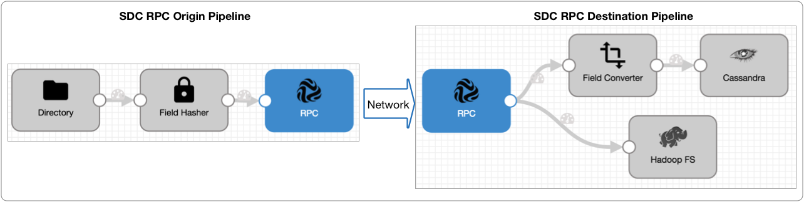
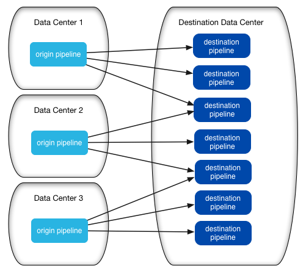

# SDC RPC管道

## SDC RPC管道概述

数据收集器 远程协议调用管道（称为SDC RPC管道）是一组StreamSet管道，可将数据从一个管道传递到另一个管道，而无需写入中间系统。

SDC RPC管道可以在同一台计算机上或通过本地网络或公共Internet互相写入。您可以使用SDC RPC管道在两个数据中心之间安全地发送数据。

通常，管道使用标准来源（例如Directory）并写入标准目的地（例如HBase）。一个SDC RPC管道包括一个SDC RPC目标或一个SDC RPC起点，以便与另一个SDC RPC管道进行通信。

若要使用SDC RPC管道，请创建一个原始管道和一个目标管道。源管道使用SDC RPC目标直接写入目标管道中的SDC RPC源，如下所示：

SDC RPC目标和SDC RPC源使您能够安全地将数据从一个管道传递到另一个管道，就像创建跨网络的单个管道一样。

### 管道类型

您可以创建两种SDC RPC管道：

- 原始管道

  处理来自原始系统的数据，并将其传递到目标管道。

  使用SDC RPC目标将数据传递到目标管道。为了提供冗余和负载平衡，您可以定义到多个目标管道的连接。

- 目标管道

  处理来自原始管道的数据，并将其传递到目标系统。

  使用SDC RPC原点来处理原点管道中的数据。

## 部署架构

使用SDC RPC管道时，在设计部署体系结构时请仔细考虑您的需求和环境。

需要考虑的关键点：

- 使用多个目标管道来提高下游可用性

  为了确保下游可用性，通常需要部署多个目标管道。

  请注意，源管道将数据写入单个目标管道，但可以在多个管道之间循环。通过使用多个目标管道，您可以提供冗余并避免大量原始管道的瓶颈：

  

  如果您有多个具有相似数据的管道，则可以部署此模型的几组以提供负载平衡和冗余：

  

## 配置交付保证

交付保证确定管道何时提交偏移量。为SDC RPC管道配置传递保证时，请在源管道和目标管道中使用相同的选项。

一组SDC RPC管道像处理单个管道一样处理数据：源管道创建批处理，将其通过管道，然后将其传递到目标管道。仅当目标管道将批处理写入其目标系统时，数据收集器才会提交偏移量。与标准管道一样，您可以使用交付保证属性来定义数据收集器如何 提交偏移量：

- 在两个管道中**至少**使用**一次**，以确保管道处理所有数据。
- 在两个管道中**最多**使用**一次**，以避免可能的数据重复。

**注意：**如果将SDC RPC管道配置为使用不同的交付保证，则产生的行为是“最多一次”。

**相关概念**

[交货保证](https://streamsets.com/documentation/controlhub/latest/help/datacollector/UserGuide/Pipeline_Design/DatainMotion.html#concept_ffz_hhw_kq)

## 定义RPC ID

RPC ID是用户定义的标识符，它允许SDC RPC起源和SDC RPC目的地相互识别。

要使SDC RPC目标能够直接写入SDC RPC源，请在两个阶段中使用相同的RPC ID。

要写入多个管道，请在SDC RPC目标和所有相关的SDC RPC起源中使用RPC ID。

## 启用加密

您可以启用SDC RPC管道以使用SSL / TLS安全地传输数据。要使用SSL / TLS，请同时在SDC RPC目标和SDC RPC源中启用TLS。

您需要以下信息才能在两个阶段中都启用TLS：

- 包含TLS证书的私钥的密钥库文件，以及该文件的密码。
- 对于自签名证书，请使用一个信任存储区文件，该文件具有SDC RPC起源的TLS证书的公钥以及该文件的密码。

启用TLS：

1. 将密钥库和信任库文件保存在

   Data Collector

    资源目录

   $ SDC_RESOURCES中

   。

   有关环境变量的更多信息，请参阅 Data Collector 文档中的Data Collector [环境配置](https://streamsets.com/documentation/datacollector/latest/help/#datacollector/UserGuide/Configuration/DCEnvironmentConfig.html)。

2. 在使用自签名证书时，在SDC RPC目标中，输入信任库文件名和密码。

3. 在SDC RPC来源中，输入密钥库文件名和密码。

## SDC RPC管道的配置准则

若要创建一组有效的SDC RPC管道，必须对齐某些配置选项。使用以下准则来配置SDC RPC管道：

- 原始管道

  在原始管道中，配置以下元素：在管道属性中，将“交付保证”设置为要使用的选项。在管道中，使用SDC RPC目标。配置SDC RPC目标时，输入RPC ID和RPC连接信息。要使用多个目标管道，请输入要使用的每个SDC RPC起源的RPC连接信息。要使用加密在管道之间传输数据，请启用TLS并配置相关属性。

- 目标管道

  对于每个目标管道，配置以下元素：在管道属性中，将“交付保证”设置为与原始管道相同的选项。使用其他选项会使数据收集器 默认为“至多一次”行为。在管道中，使用SDC RPC起源。配置SDC RPC原始时，请定义以下属性：使用在SDC RPC目标中使用的相同RPC ID。对于RPC侦听端口，输入适当的端口号。它应该是在SDC RPC目标中的RPC连接之一中指定的端口号。要使用加密在管道之间传输数据，请启用TLS并配置相关属性。