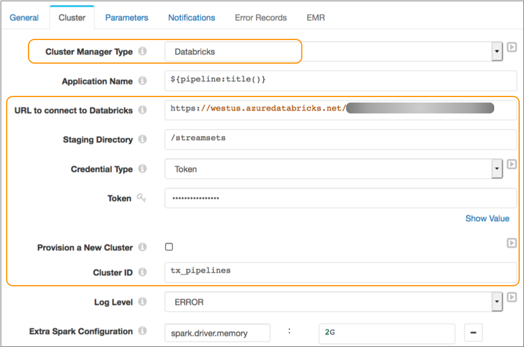
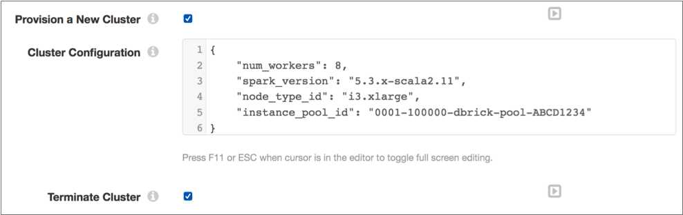
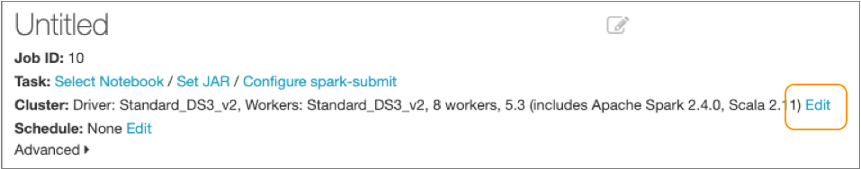
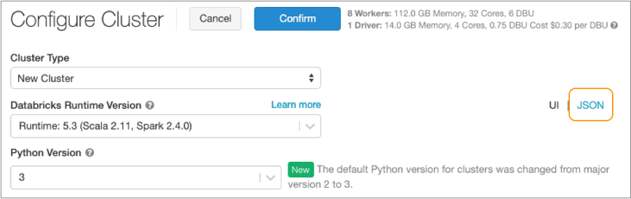
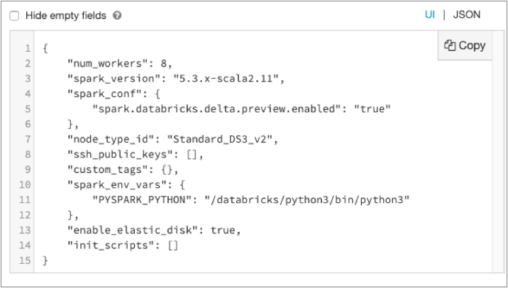
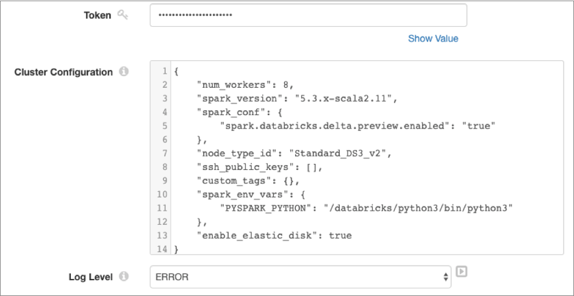

# Databricks上的管道

您可以使用部署在Databricks群集上的Spark 运行Transformer管道。当管道运行时，Spark在群集中的各个节点之间分配处理。

要在Databricks群集上运行管道，请在管道属性的“群集”选项卡上将管道配置为使用Databricks作为群集管理器类型。

Transformer使用Databricks REST API在Databricks群集上执行任务，例如提交Databricks作业以运行管道。

在将管道配置为在Databricks群集上运行时，可以指定要使用的现有交互式群集，也可以让Databricks设置作业群集以运行管道。当您使用Databricks设置群集时，可以选择在管道停止后让Databricks终止群集。

配置管道时，还可以指定用于连接到Databricks帐户的URL和凭据。您可以 在Databricks文件系统（DBFS）中定义[暂存目录](https://streamsets.com/documentation/controlhub/latest/help/transformer/Pipelines/Cluster-Databricks.html#concept_zwf_w4s_rhb)，该[目录](https://streamsets.com/documentation/controlhub/latest/help/transformer/Pipelines/Cluster-Databricks.html#concept_zwf_w4s_rhb)存储StreamSets库和运行管道所需的资源。在配置群集时，还可以定义群集配置属性，例如工作线程数和节点类型。

下图显示了配置为在部署到Microsoft Azure上现有Databricks群集的Spark上运行的管道：



## 现有集群

您可以配置管道以在现有的Databricks交互式群集上运行。在现有交互式群集上运行的所有管道都必须在相同版本的Transformer上构建。

当Databricks群集运行Transformer管道时，Transformer库将安装在群集上，以便其他管道可以使用它们。来自不同版本的Transformer的管道不能在同一Databricks群集上运行。

例如，假设您有一个交互式群集，该群集先前运行的是基于Beta版Transformer的管道。使用Transformer 3.12.0构建新管道时，新管道无法在该群集上运行。

在这种情况下，您可以使用其他现有群集，也可以将管道配置为使用预配置的群集。如果现有群集不再需要运行Beta Transformer管道，则可以从群集中卸载Transformer库，并将其用于较新的Transformer版本。

要在现有的Databricks群集上运行管道，请清除“群集”选项卡上的“配置新群集”属性，然后指定要使用的群集的ID。

### 卸载变压器库


Databricks群集可以一次从一个版本的Transformer运行管道。

例如，假设您有一个交互式群集，该群集先前运行的是基于Beta版Transformer的管道。使用Transformer 3.12.0构建新管道时，新管道无法在该群集上运行。

要使群集能够从其他版本的Transformer运行管道，可以从群集中卸载现有的Transformer库。当您不再希望从其他版本的Transformer运行管道时，请执行此任务。

提供以下详细信息是为了您的方便。如果Databricks工作流程发生变化，请查看[Databricks文档](https://docs.databricks.com/user-guide/libraries.html#uninstall-a-library-from-a-cluster)以获取更新的步骤。

1. 在Databricks工作区中，单击群集名称，然后单击“ **库”**选项卡。

   库列表显示群集上安装的每个库的名称和源目录。

   该变压器库是从已安装的[临时目录](https://streamsets.com/documentation/controlhub/latest/help/transformer/Pipelines/Cluster-Databricks.html#concept_zwf_w4s_rhb)中的管道指定。例如，如果使用默认的`/streamsets`登台目录，则可能会看到如下库列表：

   ```
   dpfs://streamsets/<transformer version>/streamsets-transformer-dist-<version>.jar
   dbfs://streamsets/<transformer version>/streamsets-transformer-<library name>-<version>.jar
   dbfs://streamsets/<transformer version>/streamsets-scala-compiler-<version>.jar
   ...
   ```

2. 在列表中找到并选择Transformer库。

3. 单击**卸载**，然后单击 **确认**。

   您必须重新启动集群才能删除该库。

4. 返回集群详细信息页面，然后单击**重新启动**，然后单击**确认**。

   重新启动群集后，可以从其他版本的Transformer运行管道。

## 预置集群

您可以将管道配置为在预配置群集上运行。在配置群集时，Databricks在管道的初始运行上创建一个新的作业群集。

您可以置备使用实例池的群集。您可以选择让Databricks在管道停止后终止群集。

要为管道设置群集，请使用管道属性的“群集”选项卡上的“设置新群集”属性。然后，定义要使用的群集配置。

要终止已配置的群集，请使用“群集”选项卡上的“终止群集”属性。

### 集群配置

在为管道配置群集时，Databricks会在管道的初始运行时创建一个新的Databricks作业群集。您定义Databricks群集属性以在“群集配置”管道属性中使用。对于所有未在“群集配置”管道属性中定义的Databricks群集属性，Transformer使用Databricks默认值。

需要时，可以通过在“群集配置”管道属性中定义其他群集属性来覆盖Databricks的默认值。例如，要置备使用实例池的群集，可以`instance_pool_id`在“群集配置” 属性中添加和定义该 属性。定义群集配置属性时，请使用Databricks期望的属性名称和值。

群集配置属性以JSON格式定义群集属性。

必须在“群集配置”属性中定义以下Databricks群集属性：

| Databricks群集属性 | 描述                                 |
| :----------------- | :----------------------------------- |
| num_workers        | 集群中的工作节点数。                 |
| spark_version      | Databricks运行时和Apache Spark版本。 |
| node_type_id       | 工作程序节点的类型。                 |

有关其他Databricks群集属性的信息，请参阅[Databricks文档](https://docs.databricks.com/user-guide/clusters/configure.html)。

### 使用实例池

当您配置管道以配置新的Databricks群集时，可以让配置的群集使用现有的实例池。

若要使已调配的群集使用实例池，请将Databricks `instance_pool_id`属性包括在“群集配置”管道属性中，并将其设置为要使用的实例池ID。

例如，以下属性集提供了一个集群来运行使用指定实例池的管道，然后在管道停止后终止集群：



### 在数据块中查找属性

要找到有效的集群配置属性名称和值，请启动您的Databricks工作区并查看用于创建作业集群的属性。

1. 在Databricks工作区的侧栏中，单击“ **作业”**图标，然后单击“ **创建作业”**。

2. 在作业详细信息页面中，单击集群规范旁边的**编辑**：

   

3. 在“ **配置群集”**页面中，选择所需的值，然后单击**JSON**以JSON格式查看规范。

   **重要提示：**请确保您的选择满足[最低要求](https://streamsets.com/documentation/controlhub/latest/help/transformer/Installation/Install-Reqs.html#concept_f3c_k4v_pgb)的变压器。

   

   下图显示了JSON格式的示例集群配置：

   

   使用JSON页面中显示的属性名称和值来定义Transformer管道的集群配置属性和值。您可以将所有属性添加 `init_scripts`到管道群集配置中。

   例如，下图显示了Transformer管道的“ **群集配置”**属性。该属性包含作业集群的整个JSON，但已删除该属性：`init_scripts`

   

## 暂存目录

要在Databricks群集上运行管道，Transformer必须将文件存储在Databricks文件系统（DBFS）上的暂存目录中。

您可以将根目录配置为用作暂存目录。默认的登台目录为 / streamsets。

当管道在现有的交互式群集上运行时，请将管道配置为使用相同的暂存目录，以便在Databricks中创建的每个作业都可以重用存储在该目录中的公用文件。当管道在预配置的作业群集上运行时，最佳做法是使用管道的同一登台目录，但这不是必需的。

Transformer将以下文件存储在暂存目录中：

- 可以跨管道重用的文件

  Transformer在以下目录中存储可跨管道重用的文件，包括Transformer库和JDBC驱动程序之类的外部资源：

  / <目录目录> / streamsets-transformer- <版本>

  例如，如果您将默认登台目录用于Transformer版本 3.12.0，则Transformer会将这些文件存储在以下目录中：

  / streamsets / streamsets-transformer-`3.12.0`

- 每个管道专用的文件

  Transformer在以下目录中存储特定于每个管道的文件，例如管道JSON文件和管道使用的资源文件：

  / <staging_directory> / staging / <pipelineId> / <runId>

  例如，如果使用默认的登台目录并运行名为KafkaToJDBC的管道，则Transformer会将这些文件存储在以下目录中：

  / streamsets / staging / KafkaToJDBC03a0d2cc-f622-4a68-b161-7f2d9a4f3052 / run1557350076328