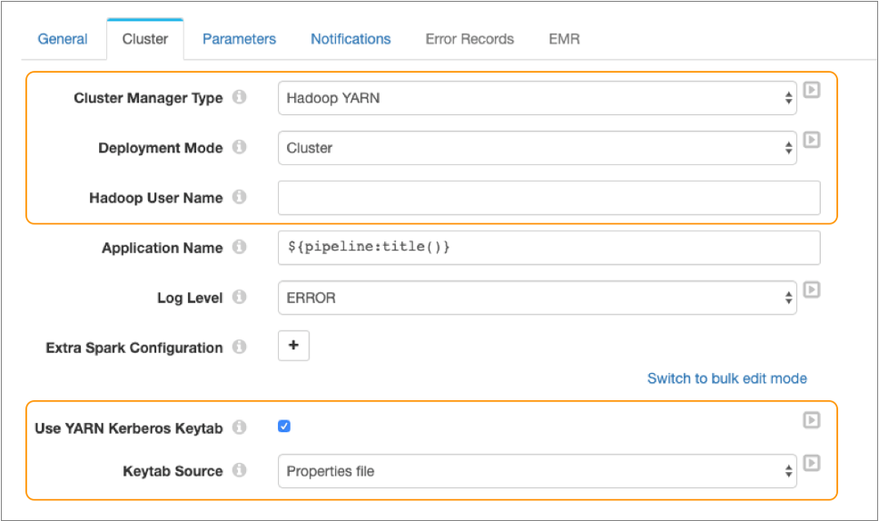

# Hadoop YARN上的管道

您可以使用部署在Hadoop YARN群集上的Spark 运行Transformer管道。当管道运行时，Spark在群集中的各个节点之间分配处理。

要在Hadoop YARN群集上运行管道，请在管道属性的“群集”选项卡上将管道配置为使用Hadoop YARN作为群集管理器类型。

**重要：**在Hadoop YARN集群上运行管道之前，请确保满足[目录要求](https://streamsets.com/documentation/controlhub/latest/help/transformer/Installation/Install-Reqs.html#concept_aky_n3j_l3b)。

当您将管道配置为在Hadoop YARN集群上运行时，您将配置用于启动的应用程序的部署模式。当Transformer不使用Kerberos身份验证并且未配置为[始终模拟启动管道的用户时，](https://streamsets.com/documentation/controlhub/latest/help/transformer/Pipelines/Cluster-Hadoop.html#concept_pqd_3dx_qhb)可以启用Transformer模拟。

下图显示了配置为在部署到Hadoop YARN集群的Spark上运行的管道：



请注意如何将此管道配置为在集群部署模式下运行。由于管道已配置为使用Kerberos身份验证，因此未定义Hadoop用户名。

## 部署方式

Hadoop YARN上的群集管道可以使用以下部署模式之一：

- 客户

  在客户端部署模式下，Spark驱动程序在群集外部的本地计算机上启动。当Transformer计算机与集群工作计算机物理并置时，请使用客户端模式。

- 簇

  在集群部署模式下，Spark驱动程序在集群内部的一个工作节点上远程启动。当Transformer计算机物理上远离工作计算机时，请使用群集模式。在这种情况下，使用群集模式可以最大程度地减少驱动程序和执行程序之间的网络延迟。

**注意：** Spark使用YARN容器作为每个管道的驱动程序。

有关部署模式的更多信息，请参阅[Apache Spark文档。](https://spark.apache.org/docs/latest/submitting-applications.html#launching-applications-with-spark-submit)

## 变压器代理用户

为确保Transformer管道按预期运行，请确保所有Transformer代理用户[对所需目录](https://streamsets.com/documentation/controlhub/latest/help/transformer/Installation/Install-Reqs.html#concept_aky_n3j_l3b)具有[权限](https://streamsets.com/documentation/controlhub/latest/help/transformer/Installation/Install-Reqs.html#concept_aky_n3j_l3b)。

默认情况下，Transformer使用启动管道的用户作为代理用户来启动Spark应用程序并访问Hadoop系统中的文件。

当Transformer使用[Kerberos身份验证时](https://streamsets.com/documentation/controlhub/latest/help/transformer/Pipelines/Cluster-Hadoop.html#concept_uct_3mc_qhb)，可以将各个管道配置为使用Kerberos主体和keytab覆盖默认代理用户。

当Transformer使用未经Kerberos身份验证的[Hadoop模拟时](https://streamsets.com/documentation/controlhub/latest/help/transformer/Pipelines/Cluster-Hadoop.html#concept_pqd_3dx_qhb)，您可以在各个管道中配置Hadoop用户以覆盖默认代理用户（启动管道的用户）。

您可以使用[Transformer配置属性](https://streamsets.com/documentation/controlhub/latest/help/transformer/Pipelines/Cluster-Hadoop.html#concept_pqd_3dx_qhb__property)来防止覆盖代理用户。强烈建议使用此选项。它确保启动管道的用户始终被用作代理用户，并防止用户在管道属性中输入其他用户名。

## Kerberos身份验证

当Hadoop YARN群集使用Kerberos身份验证时，必须[启用Transformer才能使用Kerberos身份验证](https://streamsets.com/documentation/controlhub/latest/help/transformer/Installation/Installing.html#task_qml_wyc_qhb)与群集进行安全通信。

启用Kerberos后，Transformer使用Kerberos主体与Hadoop群集进行通信。除非您为管道配置Kerberos主体和keytab，否则Transformer会将启动管道的用户用作代理用户来启动Spark应用程序并访问Hadoop系统中的文件。

使用Kerberos主体和keytab，Spark可以根据需要续订Kerberos令牌，因此强烈建议使用。

例如，您应该为长时间运行的管道（例如流管道）配置Kerberos主体和密钥表，以便Spark可以续订Kerberos令牌。如果Transformer将代理用户用于运行时间超过Kerberos令牌的最大生存期的管道，则Kerberos令牌将过期，并且无法对代理用户进行身份验证。

有关将Spark应用程序提交到使用Kerberos身份验证的Hadoop集群的更多信息，请参阅[Apache Spark文档](https://spark.apache.org/docs/latest/security.html#kerberos)。

### 为每个管道使用键标签

为Transformer启用Kerberos后，应配置管道以使用Kerberos密钥表并指定密钥表的源。如果您未指定密钥表源，那么Transformer会使用启动管道的用户来启动Spark应用程序并访问Hadoop系统中的文件。

使用keytab时，Transformer使用Kerberos主体启动Spark应用程序并访问Hadoop系统中的文件。Transformer还将在启动的Spark应用程序中包含keytab文件，以便可以由Spark更新Kerberos令牌。

使管道能够使用密钥表时，可以为管道配置以下密钥表源之一：

- 属性文件

  当管道使用属性文件作为密钥表源，管道使用相同的Kerberos密钥表和主要被配置用于变压器中的变压器的配置文件， $ TRANSFORMER_DIST的/ etc / transformer.properties。

  有关在Transformer配置文件中指定Kerberos keytab的信息，请参阅[为Hadoop YARN群集启用Kerberos](https://streamsets.com/documentation/controlhub/latest/help/transformer/Installation/Installing.html#task_qml_wyc_qhb__configFile)。

- 管道配置

  当管道使用管道配置作为密钥表源时，您将定义特定的Kerberos密钥表文件和用于管道的主体。将密钥表文件存储在Transformer机器上。

  在管道属性中，您定义密钥表文件的绝对路径以及用于该密钥表的Kerberos主体。

  为管道定义特定的密钥表和主体，以确保只有授权用户才能访问HDFS文件中存储的数据。

## Hadoop模拟模式

如果将Hadoop YARN群集配置为模拟但未配置为Kerberos身份验证，则可以配置Transformer在Hadoop系统中执行任务时使用的Hadoop模拟模式。  

不使用Kerberos时，Transformer可以按以下方式模拟Hadoop用户：

- 正如用户在管道属性中定义的那样-配置后，Transformer使用指定的Hadoop用户来启动Spark应用程序并访问Hadoop系统中的文件。
- 作为启动管道的当前登录的Transformer用户-当管道属性中未定义Hadoop用户时，Transformer将使用启动管道的用户。

**重要提示：**当[Kerberos身份验证](https://streamsets.com/documentation/controlhub/latest/help/transformer/Pipelines/Cluster-Hadoop.html#concept_uct_3mc_qhb)被启用，变压器假冒的Hadoop用户为变压器谁开始的管道，或直接运行作为管道定义的Kerberos主体用户。启用Kerberos后，Transformer会忽略管道属性中定义的Hadoop用户。

通过启用Transformer配置文件 $ TRANSFORMER_DIST / etc / transformer.properties中的属性，系统管理员可以将Transformer配置为始终使用启动管道的用户 。启用后，不允许在管道中配置Hadoop用户。`hadoop.always.impersonate.current.user`

当您要防止通过管道级属性访问Hadoop系统中的数据时，将Transformer配置为始终模拟为启动管道的用户。

例如，假设您使用角色，组和管道权限来确保只有授权的操作员才能启动管道。您希望操作员用户帐户用于访问所有外部系统。但是管道开发人员可以在管道中指定HDFS用户，并绕过您的安全性尝试。要解决此漏洞，请将Transformer配置 为始终使用启动管道的用户来读取或写入Hadoop系统。

要始终使用启动管道的用户，请在Transformer配置文件中取消注释该 `hadoop.always.impersonate.current.user`属性并将其设置为 true。

### 小写用户名

当Transformer模拟Hadoop用户以在Hadoop系统中执行任务时，您还可以将Transformer配置为小写所有用户名，然后再将其传递给Hadoop。

当Hadoop系统区分大小写并且用户名是小写时，您可以使用此属性将可能返回的大小写混合的用户名转换为小写。

要在将用户名传递给Hadoop之前将其小写，请在Transformer配置文件中取消注释该`hadoop.always.lowercase.user` 属性并将其设置为true。

### 使用HDFS加密区域

Hadoop系统使用Hadoop密钥管理服务器（KMS）来获取加密密钥。要在使用代理用户时启用对HDFS加密区域的访问，请将KMS配置为允许与为HDFS配置的用户模拟相同。

要允许Transformer作为代理用户，请将以下属性添加到KMS配置文件并配置这些属性的值：

- `hadoop.kms.proxyuser..groups`
- `hadoop.kms.proxyuser..hosts`

如果``在Hadoop用户名管道属性中定义了Hadoop用户，或者在未定义Hadoop用户的情况下启动了Transformer的用户在哪里。

例如，使用`tx`Hadoop用户名管道属性中指定的用户身份，以下属性允许Ops组中的用户访问加密区域：

```
<property>
<name>hadoop.kms.proxyuser.tx.groups</name>
<value>Ops</value>
</property>
<property>
<name>hadoop.kms.proxyuser.tx.hosts</name>
<value>*</value>
</property>
```

请注意，星号（*）表示没有限制。

有关配置KMS代理用户的更多信息，请参阅所使用的Hadoop发行版的KMS文档。例如，对于Apache Hadoop，请参阅[KMS Proxyuser配置](https://hadoop.apache.org/docs/current/hadoop-kms/index.html#KMS_Proxyuser_Configuration)。