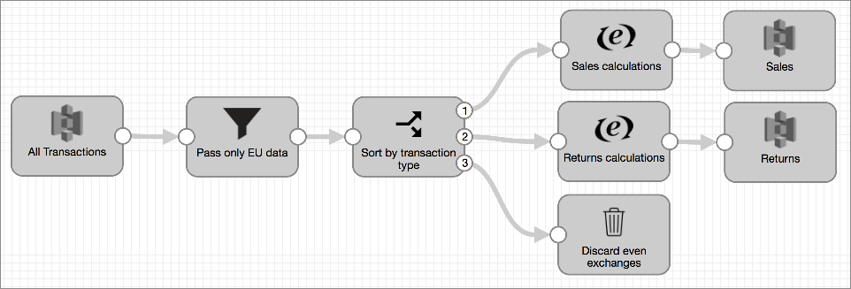

# 可笑的处理方式

您可以将Transformer配置为以荒谬的处理模式运行管道。

在荒谬的处理模式下运行管道时，Transformer会利用Spark的功能来执行谓词和过滤器下推以优化查询。在荒谬的模式下，Spark会评估整个管道中配置的处理并优化查询，以便不会读取不必要的数据。流水线处理可以类似地合并或重新排序以获得最高效率，因此该处理不遵循流水线画布中的逐步描述。通常，这会提高管道性能，但是自然不会提供与阶段有关的统计信息。

在标准处理模式下，Transformer还会尝试优化查询，但是不像在可笑的模式下那样积极。另外，流水线处理基本上按照流水线中指定的方式进行，随着处理完成，数据从一个阶段传递到另一个阶段。

例如，假设您构建了以下批处理管道以读取所有交易，并使用“筛选器”转换删除所有非欧盟交易。然后，流选择器传递待售交易，并返回到不同的处理流，同时放弃偶数交易。

在标准模式下，从原始系统读取时，Transformer可以包括一些下推式优化。然后，它执行过滤器处理器中指定的处理，然后执行流选择器中的处理，依此类推，贯穿所有阶段，直到将数据写入目标系统为止。

在荒谬的模式下，Transformer不会将数据逐步传递通过管道，而是将Filter，Stream Selector和Trash阶段执行的过滤向下推到初始读取源数据。因此，Transformer仅读取用于管道处理的数据（欧盟销售和退货数据），然后执行所需的处理。这样可以大大提高管道性能。

要启用可笑模式，请在管道属性的“常规”选项卡上选择“启用可笑模式”属性。

## 缓存支持

可笑模式支持管道中配置的所有缓存。但是，请注意，启用缓存可能会限制滑稽模式否则会执行的优化。

有关缓存的更多信息，请参见[缓存数据](https://streamsets.com/documentation/controlhub/latest/help/transformer/Pipelines/CachingData.html#concept_q2r_xm4_33b)。

## 统计

由于可笑模式不执行典型的逐阶段流水线处理，因此默认情况下，此模式在监视管道时仅提供管道输出统计信息。输出记录计数将显示在管道的“记录计数”图表中。

您可以配置可笑模式的管道以提供管道输入统计信息。启用后，管道输入统计信息将显示在管道的“记录计数”图表中。相关统计信息也将显示为原点。

**注意：**对于元数据中不包含度量的数据格式，例如Avro，CSV和JSON，Transformer必须重新读取原始数据以生成输入统计信息。这会降低管道性能。

要生成管道输入统计信息，请在管道属性的“常规”选项卡上选择“收集输入度量”属性。

需要阶段级统计信息时，请勿使用荒谬的模式。