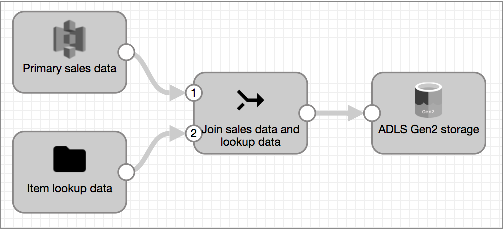

# 执行查询

Transformer提供了几种与系统相关的查找处理器，例如[Delta Lake查找处理器](https://streamsets.com/documentation/controlhub/latest/help/transformer/Processors/DLakeLookup.html#concept_pwp_wt5_w3b)和[Snowflake查找处理器](https://streamsets.com/documentation/controlhub/latest/help/transformer/Processors/SnowflakeLookup.html#concept_dtz_ssv_w3b)。您还可以使用[JDBC查找处理器](https://streamsets.com/documentation/controlhub/latest/help/transformer/Processors/JDBCLookup.html#concept_oz3_wx5_w3b)在数据库表上执行查找。

要从其他系统（例如Amazon S3或文件目录）查找数据，您可以在管道中使用其他来源来读取查找数据。然后，使用[联接处理器](https://streamsets.com/documentation/controlhub/latest/help/transformer/Processors/Join.html#concept_xdr_slq_sgb)将查找数据与主管道数据[联接](https://streamsets.com/documentation/controlhub/latest/help/transformer/Processors/Join.html#concept_xdr_slq_sgb)在一起。

在大多数情况下，在联接处理器中，可以在联接处理器中使用右外部联接类型或左外部联接类型。使用的类型取决于您如何在联接处理器中联接数据。如果管道中的主数据是Join处理器的左输入流，请使用左外部联接类型返回所有主数据，并将附加的查找数据添加到这些记录中。如果主数据是Join处理器的正确输入流，请使用正确的外部联接类型。

必要时，您可以将查找数据连接到多个数据流。您只需要使用一个单独的Join处理器即可将查找原点加入每个流。

根据为管道指定的执行模式，可以不同地配置查找源：

- 批管道执行

  在批处理管道中，主要来源读取一批中的所有主要管道数据，而查询来源则读取一批中的所有查找数据。然后，连接处理器将两个数据集连接起来。

  由于批处理管道仅加入一组批处理，因此查找原点不需要设置任何特定的属性。

- 流管道执行

  在流传输管道中，主要来源处理多个批次的主要管道数据。要将这些批数据与查找数据合并，必须在查找源中启用“仅一次加载数据”属性。

  启用此属性后，查找源将读取一批数据并将其缓存以备重用。然后，每次主原点将新批次传递给Join处理器时，处理器都会将该批次与缓存的查找数据进行联接。**重要说明：** 某些来源提供的属性会限制每个批次的大小。配置查找原点时，请勿限制批处理大小。所有查询数据都应在一个批次中读取。

## 流查询示例

假设您的流水线管道处理包含物料ID的销售数据，并且您想使用这些ID从`Items`文件中检索每个物料的其他数据。为此，您创建以下管道：

您使用以下详细信息来配置管道：

1. 配置一个源以读取主要管道数据，然后将其连接到Join处理器。

   作为连接到Join处理器的第一级，源将数据通过左输入流传递到处理器。

2. 为查询数据配置另一个来源：

   - 在查找源中的“ **常规”**选项卡上，选择“ **仅加载数据一次”**属性。这使原始服务器可以一次读取查询数据并将其缓存以备重用。
   - 某些来源提供的属性会限制每个批次的大小。配置原产地时，请勿限制批次大小。所有查询数据都应在一个批次中读取。

3. 将查询源连接到Join处理器。

   当第二阶段连接到Join处理器时，原点通过正确的输入流将查找数据传递给处理器。

4. 配置加入处理器。

   由于主要管道数据在左输入流中移动，因此请使用左外部联接类型。然后，您为查找指定连接条件，如下所示：

   

5. 配置其余的管道。

### 处理中

当您运行管道时，两个来源都开始处理可用数据。主要来源开始处理主要管道数据，并且查找来源在单个批次中处理和缓存查找数据。

Join处理器根据查找条件将来自原始来源的数据与来自查找来源的数据进行合并，并将结果传递到下游。

当来自主要来源的其他数据传递到Join处理器时，处理器会将数据与缓存的查找数据结合在一起。