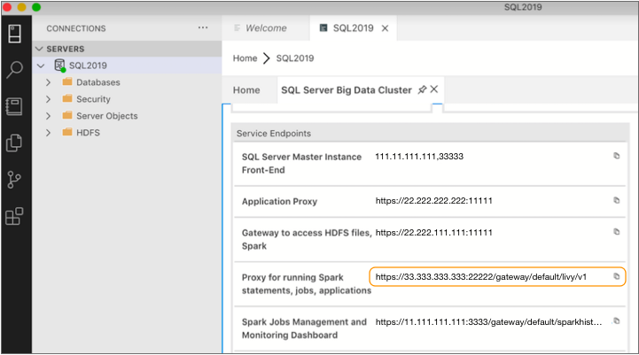

# SQL Server 2019大数据群集上的管道

您可以使用SQL Server 2019大数据群集（BDC）上部署的Spark 运行Transformer管道。当管道运行时，Spark在群集中的各个节点之间分配处理。

SQL Server 2019 BDC使用Apache Livy提交Spark作业。

若要在SQL Server 2019 BDC上运行管道，请在管道属性的``群集''选项卡上将管道配置为使用SQL Server 2019 BDC作为群集管理器类型。

您可以指定Livy端点以及用于通过端点访问集群的用户名和密码。您还可以 在集群中定义[暂存目录](https://streamsets.com/documentation/controlhub/latest/help/transformer/Pipelines/Cluster-Databricks.html#concept_zwf_w4s_rhb)，以存储StreamSets库和运行管道所需的资源。

下图显示了配置为使用SQL Server 2019 BDC上指定Livy端点上部署的Spark运行的管道：


**注意：**首次在SQL Server 2019 BDC上运行管道时，管道启动可能需要5-10分钟。发生这种情况是因为Transformer必须在整个群集中部署Transformer文件。仅应在您第一次在群集上运行 Transformer管道时发生这种情况。

StreamSets提供了一个[快速启动部署脚本](https://streamsets.com/documentation/controlhub/latest/help/transformer/Pipelines/Cluster-SQLServerBDC.html#concept_swq_xsf_1kb)，使您无需附加配置即可轻松尝试将SQL Server 2019 BDC用作Transformer管道的群集管理器。例如，您可以使用脚本尝试将SQL Server 2019 BDC用作群集管理器，但尚未准备好升级到Transformer 3.13.x或更高版本。

## 变压器安装位置

当您使用SQL Server 2019 BDC作为群集管理器时，必须将Transformer安装在允许向群集提交Spark作业的位置。

StreamSets建议在SQL Server 2019 BDC所在的Kubernetes窗格中安装Transformer。

## 检索连接信息

将SQL Server 2019 BDC用作管道的群集管理器时，需要提供以下连接信息：

- 青紫终点

  在SQL服务器2019 BDC李维端点能使提交星火工作。您可以使用命令行或使用客户端应用程序（例如Azure Data Studio）来检索Livy终结点。有关使用命令行的信息，请参阅[SQL Server 2019 BDC文档](https://docs.microsoft.com/en-us/sql/big-data-cluster/deployment-guidance?view=sql-server-ver15#endpoints)。

  在命令行请求的结果中，Livy端点出现在列表的底部：

  

  在Azure Data Studio中，Livy终结点如下所示：

  

  

- 用户名和密码

  对于用户名，请使用SQL Server 2019 BDC控制器用户名，该用户名可以通过Livy端点提交Spark作业。

  控制器用户名可以具有多个密码，以提供对不同功能的访问。要通过Livy端点访问Spark，请使用Knox密码。

  有关控制器用户名和相关密码的更多信息，请参阅[Github上](https://github.com/microsoft/sqlworkshops/blob/45a8a0729c33efe857e27435b82f698a5dcafbed/sqlserver2019bigdataclusters/SQL2019BDC/06 - Security.md#62-authentication-and-authorization)的[SQL Server 2019 BDC研讨会](https://github.com/microsoft/sqlworkshops/blob/45a8a0729c33efe857e27435b82f698a5dcafbed/sqlserver2019bigdataclusters/SQL2019BDC/06 - Security.md#62-authentication-and-authorization)。

## 暂存目录

若要在SQL Server 2019 BDC上运行管道，Transformer必须将文件存储在SQL Server 2019 BDC的暂存目录中。

您可以将根目录配置为用作暂存目录。默认的登台目录为 / streamsets。

Transformer将以下文件存储在暂存目录中：

- 可以跨管道重用的文件

  Transformer在以下目录中存储可跨管道重用的文件，包括Transformer库和JDBC驱动程序之类的外部资源：

  / <目录目录> / streamsets-transformer- <版本>

  例如，如果您将默认登台目录用于Transformer版本 3.12.0，则Transformer会将这些文件存储在以下目录中：

  / streamsets / streamsets-transformer-`3.12.0`

- 每个管道专用的文件

  Transformer在以下目录中存储特定于每个管道的文件，例如管道JSON文件和管道使用的资源文件：

  / <staging_directory> / staging / <pipelineId> / <runId>

  例如，如果使用默认的登台目录并运行名为KafkaToJDBC的管道，则Transformer会将这些文件存储在以下目录中：

  / streamsets / staging / KafkaToJDBC03a0d2cc-f622-4a68-b161-7f2d9a4f3052 / run1557350076328

## 快速入门脚本

StreamSets提供了一个部署脚本，您可以运行该脚本来快速尝试将SQL Server 2019 BDC与StreamSets Control Hub，Transformer和Data Collector结合使用。

该脚本在Kubernetes群集上部署了Control Hub Provisioning代理以及启用了SQL Server 2019 BDC的Transformer和Data Collector。启用了数据收集器以创作SQL Server 2019 BDC管道。该变压器是为创作启用的SQL Server 2019 BDC管道上执行他们的SQL Server 2019 BDC。

仅将脚本用于开发。有关更多信息，请参阅[Github上](https://github.com/streamsets/sql-server-bdc-deployment)的[部署脚本](https://github.com/streamsets/sql-server-bdc-deployment)。

**注意：**如果您已经拥有带有创作数据收集器和注册的Transformer的Control Hub组织，则可以跳过脚本并仅配置管道以使用SQL Server 2019 BDC，如下所示：

- 在Transformer版本3.13.x或更高版本中，您可以选择SQL Server 2019 BDC作为群集管理器类型以运行Transformer管道。

- 在安装了SQL Server 2019 BDC企业阶段库的Data Collector版本3.12.x或更高版本中，可以在Data Collector管道中使用SQL Server 2019 BDC的原始和目标。

  # SQL Server 2019 JDBC连接信息

  

  若要使用JDBC阶段（例如JDBC起源）访问SQL Server 2019大数据群集（BDC），请对JDBC连接字符串使用以下格式：

  ```
  jdbc:sqlserver://<ip>:<port>;databaseName=<database name>
  ```

  - ip-SQL Server主实例的IP地址。
  - port-SQL Server主实例的端口号。
  - 数据库名称-要使用的数据库名称。

  将SQL Server用户名和密码与此连接字符串一起使用。

  ## 检索SQL Server主实例详细信息

  您可以使用命令行或使用客户端应用程序（例如Azure Data Studio）来检索SQL Server主实例IP地址和端口号。有关使用命令行的信息，请参阅[SQL Server 2019 BDC文档](https://docs.microsoft.com/en-us/sql/big-data-cluster/deployment-guidance?view=sql-server-ver15#endpoints)。

  在命令行请求的结果中，IP地址和端口号如下所示：

  

  在Azure Data Studio中，IP地址和端口号如下所示：

  