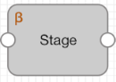

# 技术预览功能

Transformer包含某些带有Technology Preview名称的新功能和阶段。Technology Preview功能可用于开发和测试，但不适用于生产。

当技术预览功能被批准用于生产时，发行说明和文档会反映出更改，并且技术预览图标已从UI中删除。

技术预览阶段在预览阶段的左上角显示“技术预览”图标，如下所示：

当前，Transformer包括以下技术预览阶段：

- Azure SQL目标-将数据写入Azure SQL数据库，Azure SQL数据仓库或本地SQL Server数据库（2008版或更高版本）。
- [雪花来源](https://streamsets.com/documentation/controlhub/latest/help/transformer/Origins/Snowflake.html#concept_vnd_xnp_3jb) -从雪花表中读取数据。
- [Snowflake Looup处理器](https://streamsets.com/documentation/controlhub/latest/help/transformer/Processors/SnowflakeLookup.html#concept_dtz_ssv_w3b) -在Snowflake表上执行查找。
- [雪花目标](https://streamsets.com/documentation/controlhub/latest/help/transformer/Destinations/Snowflake-D.html#concept_ann_hdw_3jb) -将数据写入雪花表。