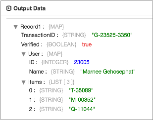

# 自定义架构

读取带分隔符的数据或JSON数据时，可以配置源以使用自定义架构来处理数据。默认情况下，原点从数据推断架构。

您可以使用自定义架构为潜在的模棱两可的字段指定数据类型，例如BigInt用于可能被推断为Integer的字段。推断数据可能需要Transformer对数据进行完整读取，然后再进行处理，以确定歧义字段的正确数据类型，因此使用自定义架构可以提高性能。

您可以使用自定义架构对JSON数据中的字段进行重新排序或对定界数据中的字段进行重命名。处理定界文件或对象时，当文件或对象不包含标题行时，可以使用自定义架构定义字段名称和类型。

谨慎使用自定义架构。当数据包含架构中未定义的字段时，原始记录将删除记录中的字段。当架构包含不在数据中的字段时，原点将在记录中包含这些字段，并使用空值填充它们。

您可以使用JSON或数据定义语言（DDL）格式定义自定义架构。定义架构时，可以为每个字段指定名称和数据类型，以及字段顺序。根据数据的数据格式，自定义架构的应用方式有所不同。

定义自定义架构时，您还可以指定源如何处理解析错误。

## 模式应用

使用自定义架构处理数据时，起源会根据数据的数据格式不同地应用架构：

- 定界数据

  使用自定义架构处理定界数据时，源将架构中的第一个字段名称和数据类型应用于记录中的第一个字段，依此类推。由于将忽略现有字段名称，因此您可以在定义字段的数据类型时重命名它们。

  例如，假设您`ItemID`在自定义模式中将Integer字段定义为第一个字段。处理数据时，`ItemID`不管原始字段名称如何，起源都会命名每个记录中的第一个字段，并将Integer数据类型应用于该字段。

- JSON数据

  使用自定义架构处理JSON数据时，源会根据架构中定义的字段名称在数据中定位字段，然后将指定的数据类型应用于这些字段。原始位置还会根据模式中指定的顺序对字段重新排序。

  例如，假设您将`ItemID`字符串字段定义为自定义架构中的第一个字段。处理数据时，原点会定位该 `ItemID`字段，应用String数据类型，并将其设为结果记录中的第一个字段。

  **注意：**模式中的字段名称必须与数据中的字段名称完全匹配。字段名称区分大小写。

## 错误处理

定义自定义架构时，可以指定源如何处理解析错误。当字段中的数据与架构中指定的数据类型不兼容时，可能会发生分析错误。

您可以使用以下错误处理模式之一：

- 允许-起源在解析记录中的任何字段时遇到问题时，它将创建一个记录，该记录具有在模式中定义的字段名称，但每个字段中的值为空。

  源可以选择将数据从原始记录写入记录中的指定字段。

  将原始记录写入字段时，必须将该字段作为String字段添加到自定义架构中。也就是说，要使原始记录将原始记录写入名为`originalData`的`originalData`字段，请在自定义模式中包括 String字段。

- 格式不正确的删除-当源在解析记录中的任何字段时遇到问题时，它将从管道中删除整个记录。

- 快速失败-当源在解析记录中的任何字段时遇到问题时，它将停止管道。

## DDL架构格式

要使用DDL指定自定义架构，请使用逗号分隔的字段名称和数据类型列表。这是基本结构的示例：

```
<first field name> <data type>, <second field name> <data type>, <third field name> <data type>
```

要定义列表字段，请使用数组数据类型并指定子字段的数据类型，如下所示：

```
<list field name> Array <subfields data type>
```

要定义一个Map字段，请使用Struct数据类型，然后指定子字段的名称和类型，如下所示：

```
<map field name> Struct < <first subfield name>:<data type>, <second subfield name>:<data type> >
```

**提示：**您可以使用反勾（`）来转义可能会误认为保留字的字段名，例如``count``。

### 例

以下DDL自定义架构按顺序包括String，Boolean，Map和List字段：

```
TransactionID String, Verified Boolean, User Struct <ID:Integer, Name:String>, Items Array <String>
```

处理以下JSON数据时：

```
{"Verified":true,"User":{"ID":23005,"Name":"Marnee Gehosephat"},"Items":["T-35089", "M-00352", "Q-11044"],"TransactionID":"G-23525-3350"}
```

原点生成以下记录：



请注意，“ `User`映射”字段具有“整数”和“字符串”子字段，而“ `Items`列表”字段具有“字符串”子字段。还请注意，字段的顺序现在与自定义架构中的顺序匹配。

## JSON模式格式

要使用JSON定义自定义架构，请在使用Struct数据类型的根字段中指定字段名称和数据类型。

**提示：**数据类型必须为小写字母。另外，`nullable` 大多数字段都需要该属性，但是由于未解决的[Spark问题](https://issues.apache.org/jira/browse/SPARK-16472)，该属性允许空值而与配置无关。

这是基本结构的示例：

```
{
  "type": "struct",
  "fields": [
    {
      "name": "<first field name>",
      "type": "<data type>",
      "nullable": <true|false>
    },
    {
      "name": "<second field name>",
      "type": "<data type>",
      "nullable": <true|false>
    }
  ]
}
```

要定义列表字段，请使用数组数据类型并指定子字段的数据类型，如下所示：

```
{
  "name": "<list field name>",
  "type": {
     "type": "array",
     "elementType": "<subfield data type>",
     "containsNull": <true|false>
}
```

要定义Map字段，请使用Struct类型，然后按如下所示定义子字段：

```
{
  "name": "<map field name>",
  "type": {
    "type": "struct",
    "fields": [ {
      "name": "<first subfield name>",
      "type": "<data type>",
      "nullable": <true|false>
       }, {
        "name": "<second subfield name>",
        "type": "<data type>",
        "nullable": <true|false>
        } ] },
  "nullable": <true|false>
}
```

### 例

以下JSON自定义架构按顺序包括String，Boolean，Map和List字段：

```
{
  "type": "struct",
  "fields": [
    {
      "name": "TransactionID",
      "type": "string",
      "nullable": false
    },
    {
      "name": "Verified",
      "type": "boolean",
      "nullable":false
    },
     {
    "name": "User",
    "type": {
      "type": "struct",
      "fields": [ {
        "name": "ID",
        "type": "long",
        "nullable": true
      }, {
        "name": "Name",
        "type": "string",
        "nullable": true
      } ] },
    "nullable": true
    },
    {
      "name": "Items",
      "type": {
        "type": "array",
        "elementType": "string",
        "containsNull": true},
        "nullable":true
     }
   ]
}
```

处理以下JSON数据时：

```
{"Verified":true, "Items":["T-35089", "M-00352", "Q-11044"], "TransactionID":"G-23525-3350", "User":{"ID":23005,"Name":"Marnee Gehosephat"}}
```

原点生成以下记录：


请注意，“ `User`映射”字段具有“整数”和“字符串”子字段，而“ `Items`列表”字段具有“字符串”子字段。还请注意，字段的顺序现在与自定义架构中的顺序匹配。