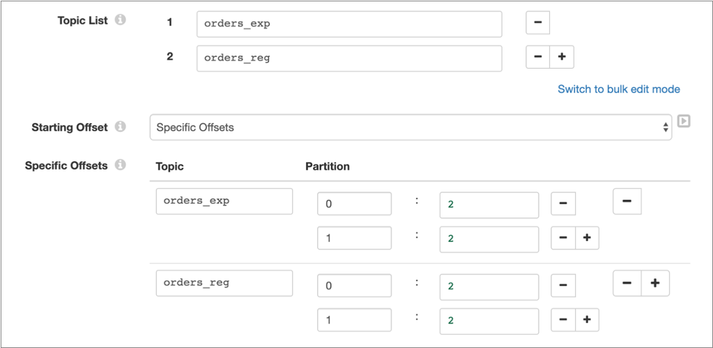
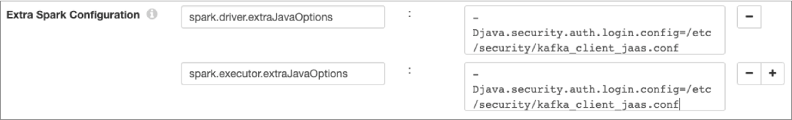

# 卡夫卡

Kafka来源从Apache Kafka集群中的一个或多个主题读取数据。批处理中的所有消息都必须使用相同的架构。该源支持Apache Kafka 0.10和更高版本。

Kafka来源可以从Kafka主题列表或与基于Java的正则表达式中定义的模式匹配的主题中读取消息。阅读第一批中的主题时，来源可以从第一条消息，最后一条消息或分区中的特定位置开始。在随后的批次中，原点从最后保存的偏移量开始。

在配置Kafka原点时，您可以指定该原点最初可以连接到的Kafka代理，原点读取的主题以及从何处开始读取每个主题。您还可以指定从每个批次的任何分区读取的最大消息数。

您选择数据的数据格式并配置相关属性。处理定界数据或JSON数据时，您可以定义一个自定义架构来读取数据并配置相关属性。

对于在本地运行或在Hadoop集群上运行的管道，您还可以配置源以安全地连接到Kafka。

您可以将源配置为仅加载一次数据，并缓存数据以在整个管道运行中重复使用。或者，您可以配置源以缓存每一批数据，以便可以将其有效地传递到多个下游批次。 您还可以将原点配置为[跳过跟踪偏移量](https://streamsets.com/documentation/controlhub/latest/help/transformer/Pipelines/Offsets.html#concept_qqc_xsx_gjb)，从而可以在每次启动管道时读取整个数据集。

## 分区

与运行其他任何应用程序一样，Spark运行Transformer管道，将数据拆分为多个分区，并在分区上并行执行操作。 Spark根据流水线的来源确定如何将流水线数据拆分为初始分区。

对于Kafka来源，Spark根据要读取的Kafka主题中的分区数确定分区。

例如，如果将Kafka来源配置为从10个主题中读取，每个主题都有5个分区，那么Spark会创建总共50个分区以从Kafka中读取。

除非处理器使Spark乱序处理数据，否则Spark会在整个管道中使用这些分区。当您需要更改管道中的分区时，请使用[Repartition处理器](https://streamsets.com/documentation/controlhub/latest/help/transformer/Processors/Repartition.html#concept_cm5_lfg_wgb)。

## 主题规范


Kafka来源从您指定的一个或多个主题中读取消息中的数据。

使用以下方法之一指定要阅读的主题：

- 主题清单

  从您的Kafka集群添加主题列表。例如，假设您希望起点阅读两个名为orders_exp和orders_reg的主题。配置原点时，清除“使用主题模式”属性，然后在“主题列表”属性中，添加以下两个主题：orders_exporders_reg

- 主题模式

  指定一个基于Java的正则表达式，用于标识Kafka集群中的主题。例如，假设您的集群有四个名为cust_east，cust_west，orders_exp和orders_reg的主题。要阅读两个主题cust_east和cust_west，可以使用一个表达式。选择使用主题模式属性，然后在主题模式属性中，输入Java表达式c+。使用此配置，如果您以后将主题cust_north添加到集群中，则原始服务器将自动读取新主题。

## 偏移量


在Kafka主题中，偏移量标识分区中的消息。在配置Kafka原点时，您定义起始偏移量以指定要在主题的每个分区中读取的第一条消息。

使用以下方法之一来标识起始偏移量：

- 最早的

  源从每个主题的每个分区中的第一条消息开始读取所有可用消息。

- 最新

  源读取每个主题的每个分区中的最后一条消息，并在管道启动后读取添加到这些主题的任何后续消息。

- 具体抵销

  源读取从每个主题中每个分区的指定偏移量开始的消息。如果未为主题中的分区指定偏移量，则原点将返回错误。

批量读取最后一条消息时，原点会保存该消息的偏移量。在随后的批处理中，起点将从下一条消息开始读取。

例如，假设您的Kafka主题orders_exp和orders_reg具有两个分区0和1。要从第三个消息2开始从分区中读取来源，请按以下方式配置来源：



## 启用安全性

对于在本地运行或在Hadoop集群上运行的管道，可以将Kafka来源配置为使用以下安全选项之一安全地连接到Kafka：

- [SSL / TLS加密](https://streamsets.com/documentation/controlhub/latest/help/transformer/Origins/Kafka.html#task_xtr_z11_phb)
- [SSL / TLS加密和身份验证](https://streamsets.com/documentation/controlhub/latest/help/transformer/Origins/Kafka.html#task_ecj_j21_phb)
- [Kerberos身份验证](https://streamsets.com/documentation/controlhub/latest/help/transformer/Origins/Kafka.html#task_gb2_vh1_phb)
- [SSL / TLS上的Kerberos身份验证](https://streamsets.com/documentation/controlhub/latest/help/transformer/Origins/Kafka.html#task_oln_gk1_phb)

目前，当管道在Databricks群集上运行时，您将无法启用Kafka安全性。

### 启用SSL / TLS加密

当Kafka群集使用Kafka SSL安全协议时，请启用Kafka来源以使用SSL / TLS加密。

1. 确保按照[Kafka文档](http://kafka.apache.org/documentation.html#security_ssl)中的[说明](http://kafka.apache.org/documentation.html#security_ssl)为SSL / TLS配置了Kafka集群 。

2. 将为Kafka客户端创建的信任库文件存储在Transformer计算机上以及群集中每个节点上的相同位置 。

   例如，您可以将文件存储在每台计算机上的以下位置：

   /var/private/ssl/kafka.client.truststore.jks

3. 在阶段的“ **Kafka”**选项卡上，将每个Kafka代理URI配置为使用SSL / TLS端口。

   默认的SSL / TLS端口号为9093。

4. 在“ **安全性”**选项卡上，配置以下属性：

   | 担保财产   | 描述                                                         |
   | :--------- | :----------------------------------------------------------- |
   | 安全选项   | 设为SSL/TLS Encryption (Security Protocol=SSL)。             |
   | 信任库文件 | 存储在Transformer计算机和群集中每个节点上相同位置的信任库文件的绝对路径。例如，您可以输入以下路径：/var/private/ssl/kafka.client.truststore.jks |
   | 信任库密码 | 信任库文件的密码。**提示：**为了保护敏感信息，可以按照Data Collector文档中的说明使用 [运行时资源](https://streamsets.com/documentation/datacollector/latest/help/datacollector/UserGuide/Pipeline_Configuration/RuntimeValues.html#concept_bs4_5nm_2s)或[凭据存储](https://streamsets.com/documentation/datacollector/latest/help/datacollector/UserGuide/Configuration/CredentialStores.html#concept_bt1_bpj_r1b)。 |

### 启用SSL / TLS加密和身份验证

当Kafka群集使用Kafka SSL安全协议并需要客户端身份验证时，请启用Kafka来源以使用SSL / TLS加密和身份验证。

1. 确保按照[Kafka文档](http://kafka.apache.org/documentation.html#security_ssl)中的说明为Kafka群集配置SSL / TLS和客户端身份验证。

2. 将为Kafka客户端创建的信任库和密钥库文件存储在Transformer计算机上以及群集中每个节点上的相同位置。

   例如，您可以将文件存储在每台计算机上的以下位置：

   - /var/private/ssl/kafka.client.truststore.jks
   - /var/private/ssl/kafka.client.keystore.jks

3. 在阶段的“ **Kafka”**选项卡上，将每个Kafka代理URI配置为使用SSL / TLS端口。

   默认的SSL / TLS端口号为9093。

4. 在“ **安全性”**选项卡上，配置以下属性：

   | 担保财产   | 描述                                                         |
   | :--------- | :----------------------------------------------------------- |
   | 安全选项   | 设为SSL/TLS Encryption and Authentication (Security Protocol=SSL)。 |
   | 信任库文件 | 存储在Transformer计算机和群集中每个节点上相同位置的信任库文件的绝对路径。例如，您可以输入以下路径：/var/private/ssl/kafka.client.truststore.jks |
   | 信任库密码 | 信任库文件的密码。**提示：**为了保护敏感信息，可以按照Data Collector文档中的说明使用 [运行时资源](https://streamsets.com/documentation/datacollector/latest/help/datacollector/UserGuide/Pipeline_Configuration/RuntimeValues.html#concept_bs4_5nm_2s)或[凭据存储](https://streamsets.com/documentation/datacollector/latest/help/datacollector/UserGuide/Configuration/CredentialStores.html#concept_bt1_bpj_r1b)。 |
   | 密钥库文件 | 存储在Transformer计算机上和群集中每个节点上相同位置的密钥库文件的绝对路径。例如，您可以输入以下路径：/var/private/ssl/kafka.client.keystore.jks |
   | 密钥库密码 | 密钥库文件的密码。**提示：**为了保护敏感信息，可以按照Data Collector文档中的说明使用 [运行时资源](https://streamsets.com/documentation/datacollector/latest/help/datacollector/UserGuide/Pipeline_Configuration/RuntimeValues.html#concept_bs4_5nm_2s)或[凭据存储](https://streamsets.com/documentation/datacollector/latest/help/datacollector/UserGuide/Configuration/CredentialStores.html#concept_bt1_bpj_r1b)。 |

### 启用Kerberos身份验证

当Kafka群集使用Kafka SASL_PLAINTEXT安全协议时，请使Kafka原始服务器使用Kerberos身份验证。

1. 确保按照[Kafka文档](http://kafka.apache.org/documentation.html#security_sasl)中的[说明](http://kafka.apache.org/documentation.html#security_sasl)为Kerberos（SASL）配置Kafka集群。

2. 对于在为Kerberos配置的Hadoop YARN集群上运行的管道，请确保为Transformer启用了[Kerberos身份验证](https://streamsets.com/documentation/controlhub/latest/help/transformer/Pipelines/Cluster-Hadoop.html#concept_uct_3mc_qhb)。

3. 创建一个Java身份验证和授权服务（JAAS）配置文件，其中包含Kafka客户端所需的配置属性。

   将以下`KafkaClient`登录部分添加到文件中：

   ```
   KafkaClient {
      com.sun.security.auth.module.Krb5LoginModule required
      useKeyTab=true
      keyTab="<keytab path>"
      storeKey=true
      useTicketCache=false
      principal="<principal name>/<host name>@<realm>";
   };
   ```

   例如：

   ```
   KafkaClient {
      com.sun.security.auth.module.Krb5LoginModule required
      useKeyTab=true
      keyTab="/etc/security/keytabs/kafka_client.keytab"
      storeKey=true
      useTicketCache=false
      principal="kafka/node-1.cluster@EXAMPLE.COM";
   };
   ```

4. 将为Kafka客户端创建的JAAS文件和keytab文件存储在Transformer计算机上以及群集中每个节点上的相同位置。

5. 编辑$ TRANSFORMER_DIST / libexec / transformer-env.sh文件，以修改TRANSFORMER_JAVA_OPTS环境变量，以定义JAAS配置文件的路径。

   修改环境变量，如下所示：

   ```
   export TRANSFORMER_JAVA_OPTS="-Xmx1024m -Xms1024m -server -XX:-OmitStackTraceInFastThrow -Djava.security.auth.login.config=<JAAS config path>/kafka_client_jaas.conf ${TRANSFORMER_JAVA_OPTS}"
   ```

   从命令提示符处重新启动Transformer，以启用对converter-env.sh文件的更改 。

6. 在阶段的“ **安全性”**选项卡上，配置以下属性：

   | 担保财产         | 描述                                                         |
   | :--------------- | :----------------------------------------------------------- |
   | 安全选项         | 设为Kerberos Authentication (Security Protocol=SASL_PLAINTEXT)。选中后， Transformer会将Kafka SASL机制设置为GSSAPI。Transformer不支持SASL机制的PLAIN（用户名/密码）。 |
   | Kerberos服务名称 | Kafka代理运行时使用的Kerberos服务主体名称。                  |

7. 在管道属性的“ **群集”**选项卡上，在“ **额外Spark配置”**下添加以下其他配置属性：

   - `spark.driver.extraJavaOptions`
   - `spark.executor.extraJavaOptions`

   将这两个属性都设置为Transformer计算机上JAAS配置文件的路径。例如：

   

### 在SSL / TLS上启用Kerberos身份验证

当Kafka群集使用Kafka SASL_SSL安全协议时，请使Kafka起源在SSL / TLS上使用Kerberos身份验证。

1. 确保按照[Kafka SSL / TLS文档](http://kafka.apache.org/documentation.html#security_ssl)和[Kafka Kerberos文档中的](http://kafka.apache.org/documentation.html#security_sasl)[说明](http://kafka.apache.org/documentation.html#security_ssl)将 [Kafka](http://kafka.apache.org/documentation.html#security_sasl)配置为使用SSL / TLS和Kerberos（SASL）。

2. 对于在为Kerberos配置的Hadoop YARN集群上运行的管道，请确保为Transformer启用了[Kerberos身份验证](https://streamsets.com/documentation/controlhub/latest/help/transformer/Pipelines/Cluster-Hadoop.html#concept_uct_3mc_qhb)。

3. 创建一个Java身份验证和授权服务（JAAS）配置文件，其中包含Kafka客户端所需的配置属性。

   将以下`KafkaClient`登录部分添加到文件中：

   ```
   KafkaClient {
      com.sun.security.auth.module.Krb5LoginModule required
      useKeyTab=true
      keyTab="<keytab path>"
      storeKey=true
      useTicketCache=false
      principal="<principal name>/<host name>@<realm>";
   };
   ```

   例如：

   ```
   KafkaClient {
      com.sun.security.auth.module.Krb5LoginModule required
      useKeyTab=true
      keyTab="/etc/security/keytabs/kafka_client.keytab"
      storeKey=true
      useTicketCache=false
      principal="kafka/node-1.cluster@EXAMPLE.COM";
   };
   ```

4. 将以下文件存储在Transformer计算机上和群集中的每个节点上的相同位置：

   - JAAS配置文件
   - 为Kafka客户端创建的Keytab文件
   - 为Kafka客户端创建的Truststore文件

5. 编辑$ TRANSFORMER_DIST / libexec / transformer-env.sh文件，以修改TRANSFORMER_JAVA_OPTS环境变量，以定义JAAS配置文件的路径。

   修改环境变量，如下所示：

   ```
   export TRANSFORMER_JAVA_OPTS="-Xmx1024m -Xms1024m -server -XX:-OmitStackTraceInFastThrow -Djava.security.auth.login.config=<JAAS config path>/kafka_client_jaas.conf ${TRANSFORMER_JAVA_OPTS}"
   ```

   从命令提示符处重新启动Transformer，以启用对converter-env.sh文件的更改 。

6. 在阶段的“ **Kafka”**选项卡上，将每个Kafka代理URI配置为使用SSL / TLS端口。

   默认的SSL / TLS端口号为9093。

7. 在“ **安全性”**选项卡上，配置以下属性：

   | 担保财产         | 描述                                                         |
   | :--------------- | :----------------------------------------------------------- |
   | 安全选项         | 设为Kerberos Authentication on SSL/TLS (Security Protocol=SASL_SSL)。 |
   | Kerberos服务名称 | Kafka代理运行时使用的Kerberos服务主体名称。                  |
   | 信任库文件       | 存储在Transformer计算机和群集中每个节点上相同位置的信任库文件的绝对路径。例如，您可以输入以下路径：/var/private/ssl/kafka.client.truststore.jks |
   | 信任库密码       | 信任库文件的密码。**提示：**为了保护敏感信息，可以按照Data Collector文档中的说明使用 [运行时资源](https://streamsets.com/documentation/datacollector/latest/help/datacollector/UserGuide/Pipeline_Configuration/RuntimeValues.html#concept_bs4_5nm_2s)或[凭据存储](https://streamsets.com/documentation/datacollector/latest/help/datacollector/UserGuide/Configuration/CredentialStores.html#concept_bt1_bpj_r1b)。 |

8. 在管道属性的“ **群集”**选项卡上，在“ **额外Spark配置”**下添加以下其他配置属性：

   - `spark.driver.extraJavaOptions`
   - `spark.executor.extraJavaOptions`

   将这两个属性都设置为Transformer计算机上JAAS配置文件的路径。例如：

   

## 资料格式

Kafka原点根据指定的数据格式生成记录。

原点可以读取以下数据格式：

- 阿夫罗

  来源为每条消息生成一条记录。**注意：**要使用Avro数据格式，必须在Transformer计算机和群集中的每个节点上安装Apache Spark 2.4或更高版本。您可以使用以下方法之一来指定Avro模式定义的位置：**在“管道配置”中** -使用在阶段属性中定义的架构。**Confluent Schema Registry-**从Confluent Schema Registry检索架构。Confluent Schema Registry是Avro架构的分布式存储层。您可以指定Confluent Schema Registry的URL，以及是否通过架构ID或主题查找架构。

- 定界

  来源为每条消息生成一条记录。您可以指定数据中使用的自定义定界符，引号和转义符。

  默认情况下，原点名称为第一个字段`_c0`，第二个字段`_c1`，依此类推。默认情况下，起源还从数据推断数据类型。您可以使用Field Renamer处理器重命名下游的字段，也可以在源中指定自定义架构。

  指定[自定义架构时](https://streamsets.com/documentation/controlhub/latest/help/transformer/Origins/CustomSchemas.html#concept_ntb_ttd_hhb)，源将使用[架构中定义](https://streamsets.com/documentation/controlhub/latest/help/transformer/Origins/CustomSchemas.html#concept_ntb_ttd_hhb)的字段名称和数据类型，将架构中的第一个字段应用于记录中的第一个字段，依此类推。

  默认情况下，当原点遇到解析错误时，它将停止管道。使用自定义架构处理数据时，原始服务器根据配置的[错误处理来](https://streamsets.com/documentation/controlhub/latest/help/transformer/Origins/CustomSchemas.html#concept_ywp_xct_hhb)处理解析错误。

- JSON格式

  来源为每条消息生成一条记录。

  默认情况下，源使用消息中的字段名称，字段顺序和数据类型。

  指定[自定义架构时](https://streamsets.com/documentation/controlhub/latest/help/transformer/Origins/CustomSchemas.html#concept_ntb_ttd_hhb)，源将架构中的字段名称与数据中的字段名称匹配，然后应用架构中定义的数据类型和字段顺序。

  默认情况下，当原点遇到解析错误时，它将停止管道。使用自定义架构处理数据时，原始服务器根据配置的[错误处理来](https://streamsets.com/documentation/controlhub/latest/help/transformer/Origins/CustomSchemas.html#concept_ywp_xct_hhb)处理解析错误。

- 文本

  来源为每条消息生成一条记录。

  该记录包括一个名为字段的`Value`位置，该字段在原点写入字符串数据。

## 配置卡夫卡原点


配置Kafka来源以从Apache Kafka集群中的主题读取数据。

1. 在“属性”面板上的“ **常规”**选项卡上，配置以下属性：

   | 一般财产                                                     | 描述                                                         |
   | :----------------------------------------------------------- | :----------------------------------------------------------- |
   | 名称                                                         | 艺名。                                                       |
   | 描述                                                         | 可选说明。                                                   |
   | 舞台库                                                       | 用于连接到Kafka的舞台库：Kafka群集提供的库-运行管道的群集已安装Kafka库，因此具有运行管道的所有必需的库。Kafka Transformer提供的库-Transformer将必要的库与管道一起传递，以使管道能够运行。在本地运行管道或运行管道的群集不包含Kafka库时使用。**注意：**在管道中使用其他Kafka阶段时，请确保它们使用[相同的阶段库](https://streamsets.com/documentation/controlhub/latest/help/transformer/Pipelines/Pipeline-StageLibMatch.html#concept_r4g_n3x_shb)。 |
   | 仅加载一次数据                                               | 批量读取数据并缓存结果以备重用。用于在流执行模式管道中[执行查找](https://streamsets.com/documentation/controlhub/latest/help/transformer/Pipelines/Lookups.html#concept_f2z_5yw_g3b)。使用原点执行查找时， 请勿限制批处理大小。所有查询数据都应在一个批次中读取。在批处理执行模式下，将忽略此属性。 |
   | [缓存数据](https://streamsets.com/documentation/controlhub/latest/help/transformer/Pipelines/CachingData.html#concept_q2r_xm4_33b) | 缓存处理后的数据，以便可以在多个下游阶段重用该数据。当阶段将数据传递到多个阶段时，用于提高性能。当管道以[荒谬的方式](https://streamsets.com/documentation/controlhub/latest/help/transformer/Pipelines/Ludicrous.html#concept_m4y_lbq_g3b)运行时，缓存会限制下推式优化。未启用“仅一次加载数据”时可用。当原点一次加载数据时，它也会缓存数据。 |
   | 跳过偏移跟踪                                                 | 跳过跟踪偏移量。在流传输管道中，这导致读取每个批次中的所有可用数据。在批处理管道中，这导致每次管道启动时都读取所有可用数据。 |

2. 在“ **卡夫卡”**选项卡上，配置以下属性：

   | 卡夫卡房地产                                                 | 描述                                                         |
   | :----------------------------------------------------------- | :----------------------------------------------------------- |
   | 经纪人URI                                                    | 用于与Kafka集群建立初始连接的主机和端口的逗号分隔列表。使用以下格式：<host1>:<port1>,<host2>:<port2>,…建立连接后，此阶段将发现可用经纪人的完整集合。 |
   | [比赛主题模式](https://streamsets.com/documentation/controlhub/latest/help/transformer/Origins/Kafka.html#concept_hz5_ck1_wgb) | 使来源能够根据正则表达式查找要阅读的主题。不使用时，输入主题列表。 |
   | 主题模式                                                     | 基于Java的正则表达式（regex），用于指定要阅读的主题。当您基于模式指定主题时可用。 |
   | 主题清单                                                     | 要阅读的Kafka主题列表。单击 **添加**图标以添加其他主题。不基于模式指定主题时可用。 |
   | [开始偏移](https://streamsets.com/documentation/controlhub/latest/help/transformer/Origins/Kafka.html#concept_pq5_mq1_wgb) | 确定要阅读的第一条消息的方法：最早-从每个主题的第一条消息开始读取消息。最新-从每个主题的最后一条消息开始读取消息。特定偏移-对于每个主题，从指定的分区和位置读取消息。 |
   | 特定偏移                                                     | 当起始偏移量是特定偏移量时，在主题和分区中读取的第一条消息的位置。对于第一个主题，输入主题名称，然后根据需要单击“ **添加分区”**图标，以添加用于指定主题的分区名称和起始位置的字段。对于其他主题，请单击“ **添加主题”**图标以添加另一个主题字段，然后 根据需要单击“ **添加分区”**图标以添加用于指定分区名称和每个主题中的起始位置的字段。您必须为主题中的每个分区指定偏移量。 |
   | 每个分区的最大邮件数                                         | 在每个批次中，源从主题中的每个分区读取的最大消息数。对于[批处理管道](https://streamsets.com/documentation/controlhub/latest/help/transformer/Pipelines/ExecutionMode.html#concept_lgy_24q_qgb)，此属性确定每个管道运行中处理的消息总数。对于流传输管道，此属性确定一次处理的消息数。 |

3. 在“ **安全性”**选项卡上，配置安全性属性以允许源安全地连接到Kafka。

   有关安全性选项和启用安全性所需的其他步骤的信息，请参阅“ [启用安全性”](https://streamsets.com/documentation/controlhub/latest/help/transformer/Origins/Kafka.html#concept_fbg_c11_phb)。

4. 在“ **数据格式”**选项卡上，配置以下属性：

   | 数据格式属性                                                 | 描述                                                         |
   | :----------------------------------------------------------- | :----------------------------------------------------------- |
   | [资料格式](https://streamsets.com/documentation/controlhub/latest/help/transformer/Origins/Kafka.html#Kafka-DataFormats) | Kafka消息中的数据格式。选择以下格式之一：Avro（Spark 2.4或更高版本）定界JSON格式文本 |

5. 对于Avro数据，请单击“ **架构”**选项卡并配置以下属性：

   | Avro物业      | 描述                                                         |
   | :------------ | :----------------------------------------------------------- |
   | Avro模式位置  | 处理数据时要使用的Avro模式定义的位置：在“管道配置”中-使用“ Avro架构”属性中指定的架构。Confluent Schema Registry-从Confluent Schema Registry检索架构。 |
   | Avro模式      | 用于处理数据的Avro模式定义。覆盖与数据关联的任何现有模式定义。您可以选择使用该 `runtime:loadResource`函数来使用存储在运行时资源文件中的架构定义。 |
   | 架构注册表URL | 汇合的架构注册表URL，用于查找架构。要添加网址，请点击**添加**。使用以下格式输入URL：`http://:` |
   | 查找架构      | 在Confluent Schema Registry中查找架构的方法：主题-查找指定的Avro模式主题。架构ID-查找指定的Avro架构ID。 |
   | 模式主题      | Avro架构需要在Confluent Schema Registry中查找。如果指定的主题具有多个架构版本，则源使用该主题的最新架构版本。要使用旧版本，请找到相应的架构ID，然后将“ **查找架构**依据 **”**属性设置为“架构ID”。 |
   | 架构编号      | 在Confluent Schema Registry中查找的Avro模式ID。              |

6. 对于定界数据，在“ **数据格式”**选项卡上，可以选择配置以下属性：

   | 定界财产 | 描述                                                         |
   | :------- | :----------------------------------------------------------- |
   | 分隔符   | 数据中使用的分隔符。选择一个可用选项，或选择“其他”以输入自定义字符。您可以输入使用格式为Unicode控制符\uNNNN，其中*ñ*是数字0-9或字母AF十六进制数字。例如，输入 \u0000以使用空字符作为分隔符或 \u2028使用行分隔符作为分隔符。 |
   | 引用字符 | 数据中使用的引号字符。                                       |
   | 转义符   | 数据中使用的转义符                                           |
   | 包括标题 | 指示数据包括标题行。选中后，原点将使用第一行创建字段名称，并从第二行开始读取。 |

7. 要将[自定义模式](https://streamsets.com/documentation/controlhub/latest/help/transformer/Origins/CustomSchemas.html#concept_ntb_ttd_hhb)用于定界或JSON数据，请单击“ **模式”**选项卡并配置以下属性：

   | 架构属性                                                     | 描述                                                         |
   | :----------------------------------------------------------- | :----------------------------------------------------------- |
   | 模式模式                                                     | 确定处理数据时要使用的架构的模式：从数据推断原点从数据中推断出字段名称和数据类型。使用自定义架构-DDL格式源使用以DDL格式定义的 [自定义架构](https://streamsets.com/documentation/controlhub/latest/help/transformer/Origins/CustomSchemas.html#concept_ntb_ttd_hhb)。使用自定义架构-JSON格式源使用以JSON格式定义的 [自定义架构](https://streamsets.com/documentation/controlhub/latest/help/transformer/Origins/CustomSchemas.html#concept_ntb_ttd_hhb)。请注意，根据数据的数据格式，[应用模式的方式有所](https://streamsets.com/documentation/controlhub/latest/help/transformer/Origins/CustomSchemas.html#concept_a14_hnx_jhb)不同。 |
   | 架构图                                                       | 用于处理数据的自定义架构。根据所选的架构模式，以[DDL](https://streamsets.com/documentation/controlhub/latest/help/transformer/Origins/CustomSchemas.html#concept_oqw_pgm_hhb)或[JSON](https://streamsets.com/documentation/controlhub/latest/help/transformer/Origins/CustomSchemas.html#concept_pzp_sfm_hhb)格式输入架构。 |
   | [错误处理](https://streamsets.com/documentation/controlhub/latest/help/transformer/Origins/CustomSchemas.html#concept_ywp_xct_hhb) | 确定原点如何处理解析错误：允许-起源在解析记录中的任何字段时遇到问题时，它将创建一个记录，该记录具有在模式中定义的字段名称，但每个字段中的值为空。格式不正确的删除-当源在解析记录中的任何字段时遇到问题时，它将从管道中删除整个记录。快速失败-当源在解析记录中的任何字段时遇到问题时，它将停止管道。 |
   | 原始数据字段                                                 | 当原点无法解析记录时，将原始记录中的数据写入的字段。将原始记录写入字段时，必须将该字段作为String字段添加到自定义架构中。使用宽松的错误处理时可用。 |