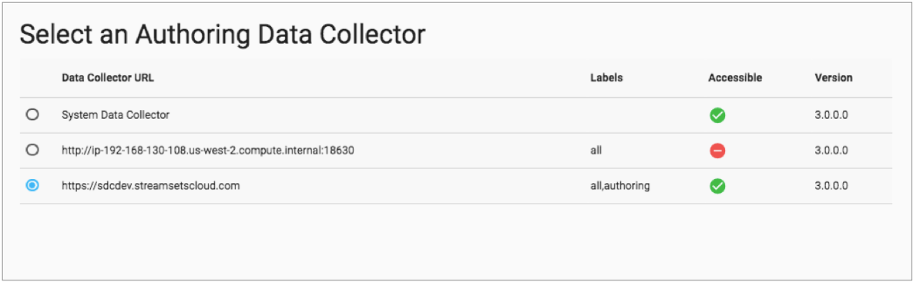
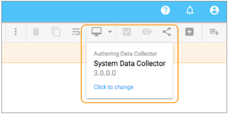

# 控制中心中的设计

您可以使用Control Hub Pipeline Designer在Control Hub中设计管道和管道片段。您可以使用Pipeline Designer 开发用于Data Collector或Data Collector Edge的管道和片段。

管道设计器使您可以配置管道，预览数据和发布管道。您还可以设计和发布[管道片段](https://streamsets.com/documentation/controlhub/latest/help/datacollector/UserGuide/Pipeline_Fragments/PipelineFragments.html#concept_msg_4hf_ndb)。

您可以创建新的管道或编辑以前发布的管道。在Pipeline Designer中创建管道时，可以从空白画布或[管道模板开始](https://streamsets.com/documentation/controlhub/latest/help/controlhub/UserGuide/Pipelines/PipelineTemplates.html#concept_wms_j5t_1jb)。管道设计器提供了几个系统管道模板。您还可以创建用户定义的管道模板。使用“管道”视图可创建新管道或访问管道存储库中的现有管道。

您还可以创建或编辑以前发布的片段。在Pipeline Designer中创建片段时 ，将从空白画布开始。使用“管道片段”视图创建新片段或访问现有片段。

在Pipeline Designer中配置管道或管道片段时，可以指定要使用的创作数据收集器。Pipeline Designer根据所选的创作Data Collector显示阶段，阶段库和功能 。

有关使用Pipeline Designer的更多信息，请参见[Pipeline Designer UI](https://streamsets.com/documentation/controlhub/latest/help/datacollector/UserGuide/Pipeline_Configuration/PipelineDesignerUI.html#concept_jjx_dhs_1cb)和[Pipeline Designer Tips](https://streamsets.com/documentation/controlhub/latest/help/datacollector/UserGuide/Pipeline_Configuration/PipelineDesigner-Tips.html#concept_yk2_zfz_1cb)。

## 创作数据收集器

在Pipeline Designer中创建或编辑管道或管道片段时，请选择要使用的创作数据收集器。您可以选择系统Data Collector或 在Control Hub 组织中注册的满足所有要求的任何 Data Collector。

选择 与要用于运行管道的执行Data Collector相同版本的创作Data Collector。使用不同的Data Collector 版本可能会导致开发对执行Data Collector无效的管道。

例如，如果创作数据收集器的版本比执行数据收集器的版本新，则管道可能包含阶段，阶段库，或者执行数据收集器中不存在阶段功能。

选择以下类型的数据收集器之一以用作创作数据收集器：

- 系统数据收集器

  系统Data Collector随附有Control Hub，用于勘探和灯光开发。系统数据收集器可供所有用户访问。使用系统数据收集器仅设计管道-不能用于执行数据预览或显式管道验证。

  有关系统数据收集器如何作为创作数据收集器工作的更多信息，请参见[系统数据收集器](https://streamsets.com/documentation/controlhub/latest/help/controlhub/UserGuide/DataCollectors/PDesigner_AuthoringSDC.html#concept_sn1_bwd_1cb)。

- 注册数据收集器

  您可以选择满足以下所有条件的注册数据收集器：StreamSets建议使用最新版本的Data Collector。支持的最低数据收集器版本是3.0.0.0。要设计管道片段，最低支持的Data Collector版本为3.2.0.0。要使用 Data Protector，最低支持的 Data Collector版本是3.5.0。该数据收集器 使用[HTTPS协议](https://streamsets.com/documentation/datacollector/latest/help/#datacollector/UserGuide/Configuration/DCConfig.html%23concept_xyp_lt4_cw)，因为控制集线器 还使用HTTPS协议。**注意：** StreamSets建议对使用HTTPS协议的数据收集器使用由证书颁发机构签名的证书。如果使用自签名证书，则必须首先使用浏览器访问Data Collector URL，并接受有关自签名证书的Web浏览器警告消息，然后用户才能选择Data Collector作为创作Data Collector。该数据采集器 采用的是[可公开访问的URL](https://streamsets.com/documentation/controlhub/latest/help/controlhub/UserGuide/DataCollectors/ManualAdmin.html#concept_lxl_cbq_fz)。

  有关注册的数据收集器如何作为创作数据收集器的详细信息，请参阅[注册的数据收集器](https://streamsets.com/documentation/controlhub/latest/help/controlhub/UserGuide/DataCollectors/PDesigner_AuthoringSDC.html#concept_ovw_gwd_1cb)。

例如，下面的“ **选择创作数据收集器”** 窗口显示系统数据收集器和两个已注册的数据收集器，作为创作数据收集器的选择。请注意 ，此映像中列出的第二个已注册Data Collector如何不可访问，因此由于使用HTTP协议而无法选择：

在Pipeline Designer中编辑管道或片段时，可以更改创作数据收集器。单击Pipeline Designer右上角的**Authoring Data Collector**图标（），以查看正在使用哪个Data Collector，并可以选择更改**Authoring** Data Collector。

例如，下图显示了当前正在使用系统Data Collector的管道：

## 创建一个新管道

您可以使用Pipeline Designer 创建新管道。

管道设计器提供了Data Collector 和SDC Edge系统管道模板。您还可以创建用户定义的管道模板。您可以查看管道模板以了解如何开发类似的管道，也可以将模板用作管道开发的起点。

创建管道时，可以指定要创建的类型-Data Collector 或SDC Edge，是从空白画布还是从模板开始，以及 要使用的创作Data Collector。您可以更改 开发期间使用的创作数据收集器。

1. 要创建管道，请单击“ **管道存储库”** >“ **管道”**以访问“管道”视图。

2. 单击**添加**图标。

3. 输入名称和可选描述。

4. 选择要创建的管道类型：**Data Collector**或 **Data Collector Edge**。

5. 选择您要如何创建管道，然后单击“ **下一步”**。

   - 空白管道-使用空白画布进行管道开发。
   - 管道模板-使用现有[模板](https://streamsets.com/documentation/controlhub/latest/help/controlhub/UserGuide/Pipelines/PipelineTemplates.html#concept_wms_j5t_1jb)作为管道开发的基础。

6. 如果选择了管道模板，则在“ **选择管道模板”**对话框中，按模板类型进行过滤，选择要使用的模板，然后单击“ **下一步”**。

7. 在“ **选择创作数据收集器”**对话框中，选择要使用的创作数据收集器，然后单击“ **创建”**。

   管道设计器 将打开一个空白画布或选定的管道模板。

如果需要，你可以改变创作的数据收集与创作管线数据采集器 图标：。

## 创建一个新片段

您可以使用Pipeline Designer 创建新的管道片段。

创建管道片段时，请为片段指定执行引擎Data Collector或 SDC Edge，然后选择要使用的创作Data Collector。

1. 要创建管道片段，请单击“ **管道存储库”** >“ **管道片段”**以访问“管道片段”视图。
2. 单击**添加**图标。
3. 输入名称和可选描述。
4. 选择要使用的执行引擎：**Data Collector**或 **Data Collector Edge**。
5. 创建片段时，在“ **选择创作数据收集器”**对话框中，选择要使用的创作数据收集器，然后单击“ **创建”**。

该管道设计显示器用一张空白的画布。

如果需要，你可以改变创作的数据收集与创作的片段数据采集器 图标：。

## 运行管道草图测试

设计管道时，可以在Pipeline Designer中对管道草稿执行测试运行。对草案管道进行测试运行，以快速测试管道逻辑。

您可以对完全配置的管道的草稿版本执行测试运行。草稿管道完成后，“测试运行”菜单将变为活动状态。

您不能对发布的管道版本执行测试。要运行已发布的管道版本，必须首先[为已发布的管道版本创建作业](https://streamsets.com/documentation/controlhub/latest/help/controlhub/UserGuide/Pipelines/CreateJobForPipeline.html#task_onk_tm5_qx)，然后再启动该作业。

1. 在Pipeline Designer中查看已完成管道的草稿版本时，单击工具栏右上角的“ **测试运行”**，然后选择以下选项之一：

   - **启动管道** - **启动管道**的测试运行。
   - **重置原点并开始** -重置原点，然后开始管道的测试运行。
   - **从参数开始** -指定要使用的参数值，然后开始管道的测试运行。

   监视管道的测试运行，包括查看实时统计信息和错误信息。

2. 监视完测试运行后，请单击“ **停止测试运行”**图标：。

   您可以继续设计管道并执行其他测试运行，直到您确定管道已完成，然后发布管道。

## 发布片段或管道

您可以发布在Pipeline Designer中设计或更新的片段和管道。

发布片段以在管道中使用该片段。管道只能使用已发布的片段。

发布管道以创建运行该管道的作业，将该管道用作模板或保留已发布的管道版本以供历史参考。您只能在作业中或作为模板使用已发布的管道。

您只能发布有效的管道。管道设计器在发布管道之前执行显式验证。因此， 管道的创作 数据收集器必须是注册的数据收集器。有关更多信息，请参见[创作数据收集器](https://streamsets.com/documentation/controlhub/latest/help/controlhub/UserGuide/DataCollectors/PDesigner_AuthoringSDC.html#concept_ygv_l4c_ccb)。

1. 在编辑模式下查看片段或管道时，单击“ 

   发布”

   图标：

   

   。

   出现“ **发布”**窗口。

2. 输入提交消息。

   作为最佳实践，请说明此版本中的更改，以便您可以跟踪片段或管道的提交历史记录。

3. 点击**发布**。