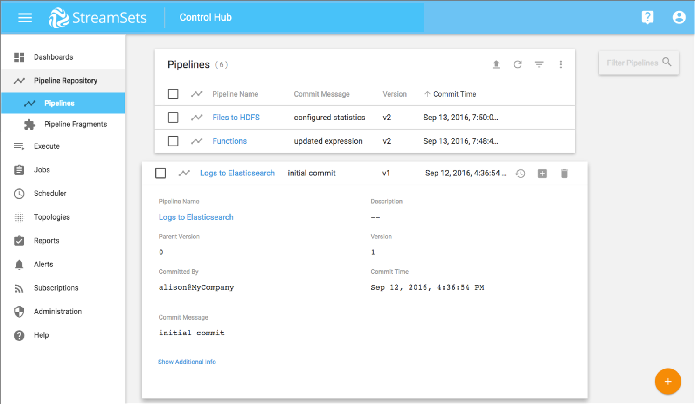
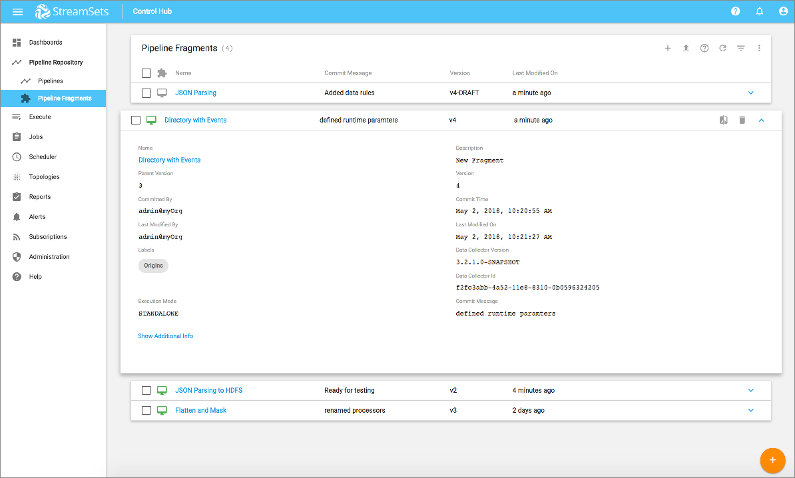

# 管道存储库概述

该控制集线器 管道库提供了访问的细节和配置您的所有管道和管道碎片控制集线器 组织。

在管道存储库中，您可以使用Control Hub 管道设计器来处理管道和管道片段。您可以创建，配置和发布管道和管道片段。您可以从管道创建模板，并使用它们创建新的管道。您可以导入片段并在管道中使用它们。您还可以导入管道并创建作业以运行管道。

您可以执行管道和碎片维护，例如更改权限以及删除管道和碎片或管道和碎片版本。

管道存储库通过维护每个管道或片段的版本历史记录来提供对管道和片段的版本管理。您可以将一个管道或片段版本与另一版本进行比较。您还可以向管道版本和片段版本添加标签，以轻松区分版本。

## 管道视图

管道视图列出了管道存储库中所有可用的管道。

您可以在“管道”视图中完成以下任务：

- 启动Pipeline Designer，以创建，配置和发布管道。
- 查看管道详细信息，包括提交管道的用户以及提交时间和消息。
- 查看每个管道以及管道中每个阶段的配置。
- 查看管道版本历史记录。您可以并排比较两个版本。您还可以为管道版本创建标签，以轻松区分管道版本。
- 复制管道。
- 从Control Hub 或Data Collector导出的导入管道。
- 从资源库中导出管道。
- 从管道创建模板。
- 为管道创建作业。
- 与其他用户和组共享管道。
- 删除管道或管道版本。

下图显示了Control Hub 管道存储库中可用的管道，并显示了其中一个管道的详细信息：

请注意以下图标，这些图标针对存储库中的所有管道或将鼠标悬停在单个管道上时显示。在管理管道时，将经常使用这些图标：

| 图标                                                       | 名称             | 描述                                                         |
| :--------------------------------------------------------- | :--------------- | :----------------------------------------------------------- |
|         | 创建新管道       | 在Pipeline Designer中创建一个新管道。                        |
|                        | 进口             | 从Control Hub或Data Collector导出的[导入管道](https://streamsets.com/documentation/controlhub/latest/help/controlhub/UserGuide/ExportImport/ExportImport.html#concept_phw_tnq_1db)。 |
|     | 刷新             | 刷新存储库中的管道列表。                                     |
|  | 切换过滤器列     | 切换“过滤器”列的显示，您可以在其中按名称，描述或提交消息搜索管道。您还可以按标签过滤管道。 |
|                             | 管线重复         | 复制所选管道。                                               |
|                | 与以前的版本比较 | 将管道版本与以前的版本进行比较。                             |
|             | 历史             | 查看管道的版本历史记录。                                     |
|           | 建立工作         | 为管道创建作业。                                             |
|                                | 出口             | [导出](https://streamsets.com/documentation/controlhub/latest/help/controlhub/UserGuide/ExportImport/ExportImport.html#concept_phw_tnq_1db)选定的管道。 |
|                                 | 分享             | 与其他用户和组共享管道，如[Permissions中所述](https://streamsets.com/documentation/controlhub/latest/help/controlhub/UserGuide/OrganizationSecurity/Permissions.html#concept_e5n_fgm_wy)。 |
|                        | 删除             | 删除管道或管道版本。                                         |

## 管道碎片视图

管道片段视图列出了管道存储库中所有可用的管道片段。

您可以在“管道片段”视图中完成以下任务：

- 启动Pipeline Designer，以创建，配置和发布片段。
- 查看片段详细信息，包括提交片段的用户以及提交时间和消息。
- 查看每个片段以及片段中每个阶段的配置。
- 查看片段版本历史。您可以并排比较两个版本。您还可以为片段版本创建标签，以轻松区分版本。
- 复制片段。
- 导入已从Control Hub导出的片段。
- 从存储库中导出片段。
- 与其他用户和组共享一个片段。
- 删除片段或片段版本。

下图显示了Control Hub 管道存储库中可用的管道片段，并显示了其中一个片段的详细信息：

请注意以下图标，这些图标针对存储库中的所有片段或将鼠标悬停在单个片段上时显示。您在管理片段时会经常使用这些图标：

| 图标                                                         | 名称             | 描述                                                         |
| :----------------------------------------------------------- | :--------------- | :----------------------------------------------------------- |
|  | 创建新的管道片段 | 在Pipeline Designer中创建一个新的管道片段。                  |
|  | 进口             | [导入](https://streamsets.com/documentation/controlhub/latest/help/controlhub/UserGuide/ExportImport/ExportImport.html#concept_phw_tnq_1db)已从Control Hub导出的[片段](https://streamsets.com/documentation/controlhub/latest/help/controlhub/UserGuide/ExportImport/ExportImport.html#concept_phw_tnq_1db)。 |
|  | 刷新             | 刷新存储库中的片段列表。                                     |
|  | 切换过滤器列     | 切换“过滤器”列的显示，您可以在其中按名称，描述或提交消息搜索管道。您还可以按标签过滤片段。 |
|  | 重复             | 复制所选片段。                                               |
|  | 与以前的版本比较 | 将片段版本与先前版本进行比较。                               |
|  | 历史             | 查看片段的版本历史记录。                                     |
|  | 出口             | [导出](https://streamsets.com/documentation/controlhub/latest/help/controlhub/UserGuide/ExportImport/ExportImport.html#concept_phw_tnq_1db)选定的片段。 |
|  | 分享             | 与其他用户和组共享该片段，如[Permissions中所述](https://streamsets.com/documentation/controlhub/latest/help/controlhub/UserGuide/OrganizationSecurity/Permissions.html#concept_e5n_fgm_wy)。 |
|  | 删除             | 删除片段或片段版本。                                         |